# IAM

---


* 全局的

identities: users, groups of users, or roles

principal: user or role

## 1. Users

* 一个user 一般表示**一个真实的人**
* **默认没有任何权限**
* root用户有最高权限，即使你赋予所有权限给一个用户他的权限也和root不一样

### 1.1 federate users

非当前账号下的 IAM users，但是拥有当前账号下的AWS Resource的权限。

## 2. Groups

* 组内只能是成员不可以有其他组
* 通过添加**policies**来给整个组的user获取权限
* 一般来说需要定制开放，否则将会给整个组开放所有的权限，比如说DynamoDB如果只需要一个表的权限，那么需要**定制policy**不能用AWS 自带的。
* **尽可能给user分组来进行权限管理**

## 3. Roles

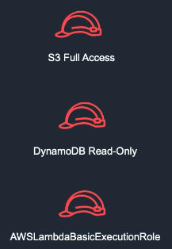

* **用来赋予AWS Service权限** 比如EC2
* **不可以赋予resource outside AWS**，如果实在需要那么使用user access key
* 赋予后则**不需要账号密码**来获取权限
* **获取的权限是临时的，但是可以自动更新**
* 不同于User，没有账号密码或者access key
* **没有数据库类型的role**因为他们不需要获取其他的Access

## 4. Policies

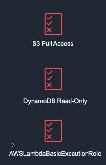

* 用于define 权限和指定赋予的对象（user or group）
* JSON
* **所有权限默认都是denied的**
* 如果被赋予多个权限，**那么最严格的会优先生效**

### 4.1 6种 Policies

#### 4.1.1 identity-based policies

分为两种 **Manage policies** 和 **Lnline policies**

Manage policies 也分为两种， **AWS managed policies**（AWS 自带的） **Customer managed policies**(用户自定义的)

Lnline policies则是**1对1创建**的，**IAM entity删除也随之删除**

#### 4.1.2 resource-based policies

* **inline policies**
* 指定在**谁**什么**condition**下什么**action** 可以被执行在某个resource上

#### 4.1.3 permissions boundaries

**设置一个permission的最大值**，如果某个**entity**被赋予了大于permission的权限，那么仍然无法执行。**交集**

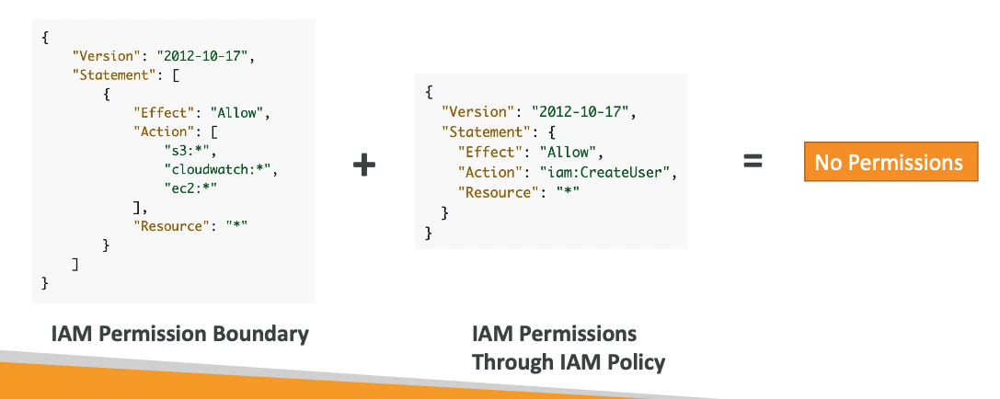

#### 4.1.4 AWS Organizations Service Control Policy (SCP)

用于group和AWS accounts的中心管理指定permissions的**上限**

* 需要创建master account
* 可以根据不同需求来分配account，比如说 testing product 等等
* **只是添加用户方便管理账单和审计，并没有赋予互相访问账号的access！**如果需要访问仍然需要设置IAM那些

###### 两种方式

* deny list，用来限制本来赋予了默认权限
* allow list，用来赋予本来被限制了的权限

**优先级很高，可以覆盖member的管理员权限**

#### 4.1.5 Access control lists （ACLs）

用于**管理账号外**的principals访问该账号的资源的权限, 类似 resource-based

#### 4.1.6 session policies

## 5. Authentication Methods

* access Key -- 由秘钥（只在创建的时候可以看到）和**Access key ID**组成 **用于代码**调用APIs
* IAM User 使用代码登录到Console

## 6. Credentials 类问题

AWS Management Console -- **username + password**

Programmatic access(AWS CLI) -- 用AWS **access keys**，用于**开发阶段**。长期有效

临时 access -- Temporary access keys（security token) **MFA**, **会失效**

AWS CodeCommit repositories： **private SSH key**

## 7. cross account问题

* 一个账号A需要另一个账号B的**buckets**的权限
  1. B中创建role用于该resource，并且设置B的trusted entitiy为账号A，并且配置一个inline policy来允许A获取B中的role
  2. A通过assumeRole来获取

## 8. on-premises 权限

不能使用role，只可以使用user access key存放在 on-premises server的 credentials 文件里

## 9. Trust policy

* 属于 resource-based policy

用于指定哪些entities可以assume某个role，一般用于attached给role，使得role可以由其他account的entities来assume， **通过设置Principal & action**

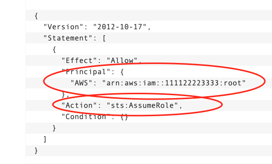

Principal： 用来表示这个role谁可以来获取，也可以是某个AWS Service

resource：表示针对action，可以适用于那些resource

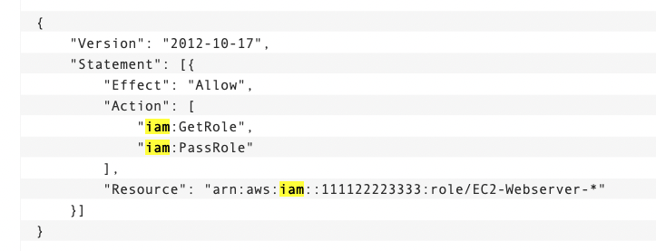

## 10. monitoring

### 10.1 IAM Credentials Report 

自己账号**内部account-level**的监控 report list 所有users和其他credentials的状态

### 10.2 IAM Access Analyzer

用于确认在你的账号或者organization的但是和**其他外部entity**分享的resource，比如说 **S3 buckets** 和 IAM，

一般用于查找**unintended access**

外部的entity包括

* 其他AWS account，包括IAM user role，federated user

**需要注意AWS Access Analyzer只用于监控一个区region。如果要监控所有需要给每一个region都创建一个**

### 10.3. Access Advisor

用于监控**内部user-level**的情况，比如某个role的使用状况。**不提供IAM以外的比如说S3的使用情况**


## 11. IAM Conditions

给IAM 的policy添加一个条件

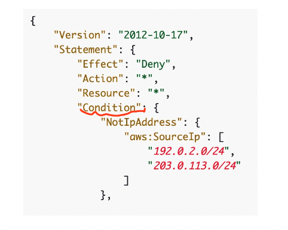

* sourceIP：based on source
* RequestedRegion：based on region
* StringEquals：based on tags
* ForceMFT：MFT强制要求

## 注意

1. **开发阶段，使用SDK或者CLI的时候一般使用 IAM user（access key） ，部署阶段使用role**

## 应用题：

### 1. 给AWS service assign role：

1. 首先用于操作的user 必须有assign role的权限 -- **iam:PassRole**,比如下面的第二条就是可以赋予S3的role

   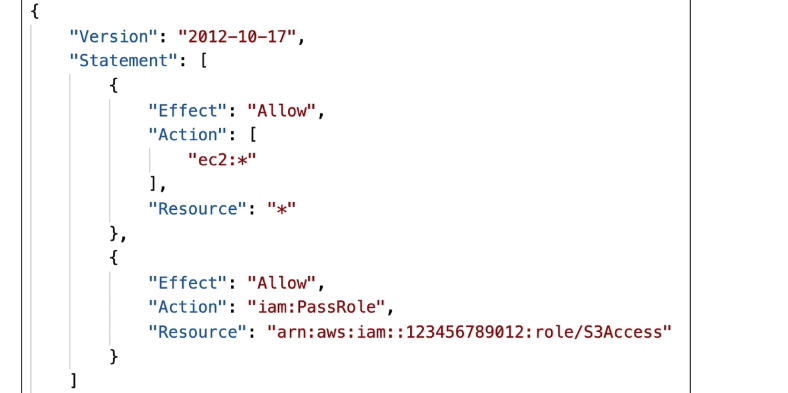

2. 并不是所有的service都可以赋予任何权限，比如赋予**Trust**允许的，比如 **aws-elasticbeanstalk-ec2-role**的trust policy只可以被ec2 assume

   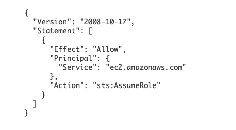

# Virtual Private Cloud (VPC)

---

## 1. 基础

* 区域性，一个区域最多5个
* 可以有多个subnet

### 1.2. Subnet

* 分public 和 private

* public 可以 访问外网

* private 只可以访问内网

* 需要使用 Route Tables 来配置各种访问规则

* **subnet必须关联一个route tables**，**并且同时只能和一个table关联**

  

## 3. Internet Gateway

**自定义VPC**的情况下即使在Public subnet也必须有这两个之一才能有internet

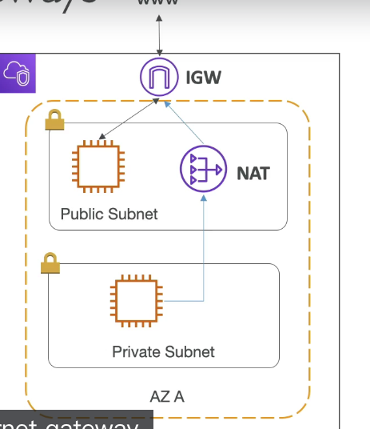

### 3.1 特点

* 可以scale horizontally
* High ability amd redundant
* 必须单独创建
* **一个VPC只能有一个IGW，后面attached不会生效**

### 3.2 route tables

* 默认会有一张 main route table

* 必须有route tables才能实现真正的联网（默认的不够），这里指定除了内网，其他的IP都会指向IGW

  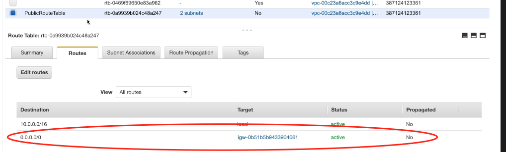

### 3.3 NAT 

**internet 用于 public 来设置访问规则**，NAT **放在public**里面 用于连接 private来使得private也可以访问外部

## 4. NAT instances

Network Address Translation, 用于让private subnet也有internet，相当于一个中间件。

* **必须放置在public subnet中**
* 必须disable EC2 flag： Source /Destination Check
* 必须添加Elastic IP

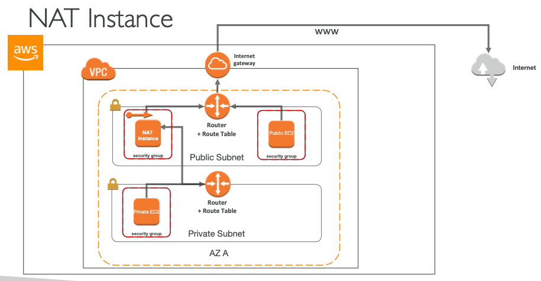

### 4.1 设置

**将private里面的table设置为一旦对外那么就去连接到 public subnet中的NAT instance**

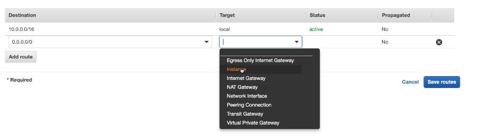

### 4.2 特点

* Amazon Linux AMI 自动配置

* 没有Highly available， 需要创建ASG in multiAZ + resilient user-datascript

* bandwidth取决于EC2instance的水平

* 必须自己管理SG 和 Rules

  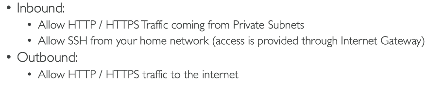

## 5. NAT Gateway

AWS 管理的服务，同样的功能用于替代NAT instance

### 5.1 特点

* 更高的bandwidth 5-45 Gbps
* 更好操作的HA
* 创建在指定的AZ中，使用Elastic IP
* 不可以被自己所在的subnet使用
* 仍然需要IGW
* 不需要管理SG

### 5.1 High Availability

NAT Gateway的弹性能力是在一个AZ内的

必须创建多个NAT GW在多个AZ中从而实现HA

## 4. NACL 

**Network Access Control lists**

* 控制进出**subnet**的防火墙
* 可以有 ALLOW rules & DENY rules
* 挂载在Subnet上
* Rules 只包括IPaddress
* 到达EC2之前必须先进过NACL

### 4.1 和Security groups的区别

* 也是防火墙 但是控制的是 EC2 **instance level**或者 ENI，而NACL控制的是**subnet level**
* 安全组只有ALLOW rules，NACL有ALLOW 和 DENEY

## 5. VPC Flow Logs

记录了所有VPC的信息 **涉及到 VPC内的ip等等使用这个**

* 可以被送入CloudWatch logs中

## 6. VPC Peering

**使多个VPC相当于在一个VPC里面**

* 不能用 重叠的 IP address range
* 不是传递的 比如说A和B合并 B和C合并 **A和C并没有关系**

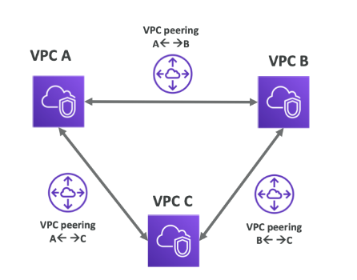

## 7. VPC Endpoints

用于privately连接AWS的服务，**相当于一个点对点的连接**


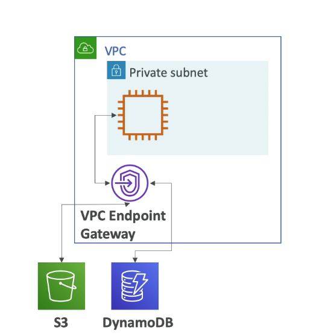

针对private subnet 如果想连接一下public 的subnet 也可以直接使用Endpoint**类似一个专用通道**

使用场景：**想在private subnet privately连接AWS的其他服务 那么使用这个**

* S3 和 dynamoDB 使用 **VPC Endpoint Gateway**
* 其他使用 **VPC Endpoint Interface**

## 8 Site to Site VPN & Direct Connect

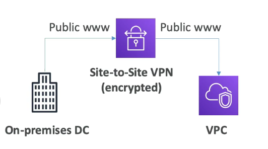

### 8.1 Site to site VPN

* 两个VPN 直接连接
* 自动加密
* 走 public internet

### 8.2 Direct Connect

* 需要建立**物理**连接
* 走private internet
* 更安全更快
* 需要花费时间 因为是物理连接

这两个都不可以连接 VPC Endpoints 


## 8. ENI

Elastic Network Inerfaces

* 在VPC中的逻辑组件 表示一个 **虚拟网卡**
* 可以有一些属性 **一个Primary privateIPV4** ， 一个或多个 Secondary IPv4
* 一个Elastic IP（IPV4） 对于一个 private IPv4
* 一个 public IPv4
* 一个或者多个安全组
* 一个Mac address
* 需要 连接一个指定的 availability Zone

## 注意点

* Subnet 如何没有指定route table那么默认会和主table连接


# EC2

---

## 1. 启动注意

* 用**console** launch instance **默认是只有basic monitoring**，使用CLI or SDK则是默认开启了detail monitoring

* 手动开启 detail monitoring的命令是,一般用于强化ASG

  ```bash
  aws ec2 monitor-instances --instance-ids i-1234567890abcdef0
  ```

  

## 3. EC2 instance

### 3.1 连接指令

SSH 连接 并且需要创建的Linux版本是amazon的

#### 3.1.1 window

```bash
ssh -i C:\Users\Tony\Downloads\EC2Study.pem ec2-user@54.212.97.194
# i 表示 identity 后面+pem文件的位置  ec2-user固定 后面跟public ip
```

### 3.2 instance profile

是一个IAM role的集合 可以被这个EC2instance使用的**权限信息**

## 4. Security Groups

防火墙

### 4.1 注意点

* 可以配置给多个instance
* **只能根据 region/VPC 来配置**  如果更换地区 那么需要重新创建
* 只有**Allow** roles
* 默认所有的**inbound** 都是 **blocked**，所有**outbound** 都是**允许**的
* **如果被其他SG referenced，那么不可以直接删除。**

### 4.2 错误代码的区别

* time out -- 安全组配置
* connection refused -- application error 或者没有launched


## 5. ip

### 5.1 Public IP

* **不是静态的** 可能会改变 比如重启EC2

* 可以通过 elastic IP 来让其固定 **需要配置**

### 5.2 private IP

不会改变 无法从外部通过这个访问

## 6. Instance Type

### 6.1 On Demand

* 根据秒来算时长（启动后一分钟）
* **支付最高 但是不需要预付款**
* 没有长期的合同（比如说承诺需要用多久）
* **推荐短期且无法确定业务时间的项目使用**

### 6.2 Reserved Instances

* 便宜很多 最高比前者便宜75%
* 需要有合同 并且 需要预付款 1- 3年
* 必须有指定的instance type（配置）
* 用于长期并且业务固定的项目使用

#### 6.2.1 按类型分

##### 6.2.1.1 Convertible Reserved Instance

* 可以改变Instance type
* 最高 57 discount

##### 6.2.2.1 Scheduled Reserved Instance

* 指定时间段使用

#### 6.2.2 按区域分

##### 6.2.2.1 Zonal Reserved instances

* Discount 只能在的指定的AZ中
* **可以在指定的AZ中预留Capacity**
* Discount只能在指定的类型和大小使用
* 不可以排队购买

##### 6.2.2.2 Regional Reserved instance

* Discount可以在当期region下的所有AZ使用
* **不预留capacity**

### 6.3 Spot instances

类似出价 如果你出的价格内 有闲置的那么就可以使用 但是如果高于 那么就会终止

* 可以减少90 相对于 On-demand
* **最便宜 但是会在任何超过预算的时候丢失instance**
* 适合用于可以进行重复尝试的项目 比如说 数据分析 图形处理

### 6.4 Dedicated Hosts

* **相当于购买了一台固定的设备**
* 获得所有的权限（包括网络的配置等等）
* 使用权三年
* **最贵**
* 用于复杂的项目
* 可能会和其他instance共享 但是只可以和你账号中的共享 不能控制更换instance **可以更换硬件配置** 

### 6.5 Dedicated Instances

* 不会和**其他account**分享你的instanc

* 不能控制更换硬件配置


## 7. Plancement Groups

用于控制EC2 instance的 **plancement strategy**

* Cluster：部署在同一个AZ中，**性能更好，但是出现区域性技术问题全挂**。（比如大数据工作需要速度，或者需要更低的延迟更高吞吐量的项目）

* Spread：分布于不同的AZ（Hardware）中，最高7个instance/group/AZ

* Partition：分布在不同的partition中，最多7个partitions/AZ, 可以跨AZ，最多100个EC2，每个分区的instance可以接受partition info （当做metadata）。**一般用于大数据的*分布式*数据存储（HDFS,HBase）**

  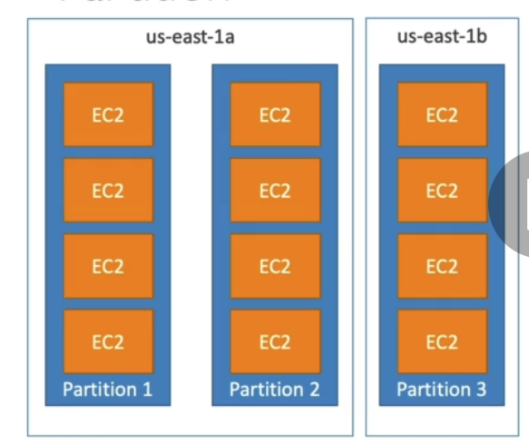


## 8. Elastic Network Interfaces(ENI)

VPC中的逻辑组件-虚拟网卡

每个ENI：

* 可以**拥有一个 Primary Private IPv4，一个或者多个 secondary Private IPv4**
* **一个Elastic IP / Private IPv4**
* 一个 **Public IPv4**
* 可以独立创建后再绑定给EC2 instance
* 可以attach SG
* 和AZ绑定

## 8. Hibernate

相比terminated 或者 stop， **hibernate会让内存的东西持久化**（root volume中）。

* root EBS volume 必须加密

* RAM size 比如小于150G

* 必须使用EBS

* 支持On-Demand and Reserved instance

* 不能超过60天

* 在创建的时候开启

  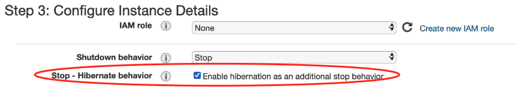

## 9. EC2 Nitro

下一代的EC2 instance，更好的虚拟化技术

* **更高速的EBS 64000** （普通的最高32000）
* 更多Networking options（Enhanced networking， HPC， IPv6）

## 10. vCPU

修改 vCPU，lunch阶段

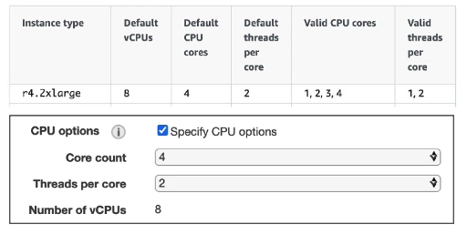

## 11. Capacity Reservations

给instance预留一些capacity，**激活的时候才收费**

* 每个需要AZ都需要设置
* 指定需要预留几个instance
* SG一样独立创建

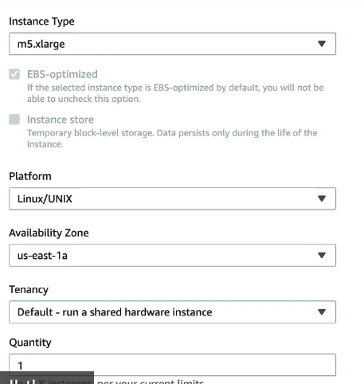

# Elastic Load blancing(ELB)

---

处理 internet traffic

* 可以设置internal（private）or external（public）

## 1. Load balancer

* target group的EC2 **可以跨AZ 但是不可以跨region**
* **只会route heathy instance**
* DNS不会改变，但是**public IP是可能会改变的，不要使用解析后的IP地址来访问LB**
* 可以 sacle，但是不可以瞬间完成 -- warm-up

### 1.1 一共有三种

#### 1.1.1 Classic Load balancer 

支持HTTP HTTPS TCP

* 只能支持一个SSL,必须使用多个CLB 来实现多个 基于hostname 的 SSL
* 手动添加instance来管理
* **fixed hostname**

#### 1.1.2 Application Load Balancer

支持HTTP **HTTPS** **WebSocket** 延迟大概400ms

* 可以用**多个监听器来配置多个SSL**
* 使用 Server Name Indication(SNI) 来实现上面的
* 通过**target group**来管理
  * 可以选择 type **instance** or IP or **lambda**

###### 1.1.2.1.2 监听器

隶属于 Load balancer 用来监听请求并且根据规则来分发到target group

可以配置的种类

* forward to ： target group
* Redirect to; 一般用于HTTP 到HTTPS
* fixed response： 指定一个return message code+message
* **Authenticate**： 可以配置 openID 或者 Cognito（user pool）等第三方验证

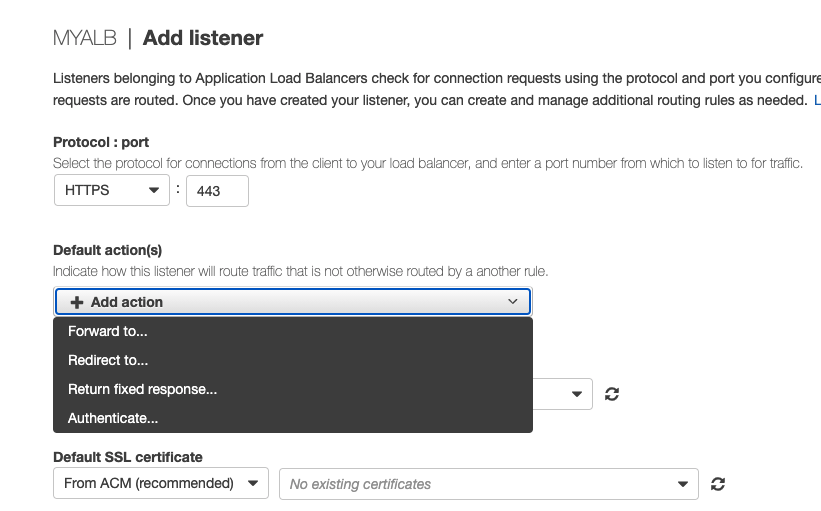

###### 1.1.2.1.3 图解


##### 1.1.2.2 特点（补）

支持多种匹配模式，可以通过不同的规则引导到不同的target groups

1. **Path in URL** ： 比如说(example.com**/users** & example.com/**posts**)
2. **Hostname in URL**：(**one**.example.com & **other**.example.com)
3. Query String,Hearders: (example.com/users?**id=123&order=false**) 

同时也非常**适合**micro services & container-based，比如（**Docker & ECS**）

* 有动态 port的功能（针对ECS 多container的情况）

例子：

**根据不同的 Path URL 来指向不同的target group**

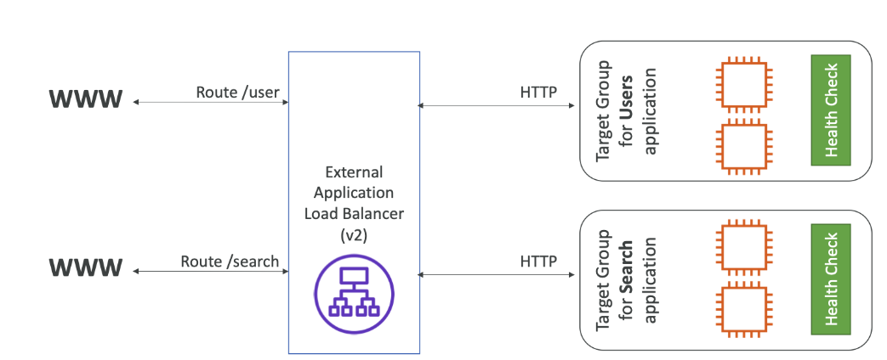

根据不同的 Query Strings/ Parameters 来指向不同的target group, 这里必group2必须是private

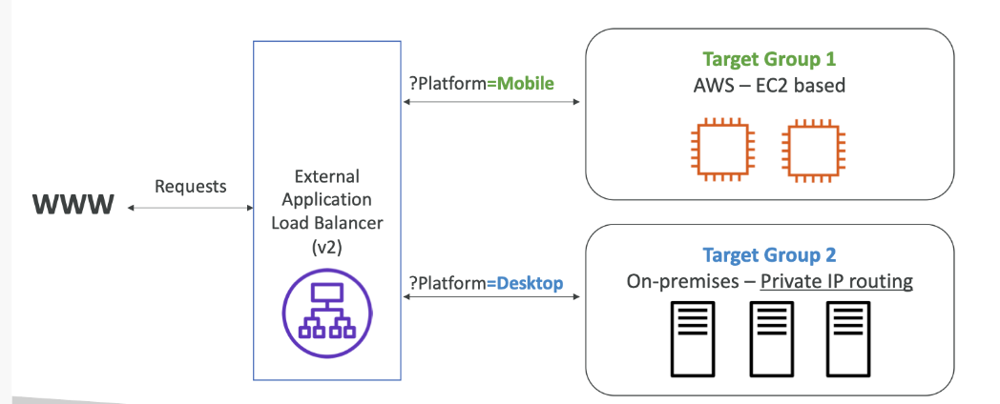

#### 1.1.3 Network Load Balancer

TCP TLS（secure TCP） & UDP

* 延迟大概**100MS**
* **非常好的performance**
* **没有免费的**
* 可以用多个监听器来配置多个SSL
* 使用 Server Name Indication(SNI) 来实现
* 一个AZ 一个 static IP

### 1.2 不同点

* CLB & ALB 暴露DNS 而 NLB 暴露一个或者多个 static IP

## 2. stickiness

携带cookie的用户 只要cookie 不过期 那么久总会连接到某一个指定的EC2（这样用户的数据不会丢失）

* 适用于 CLB & ALB

* 在AWS中配置（**在Target group 中修改** 非代码修改的）相当于携带一个额外的验证

  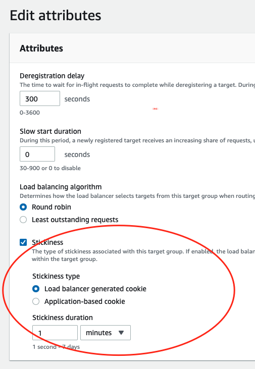

* **如果有ElasticCache优先选ElasticCache**


## 3. Cross-Zone（AZ） Load Balancing

### 3.1  不同情况

* CLB 默认关闭 免费
* ALB 默认开启 免费 **并且不可以被关闭**
* NLB 默认关闭 收费

### 3.2 处理流程

1. 首先对于每一个AZ 都会有一个node，node连接当前AZ的target group
2. 当 **Cross-Zone启动**的时候，相当于所有的EC2都重新回到了同一个node，所有的请求是**平均分配的**
3. 当 **Cross-Zone**关闭的时候，那么Node的分配是平均的，然后Node对EC2的分配也是平均的

例子：

AZ1：两个EC2 AZ2：8个EC2

**Cross-Zone**启动：所有的EC2都是 10%

**Cross-Zone**关闭：AZ1的两个每个25% AZ2的8个每个是6.25%

## 4. Monitor ALB

#### 4.1 X-forwarded headers （ALB request tracing）

**通过添加header的方式**来做一些**协议监控**，**无法监控latency**

* X-Forwarded-For: 用于查看用户的iP
* X-Forwarded-Proto: 用于识别协议（HTTP or HTTPS）
* X-Forwarded-Port：用于识别destination port

#### 4.2. Access logs

独有的logs系统用来发讯incoming信息比如说 **IP address latencies paths**

* 来自任何账号的请求

#### 4.3 CloudWatch metric

用来获取metric， 来分析是否正常运作

#### 4.4 CloudTrail


## 5. 健康策略

用于监控所管理的EC2的状况，一般来说回去监控某个port或者route，查看是否返回200 code

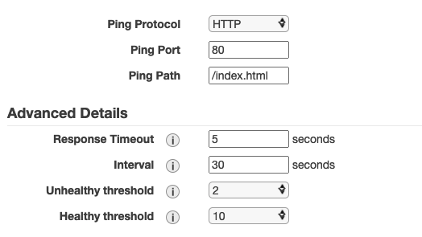

### 5.1 配置

* Protocal
* port
* path
* 和一些简单参数
* 如果instance安全监测没有通过，那么停止向它分流
* 如果instance又通过了监测，那么则自动开始向它分流

## 6. SSL 配置

### 6.1 单SSL 

CLB 只支持这一种，如果一定需要就只能创建多个CLB

### 6.2 multiple SSL certificate 配置

* 使用**Server Name Indication (SNI)** 技术实现的

只有ALB 和 NLB 支持，也支持CloudFront，根据不同的配置来访问不同的SSL

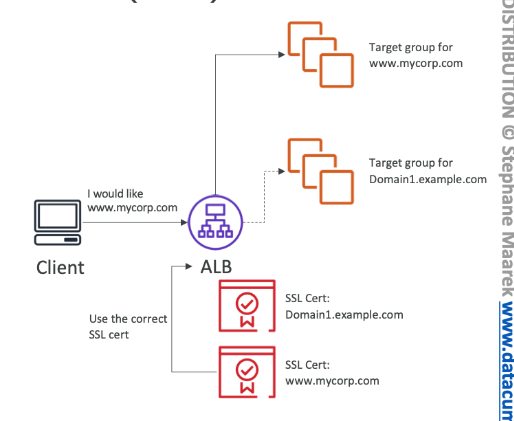


## 7.其他配置

### 7.1 安全组配置

ELB相当于代理向外开放，而EC2只配置可以通过ELB的安全组访问

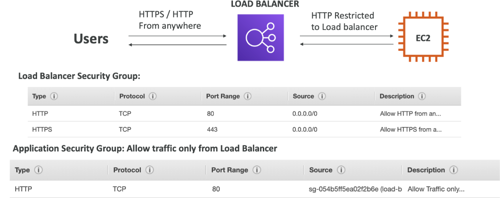

## 场景：

**Load balancer 分布不均：**

1. sticky sessions
2. 使用了classic load balancer，并且target goup总的instance的能力不同（费用不同）。CLB会多分配一些流量给能力更强的EC2
3.  Long-lived TCP

### 7.2 target group 配置

可以是如下

* EC2 instances - HTTP，可以被ASG管理
* ECS tasks - HTTP，被ECS自己管理
* Lambda Functions - HTTP 会被转换为JSON event，然后被Lambda处理
* IP address - **必须是 private IPs**

#### 7.2.1 注意

ALB可以配置多个target group，安全检查是在 target group level中完成的。


#  Auto-Scaling Groups - （ASG）

---

可以和Load balancer进行直接交互

**区别：**负载均衡器是起分配作用的 **他本身不会扩容**，**扩容需要由 ASG来完成**。所以二者搭配使用最佳

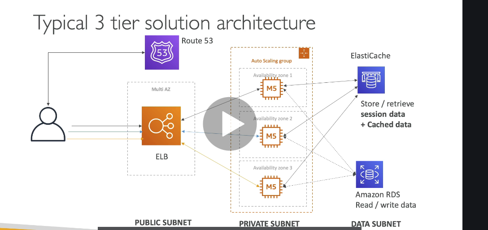

## 1. 配置属性

### 1.1 启动配置（launch comfiguration）

* **AMI + Instance Type**
* **EC2 User Data**
* EBS Volumes 
* Security Groups
* SSH Key Pair

#### 1.1.2 最小最大初始 Capacity

* 如果不设置desired capacity，那么就是按最小的来

#### 1.1.3 Network + Subnets 信息

#### 1.1.4 LoadBalancer Information

### 1.2 scaling policy

* 可以基于 **CloudWatch 来进行修改**
* 可以基于 Alarm monitor
* 现在可以设置**custom metric（比如users的访问数量）**

在ASG的 Automatic scaling中配置

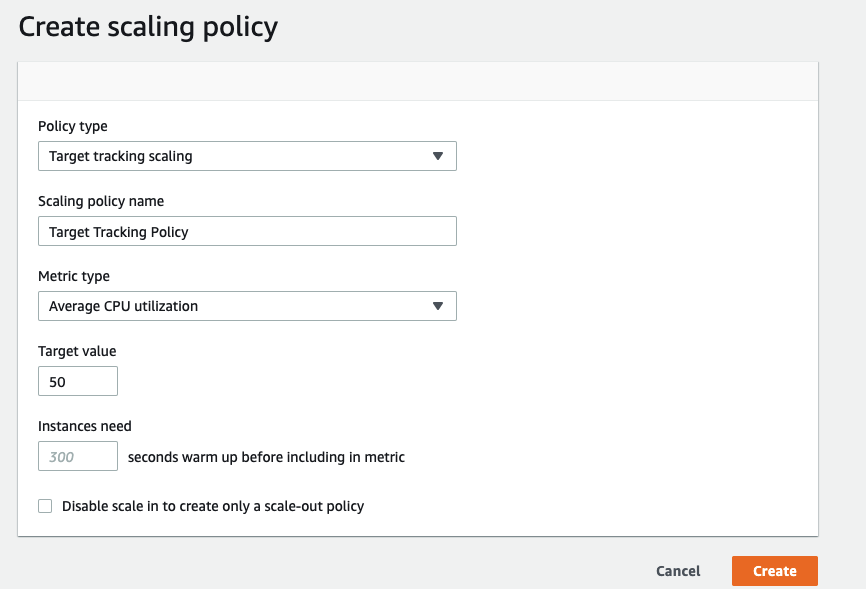

#### 1.2.1 分类

##### 1.2.1.1 Trget Tracking Scaling

* 最容易配置
* **Example: ASG average CPU 可使用率大于40%**

##### 1.2.1.2 Simple/Step Scaling

* CloudWatch alarm (比如说CPU > 70%) -> add 2 units
* CloudWatch alarm(比如说CPU < 30%) -> remove 1

##### 1.2.1.3 Scheduled Actions

* 基于某一种规律的使用 
* 比如说周末可以预先提升配置 让用户可以更好的使用

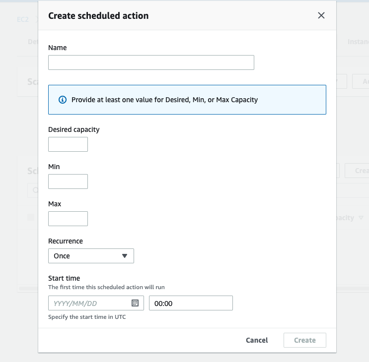


## 2. 注意点

* **可以跨AZ,不可以跨Region.**

* 扩容的时候会平均分配在注册的AZ里（默认）

  1. 移除Instance的时候会**优先选择拥有最多Instance的AZ中的最早launch的**

  2. 可以添加生命周期Hook函数来进行一些其他操作，比如说安装软件性能检查等等

     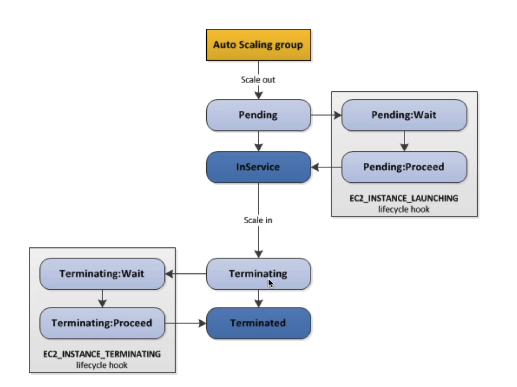

     

* 可以创建新的template，也可以从instance中创建template

* **分配给ASG的role会被EC2继承**

### 2.1 处理unhealth策略

直接**terminate** 然后 create a new one

### 2.2 处理add策略

* 添加的数量超过上限： 添加到上限

### 2.3 Healthy check 策略

**默认**是ASG自己来检查EC2是否健康，**只当自己**发现EC2处于不健康状态的时候发生替换。

**如果要和ELB搭配使用，一般来说会把Healthy check改为 ELB**，即当ELB发现了有不健康的EC2的时候会发生替换。

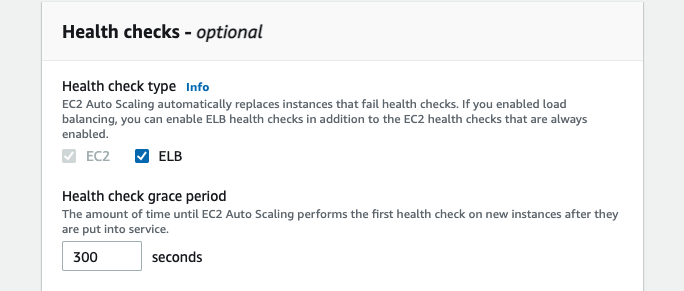

## 3. Metric （补）

### 3.1 custom metric

比如 number of connected users，需要让EC2发送这些信息到cloudwatch，然后通过**cloudwatch alarm来实现**

## 4. 配置

### 4.1 配置ASG 管理 target group

创建ASG的时候配置

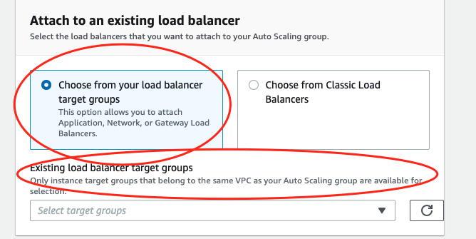

## 5. Scaling Cooldowns

当ASG发现需要进行增加或者减少EC2后，EC2需要一定的时间进行开启，这段时间我们不希望ASG继续监测，因为可能会开启更多的EC2。所以在这段时间我们**暂停ASG的监测工作**

## 6. Launch Template VS Launch Configuration

* 前者是升级版技术，**AWS推荐使用**，具有Version功能
* 可以继承

# Elastic Block Store（EBS）

---

Elastic Block Store Voume 是一个**网盘** **挂载**在instance上

## 1. 特点

* 网盘！ 所以又一定延迟 但是可以随时挂载其他的instance
* **AZ loacked**(如果需要转移需要先snapshot)
* 需要预先指定容量 ，但是也可以在后面提升（费用问题）
* 默认root盘会在EC2terminated的时候删除，其他挂载的不会
* **不支持非对称加密**

## 2. 种类

* GP2 General Purpose Volumes(SSD) 一般的SSD **平衡了价格和性能针对大多数的场景**
* IOI Provisioned IOPS (SSD) **高性能SSD** 低延迟高吞吐量
* STI Throughput Optimized HDD(HDD) 低价的HDD 针对常用并且大吞吐量
* SCI Cold HDD, Infrequently accessed data(HDD) 最低价的HDD 针对不常用的

**只有前两个（SSD）可以被当做启动盘**

## 3. Local EC2 Instance Store

本地储存 instance终止则丢失

物理连接 所以很快 IOPS 很高

**不可以**增加volume大小 

hardware fails会导致数据丢失

* 并不是所有的instance type 都有 

## 4. Configuration

### 4.1 IOPS & GiB

**Provisioned IOPS (SSD):** 

* volume  4GiB ~ 18 TiB
* IOPS 最低100 最高 64000(Nitro System) 32000 (other)
* **最大ratio of IOPS and volume 是 50：1**

**GP2 General Purpose Volumes(SSD)**

* Volume 1 GiB - 16 TiB
* IOPS 最低100 最高 16000
* **性能随着容量上升 33.33 GiB前都是最低 到 5334 GiB开始达到最高**

## 5. 加密

可以在创建的时候指定是否加密，加密是AWS管理的，**基本上所有在EBS Volume（at rest & in-flight）的都是加密的**。

**不可以直接重新加密一个在开始设置是没有加密的volume**

### 5.1 设置默认加密

可以在 AWS Account level 设置区域性加密，强迫每次创建的时候都必须是加密的！

**默认加密这个设置是区域级的**，也就是说这个区域级的都必须要加密，不可以单独指定这个区域的某一个volume不加密

## 6. Snapshots

* **可以拷贝snapshot across AZ or region**

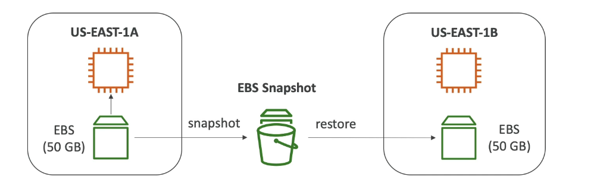

## 7. Multi-Attach 

一个EBS 挂载给多个EC2（**same AZ**）

* 只有IO1/IO2可以使用
* **需要用户自己处理并发问题**
* 必须用比较特殊的file system

## 8. AMI（补）

* build必须是在指定的region，但是拷贝是可以跨region的

## 注意点

---

* **EBS volume status checks**： 用于检查潜在的 inconsistencies 或者 EBS volumes是否受损
* **EBS CloudWatch metrics**：适用于检查EBS的使用情况而**不适合metadata**
* 添加后只是**exposed**，**需要 format并且挂载**，否则无法访问。**创建一个file system在上面**

# Elastic Beanstalk

---


## 补充

* 支持multicontainer，**Elastic beanstalk会调用 ECS来实现Docker部署这部分**
* 一个application可以**有多个environment**用来标识不同的环境（测试，生产），并且可以通过 Swap URL让两个环境的DNS进行切换（内部AWS 53来完成）
* 默认会生成一个S3来存放代码和配置文件（.ebextensions）
* **不是Serverless！**因为可以获得创建的EC2的所有权限

## 1. 配置文件 

必须创建在 **.ebextensions/**目录下的**.config**文件,**节省时间**的方法可以是使用**Custom AMI**（**Golden AMI**），用来替代console手动更新这些

* 用于**修改一些默认的设置**和添加**新的resources**
* **在EC2结束的时候会默认删除**

> **环境变量文件是放在source bundle，并且是env.yaml**

## 2. 部署策略

* **All at onec**: 一次性全部直接更新 会有downtime , No cost

* **Rolling**: 部分更新，降低capacity，没有downtime，No cost, 设置size

  

* **Rolling with aditional batches**: 思路和Rolling类似，这个不降低capacity，有small additional cost

  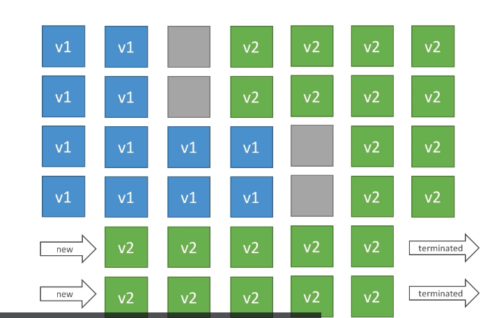

* **Immutable**: **直接创建一个新的 ASG** 。把新的ASG创建好的直接合并到之前的，**如果更新失败会有非常快的rollback速度**。部署**时间最长**，并且有**更多的cost**，适用于**生产环境**

  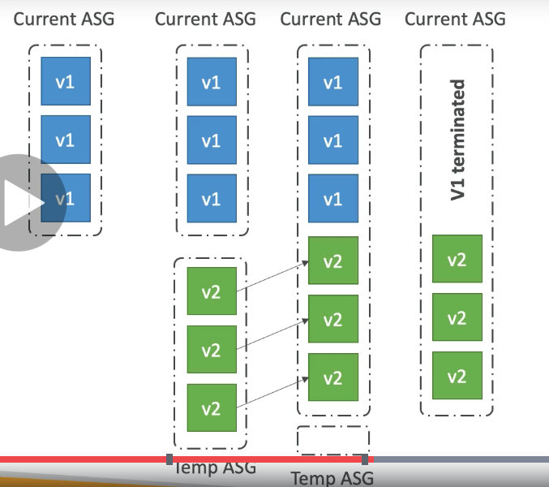

* **Blue/ Green**：直接创建一个新的Elastic Beanstalk 然后在部署成功后将之前的一些对外的比如Urls转换到新的上面.十分麻烦！

  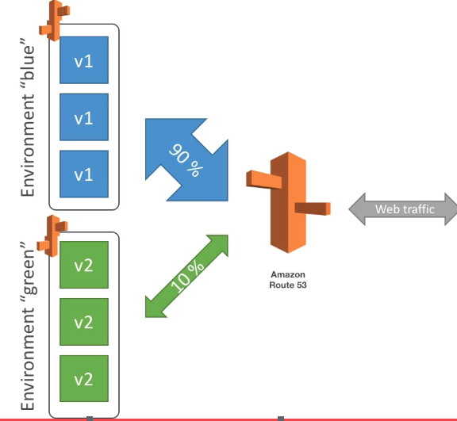

## 3. Web Server & （dedicated）Worker Environment

对于整个application中有些task需要花费很长的时间，所以我们可以**使用worker environment**对这部分进行**解耦**（or offload），这样可以避免整个Application瘫痪使得用户无法使用，这样即使处理task的那部分变得反应缓慢仍然不会影响用户来浏览前端那些静态部分。

* 使用 **cron.yaml** 来设置周期性 tasks
* 在创建environment的时候选择

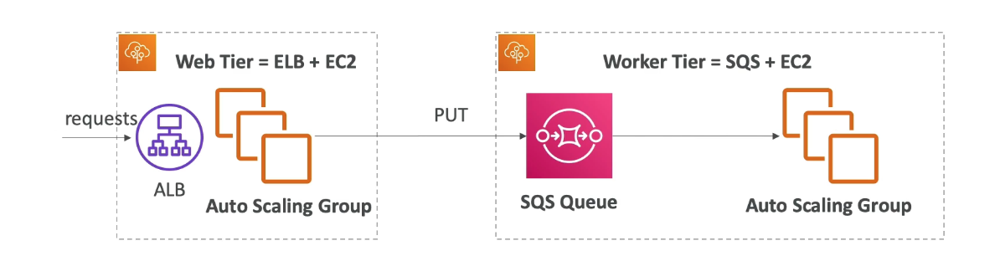

前半段用于接收请求和一些轻量级的事情，**后半段可以用于处理重量级的task比如上传视频等**

### 3.1 worker tier

使用SQS来进行解耦

## 4. Custom Platform

相当于自定义一个platform，**当出现不支持Docker 或者 不是Beanstalk支持的语言的时候使用**

### 4.1 创建

* 使用Platform.yaml来define AMI
* **通过 Packer software来创建 platform**

## 5. Environment Variable

可以在详细配置页配置**系统的环境变量**，这样可以在CLI通过命令来做一些配置。

## 6. Lifecycle Policy

* 最多存储1000个版本，如果不删除旧的，满了后就无法再添加新的。

### 6.1 lifecycle policy

* Based on time（太久）
* Based on space (太多)

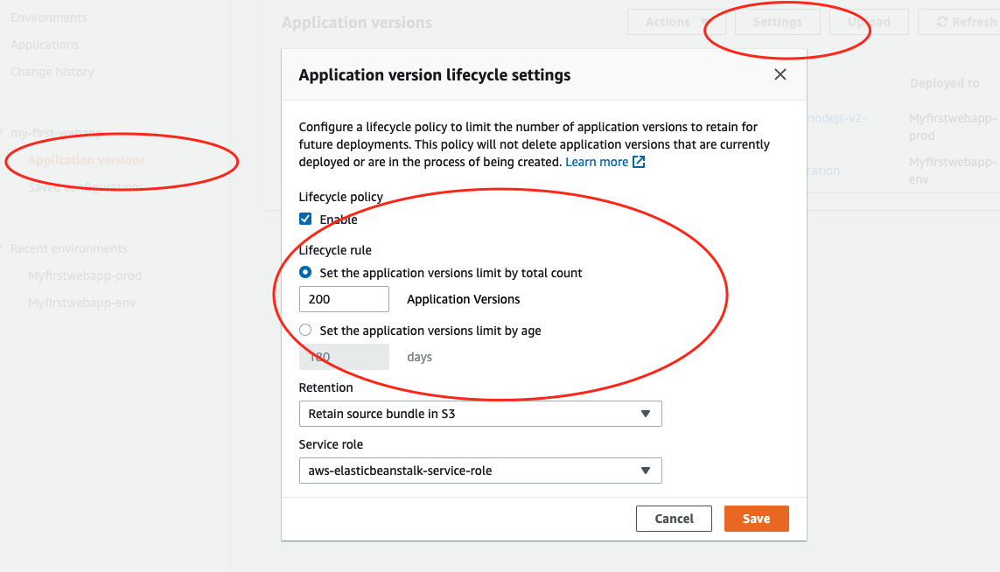

## 7. 修改配置策略

### 7.1 Load Balancer

**LB只可以在创建的时候被确认**，如果需要修改需要创建一个新的environment，然后部署Application到新的环境，然后使用一个 **CNAME swap（blue/green） 或者 Route S3 update**

### 7.2 RDS

创建一个RDS的 **snapshot**（双重保险），然后配置防止数据库被删除选项，然后其他和上面一样**同时删除数据库的安全组**（比较复杂不做赘述），最后删除之前的环境，由于数据库不能被删除所以只有数据库被保留，最后再指向新的环境即可。

## 8. EB CLI

需要安装 EB cli

## 9. with Docker

### 9.1 单 docker

* 提供Dockerfile
* 或者添加Dockerrun.aws.json（v1）：来指导（比如build好的image在哪里）
* **仅仅部署Docker在EC2上而不是ECS**

### 9.2 multiple Docker containers

* 每台EC2上部署多个container
* **需要在console中配置文件Dockerrun.aws.json(v2) file**
* 本质就是ECS的简化操作，会创建ECS的那一套resources

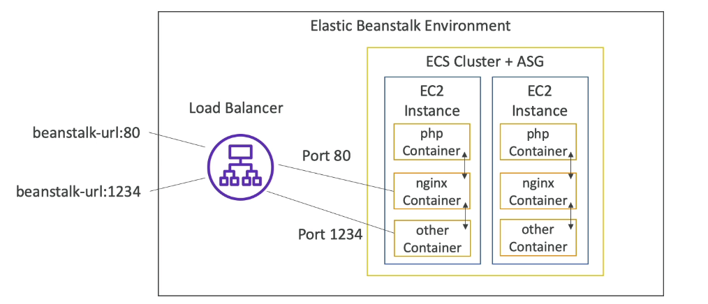

## 11. 部署模式

在**create**或者**update**的时候选择，**并且更新的时候会使用部署策略**

* single instance ： 一般用于dev

  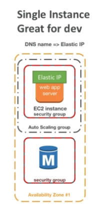

* High Availability：用于prod，可以添加LB或者不添加

  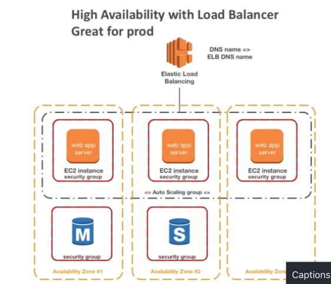


## 12. advanced Concepts

### 12.1 HTTPS

* 可以通过Console 手动配置SSL
* 通过配置文件 securelistener-alb.config
* 从ALB层面配置HTTP to HTTPS

## 应用场景

1. Blue Green depoloment一个新的version：创建一个新的environment然后上传新版本的code，最后做swap URLS
2. 更换HTTP到HTTPS：创建一个.ebextensions 来配置Load Balancer

## 注意点

1. 如果需要把一个账号的配置换到另一个账号下，需要保存并且下载然后重新上传到另一个账号上

# Elastic File System（EFS）

---

Elastic File System -- Managed NFS （network file system）

## 1. 特点

* **可以跨AZ！****从而共享给许多EC2**
* 相比EBS 可用性更高 scalable，**但是更贵**
* **使用安全组来管理**
* 只可以使用 **Linux-based** 镜像
* lifecycle management feature （几天后清理文件）
* 用多少交多少钱不需要 预先指定容量
* 由KMS 加密 at rest
* **可以挂在给多个instance across AZ（EBS只能同时挂一个）**
* 定期删除功能

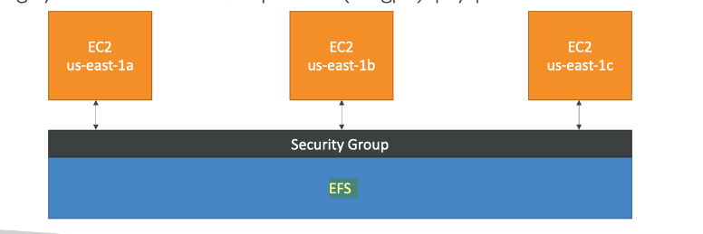

# Relational Data Base (RDS)

---

* 不可以通过SSH 来访问
* 具有Auto Scaling feature 没有 downtime

## 1. Read Replicas

* 可以有最多5个只读的复制
* 可以在AZ内，AZ外，甚至其他区域 (额外付费)
* 非同步的复制，所以所有的读是  **Eventually consistent**
* 每个复制可以升级成为独立的自己的DB
* **有独立的**DNS

## 2. Multi-AZ (Disaster Recovery)

如果出现了区域性的灾难 可能同一个AZ内的所有设备都损坏

* **同步的复制**
* **同一个DNS** 
* Master DB如果出现意外 复制可以直接变成master
* 开启非常简单，**没有downtime**

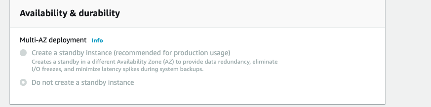

## 3. Security

### 3.1 Encryption

* **必须在创建的时候确定**
* 如果master不加密 复制不可以加密

#### 3.1.1 加密一个非加密的DB

可以先创建一个snapshot 然后复制并且启动加密

然后restore这个数据库 by using 这个加密了的snapshot

#### 3.1.2 加密方式

* At rest: **AWS KMS-AES-256 或者 TDE for oracle 和 SQL Server**
* In-flight： SSL 加密

### 3.2 网络安全

* RDS一般会被部署在一个**private subnet**中
* **只适用安全组进行通信**

### 3.3 Access 管理

* IAM管理谁可以访问RDS
* username + password
* IAM-based的授权可以用于访问（不用账号密码）

#### 3.3.1 IAM-based Authentication

通过IAM Role来实现，调用Get Auth Token API，使用**token**（15分钟）验证 **只支持 RS MySQL 和 PostgreSQL**

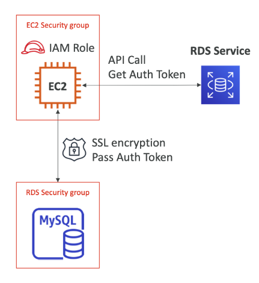

## 4. Logs

可以配置4中不同的log，针对不同的情况

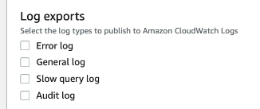


## 5. Transparent Data Encryption (TDE)

一种专门的加密方式用于**Microsoft SQL Server**，**写入前加密，查询前解密**

## 6. backups

* 备份是自动启动的
* 分为两种  **Automated backups & DB Snapshots**

### 6.1 Automated backups （single-region）

* 每日全备份，**每5分钟备份一次（point to time），可以回到任何一个点**
* 保存7-35天的

### 6.2 DB snapshots（multi-region）

* **手动生成snapshots**
* 备份时长不限

## 7. Monitoring

### 7.1 CloudWatch

从 **hypervisor** 获取数据

### 7.2 RDS Events

* 任何DB instance，snapshot，parameter group或者 security group的改变都会被触发
* 一般搭配SNS使用

### 7.3 Enhanced Monitoring

从**agent**中获取数据, 配置中开启

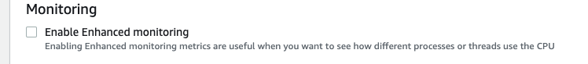

用于监控如下

* IOPS：IO
* Latency
* Throughput：bytes传输
* Queue Depth： 等待队列有多少bytes

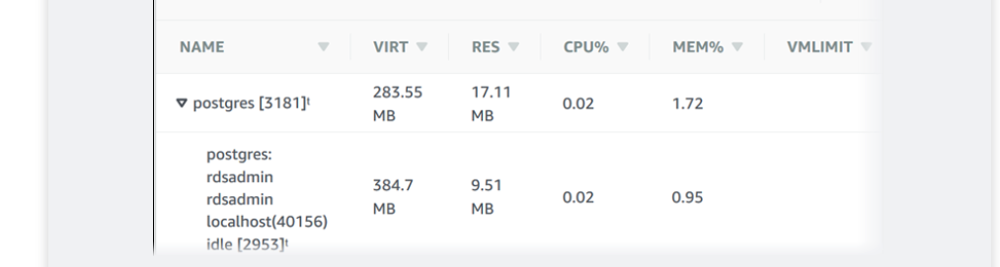

## 8. Auto Scaling（补）

只需要配置一个Maximum storage threshold即可（防止无限的扩容）

剩下的会自动进行存储空间的扩容

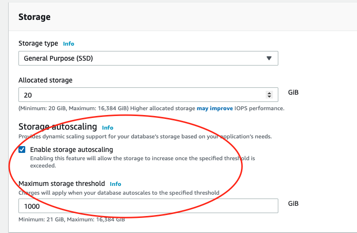

## 注意点

### 1. 关于备份

* 可以启动自动备份，但是备份的保留时间是0-35天
* 如果需要长期的备份，可以使用 CloudWatch的 cron **event**来触发一个 **Lambda function**用来触发 database snapshot

### 2. 关于连接

AWS 不提供IP address作为登录方式，只可以通过**endpoint**（当做IP用）来访问。

1. 通过 **DescribeDBInstances** API 获取
2. 通过consolo 查询

# Amazon Aurora

---

也是一种数据库 **效率更高** 并且和Postgres 和 MySQL的drivers相同

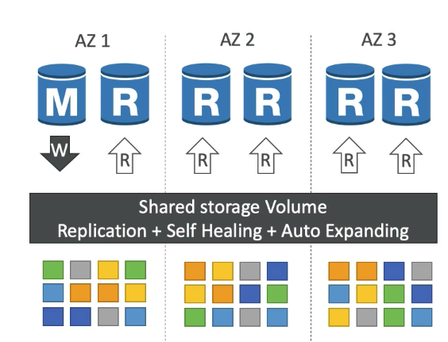

* **可以跨域**
* 提供一个 read endpoint 和一个 write endpoint 会有自己的负载均衡器来处理 这两个点就相当于是两个负载均衡器的DNS
* **不可以处理transaction**
* **OLPT Online transaction processing**

## 1. Serverless Aurora

* 自动配置启动数据库 并且auto-scaling
* 没有大小的预设
* pay per second

## 2. Gloabl Aurora

### 2.1 Aurora Cross Region Read Replicas

* 遇到灾难很有用
* 简单

### 2.2 Aurora Global Database 推荐！

* 一个主区域 负责读写

* 最多5个 第二区域 lag<1s

* 每个第二区域可以最多有16个 Replicas

  

# ElasticCashe

---

## 1. 使用场景

* **read-heavy**
* **Compute-intensive** 比如说推荐引擎，可以先保存浏览的object在Cashe里。

##  Redis VS Memcached

#### Redis:

* Multi AZ with Auto-Failover
* 可以创建 Replicas 
* **persistence**
* **backup and restore**

#### Memcached:

* 多点共享数据（都是主机 没有Replicas）
* no-presistence
* **No backup and restore**
* **多线程架构**
* simple caching model 

## 2. 安全

* 不支持IAM authentication， **IAM policy只适用于API-level**

### 2.1 Redis Auth

* passwrd/token
* SSL

## 3. Replication

### 3.1 Cluster disabled

只帮助**read**操作

* 异步复制，主可以读写，从只可以读
* 默认Multi-AZ

### 3.2 Cluster enabled

也可以帮助**write**操作

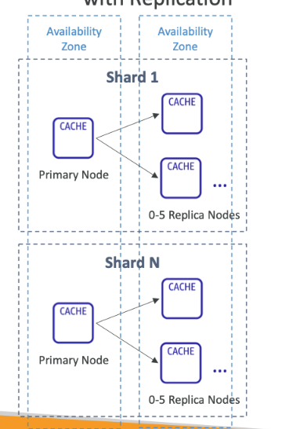

* **数据会被分布式存储于**每一个node，从而读取的时候一起工作
* 其他基本和上面差不多

## 4. Security

* 所有在ElasticCache 中的 caches 不支持IAM autentication
* Redis AUTH: 设置账号密码（创建的时候），支持SSL
* Memcached： SASL-based Auth （高级）

# Route 53

---

就是DNS 服务器 需要设置cache时间，**必须配置Elastic IP to ensure ongoing connectivity**

## 1. Type

* A:hostname to IPv4
* AAAA:hostname to IPv6
* CNAME;hostname to hostname
* Alias:hostname to AWS resource

### 1.1 CNAME vs Alias

#### 1.1.1 CNAME 

别名 **解析一个域名到另一个域名**

**存在的原因如下：**

* 服务器可能有多个别名 这样修改主名 其他别名就会一同修改
* 某些公司提供智能调度，可以通过用户和网络的情况分配到最合适的服务器

**特点**：

* 只能用于 **NON ROOT DOMAIN** 比如 something.mydomain.com

### 1.2 Alias

* 推荐
* 免费
* 可以监控一些属性

### 1.3 root domain

* 不可以用于 CNAME
* 可以用于Alias 和其他

## 2. Routing Policy

### 2.1 Simple

没啥特别的 就是可以给**一个域名配置多个地址**（自动负载均衡 client-side）

### 2.2 Weighted

手动配置分配比例，**创建多条record，使用相同的域名**

不一定相加要是100%

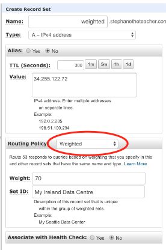

### 2.3 Latency

根据延迟来分配，配置方法是**创建多条record，但是是相同的域名**

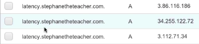

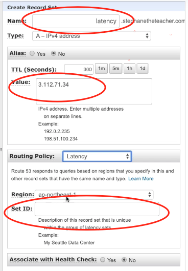

### 2.4 Failover

* 可以设置一个主一个从
* 如果出现了Failover （由route 53Health check 来监控）那么会自动进行跳转
* **主必须配置Health check** 从不需要

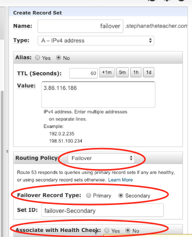

### 2.5 Geolocation

根据用户地区分

需要设置 默认地区

### 2.6 Multi Value

简单版本的升级，可以让一个record（DNS）连接多个地址

* 添加了 Health check，根据状态分配
* **并不是一个ELB的替代产品**

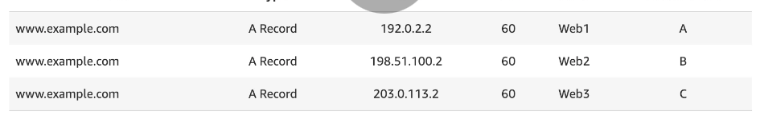

### 2.7 Geoproximity

可以通过添加bias来让更多的用户来自另一个区域的分配到这个区域

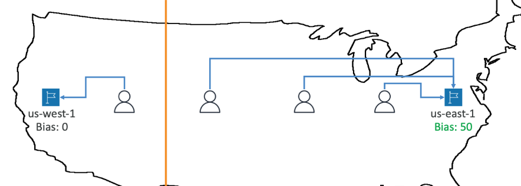

## 3. TTL

缓存解析的地址，需要配置。


## 4. Advanced features

* **负载均衡（Client load balancing）**
* Health checks

# Simple Storage Service (S3)

---

## 1. 特点

* S3 是 全局的 但是Buckets是区域性的！
* 名字必须全局unique -所有人共享
* 有命名规范
* **没有Strong consistency!  只有 Eventual Consistency**（2020）
  * **overwrite puts & deleted是 eventually consistent**
* **貌似2021开始所有的S3操作全部回归到Strong consistency**
* Object是有Key的，Key就是url。
* 最大的Object是5TB

## 2. Versioning

* 需要再bucket level enabled
* 如果上传相同文件 那么会有个属性 VersionID 表示不同版本并且显示最新版本
* **没有enable versioning的有Null version**

## 3. 加密方式

### 3.1 SSE-S3 

SSE 表示 Server side encrypted

* keys handled 加密 & 由 **Amazon S3 管理**
* 服务器端加密
* AES-256 加密类型
* **不提供审计功能**
* **需要设置Header ：“x-amz-server-side-encryption": "AES256"**

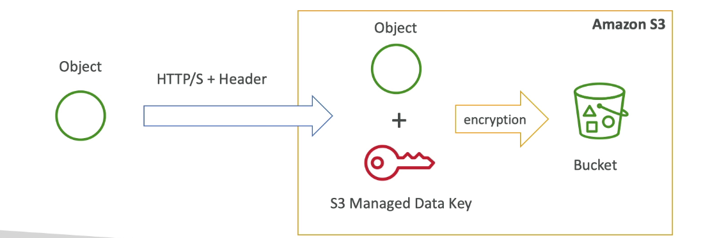

### 3.2 SSE-KMS

KMS- key managerment service

* Keys handled 加密 & KMS 管理
* 服务器端加密
* **需要设置Header ：“x-amz-server-side-encryption": "aws:kms"**
* CLI: 上传的时候使用 **GenerateDataKey， download的时候使用Decrypt**

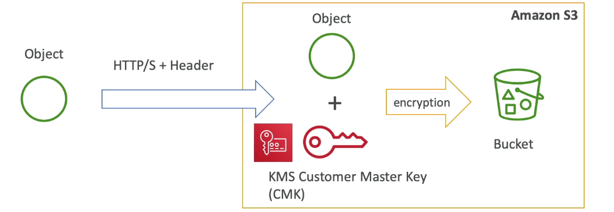


### 3.3 SSE-C

c 表示 customer

* Keys handled 加密 & key由developer自己提供

* **Amazon S3 不保存任何加密key，如果丢失key 那么也会丢失object**

* **只能使用HTTPS**

* 加密key必须放在HTTP 的 headers里面（每一次请求）

* 需要携带三个header 

  **x-amz-server-side-encryption-customer-algorithm** 

  **`x-amz-server-side-encryption-customer-key`** 

  **`x-amz-server-side-encryption-customer-key-MD5`**

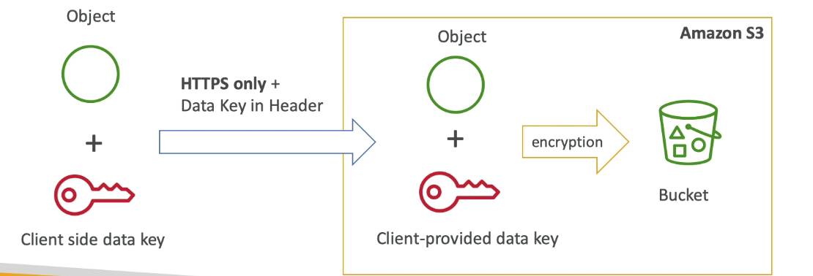

### 3.4 Client side encryption

加密和解密都在client side 自己解决

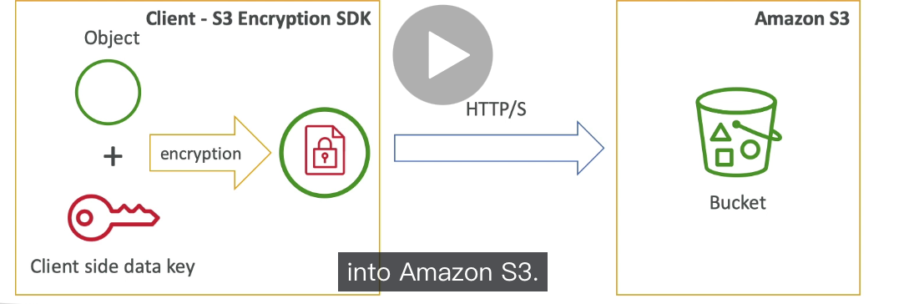


### 3.5 Encryption in transit (SSL/TLS)

用HTTP 访问会不加密 用HTTPS 会自动加密

* HTTP endpoint: non encrpted
* HTTPS endpoint: encryption in flight (推荐)

### 3.6 确保加密

注意：**只是enable 加密方式是不够的！！！**

需要通过**denied policy** 来控制不带加密header不允许添加

### 3.7 配置

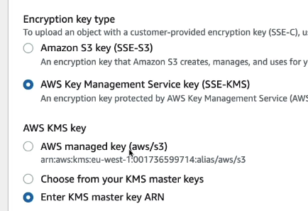

最后一个是输入key的ARN可能不在这个账号下的

**SSE-C 只可以通过CLI，因为需要发送key**

## 4. 安全

两种安全方式 User based Resource Based

### 4.1 User Based

* 基于IAM policies 针对某个user会开放不同的API

### 4.2 Resource Based

* **Bucket Policies** - 类似全局的rules
* **Object Access Control List(ACL)  细颗粒的（finer grain）**
* Bucket Access Control List(ACL) 不常用

#### 4.2.1 Bucket Policies

JSON based

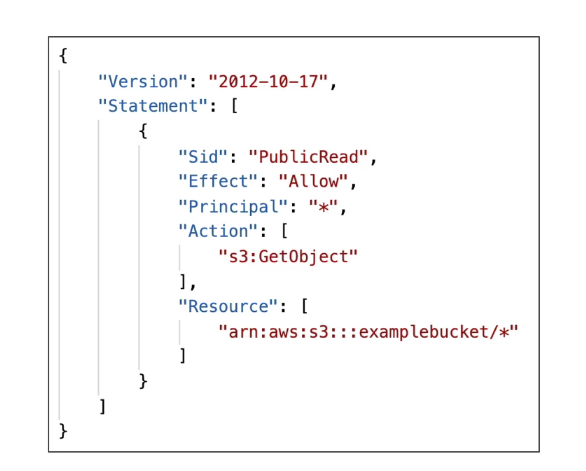

使用场景：

1. **典型使用为拒绝任何没有加密的数据存入**，设置的必须有 **x-amz-server-side-encryption** header 

2. 访问用户必须通过了MFA

   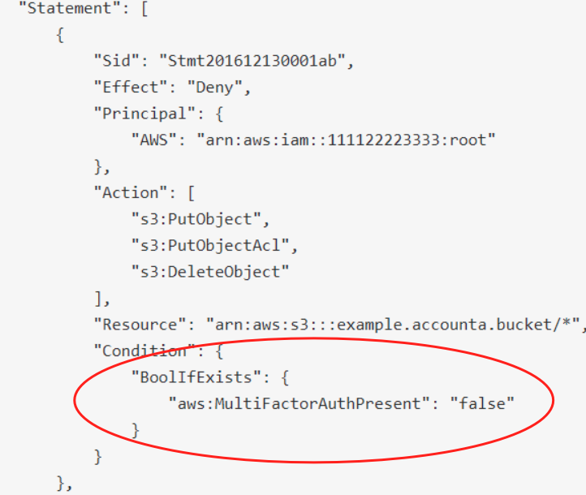

   


### 4.3 可以访问的情况

* User 有IAM的权限 或者 Resource policy同意
* **同时**没有显示的DENY

### 4.4 强制in-flight加密

添加 **bucket policy** with **SecureTransport** condition

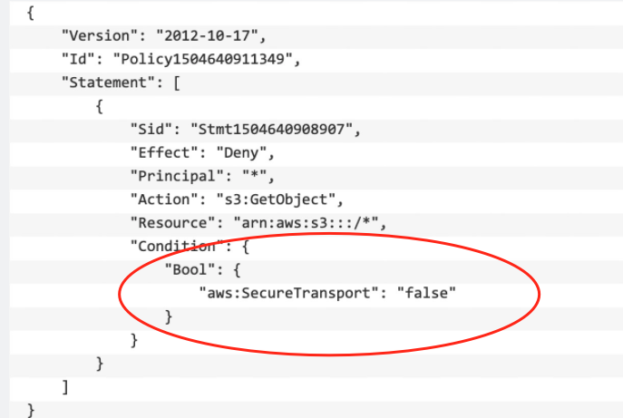

## 5. 跨域问题

需要在**被请求**的服务器修改S3的 CORS 配置

* **必须开启versioning**
* source 和 destination bucket 必须在不同的regions
* S3 必须有足够的权限

## 6. Storage Classes

### 6.1 S3 Standard - General Purpose

* 可以立刻访问

### 6.2 S3 Standard - Infrequent Access(IA)

* 相比前者便宜一些
* 适用于访问更不频繁的

### 6.3 S3 one Zone -Infrequent Access

* 和上面一样 只是只能存在一个AZ

### 6.4 Intelligent Tiering

* 需要一些Auto-tiering fee 和 monitoring fee
* 比较独特 按访问频率自动优化数据-费用更为合理

### 6.5 Amazon Glacier

* 很慢
* 需要存很久 至少90天
* **不可以立刻访问**，**需要先进行 restored然后才可以访问**

#### 6.5.1 retrieval options

* Expedited 1-5 mins
* Standard 3-5 Hours
* **Bulk 5-12 hs**

总体来说这类获取S3会很慢


### 6.6 Amazon Glacier Depp Archive

* 更久！
* 获取文件的时间 12-48 hs
* 最少存 180天

### 对比

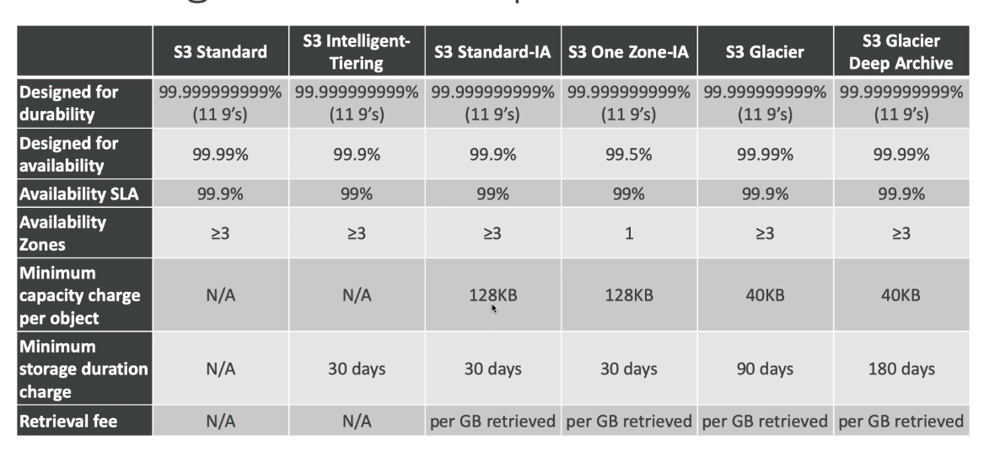


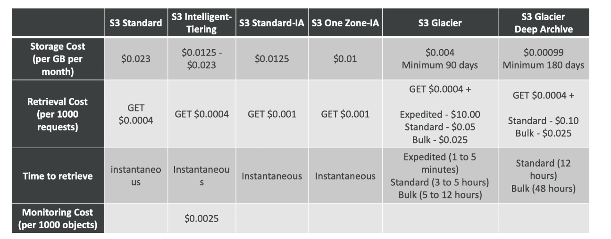

### 6.7 class之间的换换

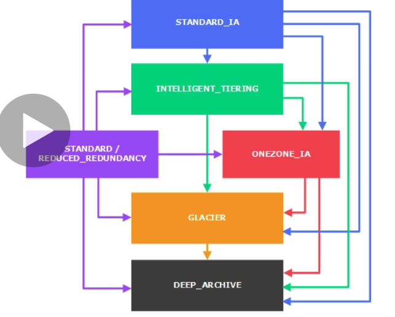

### 6.8 配置

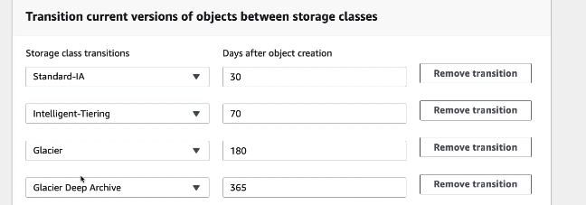

## 7. Lifecycle

制定规则来管理和过期数据

* 可以通过前缀来设置 比如说 s3://mybucket/mp3/*
* 可以根据object tags 比如 所有有 **Depoartment：Neal** 的object

### 7.1 Transition actions 

指定什么时候发生class直接的转换关系

比如说有的数据我只需要一个月内经常使用 以后就很少用 那么可以将它转到Glacier class

### 7.2 Expiration actions

设置多久后过期或者删除

## 8. AWS Athena

* 可以直接用于**数据分析**！
* 使用SQL 
* Serviceless

## 9. S3 Object Lock & Glacier Vault Lock

### 9.1 S3 Object Lock

**Write Once Read Many当有读取事件时在一段时间内Object不会被删除**, 为了让操作顺利完成。

> **和并发锁不是一回事儿**

### 9.2 Glacier Vault Lock

Write Once Read Many，**用来锁定policy**并且在一段时间内不可以被任何人修改

## 10. Consistency

如果多线程访问同一个object，那么只会拿到**新的数据或者旧数据**，不会拿到部分或者损坏的数据

## 11. Notification （S3 Event）

S3 有自己的Event提醒系统，支持**事件触发**(比如上传事件)后发送到

* SNS
* SQS
* Lambda

## 13. Performance

一些概念：

* prefix：object的url以'/'区分 比如 bucket/folder1/sub/file 这里**prefix就是/folder1/sub/**

### 13.1 Baseline

至少 **3500** PUT/COPY/POST/DELETE and **5500** GET/HEAD request/prefix

比如说一个bucket的存储如下

* bucket/folder1/sub1/file
* bucket/folder1/sub2/file
* Bucket/1/file
* Bucket/2/file

那么这个bucket有4中prefix，每个都有上述的能力，那么如果分布均匀就可以得到22000的 GET/HEAD request的能力

### 13.2 Multi-Part upload

* 推荐大于100MB就使用，**大于5G必须使用**

### 13.3  S3 Transfer Acceleration

使用了 **CloudFront**的优势来加速，收费的，和CloudFront的区别是，**CloudFront主要是负责静态数据**

* **只适用于upload**
* **可以和Multi-part upload一起使用**
* **bucket的name必须是DNS-compliant，而且不能包含"."**

原理是发送数据到AWS edge location，然后转发到S3 bucket的target region

### 13.4 S3 Byte-Range Fetches

获取object的某一个range的Byte数据，**可以并行**

* 用于传输**分段大型文件**，避免传输一半出现错误

  

* 可以用于获取文件的**部分**信息，比如**metedata**

  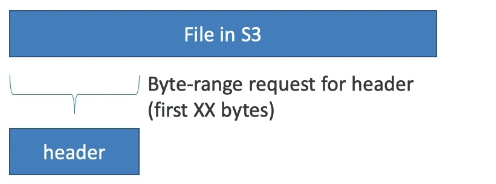

  

  

  

## 14. S3 Select & Glacier Select

类似query，高效筛选用的。

* 使用SQL，server side filtering

## 15. MFA-Delete

* 只能由root account来开启
* 每次删除需要MFA 验证

## 16. Replication

分为两种 Cross-region 和 Same-region。

* 开启前的不会进行复制
* 没有传递性
* **两个bucket必须都开启versioning**
* 如果删除带有version的，那么会添加一个 delete marker，不会复制
* 如果删除不带有version的，那么会在source删除，不会复制

### 16.1 配置

在 **Replication rules**里面配置，比较简单。

## 17. 当做网站使用

必须配置：

* index页面
* 权限（权限包括首先先让整个网站**public**（ACL），然后添加**bucket policy** 来控制任何人可以调用**GetObject**）

## 18. pre-sign url

临时访问的url，不可以在console创建

```bash
aws s3 presign s3://aws-s3-study-01/0d40c24b264aa511.jpg --region us-east-1 --expires-in 300 
# 地址+地区+过期时间
```

或者SDK： **GeneratePresignedUrlRequest** API

## 19 Monitoring

* **S3 Access Logs**
* CloudTrail

## 20. 收费

一般来说只有owner需要被收钱，包括存储以及网络传输，但是也可以使用 **Requester Pays buckets**来让requester来付费。

* 一般用于share 大型数据集给**其他AWS account**
* requeter必须是 **aws authenticated**(不可以匿名)


## 注意点

* 不要把bucket的logs 储存在当前的bucket下！
* S3 event notifications的设计是at least once，相当于发送event的中间可能会有等待时间，如果同时对一个object进行了修改，那么有可能只发送了一次提醒。如果需要每次都发送那么需要开启versioning

# AWS CloudFront

---

用于协助read 相当于分发快递 全球有很多的快递点，用户不需要去直接快递公司 只需要去快递点”读“即可，快递点会cached 数据

* 可以**有区域的限制** 比如设置哪个国家的可以访问 那哪些不可以
* 相当于在真正要访问的server和用户之间加了一层缓存层

## 1. With S3 Website

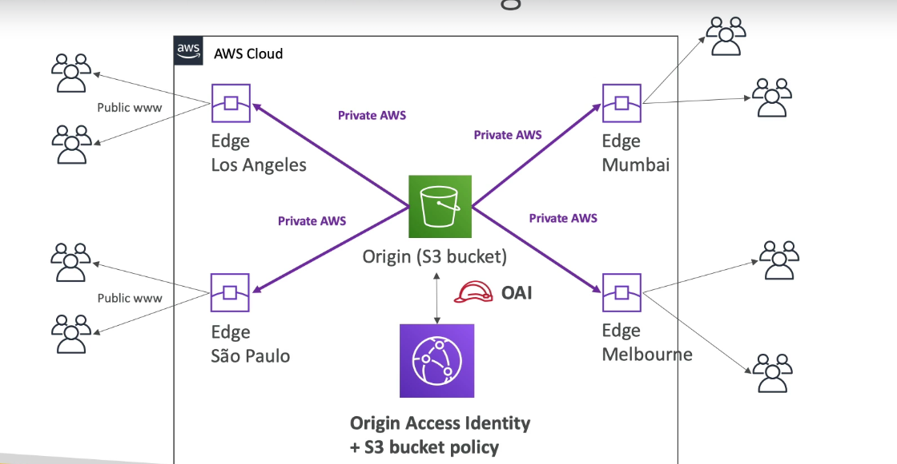

* 必须是static s3 website 

## 2. With ALB or EC2

origin也可以使ALB或者EC2

### 2.1 ALB 

* ALB必须是**public**的

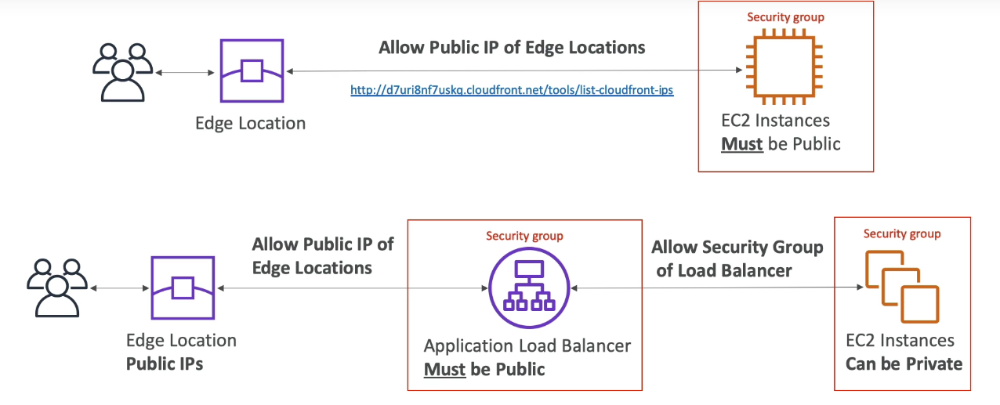

### 2.2 EC2

* EC2 必须是**public**的

## 3. 和 S3 Cross Region Replication的对比

* 使用了 Edge network 做cached，并且有**TTL**
* 对于静态文件十分好用
* 对于S3 CRR来说 数据几乎是 real-time的 并且是read-only 对于可以接受小延迟的动态数据非常好用

## 5. Caching

* Cache储存在每一个**Edge location**上

### 5.1 Caching invalidations

在**console手动触发**，或者调用 **CreateInvalidation API**

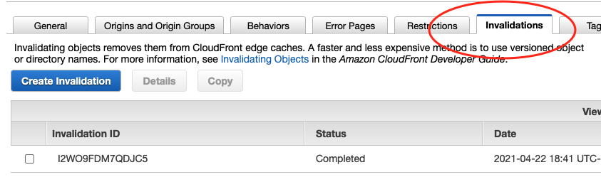

### 5.2 快速更新

推荐使用**versioned naming** 方式，**比如说 image_1.**

这样的话不需要等待object过期就可以马上更新。

**如果不使用上述的而是直接使用相同名字的更新那么cloudfront仅会在下面两条同时发生的情况下更新**

* 数据过期
* 有新的请求

## 6. 安全

安全分为三种

* **OAI Origin Access Identity** 配置访问权限 类似IAM, 可以设置为仅可以通过CloudFront来访问资源
* Behaviors 配置HTTP 相关
* Restrictions 配置地区相关（whitelist & blacklist）
* **不可以直接和用户安全的配合（比如说Cognito**），但是可以通过**Lambda@Edge**来进行权限认证

### 6.1 加密

从客户到front是加密的，front到origin也是加密的

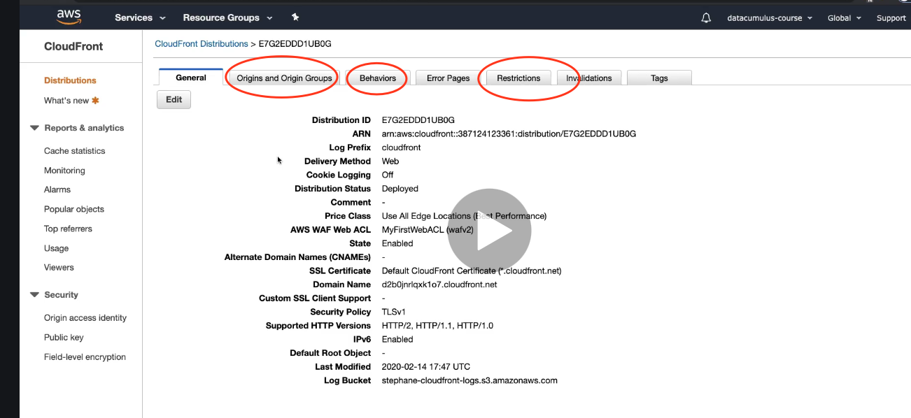

### 6.2 CloudFront & HTTPS

* **Viewer Protocal Policy** -- HTTPS only or Redirect HTTP to HTTPS
* **Origin Protocal Policy** -- HTTPS only or Match Viewer 

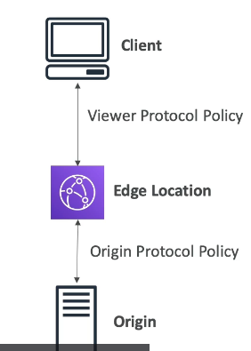

1. **如果origin 是 ELB，那么可以使用AWS Certificate Manager提供的SSL**，或者第三方信任的导入到ACM的
2. 如果origin是其他，那么必须使用第三方信任的SSL
3. 不可以使用自己信任的（self-signed）
4. **S3 bucket websites 不支持HTTPS**

## 7. 配置

### 7.1 Restrict Bucket Access

用于配置S3为origin的时候，限制用户只可以通过Cloudfront的URL来访问，不可以使用S3的URL


### 7.2 bucket policy（OAI）

配置S3的时候勾选自动修改policy，会自动帮忙修改S3的bucket policy.

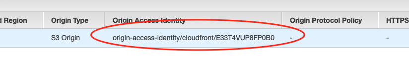

上面的的ID 会被用在 S3 的policy里面

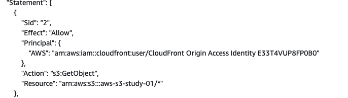

## 8. Signed URL / Signed Cookies

用于区分付费用户

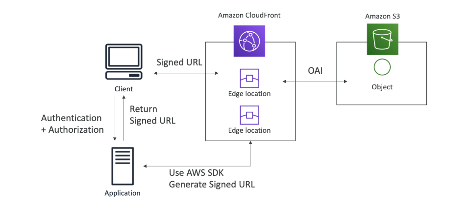

* client 首先通过application来进行验证拿到**Signed URL（由Application来签署）**
* 然后通过Signed URL来访问cloudFront获取数据
* CloudFront和application进行确认（使用私钥生成，使用公钥来确认）

### 8.1 添加policy

* 添加URL 过期时间
* **添加users 的IP range**（如果知道的话）
* Trusted signer（哪些**AWS account** 可以创建signed URLS）

### 8.2 有效期策略

* 共享内容（movie， music）配置短期有效
* Private 内容（私人信息） 配置长期有效

### 8.3 URL & Cookies

* URL ： 一个资源对应一个URL
* Cookies： 多个资源对应一个Cookies

### 8.4 Process

#### 8.4.1 两种signers

* **Trusted key group**（推荐），可以调用APIs来创建和rotate keys

* 一个AWS 账号且拥有CloudFrount key pair（只能由Root创建 所以不推荐）

  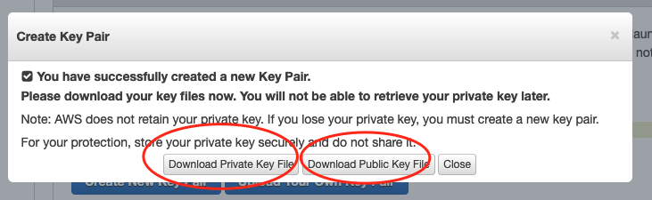

可以创建多个Trusted key group

**Key pair类似SSH，分为公钥和私钥。 私钥存放在Application中（比如EC2），公钥放在CloudFront中用来确认Signed URL是否有效**

#### 8.4.2 配置

1. 生成公钥私钥（第三方工具）
2. 把私钥放到application中，公钥上传到cloudfrot

### 8.5 CloudFront  signed URL VS S3 Pre-Signed URL

* CloudFront signed URL 不需要考虑origin是谁，但是S3只能是S3
* 前者可以过滤by IP, path，date，过期时间，后者不可以
* 前者可以caching 后者不可以

## 9. Multiple Origion

一个CloudFront可以设置多个Origion，**公用一个域名**。基于Path

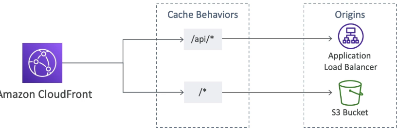

## 10. origion Groups

用于**提升性能或者处理failover**，十分类似 ALB+TrgetGroup

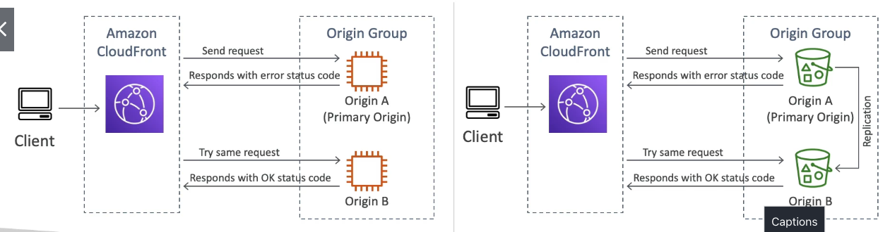

设置多个Origion在一个group里面，当主要的origion出现性能不佳的时候则可以自动切换

## 11. Field level Encryption

保护数据的部分Field的信息，**加密**。

* 在**Edge location** **存放Public key 用于加密数据**
* 在**Application****自定义代码**来使用Private key来解密
* 使用**asymmetric**加密

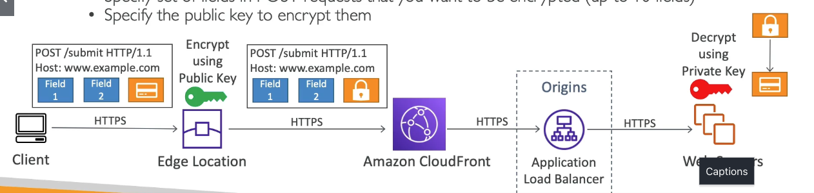


## 12. 动静分离

为了保证cache hits的准确度，可以进行动静分离

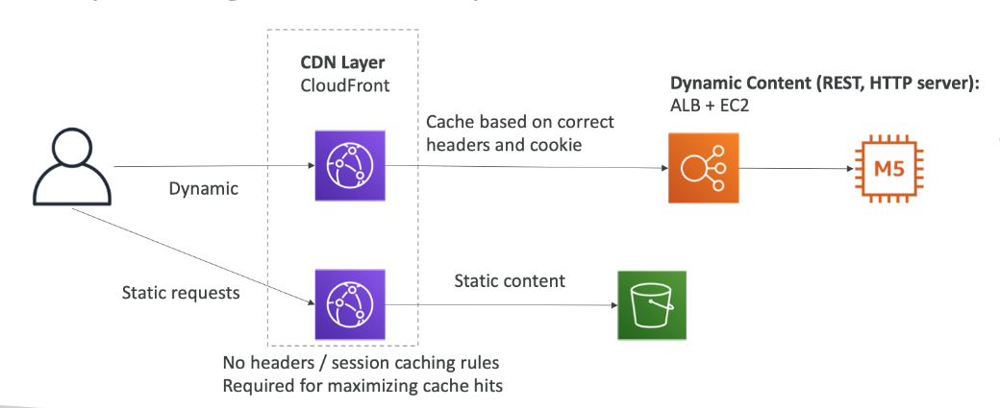

* 比如说没有某个header或者session，就访问static
* 基于某个header或者session就访问dynamic

## 13. Price

三个套餐

* Price class all： 所有地区，最好效率
* Price class 200： 绝大多数地区，除了一些最贵的地区
* Price class 100： 只有最便宜的区域

# AWS Global Accelerator

---

解决想让一个部署在一个区域的APP被世界各地**直接的访问**。

## 1. Unicast IP & Anycast IP

AWS Global Accelerator使用了后者相同的技术

### 1.1 Unicast IP

一个server 对应一个IP，想访问就必须要使用对应的IP

### 1.2 Anycast IP

多个server 对应一个IP，用户访问则获取到**离他最近的**

* AWS GA 会提供两个Anycast IP

## 2. 功能

* Consistent Performance：走AWS Inernal network
* Health Checks： 提供安全检查
* Security： DDos保护（AWS Shield）

## 3. 和 CloudFront对比

### 3.1 相同

* 都使用Edge location
* 都使用AWS Shield 来提供 DDoS保护

### 3.2 区别

* CloudFront同时提供Static和Dynamic的数据提速
* CloudFront数据存放在Edge，但是GA类似转发请求。
* GA一般用于处理TCP，UDP，适合非HTTP传输，比如游戏，IoT，Voice
* GA用于HTTP的时候需要static IP


# AWS Snow Family

---

处理两件事儿

* Edge computing
* Data migration

## 1. Data Migrations

offline，AWS 邮寄一个物理磁盘让你转移数据。

### 1.1 Snowball Edge

* 处理TBS or PBS级别数据
* 大箱子

#### 1.1.1 两种级别

* **Snowball Edge Storage Optimized**：80TB HDD
* **Snowball Edge Compute Optimized**：42TB HDD

### 1.2 Snowcone

* 轻巧
* 适应环境强
* 8TBS
* 可以和AWS DataSync来联合使用

### 1.3 Snowmobile

* 一辆车！
* 100PB
* 超过10PB就需要使用这个

## 2. Edge Computing

产生数据，但是不是特别需要高性能的传输到云端的地点。比如收集天气的传感器，这些数据固然有用但是并不需要即使的传输到云端。又或者是管道安全监测装置，需要迅速做出反应，而不是传输数据到运单。这种需要相当于一个**小型的设备**来对一些特殊**紧急的事情做出处理**，或者**简单的数据分析**。

所有以下都具有

* **可以运行EC2**
* 可以运行AWS Lambda functions （**AWS IoT Greengrass**）
* 长期部署选项：1-3年的打折

### 2.1 Snowcone（smaller）

* 2 CPUS，4GB内存

### 2.2 Snowball Edge - compute Optimized

* 52 vCPUS， 208G 内存
* 可以配备GPU
* 42 TB storage

### 2.3 Snowball Edge -Storage Optimize

* 最高 40vCPUs，80 G 内存
* 提供Object storage clustering 

## 3. AWS OpsHub

用于提供CLI在你自己的设备来管理上面的设备。

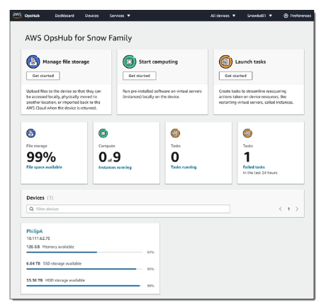

## 4. with Glacier

先上传到S3，然后通过lifecycle policy转换到 Glacier

# AWS Storage Gateway

---

on-premises 数据和云端数据之间的**桥梁**

* 是个软件，**需要安装在on-premise**

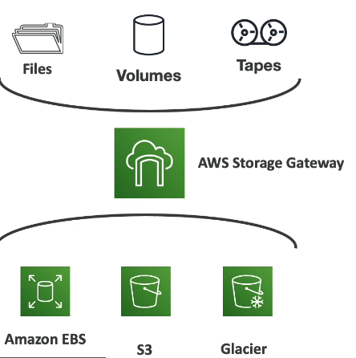

用于

* disaster recovery
* back up
* tiered storage

## 1. 种类

3种

* File Gateway
* Volume Gateway
* Tape Gateway

### 1.1 File Gateway

* S3使用 NFS 和 SMB 协议
* 支持S3 stanard， IA, One Zone IA
* 使用 IAM roles来access S3
* 提供cache
* 可以被挂载给多个server
* 可以使用**Active Directory**来进行 authentication

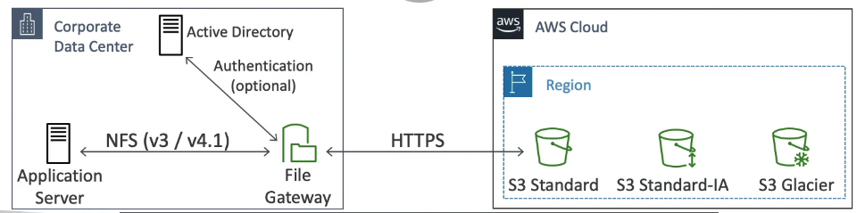

### 1.2 Volume Gateway

* block storage 使用**ISCSI** 协议
* EBS snapshots来进行备份
* **Cache volume**：低延迟的最近数据
* **Stored volume**： 整个数据集是on premise，但是备份在S3
* 结构类似上面

### 1.3 Tape Gateway

有些公司还特么在用物理tapes备份

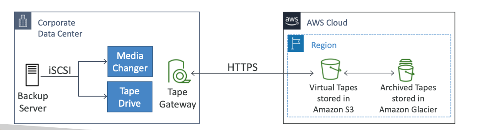

* 备份在S3 和 Glacier

## 2. Hardware appliance

使用前面的三个必须要有可视化工具，可以购买这个硬件，其中包括了负责这部分功能的所有软硬件需求。

* 针对每天的NFS 备份十分好用
* 没有可视化工具则使用这个

# AWS Fsx

---

## 1. for windows

EFS 是 shared POSIX system，只可以给Linux系统使用，这个是专门给Windows用的

* 支持 SMB协议 & windows NTFS
* 支持 **Microsoft Active Directory**， ACLs， user quotas
* SSD
* 可以使用on-premise访问
* Multi-AZ
* backed-up daily （S3）

## 2. for Lustre

Lustre: cluster + Linux， 专门用于大型分布式系统计算的file system

* 机器学习，**High performance computing** （HPC）
* 视频处理，金融建模，等等
* **超快速**
* 和S3集成
  1. 可以 read S3 as a file system
  2. write the output of the computations 回 S3

## 3. Depolyment options

### 3.1 Scratch File system

* 临时存储
* 没有备份
* 速度超快：6倍
* 用于处理短期任务

### 3.2 Persistent File System

* 长期储存
* 有replicated in same AZ
* 长期储存，敏感数据


# Elastic Container Service (ECS)

---

## 1. Concept

### 1. Task Definition

一般一个**Task**就是一个项目其中包含了全套的系统

* **独立分支，和cluster同级**
* 创建一个task的模板，需要指定 ：
  1. **Task Role**（IAM role）
  2. Memory 和 CPU
  3. 添加container（比如nginx 等等）,指定docker image
  4. port mapping

### 2. Service

用于帮助定义**多少task（同一种，使用task definition）需要运行，并且如何运行**

* 需要指定方式
  1. on-demand 直接指定数量（需要注意port映射，如果运行多个）
  2. daemon 每个instance都添加一个
* **可以配置 ELB（可以选择是否创建） 和 ASG(会自动创建)**

### 4. container

就是docker的容器

### 5. Task

可以单独创建，也可以通过service同时创建多个

## 2 ECR

就是 private Docker image repository

* 被IAM 严格管控！
* 储存，管理，**部署**

### 2.1 Login Command

```bash
# CLI version 1
$(aws ecr get-login --no-include-email --region eu-west-l)
# CLI version2
aws ecr get-login-password --regoin eu-west-l | docker login --username AWS --password-stdin | 1234567890.dkr.erc.ud-west-l.amazonaws.com
```

## 3. Fargate （补）

当创建cluster的时候可以选择EC2类型或者是Fargate类型

* Serverless
* 从EC2层面变成task层面，也就是说只添加task不需要考虑EC2
* **charge by task**
* 只需要关心 CPU/RAM 即可

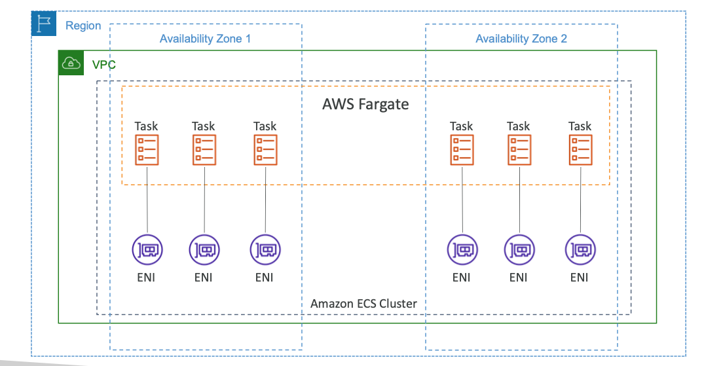

## 5. 部署策略

因为ECS Service是cluster 所以不同的EC2里面可以运行数量种类不同的Container，所以一旦有新的Container需要被加入到cluster，需要一种策略来指导部署. **Fargate无效（因为severless，不考虑EC2）**

#### 5.1 type

* **Binpack** -- 部署尽可能多的container在一个EC2上，**基于某一个属性**

  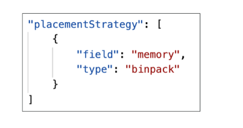

* Random -- 随机

* Spread -- 根据 **某个指定的属性**来均匀分配

**这几种可以混用**

## 6. 部署限制

* **distinctInstance** ：一个EC2上不可以部署相同的container

  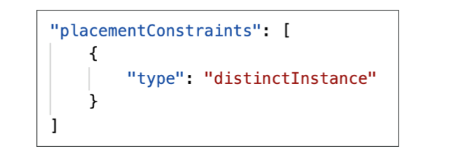

* memberOf：根据Query来部署，比较高级不一定用得上。**Cluser Query Language**(例子如下)

  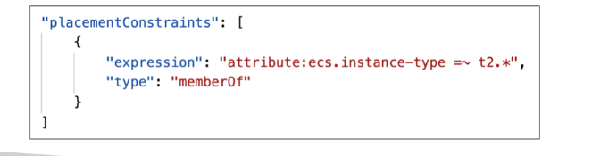

  比如根据**task group**部署

  ```json
  "placementConstraints": [
      {
        "expression": "task:group == databases",
        "type": "memberOf"
      }
  ]
  ```

  

## 7. Service Auto Scaling

**（ECS Service Scaling）Task level ≠ (EC2 Auto Scaling)instance level**

> **这里是Service level的检测，不是 EC2的**

* Target Tracking：根据参数，比如说CPU使用率超过了70触发
* Step Scaling: 基于 Cloudwatch alarms
* Scheduled Scaling: 基于未来可能发生的改变，比如说黑五
* **Fargate auto scaling 更为简单**

### 7.1 可以在Service层面覆盖ASG的EC2 desired acount

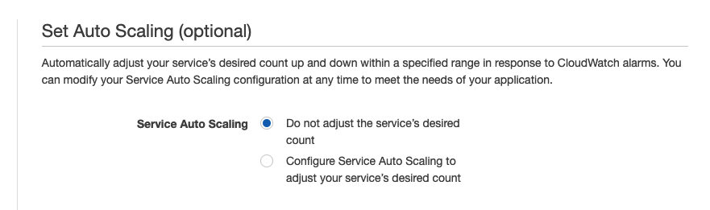

### 7.2 问题

因为是Service Level的检测，所以很难让EC2正确的进行Auto scaling, 需要使用下面的**Cluster Capacity Provider**  

## 8. Container instance lifycycle

1. 当cluster中的一个instance被**stop**了后，I**nstance的status仍然是ACTIVE**，但是**agent connection status会变为FALSE**
2. 如果instance被**deregister or terminate**，那么instance status 会变成 **INACTIVE**
3. 如果instance**在STOPPED stats被terminated**，那么需要手动deregister

## 8. Profile & Role

### 8.1 EC2 instance profile

* ECS agent 来使用，用来调用API calls到ECS，包括logs Pull image

### 8.2 task role

* 分配给task，用来获取其他服务的权限， **task definition中配置**

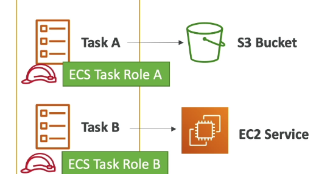

## 9. Cluster query Language

用于查询一类container instances by 某一个属性，属性可以手动添加。

## 10. ELB & ASG

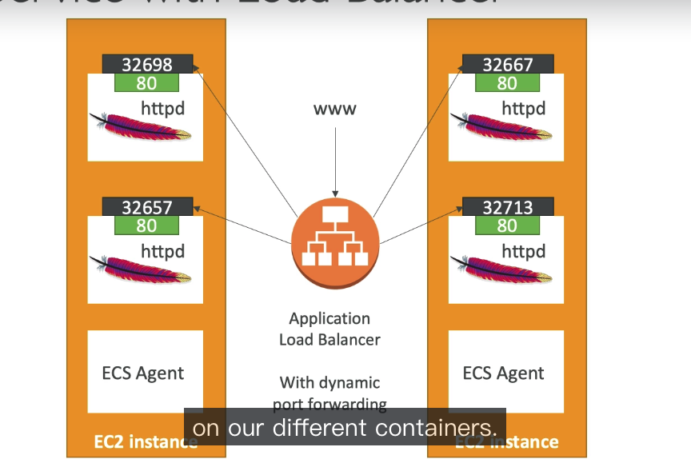

* LB **只可以在创建Service的时候创建**
* **集群部署需要再host port指定为0**，这样就会自动分配动态的host port .**需要再service里面配置，不可以在task definition里面配置这两个**
* ASG和ALB的安全组需要对接

## 11. Cluster Capacity Provider

用于扩展ASG，通过设置Capacity来实现更为方便的扩容

* 对于使用Fargate的user，**FARGATE 和 FARGATE_SPOT CP会自动添加**
* 对于EC2user，需要**手动关联一个CP到ASG**

## 12. Data Volumes

用于挂载Container内部的数据到外面进行管理和监控，比如配置文件

* Fargate不需要考虑，因为是serverless

### 12.1 EC2 + EBS Volume

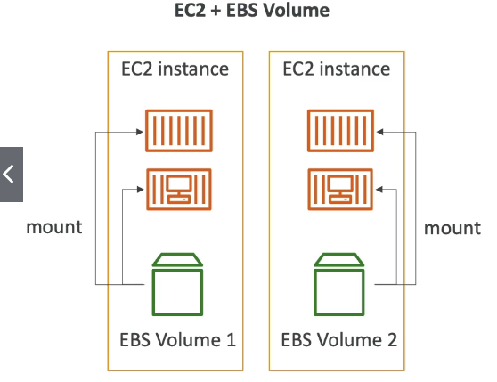

Problem： 如果task 被转移到了另一个EC2中那么数据丢失

### 12.2 EC2 + EFS NFS

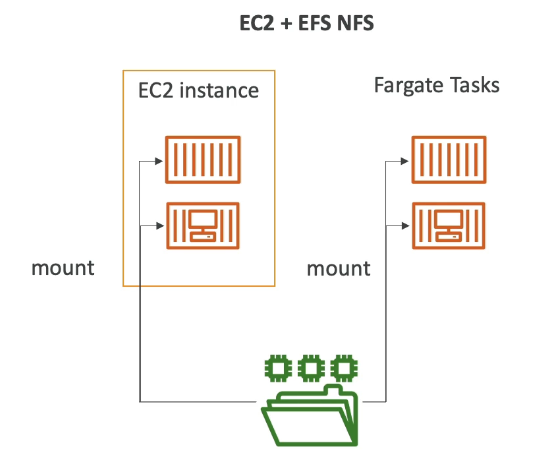

公用File

### 12.3 Bind mounts

在task definition创建的时候**多创建一个container用于记录数据**，比如说Log等等。这样即使被转移走，数据也会被带走。

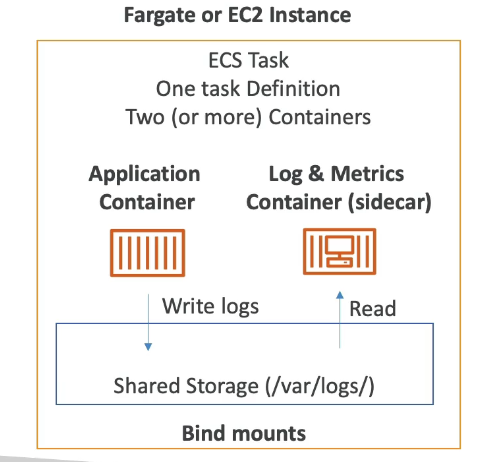

## 13. Rolling update

两个属性：一个最大（超过100则变成with additional batch），一个最低

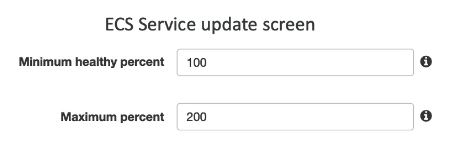

类似EC2的，不做介绍

# AWS Elastic Kubernetes Service（EKS）

---

AWS managed Kubernetes cluster

用于：

* 公司已经使用了Kubernetes，并且想继续使用其API（**API和ECS完全不同**）

# AWS Monitoring 

---

## 1. CloudWatch

* logs
* alarms
* Metrics （默认不提供Memory usage，必须使用custom metric） 
* 默认是5分钟刷新一次，**可以使用 high-resolution custom metric来改变刷新时间**
* 可以cross-account and cross-region 监控

### 1.1 Logs(CloudWatch log agent)

**默认EC2是不会发送log到 cloudwatch中，需要运行CloudWatch agent**，**在Application中调用SDK来触发**

* 同时需要考虑 IAM权限是否正确
* 也可以设置到 on-premises 中
* 可以定期删除，也可以导入到S3中 （action中操作）

#### 1.1.1 CloudWatch （Logs） agent & Unified agent

* 都是对于 virtual servers
* 前者是老版本 只可以sent to Cloudwatch logs
* 后者是新版本 可**以收集 system-level的指标 比如说RAM，同时也可以send to CloudWatch logs**
* 后者可以使用 SSM parameter store 来管理配置

#### 1.1.2 Filter patten

可以手动输入过滤logs，也可以设置Filter patten来管理logs

变成一个独立的metric可以在Metric中被观察

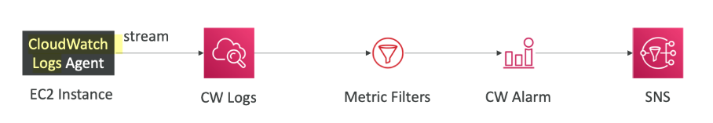

### 1.2 CloudWatch Events

Event 一般是 AWS 环境发生改变或者参数发生改变, **通过设置Event Rules来targets**

**eg：CodePIpeline state changes**

* **分为两类 EventPattern 和 schedule**
* Schedule：**比如 Cron jobs**
* Event Pattern: Event rules 可以针对某个service做出一些反应，比如说CodePipeline state changes
* 可以触发Lambda functions， SQS/SBS/Kinesis Messages


#### 1.2.1 EventBridge

传统的Event只可以发送自己的AWS service， 这个可以有多条bus 包括购买的第三方的服务也可以发送Events

#### 1.2.2 CloudWatch Rules

用于指定Event发生后由谁来处理（一般来说是Lambda function）

**Rules 和 Target 必须在同一个Region**

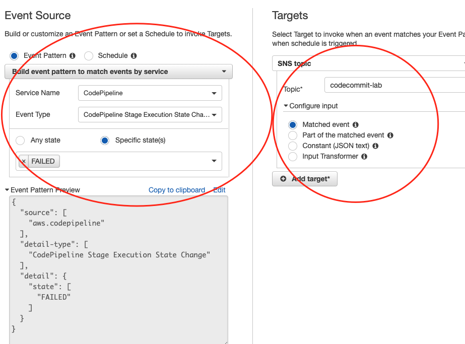

### 1.3 alarms

基于max，min，百分比触发

**一般不用于触发lambda**

#### 1.3.1 States

* OK
* INSUFFICIENT_DATA
* ALARM

#### 1.3.2 Period

配置属性

* 每隔多久触发一次检测
* **High resolution custom metrics**: 只有10s or 30s，这个是alarms的触发并不是刷新率。

#### 1.3.3 **Evaluation Period**

在最近的period中，进行多少次对于alarm state的测量

#### 1.3.4 **Datapoints to Alarm** 

在evaluation period的配置前提下，违反多少次则触发alarm。

#### 1.3.5 组合使用

需要配置 Datapoints to alarm & Evaluation period **即在多少时间内有几次越过了alarm的线**会触发警报


### 1.4 Metrics

统计学中，数据分为两类，可以计量的（CPU 使用率），不可以计量的（User ID，name）。

#### 1.4.1 Metric Filters

自定义 Metric filter for logs

并且可以通过Metric Filter来设置 alarms

concept

* **Metric** ： 被监控的variable（CPU utilization）,有 **timestamps**
* **namespaces**： **是指标的容器**，可能有很多指标
* **Dimension**: 是一个属性（instance id， environments 等等），up to 10/metric

#### 1.5 各个名词之间的关系

多个application的使用则是创建多个namespace，这样相同类型的service可以被同时监控，因为namespace不同，相当于用了不同的容器隔离

## 2. X-Ray

传统的Debug十分复杂尤其在面对分布式架构的时候。此时X-Ray就很有作用了。

### 2.1 EC2 如何使用

* **在代码中导入 SDK**
* 在系统层安装**X-Ray daemon**（客户端）

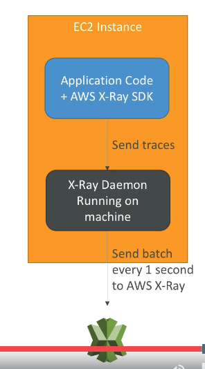

### 2.2 Troubleshooting

* 如果EC2上无法使用 --- 检查IAM Role， 是否运行 Daemon
* 启动AWS Lambda 确保 IAM execution role 是正确的Policy

### 2.3 Concepts

* Segements: 分段提供资源的名称等有关请求的详细信息和工作情况

  比如HTTP：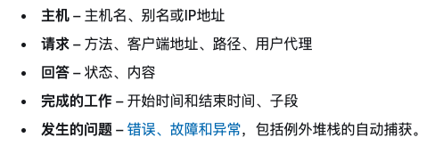

* Subsegments: 在Segments的基础上 **更加细颗粒**, 包括call的更多细节, 甚至一些不支持X-Ray的外部服务，他可以发送一个**推断片段（inferred segments）**，比如说一个注册请求，可能下面包括了数据库查询，比对等等小的calls

  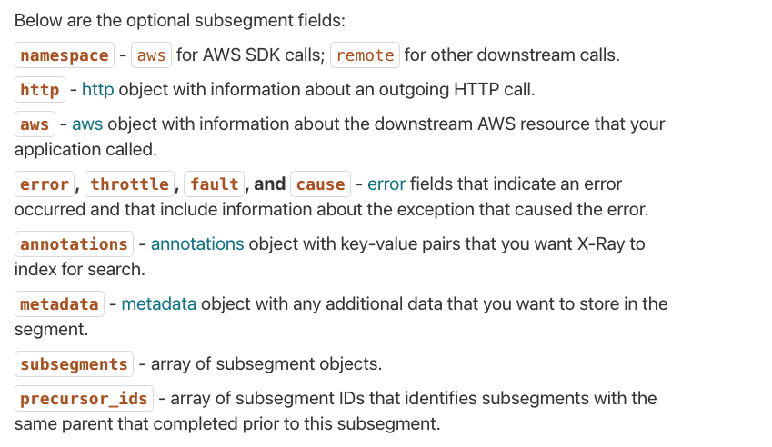

* Trace：Segements是点对点的 trace是一条线的（end-to-end），**保留由一个请求产生的所有的Segements**

* Sampling：减少记录的数量 **省钱用的**

* **Annotations**: 可以被添加到任何segments or subsegments 作为**属性** 是**有索引的**Key-Value对，可以用于  [filter expressions](https://docs.aws.amazon.com/xray/latest/devguide/xray-console-filters.html). **有index**

* **Metadata**:是Annotation的一种特例，系统添加的K-V对包含数据是Annotation，**开发人员自己添加的是Metadata** ，**没有index**。**用于存放自己想存放的数据，但是不用于搜索**

#### 2.3.1 X-Ray daemon/gent

可以配置traces **cross account**

可以有一个 **central account**来管理所有的applications

可以assume role

#### 2.3.2 Sampling Rules

**减少发送到X-Raydata的数量**，**但不是使用index（和annotations + Filter Expressions的区别, 这里是做结果筛选）. 一个是从源头进行筛选，一个是从结果进行筛选**

* 两个属性 **reservoir** & **rate**
* 前者是一个固定数目 后者是一个比例 总体是 **固定数目+整体数目** 比例

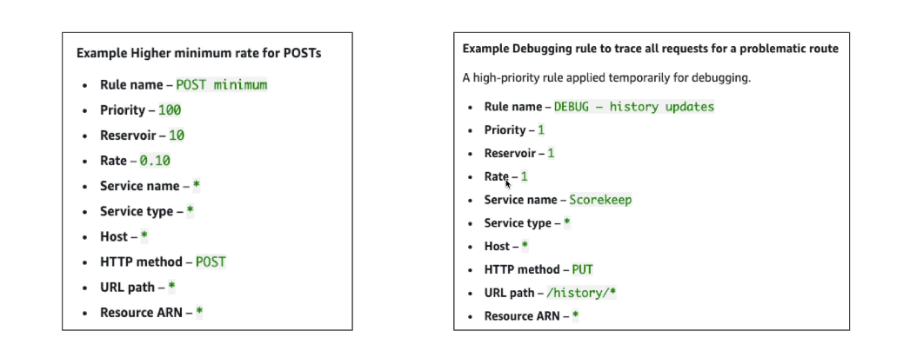

**优势是不需要修改代码** 相当于在AWS层进行筛选

#### 2.3.3 X-Ray Write APIs(used by X-Ray daemon)

* **PutTraceSements：uploads** segment documents to AWS X-Ray
* **PutTelemetryRecords**: X-Ray 调用 用来upload telemetry（不知道是啥）例如 SegmentsReceivedCount
  * SegmentReceived count
  * SegmentRejected count
  * Backend connection errors
* **GetSamplingRules**:获取所有的Sampling rules
* **GetSamplingTargets**&**getSamplingstatisticSummaires**:获取一些分析数据about Sampling
* **需要确保有IAM有足够的权限**

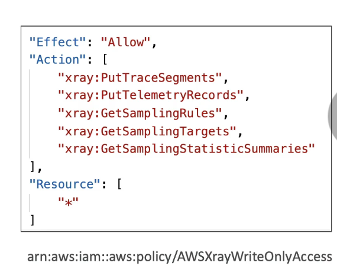

#### 2.3.4 X-Ray Read APIs

* **GetServiceGraph**: 获取main graph
* **BatchGetTraces**: 获取**一个list** 的 traces的**info**（**需要ID做参数）** 每一个trace都是一个**segment documents**的集合需要，并不返回**annotation**
* **GetTraceSummaries**: 返回一个时间内的可用的traces的**ID + annotations**信息.
* **GetTraceGraph**: 获取一个或多个 Service Graph by using IDs

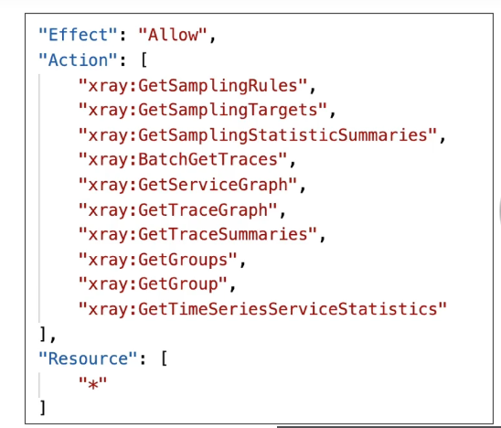

### 使用技巧：

1. 需要做 **filter** 查询：**GetTraceSummaries**（id + annotation）
2. 需要查询**segment**：**GetTraceSummaries** + **BatchGetTraces**

### 2.4 ECS+X-Ray

三种配置方法

* **一个EC2一个 X-Ray Daemon Container（注意不是daemon！！！！）**
* X-Ray 以**Sidecar**的形式和每个APP Container**一起运行**
* Fargate和第二类似
* **都需要配置监听traffic on UDP port 2000**
* **使用Fargate不需要考虑EC2的权限问题**

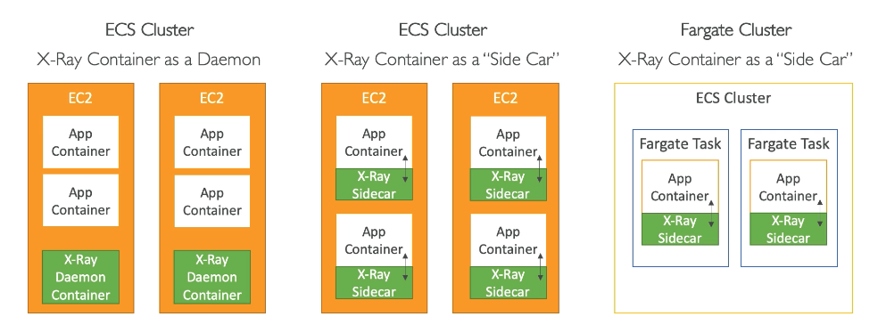

### 2.5 Elastic Beanstalk + X-Ray

细节

* X-Ray daemon（守护进程）
* 配置X-Ray daemon  **.ebxtensions/xray-daemon.config**中配置
* IAM
* **不支持 Multicontainer Docker**

### 应用场景：

* 整个application由多个组件分布在不同的account里，如何进行管理：X-Ray Agent可以assume一个role，来发送数据到另一个account中，这样可以通过让所有的 Agent都发送给中心账号来管理。

## 3. CloudTrail

* **针对AWS账号**提供 管理，compliance 和 审计 
* 默认开启！
* 可以把logs to CloudWatch
* **默认加密**
* 支持多个regions的log存储到一个S3中，直接配置即可。

### 3.1 Organization trail & AWS Organization

AWS可以创建organization, 并且可以添加trail来审计所有在内的Account。

分为两类 manager 和 member

* **Member可以看到trail，但是不可以access to it**
* 默认Cloud Trail只审计bucket-level action，如果需要关注object-level action，需要启动 S3 data events


## 4. AWS config

用于设置一些rules来审计resource

* 并不会 denied操作，只是标记没有通过审计的resource

### 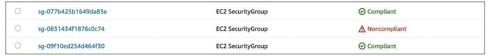

### 4.1 Remediations

可以出发一些钩子函数用于处理没有通过审核的，比如Key过期就触发让其失效即可

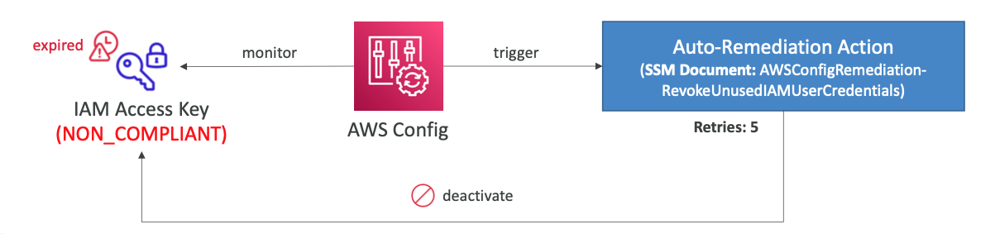

## 对比

* CloudTrail ：**针对API call**的审计 用来检测未授权的API调用
* CloudWatch: 用来**检测观察提示** Application的**各项指标**
* X-Ray： 相比CloudWatch更加细颗粒 并且**适用于分布式系统**

# Integration & Messaging

---

## 1. SQS

Simple Queue Service 

* 生产者消费者模式 SQS做中间的Buffer **用来解耦**
* Oldest offering
* **最多一次poll10条message**
* 可以通过endpoints直接接入VPC，不需要走public
* 可以添加 structured metadata（比如 timestamps， geospatial data）using **message attributes**

### 1.1 Standard Queue

* Queue 没有上限 也不会阻塞
* **默认保存4天，最多会保存14天**
* 低延迟
* **256KB Limitation** 
* 可以多次发送message（at lest once delivery）
* 可以无序的message （best effort ordering）


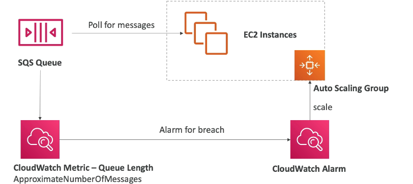

和 ASG的结合使用 根据请求数量来调节EC2 数量

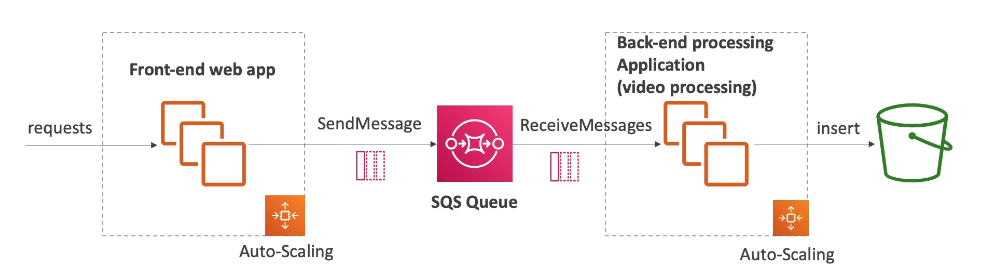

解耦前后端的使用

### 1.2 Security

加密类别

* HTTPS API
* KMS keys
* Client-side encryption

#### 1.2.1 access control 

* IAM policies

* **SQS Access Policies**（cross-account access）: resource-based policy 指定谁可以发送或者接受

  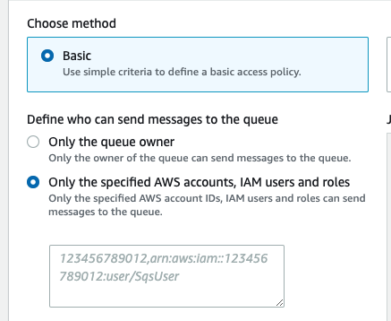

  eg: 允许S3 event 发送到SQS

  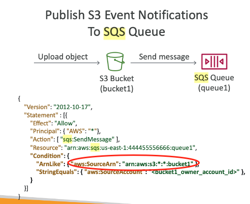

### 1.3 Message Visibility Timeout

Poll 操作需要时间。这段时间内，这些message是Invisible的对其他consumer

* 默认是30秒, 如果30秒没有被处理，那么会返回Queue。也就是说这条message会**被处理两次**
* 如果需要修改时间，需要call **ChangeMessageVisibility API**

### 1.4 Dead Letter Queue

如果有的message一直没有被处理，那么会占用资源。所以设置一个阈值，如果超过N次依然没有被处理 那么就送到DLQ中

### 1.5 Delay Queue

message发送后，会有一个delay time 才可以被consumer发现，通过**message timer**实现

### 1.6 一些Developer概念

* **Long Polling**-- consumer和Queue保持一个类似长连接的连接，用于减少API调用次数和延迟。有些类似于 Netty中的EventGroup。**好处：便宜，延迟少，推荐！**

* ShortPolling: 设置 *ReceiveMessage* 的 waitTimeSeconds 为 0。

* **SQS Extended Client**-- **需要传大数据的时候可以存储到S3**中 然后传一些metadata（指针）指向这个区域即可。SQS Extended Client 是 java libarary

* **SOS 需要知道的API** 

  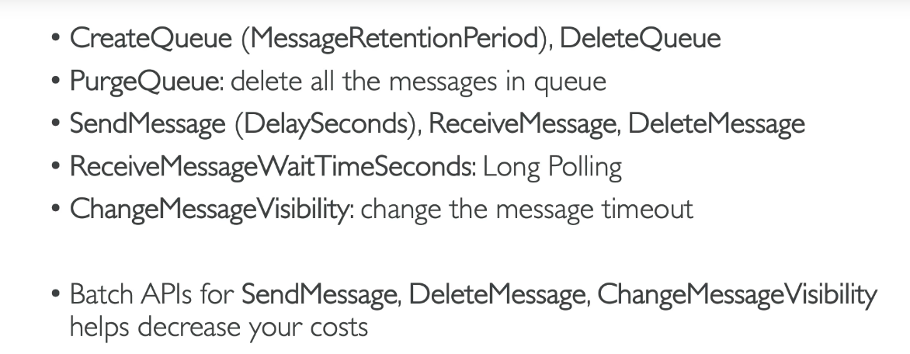

### 1.7 FIFO Queue

排序的, Queue Stander的不排序。

* 300 msg/s 的吞吐量单操作,3000 msg/s的批量操作
* **确保只会传一次！**
* **处理会排序**

#### 1.7.1 De-duplication

5分钟内相同的message会被拒绝，**在producer端配置**

拒绝策略

* Content-based: SHA-256的hash操作（去重）
* 直接提供MessageID

#### 1.7.2 Message Grouping

有的时候message应该分配给某一个固定的Consumer，并不需要整体排序。**所以先Grouping**，排序一般会根据某个属性（把这个属性赋值给**MessageGroupID**）来排序，比如说userid，那么这个user发过来的所有message会排序，并且最后专门发送给某一个consumer

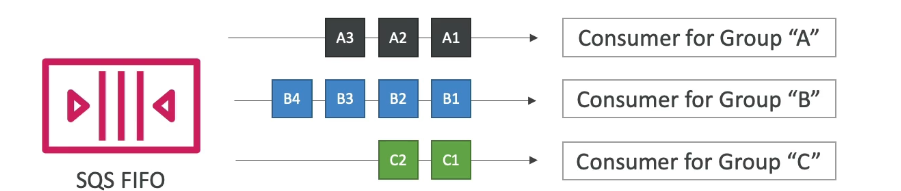

### 1.8 场景

* 大量删除Queue内的message（通过batch 操作）

### 1.9 FAQs

1. 如何share queue ： 添加**access policy statement**（resource policy），使用account number。 API：AddPermission & RemovePermission
2. 支持匿名访问
3. 不支持跨域

### 1.10 Request-Response System

正常的设计就是为了解耦，不回复。如果需要可以设计为有响应的

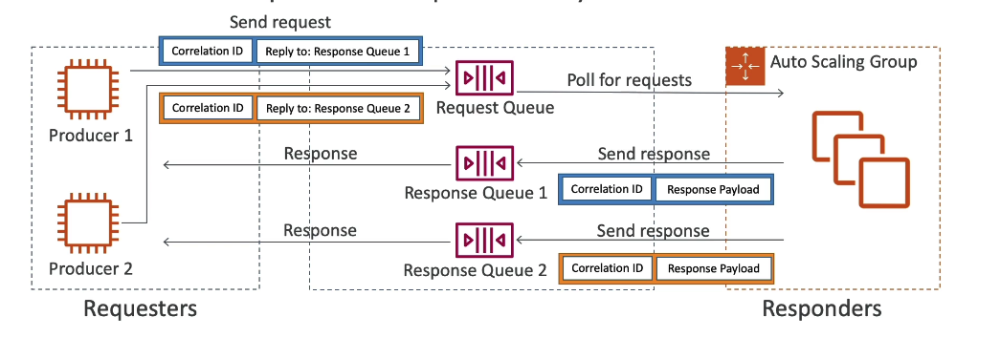

* 这里 **CorrelationID** 来标志这条消息来自哪个Producer，从而回复也带着对应的CorelactionID
* 使用 **SQS Temporary Queue Client**来直接使用 Java 编写（不需要知道如何实现的）
* 使用虚拟的Queue，而不是对应生成真是的Queue，所以便宜

## 2. SNS

Simple Notification Service

有时候需要把一条消息分发给多个接受者  **java的观察者模式**（发布/订阅）

* 传统方案直接发多次，SNS的话直接相当于加一层由SNS转发

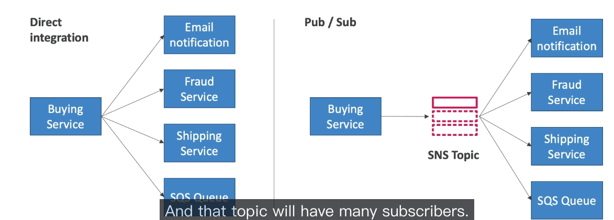

* **SNS 不可以发送message给SOS FIFO queues**
* 可以给message添加metadata（up to 10）比如 timestamps, geospatial data, signatures

### 2.1 filter policy

过滤信息

## 3. SQS+SNS

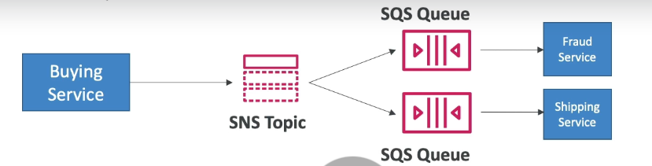

实际操作案例

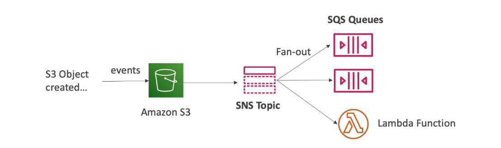

## 4. Kinesis

Kafka(大数据的消息队列) 的一种可管理的替代品

很好的用于

* application 的logs，metrics，IoT,clickstreams
* Real-time big data
* streaming processing frameworks (Spark 大数据)
* 数据自动 复制 to 3AZ

### 4.1 Kinesis Streams

 低延迟的获取大量数据

* 会分割数据

  

* **默认数据保留时间为1天 最高7天**

* 和SQS不同 **consumer可以多次使用数据**（SQS用完即删）

* 多个应用可以使用同一stream

* **real-time** 处理数据

* 一旦数据被插入到 Kinesis中则**无法被删除**（immutability）

* **延迟处理仍然排序**（Ability to consume records in the same order a few hours later up to 365 days）

#### 4.1.1 Kinesis Streams Shards

数据片 or 数据块

* stream 是由多个 shards组成
* 1 MB/S or 1000 messages/s -- write 速度**pre shard**
* 2MB/s -- read 速度**pre shard**
* Billing 是和pre shard 有关，可以随意增加数量
* shard的数量会自动调整（根据数据大小）
* **records are ordered per shard**

### 4.2 Kinesis Analytics

**用于创建SQL queries和 复杂的 java项目**

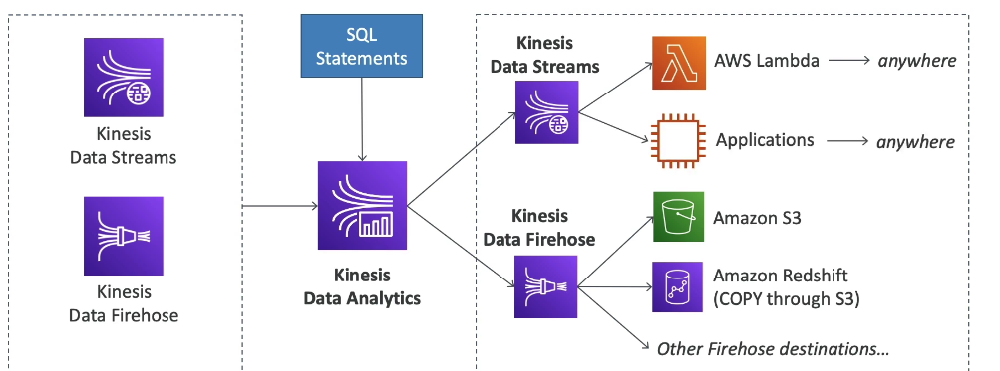

* Time-series 分析
* Real-time dashboards
* Real-time metrics


### 4.3 Kinesis Firehose

**中转站** 负责转载数据流到S3,ElasticSearch等组件中，**不进行数据分析或者数据处理**

#### 4.3.1 Destinations

* S3
* Amazon Redshift
* Amazon ElasticSearch
* 3rd-party partner，Splunk，MongoDB
* HTTP Endpoint（Custom Destinations）

### 4.4 关系

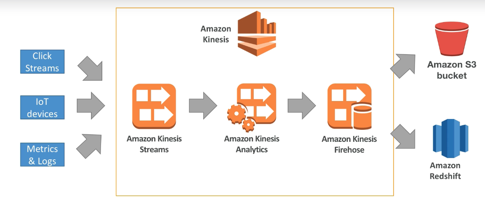

### 4.5 Kinesis API

#### 4.5.1 Put RECORDS

* 传送Data的时候需要设置一个Partition Key 来给Data分Shard -- key 会通过Hash算法来指定Shard Id
* 需要选择一个Highly distributed kay 比如说user_id来避免Hot Partition（分布不均匀）
* 使用Batching with PutRecords 来减少cost和增加吞吐量
* ProvisionedThroughputExceeded 如果超出limit

### 4.5 Kinesis KCL

Kinesis Client Library，可以运行在EC2或者Elastic beenstalk上**Java library, 用于分布式系统的 Kinesis streams的 consumer** 可以用来接收和处理数据

Rule:

* **每个 shard 只能被一个KCL instance读取**，比如入如果有4 个shards 那么最多只能有4 KCL instance
* Progress is checkpointed into DynamoDB
* 可以运行在一切EC2上

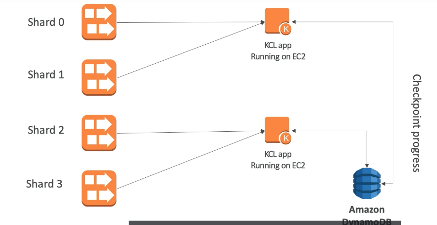

### 4.6 Kinesis Security

* Control access / authorization --- IAM pllicies
* VPC Endpoints 
* Encription -3种

### 4.7 Kinesis Firehose

* Fully Manage Service, no administration
* Near Real Time (60s latency)
* 加载数据到 Splunk/s3/Elastic Serch
* 自动 scaling

#### 4.7.1 客户端加密

不同的source加密方法不同，并且**不支持asymemetric CMKs**

**with Kinesis Data Stream**

1. Kinesis Data Firehost 不保存数据
2. Kinesis Data Streams会先加密at rest（KMS），在被Firehost读取前解密再加载到Firehose的内存中。最后直接发送给producer并且删除内存中的数据。


### 4.8 Kinesis Agent

**运行在windows上的**辅助agent

* 可以on-premise 或者 在AWS中，**辅助Kinesis的其他功能**

### 4.9 Kinesis Producer Library 

**负责对接流入Kinesis的数据的生产者**

* 用于简化生产者的开发流程
* **提供高 write throughput to a kinesis data stream**

### 4.10 **Kinesis Adapter**

相当于一个adapter，有些希望使用Kinesis的API（KCL）的service可以用这个作为中间件来处理大数据。用于consumer data ，**推荐配合DynamoDB**

### 4.11 resharding

可以通过 **splitting shards** 来 增加**capacity**

可以通过**merging shards** 来减少**capacity**

* hot or cold， 一个shard接受超过预期的数据则是hot 反之则为cold

### 4.12 initial shards

计算方法

**number of shards = max(incoming_write_bandwidth/1000, outgoing_read-bandwidth/2000)**

### 场景

* CPU 高 ： 增加 instance size（提高单机性能）
* record被多次处理：producer retries（**嵌入primary key**解决） or consumer retries

## 5. 对比

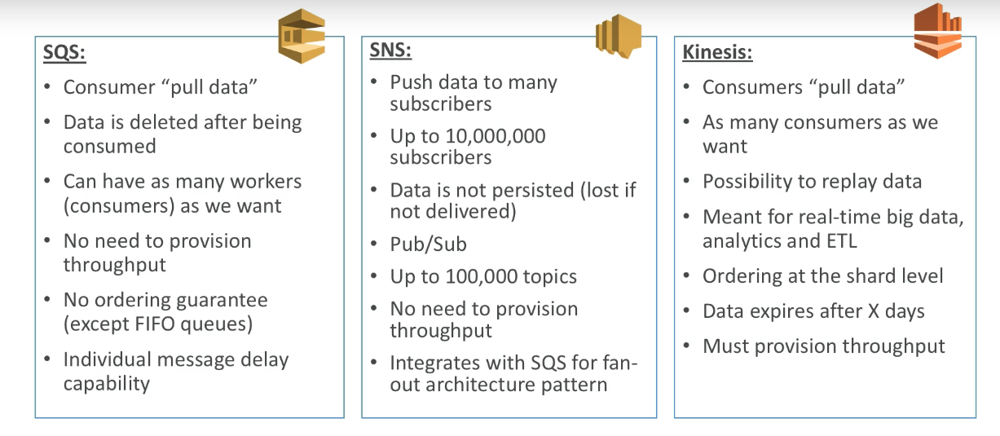

### 5.1 ordering

* Kinesis 是根据 partition key来hash分数据到 shard, **排序只能发生在每一个shard内部**，也就是shard-level，**shard之间是不可以排序的**
* SQS中 standard 没有ordring，FIFO如果不使用GroupID 会按照FIFO顺序被获取（只有一个Consumer）。如果使用GroupID 就会按Group来FIFO排序。

## 6. Amazon MQ

上面的Queue都是cloud-native的，如果就是想把**当前项目使用的MQ转移到云端**可以使用这个。

**约等于 managed Apache ActiveMQ**

* 使用on-premise的协议比如：MQTT,AMQP等等
* 运行在dedicated machine
* scale能力不行

### 6.1 Height availablety

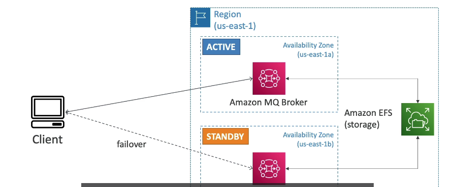


## 应用题

1. 如果是单线程poll多个queue需要使用Short polling，因为长连接需要等待一段时间会造成延迟
2. 使用**enhanced fan-out**当有多个consumers的时候

# Lambda

---

## 1. ServerLess 

Serverless 表示开发者不需要考虑Server的配置 全都是自动的

支持很多语言 **不支持Docker**

## 2. Synchronous Invocations

* Error 必须在client side 处理，因为同步的话 客户端会一直等待获取结果，也就是说客户端**一定会获得错误信息**

## 3. ALB & Lambda

**整体就是 ALB会把HTTP请求转换为JSON格式 让后Lambda就可以进行解析并且处理然后发送json格式（模拟HTTP）给ALB，ALB再次逆转换成为HTTP返回**

* 必须使用target group

**Sync + target group**

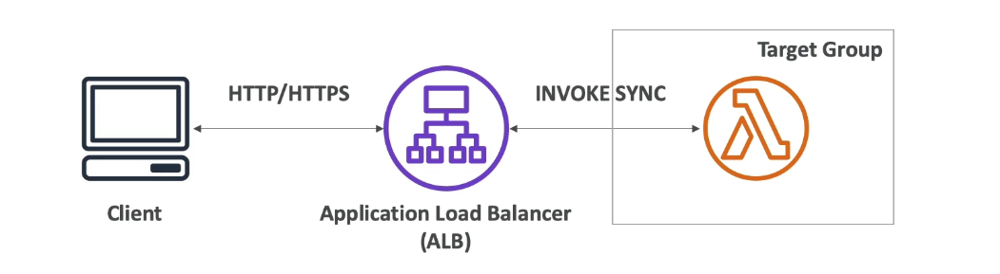

思路是使用HTTP to JSON

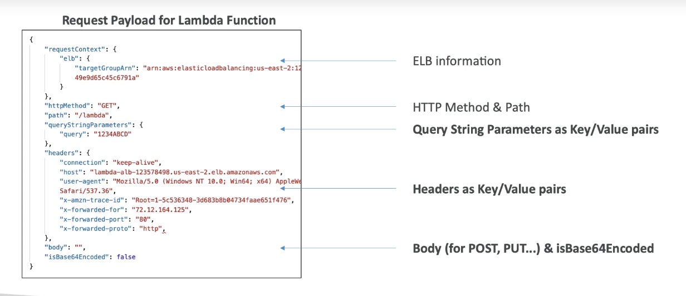

可以进行**multi header value**，可以看到有两个name被当做传输，**在JSON转换的过程中会给他们转换成为Array**

**在target group 中进行配置**

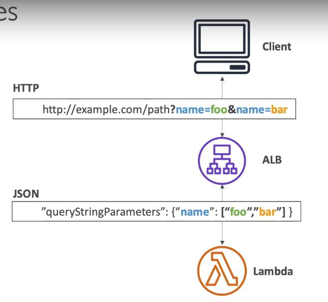

## 4. Lambda@Edge

**是CloudFront + lambda的一种架构**，使用lambda来针对cloudfront的请求和回复进行**增强**，可以进行处理的情况

* 收到request之后可以进行怎强 -- viewer request
* 在发送request到orign之前 -- origin request
* 收到origin的回复后 -- origin response
* 在发送origin的回复到viewer之前 -- viewer response

### 4.1 使用场景

* 安全处理，一般搭配Cognito

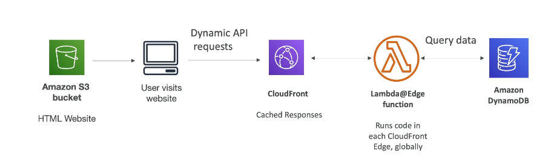


## 5. Asynchronous Invocations

一般来说 lambda service运行的时候如果报错 **会尝试一共3次**，等待时间翻倍从1mins,2mins

* 如果Funcition retried, 那么log会被重复
* 可以为了这些failed professing 设置一个DLQ

## 6. Event Source Mapping

用来匹配 Event source 和 对于的lambda function，可以作为source的有如下

* kinesis data stream
* SQS
* DynamoDB Streams

### 6.1 Stream & Lambda

**同步调用！**，也就是说有多少个shard那就有最多有多少个lambda function被调用，也就是说最多的 **concurrent executions 就是 active shards的数目**

一共有两种service可以作为stream source： **Kinesis & DynamoDB**

**可以多线程处理shard，shard会被in-order处理（shard-level的排序，根据partition key）**

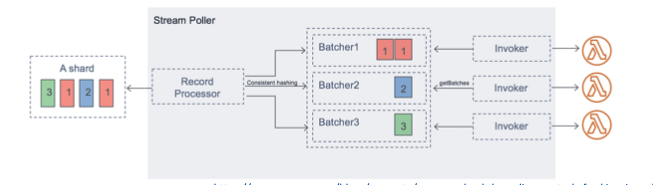

* **如果出现error 整个batch 都会重新处理直到成功或者过期**
* **stream的数据不会被移除** 也就是可以被多个comsumer访问
* **为了保证in-order的处理后面的shard会被暂停直到error处理**
* **最多10个batches** （如上图）/ shard

解决阻塞办法：

* 丢弃 old events
* 限制重试次数
* split batch 如果出现error（解决Lambda timeout issues）

### 6.2 SQS & Lambda 

**异步调用！**也就是说每一个请求都会被开启一个lambda，那么就是说如果处理时间是35s，然后每秒收到10个，就会占用**concurrent executions 350！**

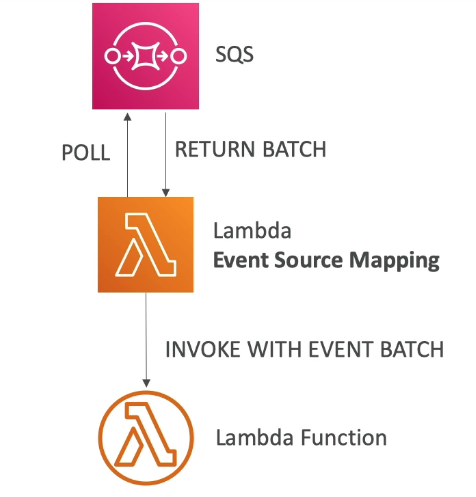

* ESM 会 poll SQS (Long Polling)
* 指定batch size（1-10 message）
* 推荐！ **设置 Visibility timeout是 Lambda function timeout 的6倍**
* 使用DLQ 

#### 6.2.1 Queues & Lambda

* Lambda 支持 in-order prefessing for FIFO，会自动scaling 到 最多 active message group的上线
* 如果出现error，被退回打data可能会组成新的group
* Lambda 在处理完毕后会删除item from queue
* 可以配置DLQ

### 6.3 总结

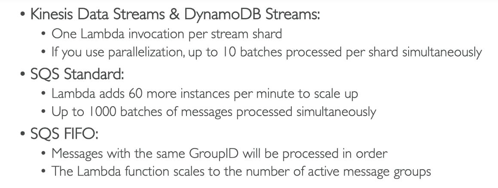

## 7. Destinations

为了能够方便观察Lambda function处理的数据是否成功，可以配置Destinations，DLQ其实就算是一种失败情况的Destination（AWS 推荐使用 Destinations来取代DLQ ）

## 8. Logging & Monitoring

### 8.1 CloudWatch Logs:

* AWS Lambda execution logs **默认会自动发送到CloudWatch**，在创建自动IAM的时候也会自动赋予这个权限，**但是需要再代码中编写发送log的代码**
* CloudWatch Metrics 会显示在Cloudwatch Metrics

### 8.2 with X-Ray

* 需要enable

* **Use AWS X-Ray SDK in code**

* 确保权限足够 **AWSXRayDaemonWriteaccess**

* 和X-Ray communicate 环境变量

  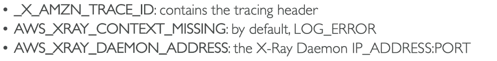

## 9. Lambda & VPC

Lambda是默认运行在AWS-owned VPC。所以无法access 自己的VPC

如果需要部署Lambda到VPC中

* **必须指定VPCId，Subnets和 Security Group Id**
* Lambda会根据上面信息创建一个ENI 在subnet中（**这一步是自动的**）
* 添加一个**NAT gateway**
* 需要**AWSLambdaVPCAccessExecutionRole**权限

需要注意的是

* Lambda function **在VPC中没有 internet access** **即使部署在public subnet 也不会有**
*  可以放在private subnet中 然后通过 NAT Gateway/instance 来和外部通讯

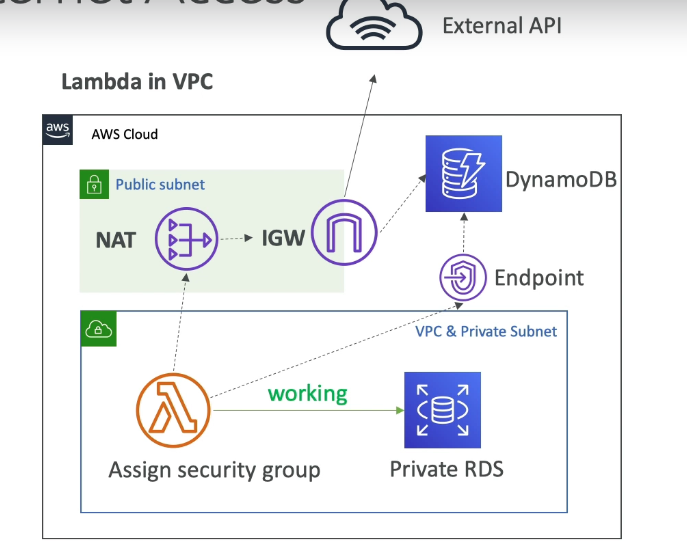

## 10. Lambda Function Configuration

### 10.1 RAM

* 128MB ~ 3009MB 每一档增加64MB
* **RAM加的越多，vCPU credits会获得的越多。类似超频的credits**
* 1792MB后 function相当于是一个 full vCPU，并且超过这个值后最好使用多线程操作
* 如果application是基于CPU的，那么就提升RAM

### 10.2 Timeout

* 默认3秒，最高900秒, **意味着最长时间是15mins**

### 10.3 Lambda Execution Context

貌似是真实代码（handler）外面用于初始化话dependences的代码一定要放在handler外面这样每次调用不需要初始化

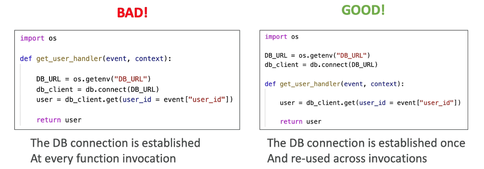

* 用于database connections等等

### 10.4 /temp

临时文件夹, **如果需要存放subsequent call需要使用的需要考虑存放在DynamoDB等等**

* max size 512 MB
* 会临时保留数据
* 永久储存请使用s3

### 10.5 Concurrency & Throttling

* 最高 1000 并发处理（**账号内的所有account共享上限**）

* **可以设置 reserved concurrency（limit），如果不设置，可能会都分配给一个application了。**

* 或者设置**provisioned concurrency**，对可能发生的高并发进行提前预估，在开始前**schedule**进行扩容（**和ASG合作**）

* **provisioned concurrency 不可以超过 reserved concurrency** 

* 如果超过了concurrency会**触发Throttle**（节流 **也就是拒绝策略**）

  * **如果是同步调用 -- 直接return 429 （too many call）**
  * **如果是异步调用 -- 先尝试后进入DLQ**

* 如果需要更高的limit，那么需要open **support ticket**

* 和reserved concurrency 对应的是 **unreserved concurrency** ，这个**不可以低于100**

  

### 10.6 Lambda Layers

类似Docker的部署模式 分层，这样不需要重复的创建运行环境

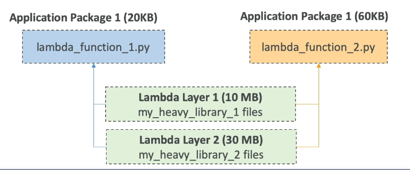

### 10.7 Limits pre region

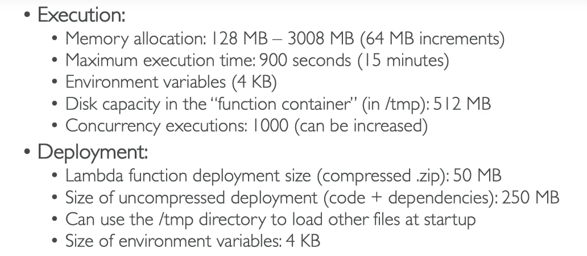

## 11 Lambda authorizer(custom authorizer)

**API Gateway 和 Lambda搭配使用的一种架构. 控制API访问权限** 

分为两种

* **Token-base  比如说JTW**
* requet parameter-based 需要接受调用者的信息在header中或者query string （W**ebSocket 只支持这种**）

## 12. Lambda & CloudFormation

可以用CloudFormation来管理Lambda

### 12.1 inline

使用 Code.ZipFile,但是**不可以添加任何 dependencies**

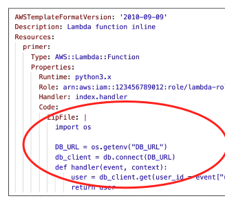

### 12.2 S3

必须先store **lambda zip** 在S3

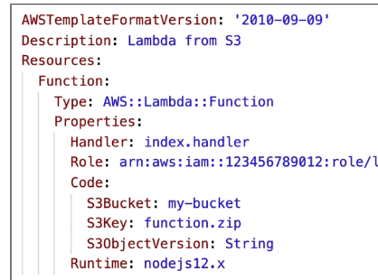

切记如果更新了也需要**更新Code下的三个属性**，比如版本号，如果版本号没有更新那么就没有任何作用

## 13. Versions

* Immutable： 一旦发布则不可以修改

* 每个版本有自己的ARN（**Immutable**）

* Version = code + configuration 

* 历史版本可以被访问

* 只有**$LATEST**版本可以修改

* **每次创建的时候会在本来的名字后面通过“：”来区分版本号**用于其他AWS Service 调用 比如

  **lambda-api-getway-proxy-root-get:DEV**

### 13.1 Aliases

相当于一个指针指向某一个版本, 由于版本是不可变的，所以为了方便使用alias来指向一个版本，那么改变alias就可以改变指向的版本。**并且还可以分流**

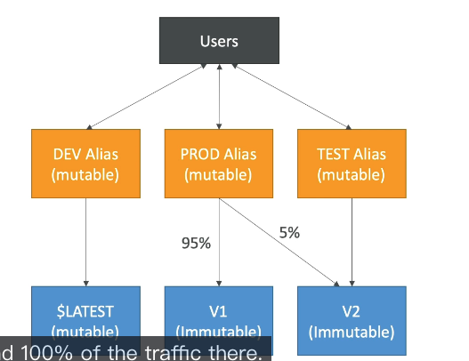

* **可变**
* 类似其他的alias 可以使用 Blue/Green和权重
* 也有自己的ARN

### 13.2 version & aliases的区别

两者都有自己的ARN，aliases更为灵活，相当于在 API Gateway和lambda之间加了一层管理，alias在中间作为转发，这样的话 如果发生改变，API Gateway不需要修改任何东西，只需要修改aliases即可。

## 14. Troubleshout

* InvalidParameterValueException -- 有invalid parameters

* CodeStorageExceededException -- zip包太大

* ResourceConflictException -- resource 已经存在了

* **ServiceException** -- 网络错误 解决方法：一般来说在状态机中配置使用 **Retry** + **ErrorEquals**

  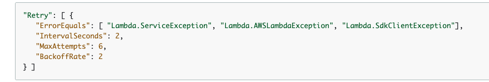

  扩展：

  Catch：用于已经多次retry之后

## 15. Environment Variables

类似环境变量，不同的语言有不同的调用方式，比如Python可以 import os

```python
import os;
```

## 16. 加密

### 16.1 secret加密

有的secret需要在到达lambda之前客户端加密，使用 **Encription helper**

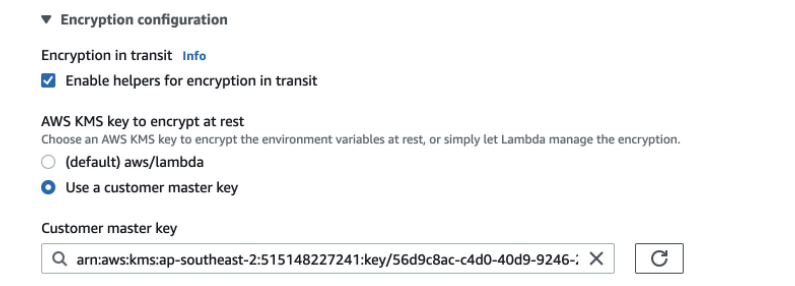

## 注意点

* **process compute-heavy workloads ---> 升级内存**

* 有些语言lambda并不支持，需要使用**Custom Runtime**

* 一般来说lambda是被CloudWatch Event trigger的，而不是用于trigger CloudWatch的，**所以一般使用CloudWatch Logs来对lambda进行监控（需要编写相关log代码）**。

* **lambda处理需要大于15分钟：改用EC2 + SQS来处理。**

* 分开lambda handler和主程序

  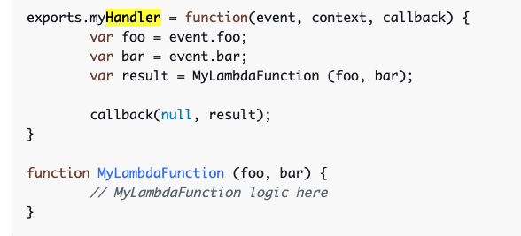


## 应用题：

1. 需要在lambda上传文件到CodeComiit -- 调用SDK来建立连接完成传输。


# DynamoDB

---

NoSQL  Serverless

* Replication across 3 AZ
* made of tables
* table has primary key
* **默认是自动加密的**

## 1. Primary Keys

### 1.1 Option1: Partition key only（Hash）

* 必须Unique
* 同样还是必须要diverse 避免分布不均浪费空间

### 1.2 Option2: Partition key + Sort key

* **组合**必须是Unique
* Date Grouped by Partition key
* Sort key 就是 range key(一般来说需要可以排序)

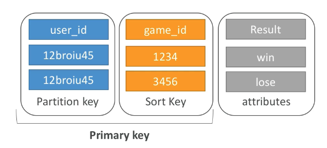

## 2. 动态table

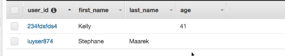

可以在插入数据的时候新增 cols

## 3. Provisioned Throughput

需要提前设置读写的能力

* RCU/WCU Read/Write Capacity Units

### 3.1 Write Capacity Units(1:1)

 **1 WCU 等于 1 unit/s in 1KB**的数据 计算的过程中如果出现了小数 那么向上取证

### 3.2 Read

* Eventually Consistent read (**default**)
* Strongly Consistent Read

通过 **ConsistentRead = true** 来启动 strongly Consistent Read, **只作用于 get类型**

#### 3.2.1 Read Capacity Units

**1 RCU 等于 1KB/s Strongly Consistent Read, 2 unit/s的 Eventually Consistent Read**。size 都是 **4KB**，如果大于4KB那么则消耗RCU更多

WCU 和 RCU 会均匀分布给partitions.RCU and WCU are spread across all partitions

## 4. indexes & Throttling

LSI -- Local Secondary Index   不重建，和普通的索引差不多，相当于多一个属性可以用来检索。**partition key**还是主表的

GSI -- globle Secondary Index 根据不同的partifition key + 不同的sort key**新建一张表**，这两张表的数据会同步（**eventually consistency only**）。

### 4.1 GSI

* 如果GSI 出现了 write throttled，那么原来的表也会出现这个情况。
* 即使主表的WCU没问题也会发生，**所以说选择GSI的 partition key 很重要，分配WCU capacity也很重要**，**一般来说GSI table的WCU > original table 的 WCU**。

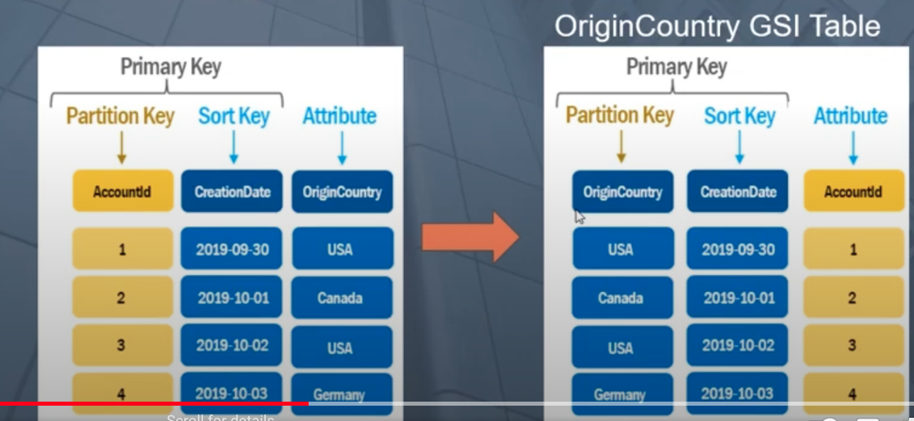

### 4.2 LSI

* WCU和RCU均使用主表的
* 没有特别的throttling考虑
* **必须在表创建的时候就指定**

## 5 Concurrency

可以使用optimistic locking(**加版本号**！)

比如说更新仅当数据是version1的时候 这样就不会用concurrency问题

## 6. DAX

DynamoDB Accelerator

**milliseconds to microsecond**s

**缓存机制**(针对read-intensive )，自动的，无需修改代码。

* 5 mins TTL 默认
* 最多10个节点
* Multi AZ
* 可加密

用于**解决Hot key problem**

### 注意点：

* **如果是Strongly consistent read request DAX不会cached 这些数据**


## 7. Streams

DynamoDB发生的**改变**都可以汇聚到**DynamoDB Stream**，然后被其他的服务读取，比如说Lambda EC2。

换句话说任何发生在DynamoDB中的改变都可以触发其他Service in real-time

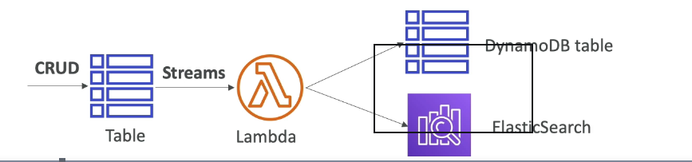

* **只有24小时**的 retention
* 和Kinesis一样由Shards组成，但是不需要provision
* 开启前的不会受到影响，开启后的才会开始

### 7.1 DynamoDB Stream & Lambda

可以由 **Event Source Mapping** 来负责转换数据给Lambda

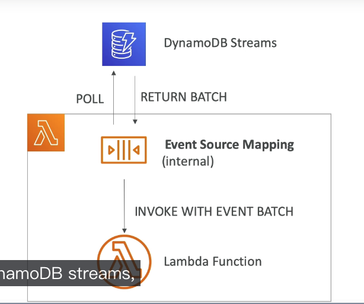

Lambda在这一过程中是**异步调用**的

### 7.2 数据

被放入stream的data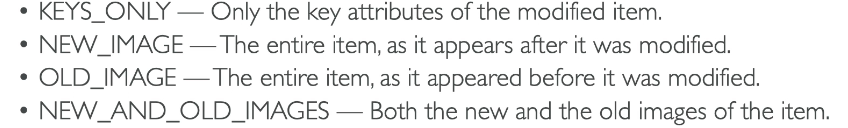

## 8. DynamoDB & S3

太大的object不该存在DynamoDB，因为太贵！并且**超过400KB就不可以**。应该转移到S3中。

可以类似指针的方法存储，把数据存到S3把指针存到DynamoDB

## 9. Back up

* on-demand： 手动备份
* Point-in-time recovery: 自动备份

都是使用S3， **但是没有权限可以访问这些S3的备份数据**

可以使用**advanced**的技, **有权限可以访问备份数据**

* Data Pipeline -- 导入到S3 bucket（可以跨账号）
* **AWA Glue -- 导入到S3**
* **Amazon EMR -- 使用Hive导入到S3**

https://aws.amazon.com/premiumsupport/knowledge-center/back-up-dynamodb-s3/

## 10. Cross Region

使用 **global table** 来加速不同region的访问速度，**但是不支持事务**

## 11. Scan & Query （补）

* Query 是高效查询，类似RDB用法。可以对table，LSI,GSI 使用Query。 

* Scan 扫描整个table 再使用 filter来处理，可以使用 **parallel sacns**来**提速**（更高的RCU consumed). 可以使用 **ProjectionExpression** + **FilterExpression**（扫描后全部后过滤，所以性能上一样）

## 12. Query

```bash
aws dynamodb query \
    --table-name Thread \
    --key-condition-expression "ForumName = :fn and Subject = :sub" \
    --filter-expression "#v >= :num" \
    --expression-attribute-names '{"#v": "Views"}' \
    --expression-attribute-values file://values.json
 
```

**key-condition-expression** partition key必须用等号，sort key 可是使用各种运算符

filter-expression 只能用于查询结束后来进行筛选

* 最多返回 1MB数据
* **可以通过  Limit来限制返回的数目**

## 13. 安全

* 支持VPC Endpoint
* IAM
* **Encription at rest:KMS**
* **Encription in transit: SSL/TLS**

#### 13.1 table encrption

* **mandatory**（创建的时候配置）
* **两种类型： AWS Owned CMK 或者 AWS managed CMK**


## 14. 原子性问题

两种使用

* **conditional writes** -- 严格原子性，不会出现任何问题 性能较差
* **atomic counter** -- 如果update item出现错误，可能会重试，**那么会导致计数两次**，但是性能好

## 15. IAM policy Conditions

**用于细颗粒的管理 DynamoDB的权限**，可以根据业务不同来访问不同的数据type

### 15.1 基于 Partition key


比如游戏数据，根据游戏id来获取，通过配置**dynamodb:LeadingKeys**


### 15.2 基于属性

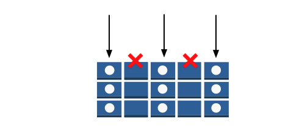

比如说所有的航班信息，用户需要知道的是航班的部分信息，比如说总人数或者飞行员是不需要知道的信息。通过设置**dynamodb:Attributes**

### 15.3 其他属性

* dynamodb:ReturnValues -- 配合 updateItem使用，设置更新后是否返回（新的值，之前的值或者不返回）

* dynamodb:Select -- 配合Query 或者 Scan使用， 可以选择如下的选项

  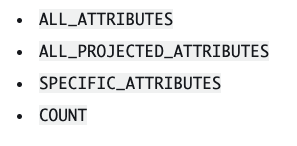

  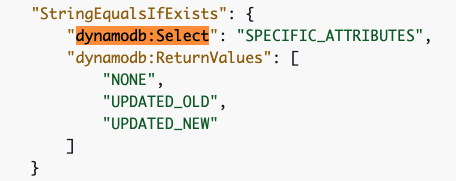

##  其他功能

* TTL 用于 expire data ，可以让table里面的数据定期自动清理

* Transactions 事务

* **让write request 返回 write capacity units consumed**

  **调用ReturnConsumedCapacity**

  1. **TOTAL**（所有）
  2. **INDEXES**（二级index）
  3. **NONE**（默认）

## 注意点

1. 针对于no-key类型的数据进行查询的时候，可以对其生成GSI，然后通过query。**不可以直接使用query**，因为此时该表并不能根据这个属性进行查询（和RDS不同）

   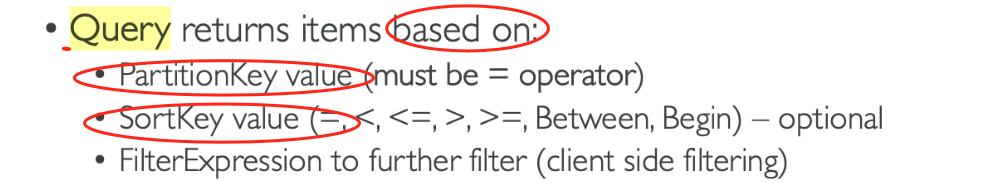

   

2. Hot key solution

   * **Distribute read and write operations as evenly as possible across your table** -- partition key 选择
   * **Implement a caching solution** -- DAX （收费，优先考虑其他两个）
   * **Implement error retries and exponential backoff**

# API Gateway

---

## 1. Endpoint Types

分为三种

* Edge-Optimized: **default**! for **global clients**。**尽管API只能在一个region**，但是可以通过cloudFront来减小lantency
* Regional： 所有的用户只可以在**同一个region**
* private： 只可以被VPC内的访问

## 2. Stages

* 每个stages有自己的配置信息
* 可以随时回滚，保留所有的部署历史

部署API，部署后可以通过public http（或者别的）来进行访问。

### 2.1 with Lambda Alias

就是在**starges 和 后端版本之间中间**加一层，这样就不需要修改Gateway的API, 只需要修改Lambda 的 alias


### 2.2 Stage Variables

**类似环境变量，用于改变那些经常改变的变量**，考试中一般用于表示访问不同的stages，比如TEST PROD

可以被调用于：

* **Lambda function ARN**（下面例子）
* **HTTP Endpoint**（URL）
* Parameter mapping templates

#### 2.2.1 配置

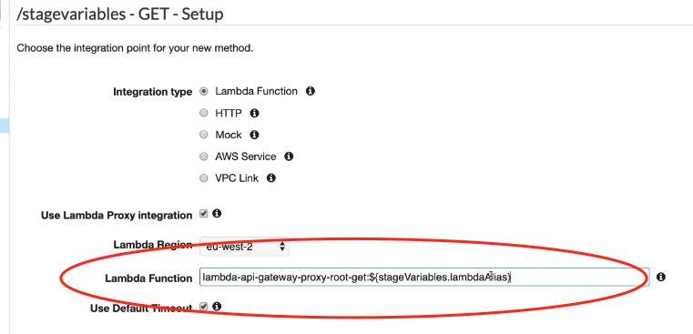

这样在创建stage的时候需要手动在stage variable中输入

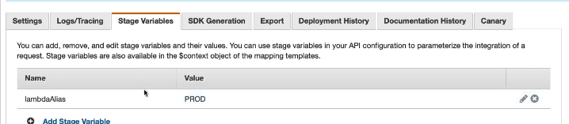

## 3. Cannary deployments

十分类似Alias 都是分出一部分的百分比作为测试

## 4. Mapping Template

用于转换请求的模板来让后端能识别

比如说前端发送的请求是RESTful，但是后端是SOAP的APIs，那么这个时候可以使用Mapping Template来进行转换,把 JSON 转换为  XML发送给后端


## 5. Usage Plans & API keys

Usage Plans 相当于我们是第三方，给其他公司提供这个API的服务，那么相当于给他们权限和计划，比如可以调用多少次，调用的延迟和等待等等。 Keys就是秘钥，一般放在代码中的。

## 6. caching

支持  catching

* 针对每个stage进行caching
* 可以在method-level进行覆盖


## 7. 安全（4种）

### 7.1 IAM Permissions

Authentication: IAM

Authorizatioin: IAM Policy

**一般用于提供access to AWS Resource**, 和检查Client 是否有权限来访问这些API

1. 客户端携带**Sig v4** 来访问Gateway
2. Gateway解析并且查看是否有权限
3. 需要在指定的method里面 **Method Request 里面进行修改**

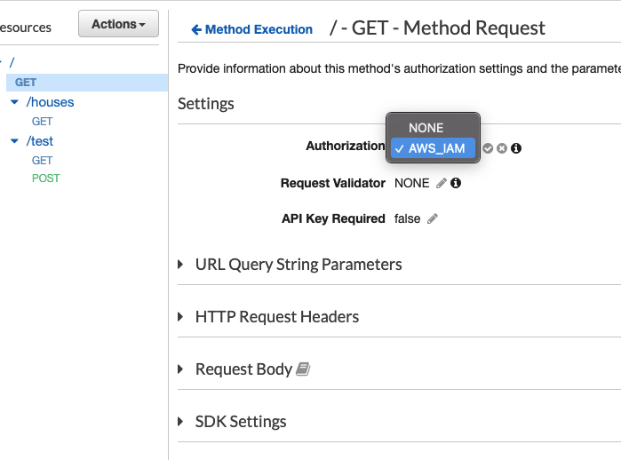

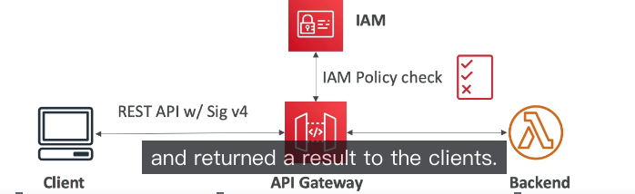

### 7.2 Resource Policies

**可以跨账号**，可以指定哪些IP或者IAM entities（别的账号也可以）可以访问

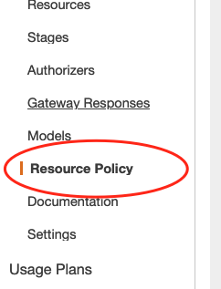

### 7.3 Cognito User Pools

1. 先访问user pools拿到token
2. 携带token访问 Gateway
3. Gateway解析token

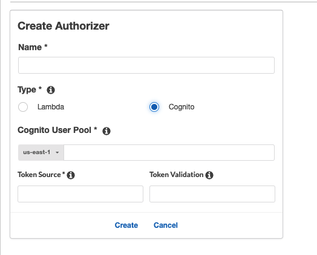

### 7.4 Lambda Authorizer（custom authorizer）

分为两种：

* Token-based, 第三方Token 比如**JTW**
* request parameter-based 需要把 调用者的identity放在headers或者parameter中

**定制化最强的**，一般用于必须使用第三方的验证，这里和 Cognito user pool不同的是一般用于第三方。

* 验证 ： 来自外部（第三方或者自己）
* 授权： Lambda

1. 通过第三方验证系统获得一个Token

2. 携带token访问Gateway

3. Gateway通过 Lambda Authorizer来验证（自己编写代码根据业务解析token）

   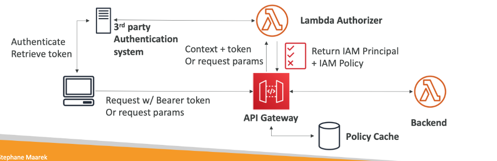

## 8. Error

### 8.1 timeout

对于所有集成的其他技术，timeout时间为 **50 milliseconds ~ 29 seconds**

## 9. Integration Types

### 9.1 MOCK

模拟后端返回

### 9.2 HTTP/AWS

必须要配置 

* integration request & integration response
* **mapping templates**（**仅仅在这两种情况下使用**） for request & respons

### 9.3 AWS_PROXY

**整个请求作为input**送到**Lambda**服务

No mapping template, header, query string parameters

### 9.4 HTTP_PROXY

也是直接把请求转发给后端，和上面类似。

## 10. with Swagger /Open API spec

可以很轻松的转移过来，直接**import** Swagger /OpenAOU 3.0 spec to API Gateway（YAML/JSON）

## 11. CORS

在跨域资源请求发生的时候 Origin会发送一个Preflight Request(如图)，后端会返回一个preflight Response 关于允许的请求

相当于：

1. 询问跨域的配置信息
2. 拿到后再进行数据的访问

**Access-Control-Allow-XXX之类的header是在response里面的**

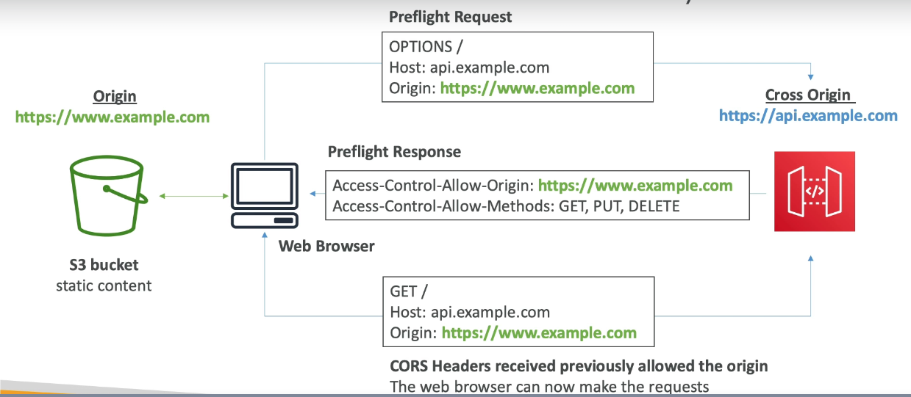

### 11.1 API Gateway CORS

1. 必须enable CORS(console)
2. OPTIONS pre-flight request 必须有如下headers（服务器一般会自动添加）
   * Access-Control-Allow-Methods
   * Access-Control-Allow-Headers
   * Access-Control-Allow-Origin

对于**Lambda custom integration & HTTP custom integration** --- **手动添加 `Access-Control-Allow-Origin` header.**

**对于上述的proxy类别则在API Gateway不需要做处理，由backend自己负责**


### 11.2 配置

在method中点击action选择 enable CORS

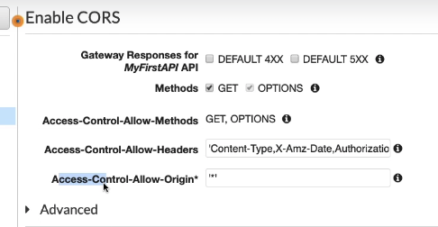

## 12 with Cloudwatch

* 自动发送，1分钟一次，保存两周内容

### 12.1 观察的metrics

1. **IntegrationLatency**：观测backend的responsiveness
2. latency：整体的API responsiveness（从接受开始）
3. CacheHitCount & CacheMissCount：用于优化缓存
4. count：调用次数

## 13. concepts （补）

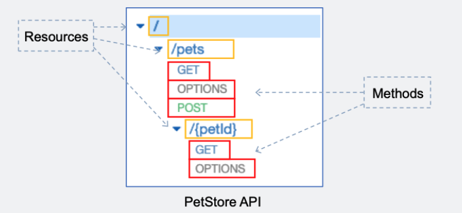

## 14 WebSocket 模式

支持WebSocket模式，通过不同的“action” + **route key table**来访问不同的backend API

* 一般来说需要使用存储connectionID（比如DynamoDB）
* 连接调用连接的后端API，断开调用断开的，逻辑调用逻辑的


### 14.2 url格式


### 14.3 route key table

可以设置expresson来指定哪个JSON的属性可以作为route table的key，如图

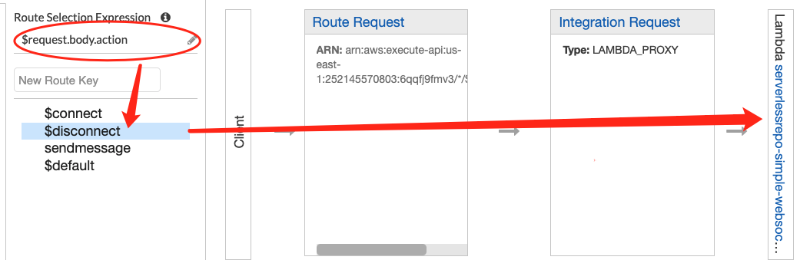

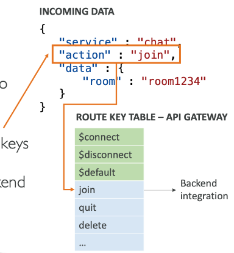


## 注意点

* 每次更新后**需要重新部署**到已有stage或者new stage才可以生效

# Serverless Application Model（SAM）

---

Serverless Application Model, 是一个用于开发和部署Serverless applications的**框架**

**简化版的 CloudFormation**

* two command for deploy
* 所有配置都是通过YAML
* 从SAM YAML file生成复杂的 CloudFormation
* 支持一切CloudFormation的东西
* 可以创建这些Service **locally！**
* **强制S3为template的存放地点**

## 1. Recipe

看到 transiform header 就表明使用额是SAM template


## 2. Write Code

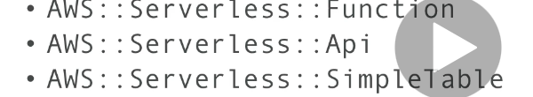

### 2.1 解释：

* API: 用来描述 Gateway resource
* Application：用来描述一个nested application，从 Serveless application respository或s3中调用
* Function：描述lambda
* LayerVersion：描述Lambda layer
* SimpleTable：描述如何创建DynamoDB

## 3. Package & Deploy

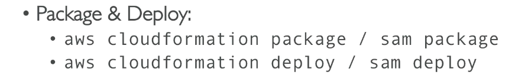

## 4. 部署策略

**Canary** **直接部署百分比，剩下的在多少分钟内全部实现**，比如第一种，百分之10直接转换，剩下的90会在30分钟内完成

**Linear** **每多少时间内部署多少百分比直到所有**

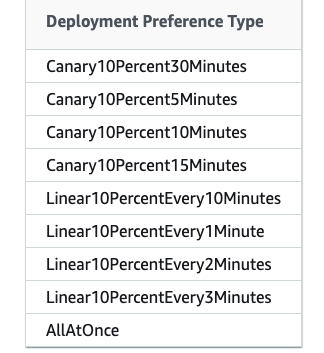


## 5.CLI  命令（补）

需要先安装**AWS SAM CLI** ，**不支持AWS CLI**

* sam init 初始化资源
* sam local 用于在本地部署的时候进行测试


# Cognito

---

**权限认证中心，不用于IAM，IAM针对cloud内，Cognito针对cloud外的用户**

**支持  Security Assertion Markup Language 2.0 (SAML 2.0)** with Identity Provider(Identity Pools)

## 1.  User Pools

 Cognito User Pools 创建一个serverless 数据库来为你的用户进行登录注册行为。**拥有一整套的系统，包括用户找回验证注册等等**

* 登录验证
* Federated Identities：users from Google Facebook 。。。。
* black users 如果 credentials被破坏
* 监控用户的状态，或者group用户
* 并且可以出发Lambda Function（钩子函数），比如说注册前触发，登录后出发等等。。官方指定
* 一般可以和Load balancer or API GateWay 集成使用,callback url中填写它们的地址即可
* **支持MFA**（配置即可）


> **登录完毕后会被送到指定的url并且返回一个身份的Token(JWT)**


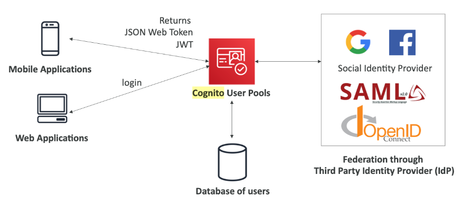


### 1.1 配置

1. 创建的前半段配置用户需要提供的注册信息等等

2. 创建一个 APP client（你需要验证的App（可以是LB 等等）使用callback url 来填写正确的地方比如LB DNS）

   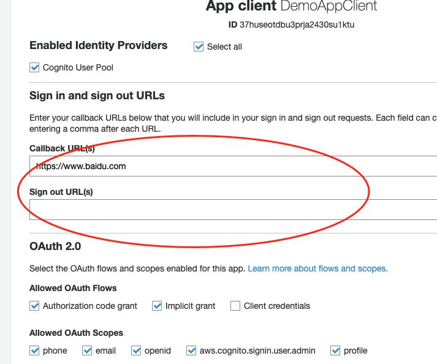

## 2. Identity Pools (Federated Identities)

* 提供AWS的 credentials 使得**信任的用户**可以获取AWS resources的**临时权限**
* **也可以给没有验证的用户提供，根据不同的用户登录分配不同的role给用户来获取不同的资源权限**
* **identity provider**可以是
  * Cognito user pools
  * public identity provider(facebook google ....)
* token handling 和 management 一般编写在客户端（比如Javascript）
* AWS 提供dashboard监控部分用户数据

典型架构

1. 用户尝试访问application  resource
2. 提交验证信息给Cognito Identity pools, CIP进行validation，然后通过STS获取临时权限返回给用户
3. 用户携带这个权限来访问


### 2.1 Policy variable

动态的赋予用户指定存储目录的权限，下面是S3的


## 3. Sync

* 用于同步不同设备的数据，**弃用**
* 可以储存数据到datasets（up to 1MB）
* Push Sync: 通知所有逇devices当 identity数据发生变化
* **Cognito Stream**: stream data from Cognito into Kinesis
* **Cognito Events**: 执行Lambda functions 当有event触发

# AWS Redshift

---

**数据仓库** 基于 PostgreSQL， 但并不使用OLTP，而使用OLAP - online analytical processing

* 效率极高（相比其他数据仓库）**用作高性能分析**
* Columnar 类型的存储
* Paraller Query Execution
* **速度比Athena 更快，并且由于有index可以做正常的RDS操作，比如join**

## 1. 综合属性

* 数据从S3， DynamoDB等其他数据库中加载
* 有两种Node
  1. Leader node： 用于做query planning，结果聚合
  2. Compute node：执行query，送结果回leader

### 1.1 Redshift Spectrum

直接从S3执行query，不需要加载过来

### 1.2 Backup & Restore

和其他差不多

## 2. Redshift Enhanced VPC Rounting

复制或者卸载数据不走public internet，直接从VPC

## 3. Reliability

**没有 Muti-AZ**，但是可以手动来

可以配置Redshift自动copy **snapshots of cluster** 到另一个Region

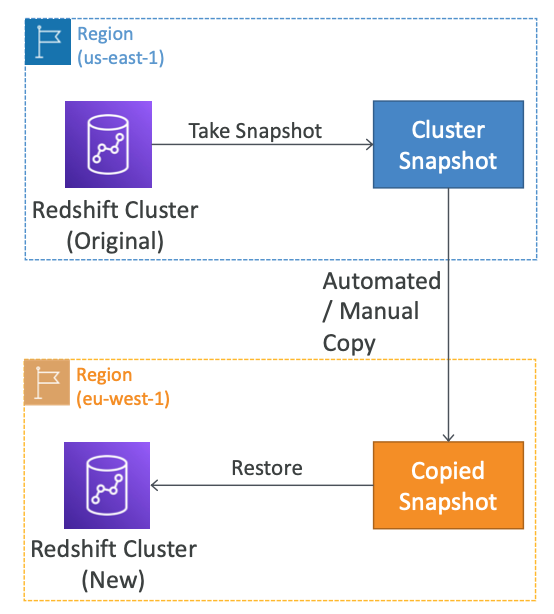

### 3.1 snapshot

* **incremental**：只改变修改的部分
* 自动备份：每8小时
* 手动：一直保存直到手动删除

## 4. 加载数据

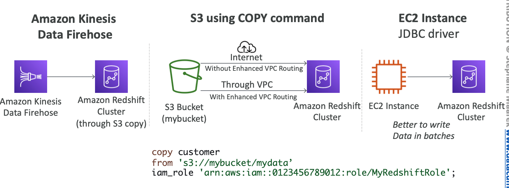

## 5. Redshift Spectrum

直接query data from S3

* 必须先创建Reshift cluster

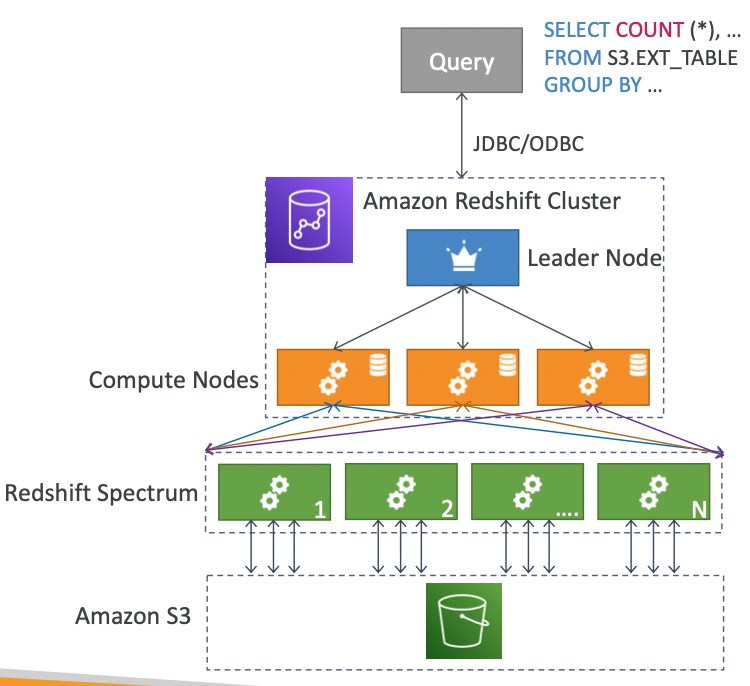

# Advanced Identity

---


## 3. AWS Directory Services

SAML 身份提供商（identity provider）

### 3.1 AWS Managed Microsoft AD


在AWS中创建一个AD用来管理users然后再和on-premise的AD进行对接（互相信任）

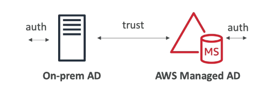

### 3.2 AD Connector

**相当于一个代理用来转发请求或者验证**

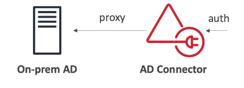

### 3.3 Simple AD

独立的AWS服务，无法和on-premise对接


# Security & Encryption

---

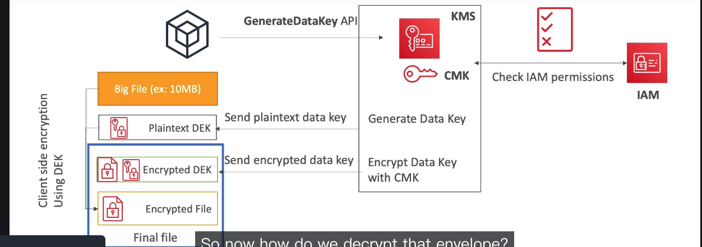

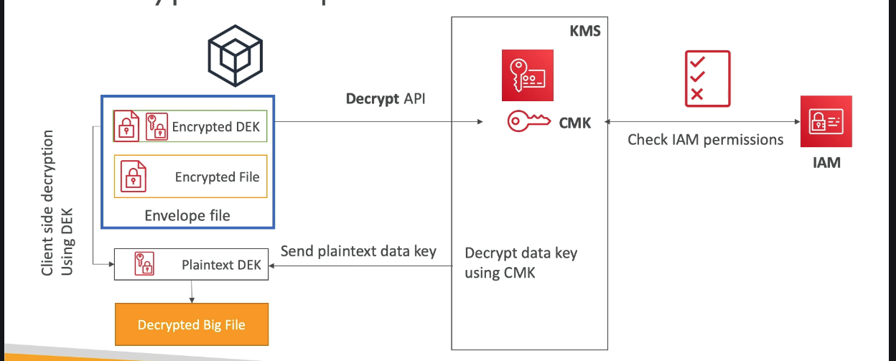


## 1. SSL/TLS

**只能用于HTTPS** 不能用于HTTP

### 1.1 SSL

Secure sockets layer 

加密思路：首先由某机构签发一个证书给某域名，那么每次当他的用户试图访问这个域名时候，域名会先返回一个数字签名（public key）给用户让用户知道这个网站是可以信任的那么用户就可以**使用这个public key** 来对发送的数据进行**加密**，然后**网站的后端**就可以使用自己的**secret key来进行解密**。由于传输过程中从来没有暴露过secret key所以其他人**拦截加密信息没有任何意义**。

### 1.2 TLS

Transport layer security

和SSL基本一直

### 1.3 ssl termination & SSL passthrough

* termination 是在**负载均衡器进行解密**，会增加LB的CPU负担，但是简化SSL管理。
* pass-through 直接把连接转发到后端，**后端解密**，SSL管理比较复杂

## 2. KMS

Key Management Service

* 可以上传自己的CMK，但是只**需要一次**！不必每次请求携带
* **区域性**
* KMS不会每次都创建一个新的CMK，但是可以rotate。
* **加密的数据size 最大4KB**
* 可以enable和re-enable账户自己管理的Key in CMKS，不可以disable AWS管理的
* AWS key分别针对于不同的AWS Service, 由AWS 完全管理！
* 可以自动rotation，但是不支持Asymmetric keys rotation

### 2.0 AWS managed keys

**AWS 免费提供给用户用于加密的encryption key**

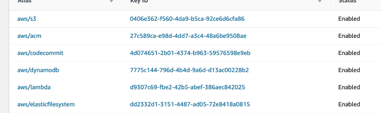

* 不可以在AWS 以外使用（on-promise）
* 不可以disable，删除等等
* **每三年自动rotation，并且不可以修改**。

### 2.1 Customer master keys (CMKs)

用户管理的key，**可以自己创建也可以AWS 帮忙创建（两种都可以创建，但是用户只可以上传Symmetric）**

* 默认每年自动rotation，需要开启, 也可以自己指定时间

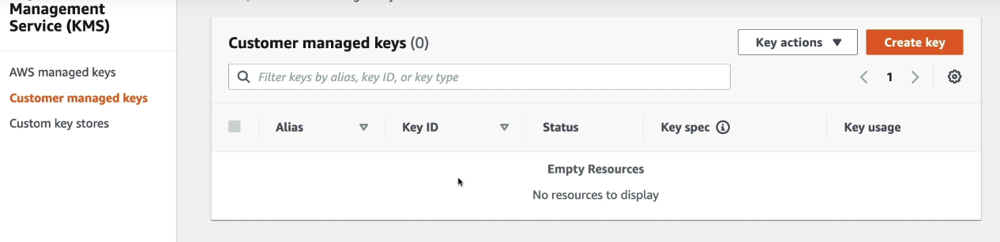

* **Symmetric**(AES-256 keys) , **单key** 用于加密解密，永远无法获得明文的key。**大多数都是用这个**
* **Asymmetric**(RSA & ECC key pairs)，**双Key** 公钥加密和秘钥解密组合，**不支持自动 rotation**

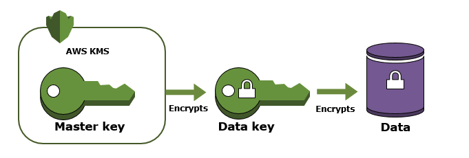

### 2.2 KMS创建CMKS

* 可以指定为哪些IAM可以使用，**跨账号也可以**

### 2.3 envelope encryption（Symmetric CMK）

**客户端加密**，通过调用**GenerateDataKey**,KMS会返回明文和加密的DEK（Data Encription Key）给客户端，客户端加密后把加密后的数据和加密后的DEK一起包装

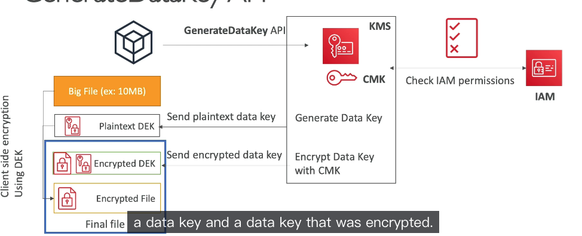

解密过程为调用decript API ，KMS会解密加密了的DEK返回给客户端，客户端使用解密的DEK来进行解密数据

### 2.4 limits

* 如果需要加密的请求太多 会超过**request quota** -- **ThrottlingException**
* 可以使用**exponential backoff**
* 对于 **GenerateDataKey**, 可以考虑使用**DEK caching**
* 或者请求提升上限（类似联系support或者使用ticket）

#### 2.4.1 Quota

* 所有类型的请求共享！比如加密解密生成秘钥
* 对称加密根据区域分为 5500, 10000, 30000
* 非对称加密 500（RSA CMKs）,300(ECC CMKs)

### 2.5 APIs

* Encrupt：加密4KB以内的数据
* **GenerateDataKey** -- 创建 unique symmetric data key（DEK），返回一个key**的明文复制和一个加密的复制**
* **GenerateDataKeyWithoutPlaintext**-- 创建后并不是马上使用 **later use**。**只保留了加密的DEK**
* **Decrypt** -- 解密4KB以内的数据
* **GenerateRandom** -- 返回 random byte string

### 2.6 Encryption SDK

**专门用来加密的SDK，使用Envelope Encryption 来加密** 

* Data Key Caching，可以减少KMS call，**重复使用Data key**来进行加密

### 2.7 key policies

和bucket类似，区别是这个policiy是唯一控制acess的方法不同于S3还可以用IAM

## 3. AWS Certificate Manager(ACM)

用于管理SSL certification，可以上传自己的，也可以申请

可以和ALB进行交互，来进行HTTPS请求（SSL）

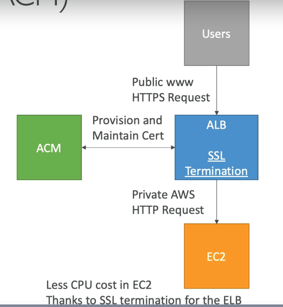

### 3.1 IAM as a certificate manager

有的region 并不支持ACM，但是同时可能又需要HTTPS，那么只能使用 IAM管理SSL

* IAM可以加密private keys并且储存到**IAM SSL certificate storage**, 此外**不可以**通过IAM Console来管理

## 4. Sigature v4

许多HTTP请求需要被sign，这样AWS才能识别出来是你发送的，需要使用credentials（**access key & secret key**）

* 如果调用SDK 或者 cli，那么请求会被自动sign

### 4.1 HTTP header option


### 4.2 Query String option（pre-signed URLS）

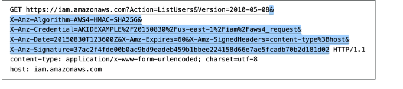

# 各种 Analyzer & Advisor

---

## 2. Amazon Inspector

用于检测application的潜在危险等等

## 3. S3 Analytics

帮助分析储存的object**改变class的策略**

## 6. Trusted Advisor

用于优化硬件，安全和性能，减少花费，监控各个服务的。

# CloudFormation

---

用代码的形式来创建AWS resource

* version controlled -- git
* stack (template)-- 一**个AWS resources的集合就称为一个 unit or stack**，所有在集合中被定义的resource都是被Cloudformation template定义的。比如 VPC stacks，Network stacks, APP stacks
* cost -- 可以由template来预测
* Productivity 自动生成图表
* **CloudFront Key Pairs只可以root用户创建**
* **只接受JSON 和 YAML**

## 1. 注意点

* **更新template的时候不可以更新之前的，需要重新上传新的版本**
* 几乎所有的resource都是支持CloudFormation的
* 不可以动态生成resource
* **resource 是必须被声明的**
* Lambda function不可以引用codecommit

## 2. Resource

AWS的resource，可以被CloudFormation**声明**或者其他resource**引用**，**必须声明**

```yaml
AWS::aws-product-name::data-type-name # 格式
AWS::AutoScaling::LaunchConfiguration # 例子
```

* Resource必须声明
* 可以Link to 其他的resource

## 3. Parameters

提供一种外部输入的方式，因为毕竟是模板，不同的人可能会在某些地方有不同的参数，会在更换的时候要求用户重新手动输入


可以的方法

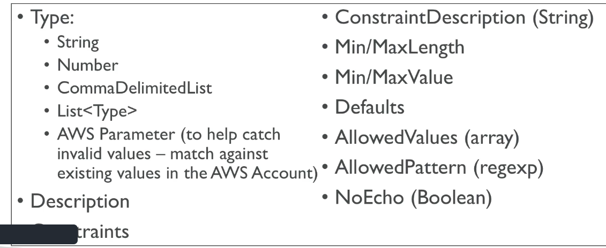

AWS parameter 补充

```bash
AWS::EC2::KeyPair::KeyName – An Amazon EC2 key pair name
AWS::EC2::SecurityGroup::Id – A security group ID
AWS::EC2::Subnet::Id – A subnet ID
AWS::EC2::VPC::Id – A VPC ID
List<AWS::EC2::VPC::Id> – An array of VPC IDs
List<AWS::EC2::SecurityGroup::Id> – An array of security group IDs
List<AWS::EC2::Subnet::Id> – An array of subnet IDs
```

### 3.1 Fn::Ref

用于引用**Parameters和resource**两种,缩写是 **!Ref**

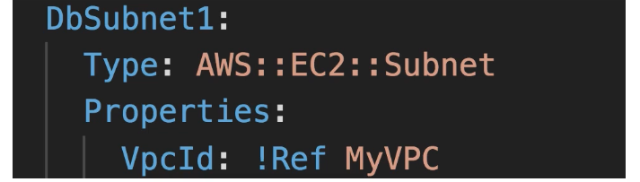

### 3.2 Pseudo parameters

相当于环境变量 创建后默认自带

* AWS::AccountId 返回当前stack的创建者
* AWS::NotificationARNs
* AWS::NoValue 用于删除某个属性，**相当于对某个属性返回空，搭配判断类型的Function使用**
* AWS::Partition 标准AWS regions 返回aws, 其他partition为 aws-partitionname eg: aws-cn
* AWS::Region
* AWS::StackId
* AWS::StackName
* AWS::URLSuffix 和 partition类似 标准为 amazonaws.com，如果是中国则是 amazonaws.com.cn

## 4. Mapping

有些类似一个**常数表**

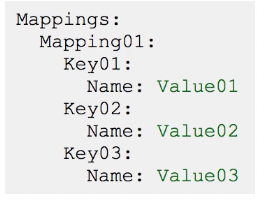

### 4.1 Fn::FindInMap

用于获取map中的值

```yaml
!FindInMap[MapName,TopLevelKey, SecondLevelKey]
```


## 4. outputs

方便其他的template来调用，比如说在当前的template下生成了一个Network CloudFormation stack，生成前是无法得知VPC ID的，所以可以提前把他导出，这样生成后就不需要去手动查询ID。

* 如果其他的template正在调用导出的变量，那么这个template无法被删除。

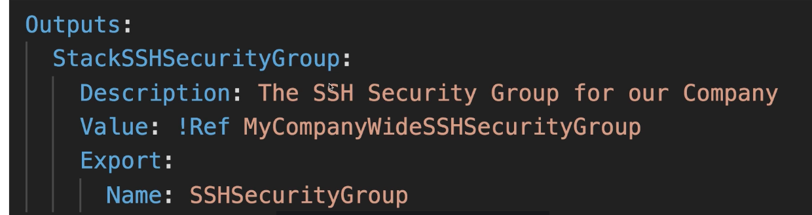

* **Output name 必须是在一个 Region内unique（不是AZ）**

### 4.1 Fn::ImportValue (!ImportValue)

用于引用其他stack的导出变量

## 5. Condition

* 不允许在parameter里面使用

判断语句

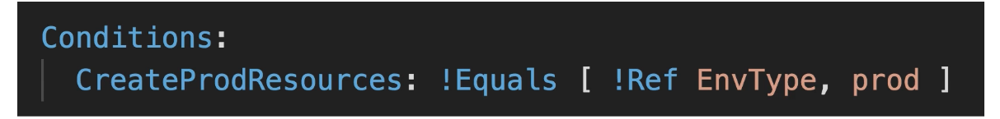

**！不代表取反**

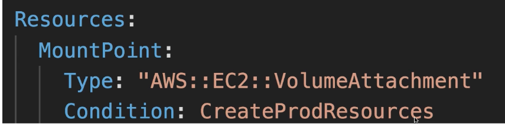


## 6. fucntions

* Fn::Ref 如果引用Parameters 那么就是value，如果引用Resources 那么就是返回ID

* Fn::GetAtt 用来获取resource的属性（和importValue不同，这里是template内部的） **查看文档**

  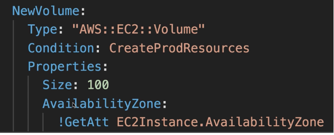

* Fn::Join 类似变成的join语法是

  ```bash
  !Join[delimiter,[list of values]]
  !Join[":",[a, b, c]]
  ```

* Fn::Sub ${VariableName} 

## 7. Rollbacks

* **创建失败 --- 全部deleted**，也可以设置不删除，需要配置
* **更新失败 ---回滚到上个版本**

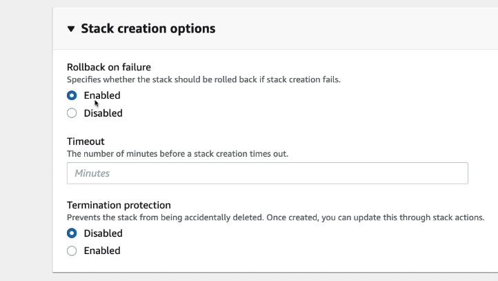

## 9. 案例

### 9.1 创建Lambda代码位置

1. 用ZIP包，上传到S3，通过**Code参数**指定

   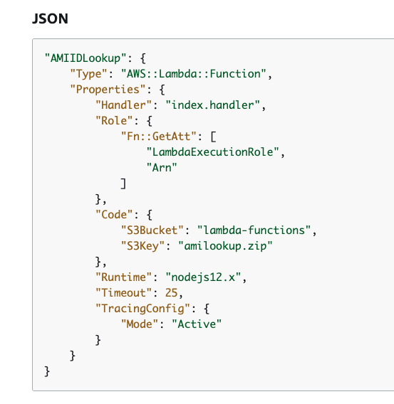

2. 通过Inline直接写入，只有部分可以使用，路径为 **Code**下的**ZipFile**

   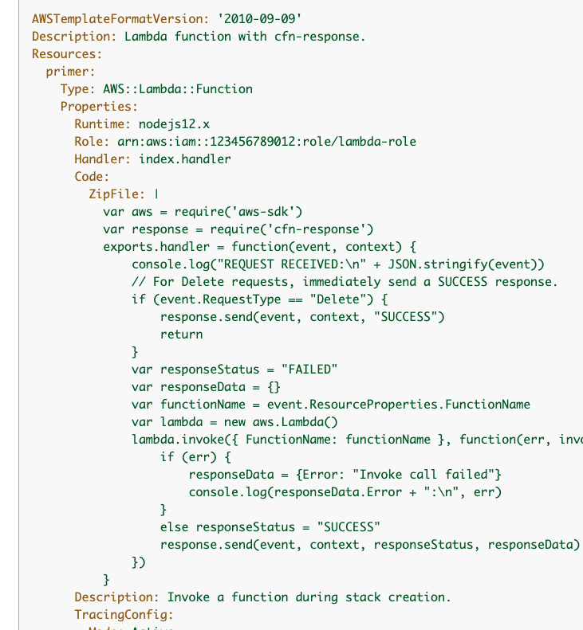

## 10. DeletionPolicy

**默认情况下当stack被删除**，**那么创建的resource也会被删除**。可以使用DeletionPolicy来**防止部分或者所有的resource被删除**。

### 10.1 三种策略

#### 10.1.1 Delete

* 大部分的resource在不指定Deletionpolicy的情况下都是直接删除。除了以下
* AWS::RDS::DBCluster：**默认是Snapshot**
* AWS::RDS::DBInstance：**默认在不指定DBClusterIdentifier的情况下是Snapshot**
* S3： **必须删除所有的objects才能删除**

#### 10.1.2 Retain（保存）

* stack 进入 Delete_complete状态，**resource继续保留并且持续收费**
* 如果是update阶段删除了资源：那么会保留resource但是删除它和CloudFormation的关系
* 如果是更新阶段创建了一个新的用来替换那么会彻底删除之前的。

#### 10.1.3 Snapshot

* 创建一个快照，并且可能会产生费用

## 11. Drift

用于检测resource在被CloudFront创建后被人手动篡改，CloudFormation不会监控，但是可以手动进行检测，**在stack action中选择**，比如安全组的rule被人修改。

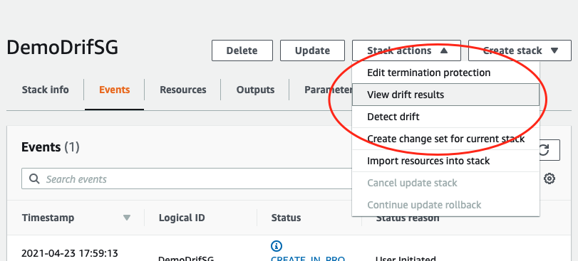

##  其他可能用到的

**ChangeSets**: 相当于一个改变的预览，可以快速回滚, 更新stack的时候会自动生成

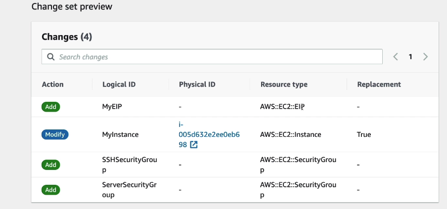

**Nested Stack**: 类似OOP，把一个stack变成一个class，然后在当前的APP stack中反复使用。

**StackSets**:用于**cross-account**和**cross-regions**，可以配置Trusted account来管理，并且一旦更新 所有的都更新。

```bash
AWS::CloudFormation::Init # 类似user data，在instance lanchu之后可能想要添加一些application
```

# CICD

---

1. **Continuous integration**

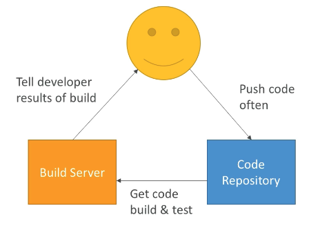

只需要关心push code 剩下的都是自动完成并且反馈给developer

2. **continuous Delivery**

简而言之：**自动部署**

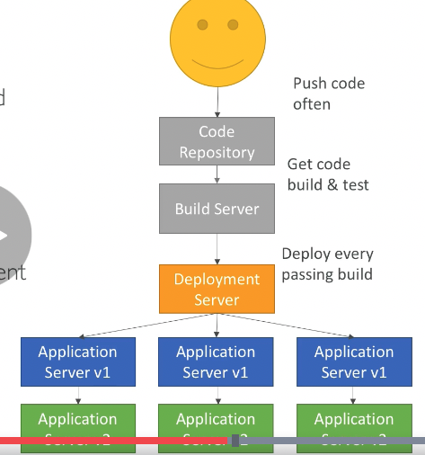

3. **AWS CICD 策略**

   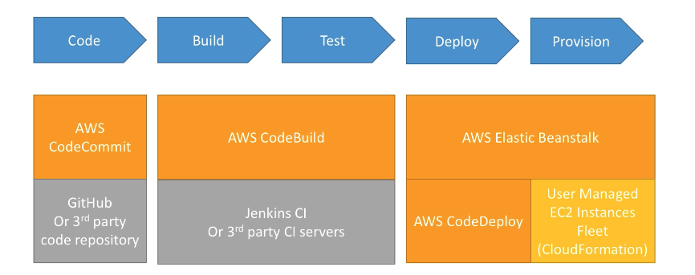

## 1. CodeCommit

储存code, **repository**

* 类似Jenkins 提供**SNS**作为event触发的题型，可以在notification中配置policy

### 1.1 安全

#### 1.1.2 认证

Authentication in git：

* SSH 和git类似，可以配置SSH keys到IAM Console
* HTTPS
* MFA

##### 1.1.2.1 Clone repositry by access key （HTTPS）

两个方法

* 使用在**AWS credential profile**中创建的**access key** 来配置 **Git credential helper**
* 生成HTTPS Git credentials for AWS Codecommit，并且制定这个credientials 在 GIT Credential Manager

#### 1.1.3 授权

Authorization in git:

* IAM Policies 用来管理 user or role 到仓库

#### 1.1.4 加密

* 自动KMS at rest
* In-flight： HTTPS or SSH

#### 1.1.5 Cross Account access:

使用 IAM Role （当前账号），使用AWS STS（with AssumeRole）

### 1.2 migrate from git or 其他

如果是其他版本控制工具，第一步都是移植到git

> **have to migrate to Git first.**

1. 创建新的CodeCommit repository
2. 克隆git repository push it to CodeCommit

### 1.3 HTTPS 连接

1. IAM users里面创建 git credentials（username + password）

   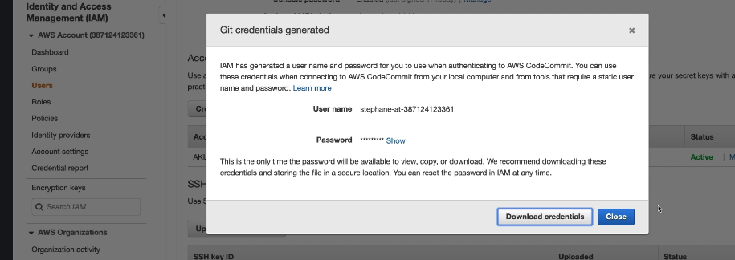

2. 使用clone的时候会自动弹窗输入账号和密码

## 2. CodePipeline

是一个**Visual workflow**的**工具**

* 和其他组件合作，CodeCommit(**可以指定repository**)，CodeBuild（**指定如何build**），部署地点（**EC2 or Elastic Beanstalk**）

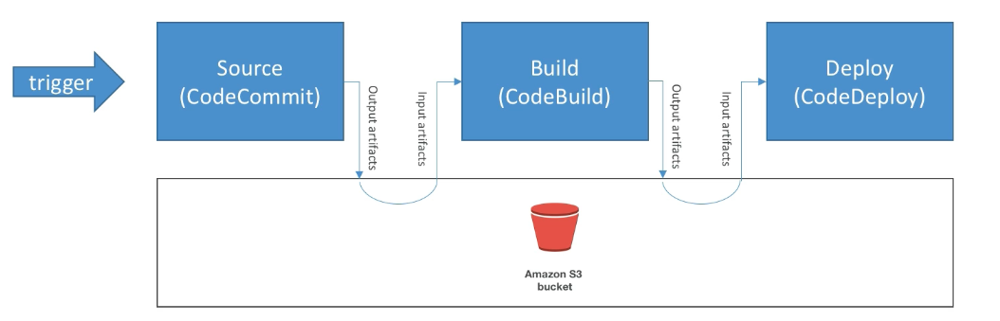

* **CodePipeline state 的改变是被 Cloudwatch Events 管理的，可以发送提醒**
* **如果fails in a stage, pipeline 会 stop！而不是roll back**
* 一般报错 **think about IAM Service Role**

### 2.1 Stages & Action group

Stages代表了一个一个的**阶段**(只需要提供一个阶段的名字，每个阶段之间顺序进行)。

* **Action group是一系列action在这一阶段需要做的事情**一个阶段可以有**多个**Action group。比如**Mannual Approval**
* **Action** 就是Action group 里面需要做的事情，可以有多个。（比如部署，build，测试）分为 AWS自带的和custom的**,比如说有些AWS不支持或者on-premise的操作，可以使用**custom action

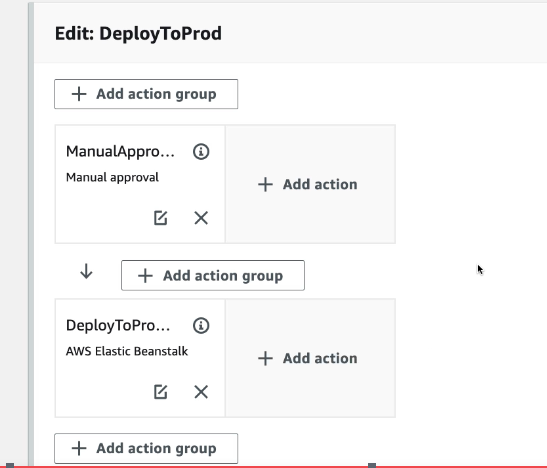

* **Action provider** 提供了绝大多数 Action可以做的事情，在action中配置

  

## 3. CodeBuild

build & test code，通过yml文件来进行，**不可以和直接出发lambda必须使用cloudwatch**

* Pay for usage：不用不花钱

* Continuous scaling： 不需要等待，没有queue

* 安全： KMS & IAM

* 可以定义在**CodePepline(直接在action provider中选择即可)** 或者 CodeBuild自己

* **会自动扩容，但是考虑单机性能需要自己升级**

  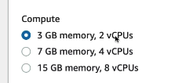

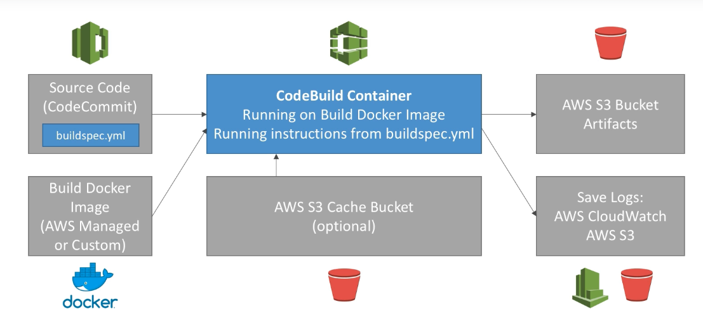

### 3.1 BuildSpec.yml

**用于指导CodeBuild如何Build**

* 必须在root下

* 可以使用**环境变量**（SSM Parameter store结合）

* 可以增强build(**Phases**)，比如Pre build Post build这类

* 会被储存到S3（encrypted）

* **Cache 一般用于储存dependence用于加速**，存放在S3

  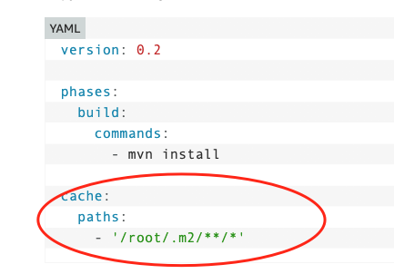

整体看起来如下, 包含很多**钩子函数**

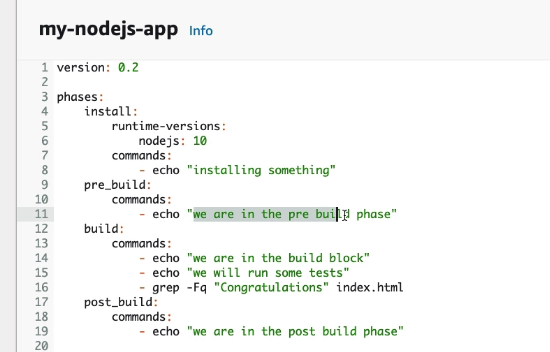

### 3.2 CodeBuild in VPC

默认codeBuild是AWS管理，也就没有VPC概念。

但是如果出现了需要Access AWS的source的情况且这个资源在**private VPC**里面，那么可以让其在VPC内Build。在配置文件中提供**VPC-specific configuration information** 

指定

* VPC ID 
* Subnet IDS
* 安全组

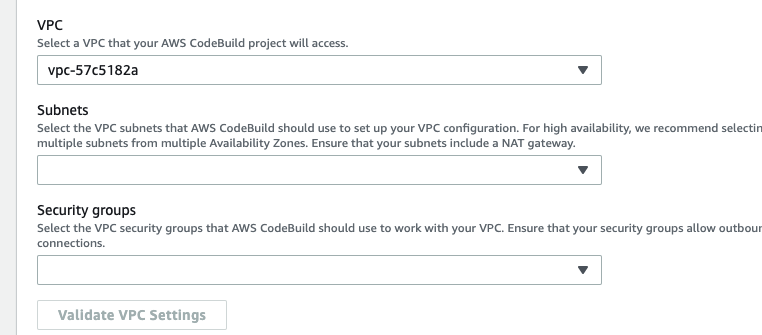

### 3.3 修改配置文件

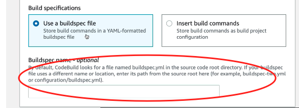

* 可以修改文件名字 比如`buildspec_debug.yml` and `buildspec_release.yml`.
* 也可以修改地址 比如放在 **S3**的 config/buildspec.yml

需要使用 AWS CLI **`create-project`** or **`update-project`** command 最后run **start build**

> https://docs.aws.amazon.com/codebuild/latest/userguide/build-spec-ref.html


## 4. CodeDeploy

* 每个EC2 需要运行 **CodeDeploy Agent**（负责版本控制，不同版本代码保留数量，log file储存，**只有EC2 或者 on-premises 需要安装，ECS 或者Lambda是不需要的**）
* 需要在代码中添加 **appspec.yml** 来指导，在root

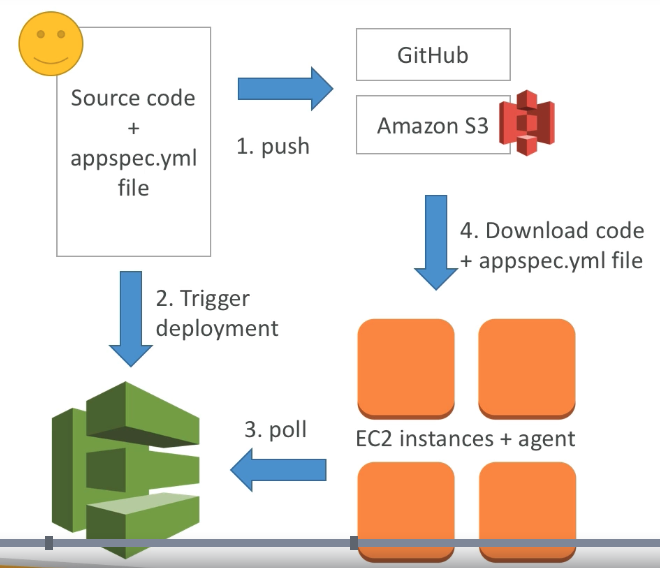

* 支持Lambda deployments
* **不进行provision**，默认所有的硬件已经创建好了

### 4.1 Configs

* One a time: 一次部署一个，fails就停止部署
* Half at a time: 一次一半
* All at once: 很快，但是同时没有可以被访问的，适合dev
* Custom：自动设置部署百分比

### 4.2 Failures

* 出现后那个Instances stay in "failed state"
* **新的部署会先部署到 failed state 的intances上**
* Rollback：重新部署老版本的部署或者启动自动回滚when failures

#### 4.2.1 rollback

**可以自动（You configure automatic rollbacks when you create an application or create or update a deployment group.可以override之前的配置）也可以手动**（使用之前的版本**创建一个新的版本**）

本质上rollback 和 re-deploy没有区别，rollback就是重新部署了之前的一个稳定版本。**会拥有新的deployment IDs**。并且需要确保之前的版本是accessable。

如果出现回滚的时候之前的revision丢失或者无法访问那么可以通过如下

1. 手动上传 files to instance
2. 创建一个新的版本

* **可以搭配SNS来通知回滚失败**
* 从group中移除一个instance不会导致任何卸载

### 4.3 Deployment Targets：

设置部署到哪些Instance上

* 一堆有tags的 EC2（分类的EC2）
* ASG
* Mix
* Customoization

### 4.4 Hooks

#### 4.4.1 EC2

部署阶段的钩子函数

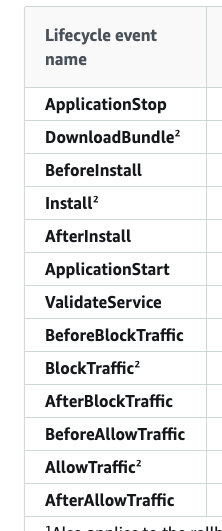

**ValidateService是在Application Start之后！！！**


- ApplicationStop：当新的版本下载好的时候触发，运行脚本来停止application或者删除当前的packages
- DownloadBundle：拷贝新的版本项目到临时目录
- `BeforeInstall` –  一般用于decrypting 文件或者备份
- `Install` – 用于拷贝文件到指定目录，这部分是 deploy agent来做，**不可以运行脚本**
- `AfterInstall` – 比如修改文件权限.
- `ApplicationStart`
- `ValidateService` – **部署的最后一个环节**，用于检测是否成功
- `BeforeBlockTraffic` – You can use this deployment lifecycle event to **run tasks on instances** before they are deregistered from a load balancer.
- `BlockTraffic` – During this deployment lifecycle event, internet traffic is blocked from accessing instances that are currently serving traffic. **This event is reserved for the CodeDeploy agent and cannot be used to run scripts.**
- `AfterBlockTraffic` – You can use this deployment lifecycle event to **run tasks on instances** after they are deregistered from a load balancer.
- `BeforeAllowTraffic` – You can use this deployment lifecycle event to **run tasks** on instances **before they are registered with a load balancer.**
- `AllowTraffic` – During this deployment lifecycle event, internet traffic is allowed to access instances after a deployment. **This event is reserved for the CodeDeploy agent and cannot be used to run scripts.**
- `AfterAllowTraffic` – You can use this deployment lifecycle event to **run task**s on instances after they are registered with a load balancer.

##### 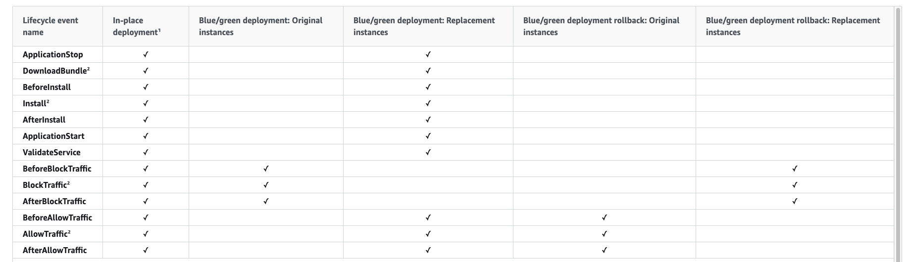

#### 4.4.2 ECS

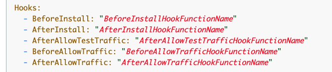

#### 4.4.3 lambda

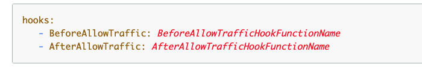

##### 4.4.4 总结

* EC2啥都有
* ECS 没有validation，**但是独有test traffic**
* **Lambda最短**

### 4.5 部署策略

只有两种

* In-place **只支持EC2/ On-Premises**，不能用于lambda 和 ECS
* Blue/green **适用于EC2（当然也包括ECS，ECS基于EC2）和 lambda**

#### 4.5.1 Deployment Group

指定部署的一个集群，一般来说可以分为 开发，生产和测试。通过EC2的**tag**来进行分类或者**target group**

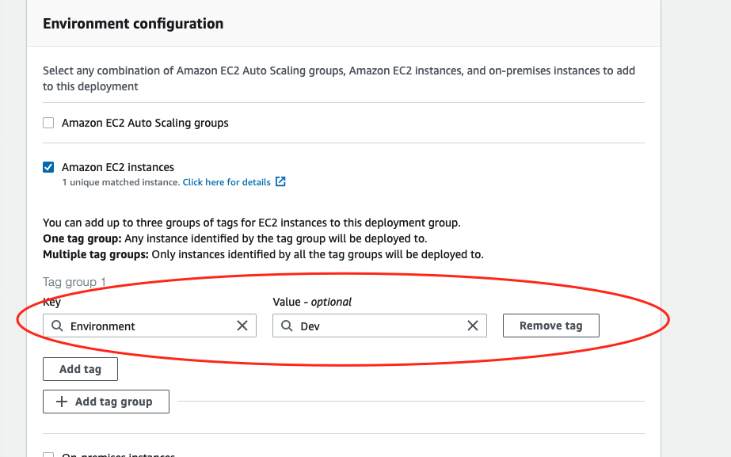

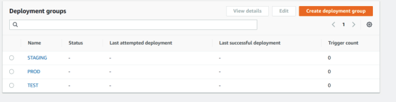

### 4.6 Primary Components

详细配置信息

* Application: unique name
* Compute platform: EC2/on-premise or Lambda
* Development configuration:指定一些规则针对部署成功或者部署失败
  1. EC2/On-Premise：**可以指定最小健康的instance的数量**
  2. Lambda: **指定traffic的routing规则**
* **Deployment group**: group of tagged instances(EC2) 
* Deployment type: in-place or Blue/green
* IAM instance profile:**需要EC2有权限从S3或者Github中调用**
* Application Revision: application code + appspec.yml
* **Service role: Role for CodeDeploy来做需要权限才能完成的工作**

### 4.7 AppSpec.ymal

* File section: 如何copy from S3/Github 到当前instance的filesystem
* Hooks

### 4.8 两种role

* service role：分配给CodeDeploy 用于一些常用的权限比如Poll images or code（**在 Deployment group里配置）**

  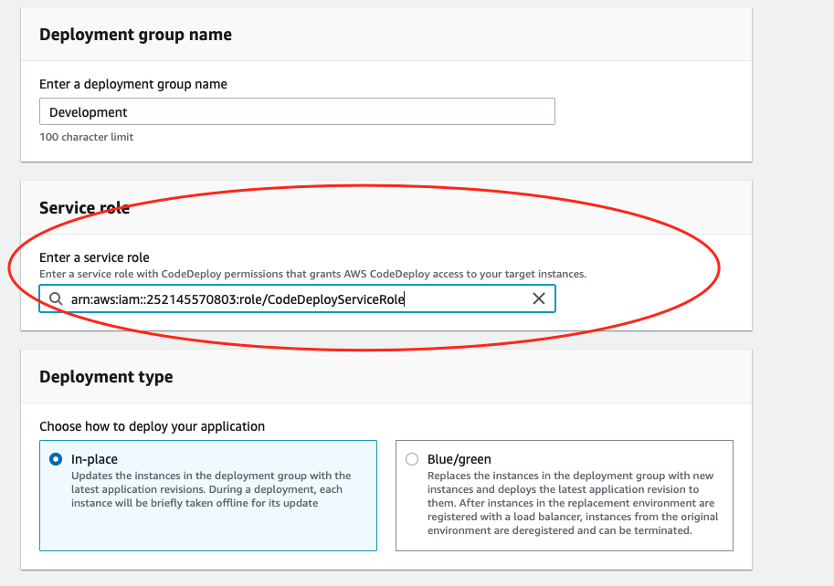

* Instance role：是分配给EC2的，如果EC2由于代码逻辑的需求需要访问一些resources

## 5. CodeStar

一站式服务，集成所有CICD 包括 cloudwatch等等监控手段，并且提供可视化界面

# AWS Billing and Cost Management

## 1. AWS Cost Explorer

就是我们经常看到的dashboard

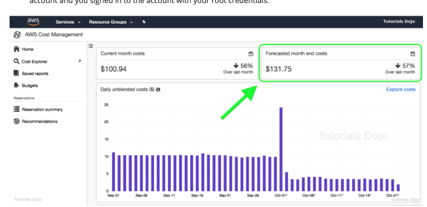

## 注意点

1. Detailed Billing Reports已经被舍弃，不对新用户开放，**推荐使用AWS Organizations** 来管理多个项目的billing问题

# CLI

---

## 补充 

### 1. 配置

使用 access key（在IAM user里面创建）进行配置

* Dry Run --测试是否有权限

* STS decode-authorization-message --encoded-message realmessage -- 用于解密

* STS GetSessionToken -- 请求MFA 获取当前用户的临时登录信息

  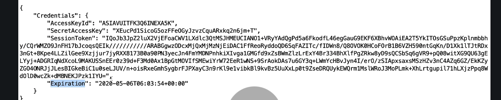


## 1. EC2 相关

```bash
ssh -i xxx.pem ec2-user@xx.xxx.xx.xxx 
```

如果出现了如下，说明这个pem文件是公开的十分不安全所以拒绝使用这个访问，**下一步修改访问权限**

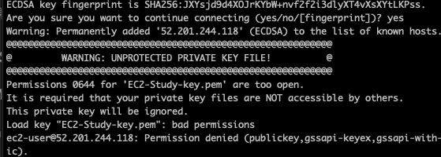

```bash
chmod 0400 xxx.pem
```

查看meta-data

```bash
curl http://169.254.169.254/latest/meta-data/
```


## 2. S3 相关

S3 默认返回所有的object，每页1000，如果有3400个则默认执行4次。可以通过下面来分页

```bash
--max-items # 指定最多query多少个
--starting-token # 指定起始的object
--page-size # 指定每页的size
```

## 3. ECS 相关

根据规则创建ECS cluster

```bash
aws ecs create-service --service-name ecs-simple-service --task-definition ecs-demo --desired-count 10
# --service-name 服务名字
# --task-definition task名字
# --desired-count maintain数量
```


## 4. KMS 相关

加密

```bash
aws kms encrypt --key-id alias/study --plaintext fileb://asdasdasd/asdasdasd.txt --output text --query Ciphedaksjdn --region us-east-1 > asdasdasd.base64
```

解密类似 


## 5. SAM 相关

```bash
sam package
sam build 	# build并且打包所有的依赖到 .aws-sam/build
sam depoly  # 打包整体的代码并且部署
sam publich # 用于使用 packaged SAM template来发布到application到某一个region
```

## 6. Cloudformation 相关

```bash
aws cloudformation deploy
aws cloudformation package 
```

## 7. CloudWatch log 相关

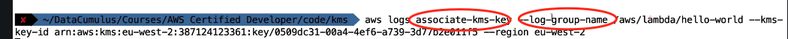

一般会需要先针对CMK的policy进行修改

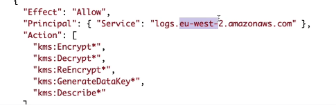

## 1. 命令

* --dry-run option ：用于测试当前用户是否有某个权限

## 2. instance profile

```bash
aws configure --profile 
```

使用profile来管理多个账号

# 散碎

---

## HTTP error code

* 503 Service unavailable 
  1. 如果是ALB问题表示没有target group
  2. 如果是S3说明有的object有太多的versions 使用 Amazon S3 inventory 来检查
* 500 Internal server -- 发送的不是HTTP/LB不能转发URL/
* 504 Gateway timeout
* 403 权限

## Budgets

* alert只会在超过或者预计要超过的时候触发
* 如果基于 forecasted to exceed 那么**需要大约 5weeks的使用时间**

# 其他 Service

---

内容不多，但是需要了解的Services

## 1. AWS Glue

用于处理**ETL**（大量数据的获取，运输，加载）的场景，帮助实现功能和分析等等。

* 数据清洗
* 数据分类

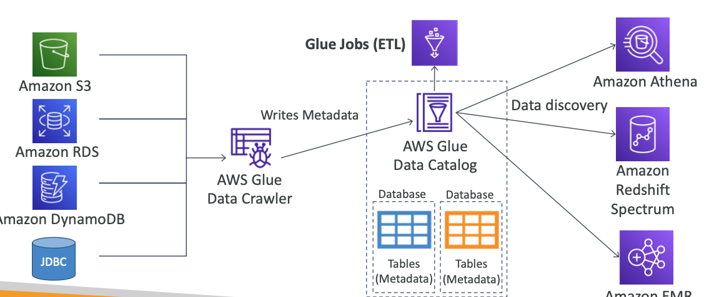

## 2. AWS Step Functions

只能用于sequence AWS Lambda functions。比如订单，需要先接受-处理-反馈 一系列**需要排序的操作**。**用于协助生成Serverless workflow并且管理的**

也可以用于并行的，这里不举例

一般来说会创建**状态机（state machines）**来描述流程图.

特点：

* 对一个线性的流程来说 某一步的损坏不会破坏整个循环。
* Serverless
* 使用 **JSON-based** 
* 每个state可以同时运行多个实例


### 2.1 Activities 

除了自身运行的lambda之外，还可以从别的服务器来**poll**任务，相当于远程调用。


### 2.2 6种state type

* task state 做逻辑处理或者运算（如上图）

* Choice state 在branches 中做判断

* Fail or succeed state ：结尾 成功或者失败会stop处理

* Pass state：**传入input**

* Wait state： 等待时长或者直到某一个时长

* Parallel state： 同时启动多个branches

* map state: 当运行一个lambda的时候input为数组，在这里可以**多次调用lambda**

  写法如下

  ```json
  {
    "StartAt": "ExampleMapState",
    "States": {
      "ExampleMapState": {
        "Type": "Map",
        "Iterator": { // 把lambda指定为迭代器
           "StartAt": "CallLambda",
           "States": {
             "CallLambda": {
               "Type": "Task",
               "Resource": "arn:aws:lambda:us-east-1:123456789012:function:HelloFunction",
               "End": true
             }
           }
        },
        "End": true
      }
    }
  } 
  ```

  

  输入为

  ```json
  [
    {
      "who": "bob"
    },
    {
      "who": "meg"
    },
    {
      "who": "joe"
    }
  ]
  // 返回
  [
    "Hello, bob!",
    "Hello, meg!",
    "Hello, joe!"
  ]
  ```

  

* Parallel state: 开始并行运行branches

### 2.3 要求

* 每个state **必须有 type fiield**
* 每个state都应该可以到达end（自动机原理）

### 2.4 task type 参数

* InputPath & Parameters：前者使用filter限制输入，后者传递KV对collection
* ResultPath: 控制结果和输入到output，**可以把lambda运行的结果和lambda的输入进行组合**
* OutputPath: 用于筛选ResultPath

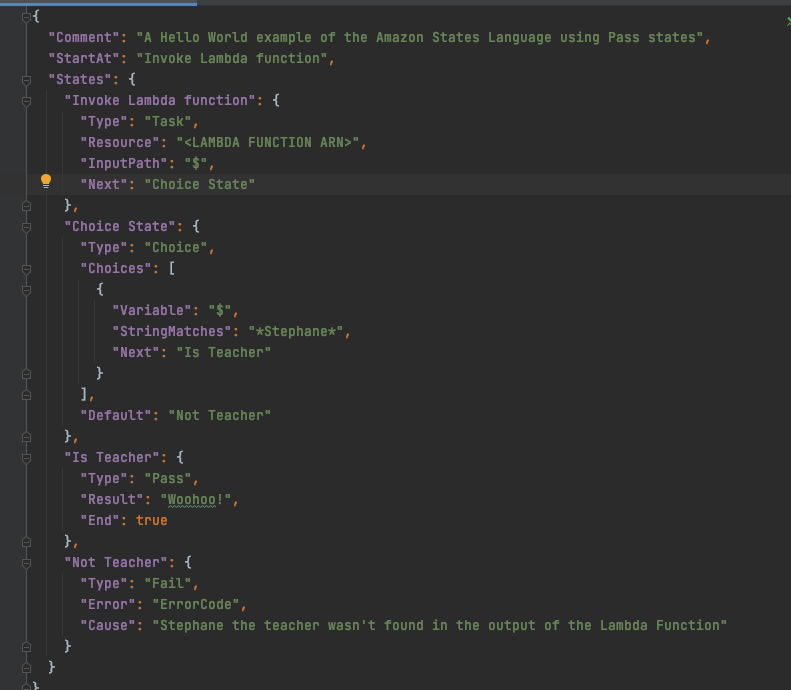

### 2.5 处理错误

可以在**Task**里面指定**Catch field** 设置 错误类型（state machione definition），包含如下三个

* **ErrorEquals**：一个非空的数组包含了所有的错误的名字
* **Next**：一旦出错走向哪个state，string类型
* **ResultPath**：同上面解释的，**这里的“$” 则代表了输入** $.error 表示添加error到input一起返回

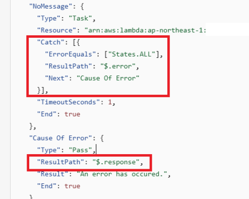


也可以设置**Retry filed**再次处理，一包含4个配置，**如果retry没有通过就会进入catch**

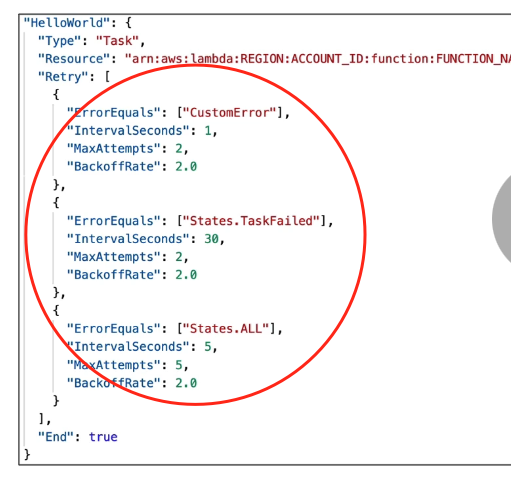

* **ErrorEquals**: 同上
* **IntervalSeconds**: 第一次重试之前等待多少秒
* **MaxAttempts**:最多尝试几次 **默认为3**
* **BackoffRate**：每次尝试失败都会延长**IntervalSeconds**，这个是相乘用的系数

## 3. **AWS Batch**

用于处理**batch computing** workloads。

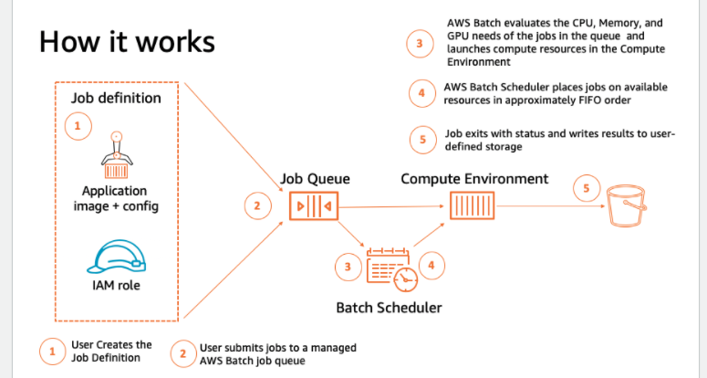

## 4. **Web application firewall**（WAF）

防火墙 **用于处理基于HTTP的问题**，用于filter web 请求 based on IP, geographic, request size etc。

**仅可以和如下服务使用**：

* ALB
* API Gateway
* CloudFront

### 4.1 Web ACL

实际限制的**Rules**

* 可以限制IP address， HTTP headers 。。。。
* 保护常见攻击：SQL注入，Cross-site Scripting
* 限制请求大小，地区
* DDoS 保护（限制请求数量）

### 4.2 AWS Firewall Manager

管理整个Organization所有账号下的rules。

包括

* WAF rules
* AWS Shield Advance
* SG
* ENI


## 5. Security Token Service STS

关键字：***LDAP***，**SAML 2.0**

* 授权**临时的访问权限**，user可以去申请一个临时的权限来把自己当做某个role 或者 user
* **AssumeRole**: 获得你账号下的roles 或者 其他账号（其他账号指定允许你获得的）
* AssumeRoleWithSAML: 返回用于user登录的 credentials **with SAML**
* AssumeRoleWithWebldentity: 返回 **identity provider 提供的credentials**，**现在已经被Cognito Identity Pools代替**
* **GetSessionToken**: MFA 
* GetFederationToken: federated 用户来获取临时的credentials
* GetCallerIdentity: 获取当前使用API的 IAM user or role的信息
* **DecodeauthorizationMessage**:解码错误信息

### 5.1 使用 STS 来Assume roles

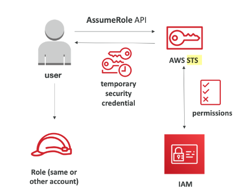

1. 创建role
2. 指定哪些principals可以获取这个role
3. 调用AWS STS来获取临时的credentials来assume roles（AssumeRole API）
4. credentials会在15mins-1小时内失效

## 6. AWS Secrets Manager

专门用于保存Secrets，可以自动 **rotation**，**很贵**, **但是不提供加密数据行为**

## 7. **AWS CloudHSM**

hardware security module，单反提到这三个词的加密问题就选这个，用于用户自己管理的加密服务。

* 提供额外的软件下载到on-promise设备来使用，权限自己创建用户处理。
* 适合客户端加密

## 8.  AWS Organizations

管理多个账号，一般用于多个项目开发，每个项目创建单独的账号，通过**consolidated billing**来合并账单并且进行管理。

### 8.1 Organizational Units

用于分类，**可以树形结构**（继承），如下案例：

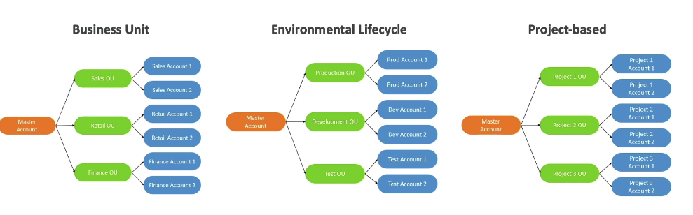

### 8.2 Service control policies （SCP）

* AMI 操作的黑白名单
* 可以作用于 **OU 或者 account** level
* 不作用于Master account（不是OU root account）
* 默认denied 所有权限，所以必须有一个explicit allow

#### 8.2.1 使用案例

* 限制某个service，比如不允许使用EMR

继承使用的案例：

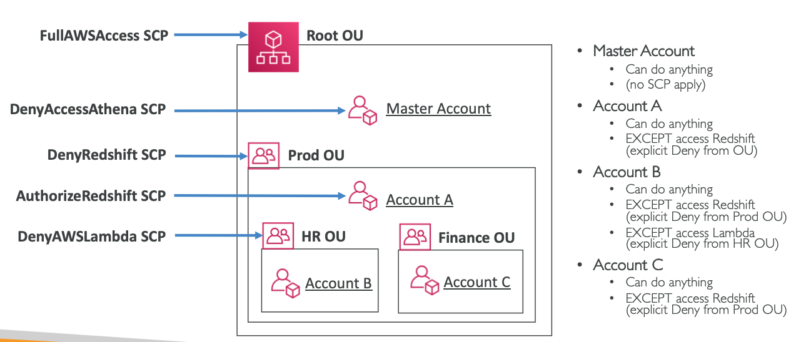

### 8.3 Moving Accounts

直接从old删除，从新的发出邀请。

## 9. AWS SWF

Simple workflw service和Step function，**这个不可以协助Serviceless**

用于协助复杂分布式系统，以及相关的操作。

* 适用于 Long running execution

好处

* 不重复处理Task
* Routing 和 队列
* Timeout 和 执行 状态

## 10. SSM Parameter Store

Systems Manager Parameter Store，**可以存储一些重要的configuration或者秘钥，Application可以通过发送请求来获取。**但是**不可以rotation**

K-V 键值对，Key是明文，Value是由（KMS）加密过的

> **需要注意的是SSM parameter store会自动调取 KMS进行加密，不需要手动调用KMS先**

更进一步的加密，一般用于加密 configuration 和 秘钥

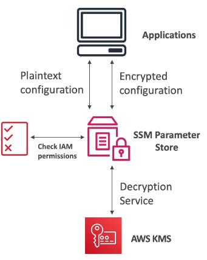


* 拥有继承性 类似 file system

  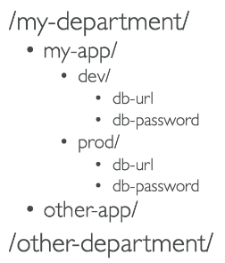

* 分为两个tiers **standard 和 advanced**

* advanced版本可以设置**Parameters Policies**比如TTL

  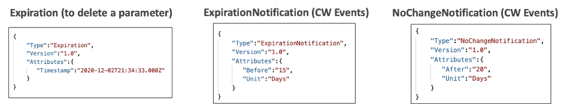

### 10.1 type

* String
* StringList：使用commas分割
* SecureString：KMS加密的

### 10.2 通过cli获取

* **默认加密，可以通过添加 -with-decrpytion 来获得明文**

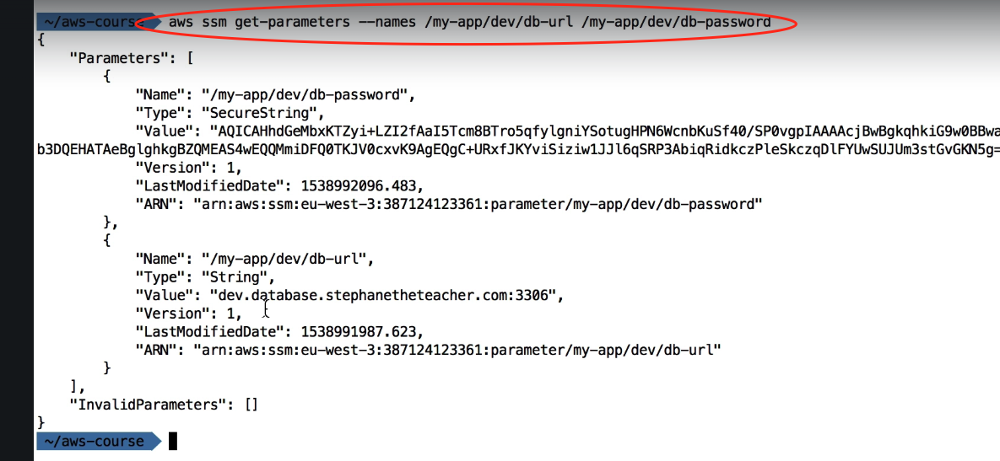

### 10.3 lambda

其他的service类似通过**SDK（boto）**来访问

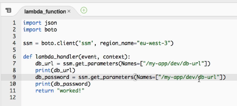

## 11. Redshipft

数据仓库，多用于数据分析

* 也支持**complex joins.**
* 使用**COPY**来从S3导入数据
* 不支持事务

## 12. Neptune

图形化数据库

## 13. DMS

Database Migration Service

## 14. DocumentDB

用于管理MongoDB

## 15. AWS DataPipeline

用于数据迁移

* Data Nodes 指定destination 和 source
* Task Runner： 轮训任务，并且完成它们
* activity： 创建任务
* resource： 用于计算的资源

## 16. QuickSight

图形化界面

## 17. AWS CDK

AWS Cloud Development Kit。用于使用**某类编程语言**来model和部署你的cloud项目

* 会被转换为JSON or YMAL 自动
* 底层还是调用CloudFormation实现

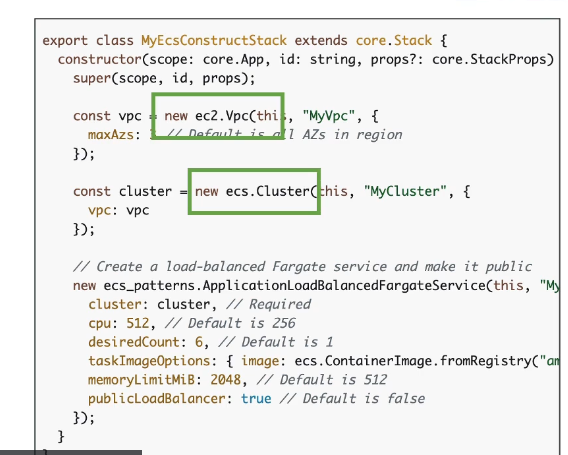

* 支持部署后再更新

## 18. AWS Resources Group

用于管理AWS的resources 一般用于如下情况

* application有多个phases
* project被多个department或者个人管理
* 标记一类资源，比如这一类EC2用于web开发等等

## 19. AppSync

AWS 版本的GraphQL，一种更为advanced API操作

* **基于WebSocket的 real-time的 API 服务**
* **移动端优势**

### 19.1 关于GraphQL

相比于**RESTful**，**GraphQL可以提供更为精准的查询**，未来趋势。

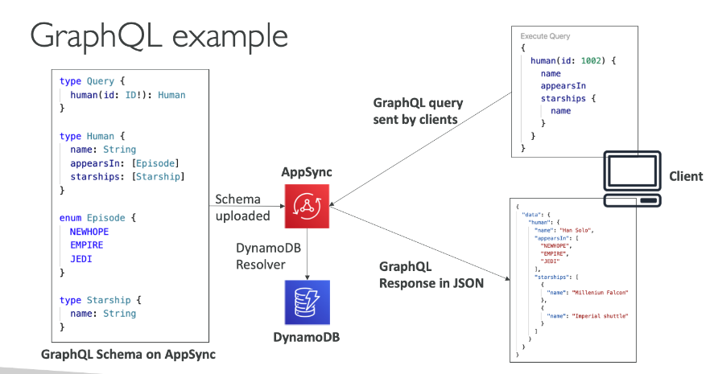

* Schema -- 用于定义数据的类型 **类似数据库的表**
* root -- 用来实现如何返回Schema所定义的数据
* Query -- 用来查询Schema

### 19.2 Security

有4中方法可以对AppSync进行授权

* API_KEY： **由AWS生成的API Key**
* AWS_IAM： 包括 **users/roles/cross-account access**
* OPENID_CONNECT： **第三方验证**，OpenID Connect Provider/JSON Web Token
* AMAZON_COGNITO_USER_POOLS： 指定一个 **cognito user pool** 来验证

### 19.3 log & monitoring

* X-Ray
* CloudWatch

**都是直接勾选即可，一键到位**

## 20. Neptune

图形数据库

* 强关系类型数据！维基百科这样的

## 21. AWS Resource access Manager

用于将多个账号的资源共享在一个VPC下

好处：

* 安全
* 更快

### 21.1 VPC Subnets

* 必须来自同一个AWS Origanizations
* 不可以修改和查看其他账号下的资源

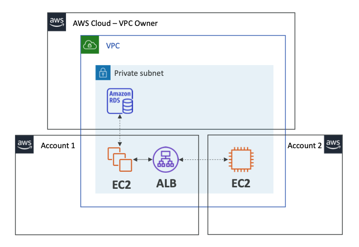

## 22. AWS SSO

单点登录，和**Orginizatioin**，**Active Directory**集成

### 22.1 和 AssumeRoleWithSAML的区别

**AssumeRoleWithSAML**只能在同一个账号内并且**需要手动和 identity provider通过SAML（JWT）通信**，而**SSO支持多账号并且更方便（默认集成了SAML 2.0）**。

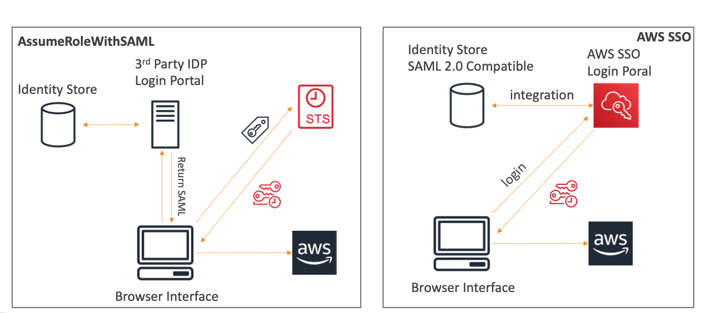

## 23 AWS Shield

处理DDoS问题，**免费**

### 23.1 AWS Shield Advanced

更好的防护，24小时的团队

## 24 AWS GuardDuty

用大数据AI等技术来保护AWS account，**数据集可以是 各种Logs**

* 可以和CloudWatch Event配合
* **用来预防 CryptoCurrency attacks**

## 25 Inspector

**只用于保护EC2的安全**

* 可以通过网络访问等等信息编写**报告**
* 必须安装在EC2上

## 26 Amazon Macie

使用机器学习和 pattern matching技术来发现和保护AWS上的敏感信息

* **Personally identifiable information（PII）**

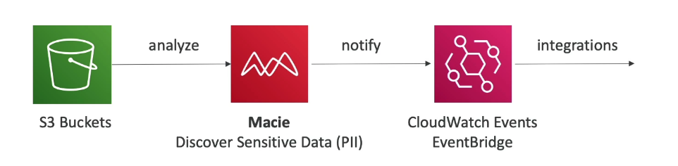


# 题库知识点总结

---

1. **SMS text message-based MFA** 只支持IAM users,  不支持root用户
2. DynamoDB 和 RDS支持事务，其他都不支持
3. **ProvisionedThroughputExceededException**：error retries & exponential backoff, **不能使用增加 lambda timeout**
4. 在AWS Services内的 **programmatic access**永远优先考虑IAM role，如果在AWS Service外部比如on-premise，那么**只能**使用**Access Keys**。Linux系统一般存放在**~/.aws/credentials**，

5. 提高DynamoDB preformance

   * Use Query
   * 减少 page size （使用 Limit 参数）
   * **DynamoDB Accelerator(DAX)** **很方便但是很贵**，如果提到cost应该优先使用前两个
6. API Gateway 允许验证用户不使用cache数据：

   * Cache-Control: max-age=0 
   * 勾选 Require Authorization checkbox
7. IAM roles + resource-based policies来实现的跨账号权限赋予仅在同一个partition（N.california，Beijing）
8. Lambda不支持C++，如果要使用需要配置layer
9. 跨域问题如果经过了API Gateway，那么在Gateway中配置 --- API Gateway creates an `OPTIONS` method and attempts to add the `Access-Control-Allow-Origin` header to your existing method integration responses.
12. AWS CLI的credentails和configuration权限的方法
    * **Command line options**（access key 覆盖所有权限）
    * **Environment variables**
    * **CLI credentials file**
    * **CLI configuration file**
    * **Container credentials**（ECS task IAM role）
    * **Instance profile credentials**
11. 对于lambda的返回值，同步的返回200是成功，异步是202，dry-run是204
12. **Eventually consistent reads 只减少RCU的消耗，但是不会读取提升速度**


# 安全知识扩展

---

## SAML 2.0

一种基于XML的**验证+授权**策略，类似Cognito

* 不适合跨平台（wab+手机端）
* **专注于认证**

### 1. 两种提供商

* 身份提供商（**identity provider IDP**）：用于进行身份认证
* 服务提供商（**service provider SP**）: 在user通过了 IDP的认证后给用户提供服务

### 2. SAML Assertion（Token）

包含用户信息的SAML token，表明用户身份。

### 2. 流程

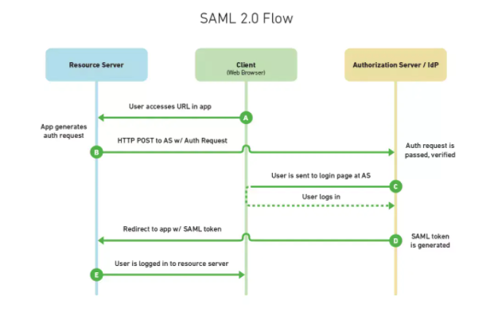

1. 发送登录请求到某个平台，并且通过第三方账号登录
2. 平台通过这个验证信息（多种，可能是token，可能是code）到第三方服务器进行验证
3. 第三方服务器完成验证，并且返回**SAML Assertion**
4. 当用户想访问平台的资源的时候可以携带这个token，**平台会自己解析token**
5. 返回所请求的资源，或者拒绝。

## OAuth2

一种基于第三方认证的**登录授权**模式，一般来说用户可能对一些平台并不信任，不希望将一些用户信息存放在这个平台。但是信任其他大公司，比如Google，github等等，也就是平常见得**使用第三方账号登录**

* **重点是IDP 和SP 之间是互相信任的所以可以使用IDP提供的access key来访问SP**
* **专注于授权（自然也包括了验证）**

### 1. 4个角色

* resource owner -- user
* client -- 客户端/服务器 比如Web来说就是一个浏览器
* resource server --  资源服务器 （本次访问你需要获取的资源，比如某个图片）
* Authorization server -- 认证授权服务器，第三方 比如Google

### 2. 整体流程

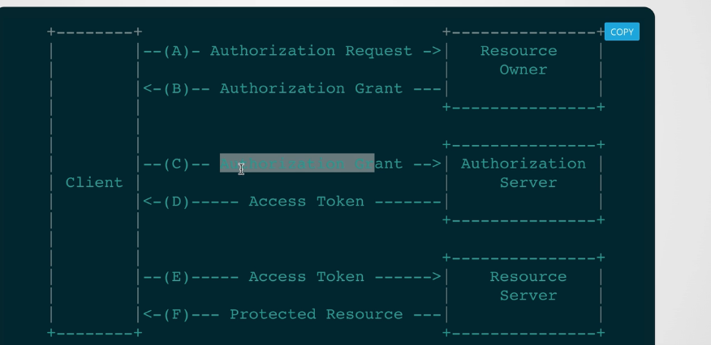

1. 发送登录请求到某个平台，并且通过第三方账号登录
2. 平台通过这个验证信息（多种，可能是token，可能是code）到第三方服务器进行验证
3. 第三方服务器完成验证，并且返回access token（这个access token同时也会发送给平台或者保存下来）
4. 当用户想访问平台的资源的时候可以携带这个token，平台会像第三方进行验证token是否有效
5. 返回所请求的资源，或者拒绝。

### 3. 配置

第三方服务器和平台之间需要进行配置（trust），github为例

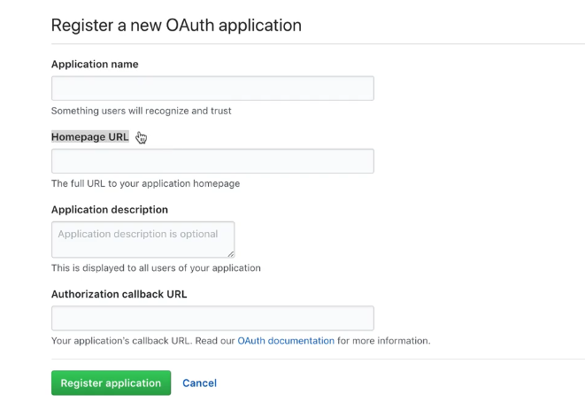

## OpenID

只进行身份认证，像第三方证明你是我的（Google）合法用户，但是不提供任何用户在我这里的信息。

## JWT

**有些需要进行验证的服务并没有client（因为不需要用户数据所以没有认证），可能是自动发送的，比如定时任务，API**，那么就需要借助JWT来完成

### 1. 流程

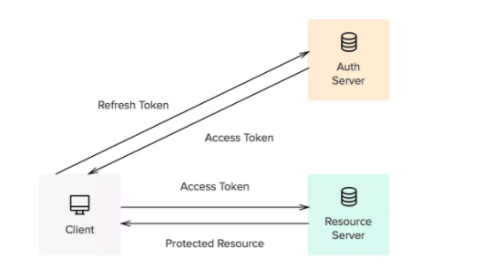

1. 首先在Google API建立服务账号（service account）
2. 获取服务账号的验证信息，可能包括 **邮箱地址**，**client ID**，以及一对**公私钥**
3. 通过**Client ID + 私钥** 来创建一个**签名**的JWT，发送给Google
4. Google验证并且返回access token
5. 通过access token 来访问资源（API）

## 几种模式的小结

* SAML 2.0：IDP只做认证，SP做授权
* OAuth2：IDP做认证+授权
* OpenID：只认证是否为合法用户（无权访问用户信息）
* JWT：做认证和授权，都是通过签名来完成

