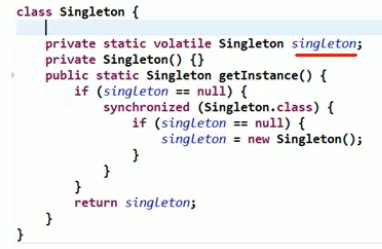

# 七大原则

---

## 1. 单一职责原则

**一个类只负责一类职责** 比如Web开发的三层（Service， Controller，Dao）

## 2. 接口隔离原则

一个类对于另一个类的依赖应该建立在最小的接口上，说白了就是如果一个类对另一个类依赖的话**不应该有多余实现的方法**。**如果出现的话应该将接口拆分**。

## 3. 依赖倒转原则（Dependence Inversion principle）

底层模块最好有抽象类或者接口，稳定性更好，这样扩展会更好。**相当于添加一层缓存层**。

这样在依赖的时候可以声明为接口而不是一个指定的类。以后可以更好的进行扩展。

**继承时候需要满足里氏替换原则**

### 3.1 传递的三种方式

1. 接口传递
2. 构造方法传递
3. setter方式传递

第一种十分好理解，2和3就是Spring的方法，**内部有一个属性是接口或者抽象类，可以通过构造函数或者setter来注入**

### 3.2 设计思路

* 低层模块尽量是有抽象类或者接口，而不是一个独立的类
* 变量的声明尽量是接口或者抽象类
* 里氏替换原则

## 4. 里氏替换原则

**继承性的规范**

* 尽量不要重写父类的方法
* 如果实在需要重写，那么应该**把重叠的地方抽出变成子类和父类的抽象类或者接口**，然后把其他部分进行组合或者聚合

## 5. 开闭原则

一个类或者模块或者函数应该**对扩展开放（开发者），对修改关闭（使用者）**

* 尽量少修改代码，通过添加代码来扩展

## 6. 迪米特法则

封装的核心（**高内聚**），**只提供功能，而不是暴露实现**

一个类对自己依赖的类知道的越少越好。

### 6.1 概念

* **直接朋友**：如果一个类中出现了另一个类的使用（方法参数，成员变量，返回值类型）
* **陌生的类**：直接朋友取反

陌生的类尽量不要出现在局部变量里面！

## 7. 合成复用原则

尽量使用合成或者聚合而不是继承

* 组合：依赖必须存在，A创建的时候成员变量B自动也创建
* 聚合：依赖可以存在也可以不存在，通过构造器或者setter传入


# 单例

---

饿汉懒汉略，推荐写法为**双重检查**



## 1 其他方法

开发就用双重检查即可，下面可以了解

### 1.1 静态内部类

* 静态内部类在没有被调用时是不会加载的
* 加载的时候是线程安全的，所以可以确保只创建一个instance

```java
class Singleton{
  private Singleton(){}
  
  private static class SingletonInstance{
    private static final Singleton INSTANCE = new singleton();
  }
  
  public static Singleton getInstance(){
    return SingletonInstance.singleton;
  }
}
```

### 1.2 枚举（也推荐使用）

* 枚举本身就是类似单例，所以创建一个枚举类，里面只有一个成员既Instance即可

# 简单工厂模式

---


# 观察者模式

---


