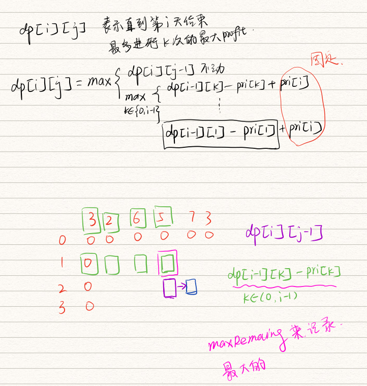
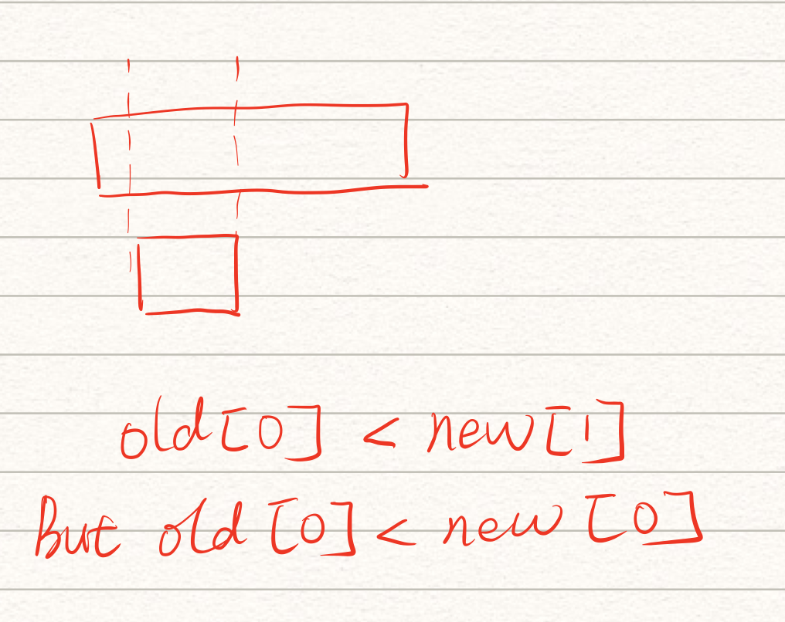
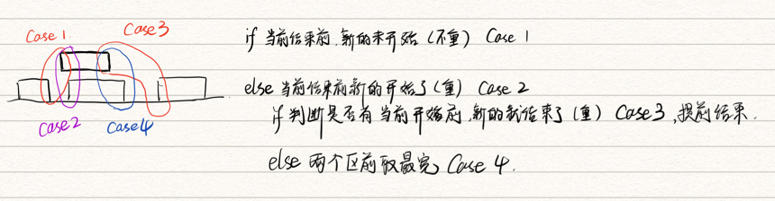

# Array

---

## 1. sum 问题

* 设置一个target， 从两头开始查找
* 需要注意去重复

### 1.1 2Sum 

用Map来保存数字和index然后通过 contains来迅速判断， 复杂度n。

### 1.2 3Sum

* 三个数字都要去重

```java
class Solution {
    public List<List<Integer>> threeSum(int[] nums) {
        List<List<Integer>> ans = new ArrayList();
        if(nums.length < 3) return ans;
        
        Arrays.sort(nums);
      
        for(int i = 0;i < nums.length - 2;i ++){
          // 给第一个数字去重，这里只可以使用i-1 不能使用i+1否则会压缩后面两个数字的使用空间
            if(i == 0 || nums[i] != nums[i - 1]){
                int target = 0 - nums[i];
                int start = i + 1;
                int end = nums.length - 1;
                while(start < end){
                   if(nums[start] + nums[end] == target){
                    List<Integer> temp = new ArrayList();
                    temp.add(nums[i]);
                    temp.add(nums[start]);
                    temp.add(nums[end]);
                    ans.add(temp);
              			// 给后面两个去重
                    while(start < end && nums[start] == nums[start + 1]) start ++;
                    while(start < end && nums[end] == nums[end - 1]) end --;
                     // 需要注意在过滤了后再++ 因为当前还是已经判断过了的数
                       start++;
                       end --;
                }else if(nums[start] + nums[end] > target){
                    end --;
                } else {
                      start ++; 
                  }
                }
                
            }
        }
        return ans;
    }
}
```

### 1.3 3Sum Closet

* 关键点！对于排序后的数组不会存在反超， 仍然是从两头进行缩短gap

```java
class Solution {
   
public int threeSumClosest(int[] nums, int target) {
         Arrays.sort(nums);
    int minDistance = Integer.MAX_VALUE;
    int result = 0;
    for (int i = 0; i < nums.length; i++) {
        int left = i + 1;
        int right = nums.length - 1;
        while (left < right) {
            int threeSum = nums[i] + nums[left] + nums[right];
            if (threeSum == target) {
                return threeSum;
            }

            if (threeSum < target) {
                left++;
            }

            if (threeSum > target) {
                right--;
            }

            int curDistance = Math.abs(threeSum - target);
            if (curDistance < minDistance) {
                minDistance = curDistance;
                result = threeSum;
            }
        }
    }
    return result;
    }
}
```

### 1.4 4Sum

* 这里的重复问题很不好处理，可以直接使用contains或者降维到3Sum

## 2. 摩尔投票

用于求数组中的众数

### 2.1 思路

假设一个数是众数，比如大于二分之一，那么假设分为阵营每一种数字代表一个阵营，无论如何两两互换的情况下 最后剩下的人一定是这个众数。 并且如果大于二分之一那么只能有一个队伍，大于三分之一只能有两个队伍，我们可以先根据情况来查找不同的cadidate，然后再确认他是否满足

### 2.2 3/n

2/n比较简单，这里考虑3/n，那么最多可能有两个队伍，那么假设每个队伍。那么有如下情况

1.  有两只大于3/n的队伍，那么其他的所有队伍加起来也不可能1换1也不可能换的过他们，因为剩下的队伍加起来也不足3/n
2. 只有一只大于3/n的队伍，那么因为我们设置了两个潜在的candidate。由于另一个潜在的candidate的存在，唯一这只大于3/n的队伍也会存活到最后，因为cadidate会负责抵消一部分（这里不涉及证明记住就好）。

最后再检查是否两个数都会大于 3/n

```java
class Solution {
    public List<Integer> majorityElement(int[] nums) {
        int n1 = nums[0];
        int n2 = nums[0];
        int count1 = 0;
        int count2 = 0;
        List<Integer> ans = new ArrayList<>();
        for (int i = 0;i < nums.length;i ++){
            if (n1 == nums[i]) count1 ++;
            else if (n2 == nums[i]) count2 ++;
            else if (count1 == 0){
                n1 = nums[i];
                count1 = 1;
            }
            else if (count2 == 0){
                n2 = nums[i];
                count2 = 1;
            }else {
                count1 --;
                count2 --;
            }
        }
        count1 = 0;
        count2 = 0;
        for (int i = 0;i < nums.length;i ++){
            if (n1 == nums[i]) count1 ++;
            // 这里一定要用else if 否则会多次计算，这样写如果两个candidate都是1，那么只会加一次
            else if (n2 == nums[i]) count2 ++;
        }

        if (count1 > nums.length / 3) ans.add(n1);
        if (count2 > nums.length / 3) ans.add(n2);

        return ans;
    }
}
```

## 3. 重复 element

### 1. I

直接排序 然后遍历一遍

### 2. II

* 添加约束必须i - j 距离相差不能超过k

使用map记录每个数**最近**的坐标，如果遇到了map中有这个数，如果符合k的条件则返回true，如果不符合更新index，这样保证后面如果再次遇到index的差值最小

### 3. III

* II的基础上再加约束，不是相等而是在K的区间内存在两个数之差小于t

使用TreeSet，**在保证数的范围永远都是在K之内的前提下**，每次返回**正好大于这个数(ceiling)**和**正好小于(floor)**这个数的element，如果这两个数其中有一个满足t的条件则返回true，否则添加到set中。每次添加后需要移除区间大于K的数**相当于窗口移动**。

```java
 public boolean containsNearbyAlmostDuplicate(int[] nums,int k,int t){
        if (nums.length < 2 || k == 0) return false;

        TreeSet<Long> treeSet = new TreeSet<>();
        int i = 0;
        while (i < nums.length){
            Long floor = treeSet.floor((long) nums[i]);
            Long ceiling = treeSet.ceiling((long) nums[i]);
            if ((floor != null && nums[i] - floor <= t) || (ceiling != null && ceiling - nums[i] <= t)) return true;
            treeSet.add((long) nums[i]);
            i ++;
          // 移动窗口，保证set中的所有书都是在K的区间内
            if (i > k){
                treeSet.remove((long) nums[i - 1 - k]);
            }
        }
        return false;

    }
```

## 4. 买股票

多种题目总结

### 4.1 思路 & 重点

1. 查找某一段的最高收益:**可以把DP设置为以i结尾或者以i开始的最大收益**，**如果以i结尾，那么需要记录最高值用最高值-当前值**，因为**无法确保当前值是最高值所以如果记录的是最低值那么则无法保证是最大收益**，相反如果是以i开始，那么记录最低值，使用当前值-最低值。
2. **DP的向右和向下方向永远都是>= 左上方的**
3. 如果出现了最大收益的那一天**同买同卖**的情况则视为这一天自动跳过，合并两次交易为一次。
4. 可以把**购入股票**看做**买入当天**的**负收入**，这样做的好处是在卖出的那天可以直接通过加上当天的价格来算profit
5. 初始化可以添加一列第0天，全部为0.方便计算，也可以直接手动初始化两天。

### 4.1 I

* 只买一次
* 从后往前从前往后都可以

```java
 public int maxProfit(int[] prices) {
        // 核心是找到当前index的prices之前的最低价格 而不是找到当前index后面的最高点，因为当前可能不是最低点
        // 反着也可以 找以当前index作为start的 最高价格，这里不可以找最低，因为当前可能不是最高。
        if(0 == prices.length) {
            return 0;
        }
        int[] dp = new int[prices.length];
//        int min = prices[0];
//        int pro = 0;
//        for (int i = 1;i < prices.length;i ++){
//            if (prices[i] < min) min = prices[i];
//            else {
//                pro = Math.max(pro, prices[i] - min);
//            }
//        }
        int max = prices[prices.length - 1];
        int pro = 0;
        for (int i = prices.length - 2;i >= 0;i --){
            if (prices[i] > max) max = prices[i];
            else {
                pro = Math.max(pro, max - prices[i]);
            }
        }
        return pro;
    }
```

### 4.2 II

* 不限次数
* 下降的时候什么都不做， 上升的时候最低位买最高位出

```java
public int maxProfit(int[] prices) {
        // 核心 下降的时候什么都不做
        // 1. 下降的时候购买，那不如在下降结束了买，因为最低点肯定比中间便宜
        // 2. 下降的时候卖出，那不如在起点卖出，因为起点的时候价格最高
        // 3. 边买边卖，那就说了下降趋势买卖属于脑残
        if (prices.length == 0) return 0;

        int profit = 0;
        int min = 0;
        int max = 0;

        int start = 0;
        while (start < prices.length - 1){
            while (start < prices.length - 1 && prices[start] >= prices[start + 1]) start ++;
            min = start;
            while (start < prices.length - 1 && prices[start] <= prices[start + 1]) start ++;
            max = start;
            profit += prices[max] - prices[min];
        }
        return profit;
    }
```

### 4.3 III

* 最多进行两次
* 分为前后两个
* 然后利润相加取最大

```java
 public int maxProfit(int[] prices) {
        int n = prices.length;
        if (n == 0) return 0;
        int[] dp1 = new int[prices.length];
        int[] dp2 = new int[prices.length];

        // 找到从0开始以i结尾的最大值
        int low = prices[0];
        dp1[0] = 0;
        for (int i = 1;i < prices.length;i ++){
            if (prices[i] < low) low = prices[i];
            dp1[i] = Math.max(dp1[i - 1], prices[i] - low);
        }

        int high = prices[prices.length - 1];
        dp2[prices.length - 1] = 0;
        for (int i = prices.length - 2;i >= 0;i --){
            if (prices[i] > high) high = prices[i];
            dp2[i] = Math.max(dp2[i + 1], high - prices[i]);
        }


        int ans = 0;
        for (int i = 0;i < prices.length;i ++){
            ans = Math.max(ans, dp1[i] + dp2[i]);
        }
        return ans;
        // 找到以i开始到最后的最大值

    }
```

### 4.4 IV

如图

* 在求图中绿色部分的时候会重复计算，因为每一次都要求之前所有天的某一天买入当前天卖出的最大收益，所以通过一个maxRemain来记录之前最大的。



```java
 public int maxProfit(int k, int[] prices) {
        if (k == 0 || prices == null || prices.length < 2) return 0;
        int[][] max = new int[k + 1][prices.length];
        for (int i = 1;i <= k; i ++){
          	// 记录内循环的最大值
            int maxRemaing = -prices[0];
            for (int j = 1;j < prices.length;j ++){
              // 1.什么都不做 2. 在之前的某天卖出，相当于需要一次交易，所以只能在前i- 1次中遍历
                max[i][j] = Math.max(max[i][j - 1], maxRemaing + prices[j]);
              // 2.结束后更新maxRemaing，对比当前天的前一次 交易的最大收益 + 今儿卖出
                maxRemaing = Math.max(maxRemaing, max[i - 1][j] - prices[j]);
            }
        }
        return max[k][prices.length - 1];
    }
```

### 4.5 with downtime

卖了后需要休息一天才可以继续购买

* 两个dp array，记录当天持有/不持有股票的最大收益

```java
 public int maxProfit(int[] prices) {
        if (prices.length < 2) return 0;
        // 第i天结束，手里持有股票的最大收益
        int[] maxHold = new int[prices.length];
        // 第i天结束，手里不持有股票的最大收益
        int[] maxNoHold = new int[prices.length];
        // 如果当天进行购买操作，那么当天的最大收益会减去购买所需要的钱，所以第一天如果购买是
        // - prices[0]
        maxHold[0] = -prices[0];
        maxNoHold[0] = 0;
        maxHold[1] = -Math.min(prices[0], prices[1]);
        maxNoHold[1] = Math.max(0, maxHold[0] + prices[1]);
        // 从第二天开始
        for (int i = 2;i < prices.length;i ++){
            // 1. 之前买了，今天继续持有（什么都不做） 2. 之前没买今天买
            maxHold[i] = Math.max(maxHold[i - 1], maxNoHold[i - 2] - prices[i]);
            // 1. 之前就没有，今天没得卖（什么都不做） 2. 之前买了今天卖
            maxNoHold[i] = Math.max(maxNoHold[i - 1], maxHold[i - 1] + prices[i]);
        }
        return maxNoHold[prices.length - 1];
    }
```

#### 4.5.1 为什么是maxNoHold[i-2]

对于maxHold的状态方程为什么是i - 2，看似好像如果i - 1的maxNoHold也有可能成立，**因为NoHold可能存在case1（之前没有，今天也没卖）**。**那么就不存在colddown**。

**如果是这种情况（之前没有，今天也没卖）那么i - 1和 i- 2的NoHold的值一定是一样的（相当于空过），所以不影响答案**

## 5. 桶排序思想

有些需要排序，但是时间复杂度必须小于n，可以考虑桶排序（类似空间换时间）

* 需要注意桶排序**最大的数可能会出现越界**需要处理

### 164. Maximum Gap

**无序的数组**，**求其有序**的状态下相邻两个数的**最大gap**

* 把n个数的数组分为放入n-1个桶中，其中**维护桶的min 和 max**

  ```java
  class Bucket{
          public int max;
          public int min;
          public Bucket(){
              max = 0;
              min = Integer.MAX_VALUE;
          }
          public void updateWithNum(int num){
              max = Math.max(max, num);
              min = Math.min(min, num);
          }
      }
  ```

* 每个桶的size大小是两个数字之间的最小间隔（确保max - min 不会是答案，因为答案要求的是最大）答案只可能出现在桶和桶之间的间隔既**（bucket[i].min - bucket[i - 1].max）**

  ```java
  private int findIndex(int num, int max, int min, int n){
      // 确保size至少大于1
      int size =  Math.max((max - min) / n, 1) ;
      return Math.min(n - 1, (num - min) / size);
  }
  ```

```java
class Solution {
    class Bucket{
        public int max;
        public int min;
        public Bucket(){
            max = 0;
            min = Integer.MAX_VALUE;
        }
        public void updateWithNum(int num){
            max = Math.max(max, num);
            min = Math.min(min, num);
        }
    }
    public int maximumGap(int[] nums) {
        if (nums == null || nums.length < 2) return 0;
      // 如果只有一个桶被使用 那么无法使用下面的算法，所以处理这种特殊值
        if (nums.length == 2) return Math.abs(nums[0] - nums[1]);
        Bucket[] arr = new Bucket[nums.length - 1];
        for (int i = 0;i < arr.length;i ++){
            arr[i] = new Bucket();
        }
        // 找到数组的最大值和最小值
        int min = nums[0];
        int max = nums[0];
        for (int i = 0;i < nums.length;i ++){
            min = Math.min(min, nums[i]);
            max = Math.max(max, nums[i]);
        }
        // 如果所有数字都是一样的，那么直接返回0
        if (min == max) return 0;
        // 开始把数字放到各个桶中
        for (int i = 0;i < nums.length;i ++){
            int index = findIndex(nums[i], max,min, nums.length - 1);
            arr[index].updateWithNum(nums[i]);
        }
        int result = 0;
        int currentMin = min;
        for (int i = 0;i < nums.length - 1;i ++){
            // 空桶，跳过
            if (arr[i].min == Integer.MAX_VALUE) continue;
            result = Math.max(result, arr[i].min - currentMin);
            currentMin = arr[i].max;
        }
        return result;
    }

    private int findIndex(int num, int max, int min, int n){
        // 确保size至少大于1
        int size =  Math.max((max - min) / n, 1) ;
      // 防止越界
        return Math.min(n - 1, (num - min) / size);
    }
}
```

## 6. 单调栈

对于数组中递增和递减的部分可以进行分别处理的情况，

* **一般伴随着要求数组的相对位置不能改变**。

* 左右的最大值或者最小值可以确定以arr【 i 】的答案

### 42 Trapping Rain Water

* 递减部分全部放入stack
* 遇到递增部分，一旦当前的height[ index ] 比栈顶的数字（递减趋势中最小的）大，那么就开始计算面积
* 核心！ **一个点的储水能力取决于短边**，那么也就是说如果遍历到的index是大于当前点**左边**的长度那么这个点就可以**从stack中移除并且计算**，因为无论**后面的点是什么高度这个点的储水能力就已经确定了**。

```java
public int trap(int[] height) {
        if (height.length < 2) return 0;
        // 这里我们储存index
        Deque<Integer> stack = new ArrayDeque<>();
        int res = 0;
        int index = 0;
        int len = height.length;
        while (index < len){
            // 先查找下降趋势 添加所有的element到stack直到开始上升
            while (index < len && (stack.isEmpty() || height[stack.peekLast()] >= height[index])){
                stack.addLast(index++);

            }
            // 如果最后一段是持续下降的直接break
            if (index == len) break;

            // 上升趋势的情况下，会一直向上查找stack里面存放的index所对应的高度比当前高度矮的进行计算，index不会变
            // 所以本次循环结束后这个index会被上一个while再一次添加到stack中因为有可能这个index是一个peek，所以可能会被下次循环使用
            while (index < len && !stack.isEmpty() && height[stack.peekLast()] < height[index]){

                int curIndexInStack = stack.removeLast();
                // 如果这个是下降趋势的第一个 也就是stack中的第一位，那么就break，因为他没有左边的墙壁了
                // 也就是说这个index是一个peek
                if (stack.isEmpty()) break;

                // 这里w求法看图就明白了，并且如果是上升趋势 虽然上一次循环的index会被重新添加到stack中
                // 因为这个while的退出条件 height[stack.peekLast()] < height[index] 和 上一个while的进入条件正好相反 height[stack.peekLast()] >= height[index]
                // 但是并不会影响 因为如果是上升趋势，那么必然curIndex - stack.peekLast = 1. 所以w是0.
                int w = index - stack.peekLast() - 1;
                //
                int h = Math.min(height[index], height[stack.peekLast()]) - height[curIndexInStack];
                res += w * h;
            }
        }
        return res;
    }
```

### 402. Remove K Digits

* 递增部分全部放入栈
* 递减部分开始弹出之element直到 当前的值 >= 栈顶
* 递减部分弹出的时候需要考虑余下的candidate是否够用（代码有注释解释）

```java
 public String removeKdigits(String num, int k) {
        int len = num.length();

        // 我们希望递增，并且开头是在第一个波谷，所以递增添加 递减检查
        Deque<Character> stack = new ArrayDeque<>();
        int index = 0;
        int count = len - k;
        if (count == 0) return "0";
        while (index < len){
            while (index < len && (stack.isEmpty() || stack.peekLast() <= num.charAt(index))){
                stack.addLast(num.charAt(index));
                index ++;
            }
            // 到边界，没有下降趋势了，否则下面会超界
            if (index == len){
                break;
            }

            // stack 在下降前不可能为空因为上面的while会至少添加一个元素，这里是为了防止空指针（因为在不停的移除）
            // 计算为 （stack.size - 1） + (len - index)
            // 123   216  len = 6 index = 3 所以 还有3个可用
            // 栈需要被移除1个 然后这三个都可能会被添加进来 所以candidate的最大是 stack.size - 1） + (len - index)
            while (!stack.isEmpty() && stack.peekLast() > num.charAt(index) && stack.size() - 1 + len - index >= count){
                stack.removeLast();
            }
            // 当前的栈顶的数字是满足 stack.peekLast() <= num.charAt(index)
            stack.addLast(num.charAt(index));
            index ++;
        }

        StringBuffer sb = new StringBuffer();


        if (stack.isEmpty()) return "0";
        int start = 0;
        // 去掉leading "0"
        boolean seen = false;
        while (!stack.isEmpty() && start < count){
            if (stack.peekFirst() == '0' && !seen){
                start ++;
                stack.removeFirst();
                continue;
            }
            sb.append(stack.removeFirst());
            seen = true;
            start ++;
        }
        // 如果stack为空说明答案是0 但是因为去重给移除了
        // 比如100001 4 这里stack里面是0
        return sb.length() == 0 ? "0" : sb.toString();
    }
```

### 316 Remove Duplicate Letters

* 递增添加到栈
* 递减检查栈尝试移除之前的来保证栈依然递增，直到遇到第一个不可以移除的（既后面没有duplicate的元素）

```java
public String removeDuplicateLetters(String s) {
        // stack
        int[] lastIndex = new int[26];
        for (int i = 0;i < s.length();i ++){
            lastIndex[s.charAt(i) - 'a'] = i;
        }

        Deque<Character> deque = new ArrayDeque<>();
  		// set用来记录当前栈里的元素	
        HashSet<Character> set = new HashSet<>();

        for (int i = 0;i < s.length();i ++){
            char cur = s.charAt(i);
            if (set.contains(cur)) continue;

            // 如果出现递减，那么尝试pop所有在deque中大于cur的char，目的是为了尽最大可能的保证上升趋势
            // 直到遇到第一个char在后面的remain部分没有重复的，则停止，因为只可以删除重复的
            while (!deque.isEmpty() && deque.peekLast() > cur && lastIndex[deque.peekLast() - 'a'] > i){
                set.remove(deque.peekLast());
                deque.removeLast();
            }

            set.add(cur);
            deque.addLast(cur);
        }
        StringBuilder sb = new StringBuilder();
        while (!deque.isEmpty()){
            sb.append(deque.removeFirst());
        }
        return sb.toString();
    }
```

### 84. Largest Rectangle in Histogram

目的 遍历数组 以 Height【 i 】 为高的话最大面积是多少，**相当于固定高求最大宽** 

* 上升趋势全部放入栈（相当于确定左边界），因为递增所以左边界最宽只能到当前
* 遇到下降趋势开始弹出栈，并且计算宽度，因为一旦下降说明右边界也确定可以直接计算，直到栈顶的高度严格大于当前遍历的高度
* **左右添加哨兵（左右添加0）！这样可以减少很多检测，**
  * 比如说如果最后一段数列**单调递增**，如果不设置哨兵，那么结束循环的时候栈不为空。
  * 比如说如果栈中的是最小元素，那么他的宽应该从头一直到尾部，如果添加哨兵那么就可以用peeklast获取哨兵的index（0）来方便计算

```java
// 目标 求得以height[i] 为高，最大的面积是多少（左右找第一个比height[i]短的）
    public int largestRectangleArea(int[] heights) {
        int len = heights.length;
        if (len == 1) return heights[0];
        int[] arr = new int[len + 2];
        len += 2;
        for (int i = 0;i < heights.length;i ++){
            arr[i + 1] = heights[i];
        }

        // 涉及高度 所有存入index
        Deque<Integer> stack = new ArrayDeque<>();
        int ans = 0;
        int index = 0;
        while (index < len){
            // 所有递增全部添加
            while (index < len && (stack.isEmpty() || (!stack.isEmpty() && arr[stack.peekLast()] <= arr[index]))){
                stack.addLast(index ++);
            }
            // 说明在末尾 ,开始处理递减
            while (index < len && !stack.isEmpty() && arr[stack.peekLast()] > arr[index]){
                int curIndex = stack.removeLast();
                // 因为栈内单调递增，所以stack顶后的所有元素高度都低于栈顶，也就实说针对height[curIndex]为高的矩形面积此时已经确定
                int w = index - stack.peekLast() - 1;
                // 这里不使用下面的方法计算是为了考虑如果当前stack已经是最小的元素了 那么这个元素的宽度可以最远reach到最左边
//                int w = index - curIndex;
                ans = Math.max(ans, w * arr[curIndex]);
            }
            stack.addLast(index++);
        }


        return ans;
    }
```

### 321 Create Maximum Number

* 上升下降这里和Remove K digits差不多
* 直接分开合并即可

易错点是greater，这里不能简单的在合并的时候判断当前位大小，如果相同需要判断后面一位的大小直到找到第一个不同的数组或者到末尾。

```java
class Solution {
    public int[] maxNumber(int[] nums1, int[] nums2, int k) {
        // 给一个数组分配 i， 另一个数组分配k - i

        int len1 = nums1.length;
        int len2 = nums2.length;
        int[] ans = new int[k];
        for (int i = 0; i < k; i++) {
            // 然后分别对每个数组求移除分配的数量后的最大值
            if (i > len1 || k - i > len2) continue;
            int[] candidate1 = getMax(nums1, i);
            int[] candidate2 = getMax(nums2, k - i);
            // 合并求最大值
            int[] temp = merge(candidate1, candidate2);
            // 比较后返回最大的分配方法
            if (!isGreater(ans, 0, temp, 0)) ans = temp;
        }

        return ans;

    }

    private int[] getMax(int[] nums, int k) {
        int[] res = new int[k];
        Deque<Integer> stack = new ArrayDeque<>();
        int len = nums.length;
        int index = 0;
        while (index < len) {
            while (index < len && (stack.isEmpty() || (!stack.isEmpty() && stack.peekLast() >= nums[index]))) {
                stack.addLast(nums[index++]);
            }
            // 说明整体单调递增
            if (index == len) {
                break;
            }

            while (!stack.isEmpty() && stack.peekLast() < nums[index] && stack.size() - 1 + len - index >= k) {
                stack.removeLast();
            }
            stack.addLast(nums[index++]);
        }

        for (int i = 0; i < k; i++) {
            res[i] = stack.removeFirst();
        }
        return res;
    }


    // 这个是考虑到普通判断会出现相同情况，如果出现了，那么无法判断后面谁大 比如
    // 67  604 合并的时候还需要考虑第二位（整体最大），否则如果会出现其他答案 66704 67604
    // 整体逻辑是判断当前位谁大，如果相同，则比较后面一位一直到结束
    public boolean isGreater(int[] nums1, int i, int[] nums2, int j) {
        // 去掉从当前位开始往后可能存在的相同数。
        while (i < nums1.length && j < nums2.length && nums1[i] == nums2[j]) {
            i++;
            j++;
        }
        // 如果第二个数组到头了仍然没有比较出来，那么两个一样大 无所谓。
        // 如果第一个数组先到头仍，第二个没有到头。 那么第二个数大
        // 如果两个数都没有到头，只是去掉了前面可能存在的相同，那么比较当前数即可
        return j == nums2.length || (i < nums1.length && nums1[i] > nums2[j]);
    }

    private int[] merge(int[] nums1, int[] nums2) {
        int index1 = 0;
        int index2 = 0;
        int indexR = 0;
        int len1 = nums1.length;
        int len2 = nums2.length;
        int[] res = new int[len1 + len2];


        while (index1 < len1 || index2 < len2){
            if (isGreater(nums1, index1, nums2, index2))
                res[indexR ++] = nums1[index1 ++];
            else
                res[indexR ++] = nums2[index2 ++];
        }
        return res;

    }

}
```


## 7. Interval

* 根据不同情况针对开始时间或者结束时间进行**排序**
* **重叠发生在 结束时间大于开始时间，结束在开始时间大于重叠的结束时间**

### 57. Insert Interval

* 对开始时间进行排序（如果需要）
* 遍历所有的interval，知道遇到了第一个**结束时间大于开始时间**，**注意这里不可以是第一个开始时间小于结束时间**，因为有可能出现新的开始时间也大于这个开始时间如下图
* 

```java
class Solution {
    // 题目给出的是不重叠的 所以按着开始时间排序，那么结束时间也是排序的
    public int[][] insert(int[][] intervals, int[] newInterval) {

        List<int[]> ans = new LinkedList<>();

        int index = 0;
        int len = intervals.length;
        if (len == 0){
            ans.add(newInterval);
            return ans.toArray(new int[ans.size()][]);
        }
        int start = newInterval[0];
        int end = newInterval[1];
        while (index < len && intervals[index][1] < start){
                ans.add(intervals[index ++]);
        }
        // 说明一直到结束都没有找到 插入到最后一位
        if (index == len){
            ans.add(newInterval);
            return ans.toArray(new int[ans.size()][]);
        }
        // 确定start
        start = Math.min(intervals[index][0], start);
        // start to find end
        while (index < len && intervals[index][0] <= end){
            end = Math.max(intervals[index][1], end);
            index ++;
        }
        int[] temp = {start, end};
        ans.add(temp);
        // 把剩余的全部添加，当前i是严格大于的所以之前使用的是 <= 因为如果出现了相同也需要合并
        while (index < len){
            ans.add(intervals[index ++]);
        }
        return ans.toArray(new int[ans.size()][]);
    }


}
```

### 58.  Merge Intervals

* insert的变种， 每次从ans中获取上一个作为pre。用pre进行比较
* 找start的时候用pre，找end的时候把当前设置为pre来查找
* 重合的时候**先找start 后者找end**

```java
 public int[][] merge(int[][] intervals) {
        int len = intervals.length;
        List<int[]> ans = new LinkedList<>();
        if (len == 1) return intervals;

        // sort
        Arrays.sort(intervals,(a , b) -> {
            return Integer.compare(a[0] , b[0]);
        });
        int index = 1;
        ans.add(intervals[0]);
        while (index < len){
            int[] pre = ans.remove(ans.size() - 1);
            // 查找重合部分 等于也不行，也需要merge。必须严格小于
            while (index < len && pre[1] < intervals[index][0]){
                ans.add(pre);
                pre = intervals[index ++];
            }
            // 说明全部都不重叠，添加上pre即可
            if (index == len){
                ans.add(pre);
                return ans.toArray(new int[ans.size()][]);
            }
            // 确认start
            int start = Math.min(pre[0], intervals[index][0]);
          // 开始查找end
            int end = pre[1];
            pre = intervals[index];
            while (index < len && pre[1] >= intervals[index][0]){
                end = Math.max(end, intervals[index][1]);
                index ++;
            }
            // 符合条件 添加
            int[] newInterval = {start, end};
            ans.add(newInterval);
        }
        return ans.toArray(new int[ans.size()][]);
    }
```

### 252. Meeting Rooms

* 先按着start排序，如果没有出现重叠即可。
* 重叠条件仍然如上 **上一个interval结束时间大于当前开始时间**

#### 这里记录另一种做法 配合下一道题使用

这道题也可以按着**结尾和开始都先排序**，计算在最近一个meeting结束前 如果有两个以上的start开始了，那么就return false。

```java
public boolean canAttendMeetings(int[][] intervals) {
        int len = intervals.length;
        if (len == 1) return true;

        int[] start = new int[len];
        int[] end = new int[len];
        int res = 0;
        for (int i = 0;i < len;i ++){
            start[i] = intervals[i][0];
            end[i] = intervals[i][1];
        }

        Arrays.sort(start);
        Arrays.sort(end);

        // 从头遍历看是否有重叠
      for (int i = 1;i < len;i ++){
          if (start[i] < end[i - 1]) return false;
      }

       return true;

    }
```


### 253 Meeting Rooms II

**这道题不可以按着前几道题有多少次重叠来计算**（只考虑开始时间）**而是考虑在最近的一次结束前还有多少个meeting在进行**

* 对start 和 end 都进行排序

**核心**，转换场景为一个meeting room. 有人进有人出，**进代表一个会议的开始，出代表一个会议的结束**。

如果在最近的一个会议结束前（无论是哪个）有不止一个会议开始。那么说明有冲突，我们需要多开一个房间。

**但是不需要知道是哪个会议开始哪个会议结束，因为我们只关心同一时间内存在的个数。**

* 只针对start进行遍历检查，然后move end的指针
* **end不一定会用完，因为后面的时间点发生都是meeting结束，所以不会产生新的需求。**

```java
 public int minMeetingRooms(int[][] intervals) {
        int len = intervals.length;
        if (len == 1) return 1;

        int[] start = new int[len];
        int[] end = new int[len];
        int res = 0;
        for (int i = 0;i < len;i ++){
            start[i] = intervals[i][0];
            end[i] = intervals[i][1];
        }

        Arrays.sort(start);
        Arrays.sort(end);

        int endPoint = 0;
        for (int i = 0;i < len;i ++){
            // 如果在最近的一个会议结束前，有新的会议开始了，那么需要的房间++
            if (start[i] < end[endPoint]){
                res ++;

            // 如果在最近的一个会议结束之后，也就是说在这个新的会议开始前，会有一个会议结束，也就是离开
            // 那么我们可以把这个结束的会议的房间留给新的会议，也就是说结束会议的时间可以延伸到下一个最近的结束会议时间
            }else {
                endPoint ++;
            }
        }

        return  res;


    }
```


## 8. 数据流处理

* 优先队列

### 239 Sliding Window Maximum

* **优先队列会超时**，只能维护一个模拟的优先队列来降低查找复杂度
* 维护一个队列长度小于K 从头到尾部降序 -- 每次添加的时候从尾部开始向上移除所有小于这个数的情况，**因为一旦这个数被添加到队列中，那么其他小于它的值都不可能作为答案 ，所以不需要保留**

```java
public int[] maxSlidingWindow(int[] nums, int k) {
        int len = nums.length;
        Deque<Integer> queue = new ArrayDeque<>();


        int[] ans = new int[len - k + 1];
        int index = 0;

        for (int i = 0; i < len; i++) {

            // 维护一个降序的队列
            // 每次添加到队列前先从尾部开始查看 弹出所有比当前数字小的
            // 这里只可以从后往前弹出，不可以从前往后 这样才能保证队列是降序的，这样如果3因为长度被弹出
            // 后面的仍然是最大的 比如 3 1     2 如果不从后往前而是从前往后，那么队列会变为 312 并且在3倍弹出后队列并不是一个优先队列
            while (!queue.isEmpty() && queue.peekLast() < nums[i]) {
                queue.removeLast();
            }

            queue.addLast(nums[i]);

            if (i - k + 1 >= 0){
                ans[index ++] = queue.peekFirst();
                if (nums[i - k + 1] == queue.peekFirst()) {
                    queue.removeFirst();
                }
            }
        }

        return ans;

    }
```

## 9. prefix问题

* 维护一个Map，Key是sum，Value是index，sum 是从index0到value的index所有成员的sum，思想其实就是DP减少冗余计算

### 53 Maximum Subarray

* DP， 思想类似

### 325 Maximum Size Subarray Sum Equals K

* 维护prefix， 这样一遍即可时间复杂度n， 
* **这道题不可以使用滑动窗口，因为存在负值，当前sum不是单调递增的**

```java
 public int maxSubArrayLen(int[] nums, int k) {
        int sum = 0, max = 0;
        HashMap<Integer, Integer> map = new HashMap<Integer, Integer>();
        for (int i = 0; i < nums.length; i++) {
            sum = sum + nums[i];
            if (sum == k) max = i + 1;
          // 这里只能使用 sum - k ， 不可以倒着，因为sum的坐标一直向前走
            else if (map.containsKey(sum - k)) max = Math.max(max, i - map.get(sum - k));
            if (!map.containsKey(sum)) map.put(sum, i);
        }
        return max;
    }
```

### 238. Product of Array Except Self

* 维护两个数组，一个表示**从0开始到index**之前所有数的乘积，一个表示从右开始，所有从**末尾到index**的乘积
* 第 i 位的答案则是正好两边的乘积

```java
public int[] productExceptSelf(int[] nums) {
        int len = nums.length;
        int[] ans = new int[len];
        int[] left = new int[len];
        int[] right = new int[len];
        left[0] = nums[0];
        right[len - 1] = nums[len - 1];
        for (int i = 1;i < len;i ++){
            left[i] = left[i - 1] * nums[i];
        }
        for (int i = len - 2; i >= 0;i --){
            right[i] = right[i + 1] * nums[i];
        }
        ans[0] = right[1];
        ans[len - 1] = left[len - 2];
        for (int i = 1;i < len - 1;i ++){
            ans[i] = left[i - 1] * right[i + 1];
        }
        return ans;
    }
```


## 10. 滑动窗口

* 运用1：目的是减少while的循环，如果要求**固定连续长度**的大小的**subarray**，那么可以采用**减去头部添加尾部**的方法来减少计算量
* 运用2：**查找不定长满足某一条件的连续或者不连续subarray**。先向右查找，一旦满足条件开始收缩左边界，一旦出现不满足则再开始扩展又边界。

### 209. Minimum Size Subarray Sum

* **使用了运用2**，查找连续的
* 满足则左指针移动，不满足右指针移动

```java
public int minSubArrayLen(int target, int[] nums) {
        if(nums.length == 0) return 0;
        int left = 0;
        int right = 0;
        int ans = Integer.MAX_VALUE;
        int curr = 0;
        while (right < nums.length){
            curr += nums[right];
            while (left <= right && curr >= target){
              // 长度因为左右都包括 所以需要+1
                ans = Math.min(ans, right - left + 1);
                curr -= nums[left ++];
            }
            right ++;
        }
        return ans == Integer.MAX_VALUE ? 0 : ans;
    }

## 11. 动态规划

* 处理冗余的计算

### 376. Wiggle Subsequence

* 保留两个DP，表示 **前 i 和数中最长的wiggle sequence是多少并且以Up/ Down 结尾**。最后比较两个的最大值即可

```java
public int wiggleMaxLength(int[] nums) {
        int len = nums.length;
        if (len == 1) return 1;

        int[] up = new int[len];
        int[] down = new int[len];

        up[0] = 1;
        down[0] = 1;
        for (int i = 1;i < len;i ++){
            if (nums[i] > nums[i - 1]){
                up[i] = down[i - 1] + 1;
                down[i] = down[i - 1];
            }else if (nums[i] < nums[i - 1]){
                down[i] = up[i - 1] + 1;
                up[i] = up[i - 1];
            }else {
                down[i] = down[i - 1];
                up[i] = up[i - 1];
            }
        }
        return Math.max(up[len - 1], down[len - 1]);
    }
```


## 无分类

### 299. Bulls and Cows

* secret 和 guess 长度相等
* 遇到Bulls 直接计数
* 遇到Cows 可以通过两种不同互斥的计数（比如 + -），这样一旦遇到了临界点则表面他们另一边对其进行了计数

```java
public String getHint(String secret, String guess) {
        int countA = 0;
        int countB = 0;
        int[] temp = new int[10];
        char[] secretArr = secret.toCharArray();
        char[] guessArr = guess.toCharArray();

        for (int i = 0;i < secretArr.length;i ++){
            if (secretArr[i] == guessArr[i]){
                countA ++;
            }else {
                // 没有对比位置的则开始同时对secret 和 guess进行记录
                // secret出现一次则++， guess出现一次则--
                // 如果secret发现出现了count 小于0， 那也就是说当前数在guess中出现过，那么符合B的条件 则countB++
                // 如果guess发现出现了coount 大于0，那也就是说明有在secret中出现过，那么也符合所以acountB++
                if (temp[secretArr[i] - '0'] < 0) countB++;
                if (temp[guessArr[i] - '0'] > 0) countB++;
                temp[secretArr[i] - '0'] ++;
                temp[guessArr[i] - '0'] --;
            }
        }
        return countA + "A" + countB + "B";
    }
```

### 134. Gas Station

*  起点必须是正数也就是**补充的油 - 到下一站消耗的**
* 答案只有一个，**必须满足total一定是大于0**的否则无论任何起点都不可能完成
* 两个记录total记录所有，current记录从cadidate起点到当前的gas，小于0则开始重新寻找

```java
public int canCompleteCircuit(int[] gas, int[] cost) {
        int total = 0;
        int startIndex = 0;
        int current = 0;
        for (int i = 0; i < gas.length; i++) {
            int temp = gas[i] - cost[i];
            total += temp;
            current += temp;
            // 重点在于这里， 1. 答案只有一个 2. 起点必须是正数
            // 假设为 2（start） 2 1 2 -80 
            // 那么不管从当前i的之前任何一个数（start ~ i）开始都不可能为答案，因为从pre的start到现在
            // 都已经负数，那么减去这个start的正数总数更小所以更不可能满足条件，所以只能从i + 1开始重新查找。
            if (current < 0){
                startIndex = i + 1;
                current = 0;
            }
        }
        return total >= 0 ? startIndex : -1;
    }
```

### 274. H-Index

* 找到n，使得n个论文的引用次数至少大于n
* 也就是说 n<= 论文的总数 比如 [3,0,6,1,5] 那么n <= 5

#### 思路

1. 创建数组来统计各中引用次数出现的次数，所有大于长度的则都算在最大长度的里面
2. 从后往前开始叠加来算count是否大于i， 如果大于则说明至少有i个文章大于i。既满足条件。

```java
class Solution {
    public int hIndex(int[] citations) {
        int len = citations.length;
        int[] arr = new int[len + 1];
        for (int i = 0;i < len;i ++){
          // 所有大于长度的都算子len这一类里面
            if (citations[i] >= len){
                arr[len] ++;
            }else {
                arr[citations[i]] ++;
            }
        }
        int count = 0;
      // 开始叠加acount，从后往前
        for (int i = len;i >= 0;i --){
            count += arr[i];
          // 一旦出现满足那么直接返回，因为求的是最大值
            if (count >= i){
                return i;
            }
        }
        return 0;
    }
}
```

#### H-Index II 

* 之前的条件下 给citations排序，要求logn的时间复杂度
* 二分查找

特点是

1. len-index,代表的是index之后所有的paper的引用次数都大于当前的index下的引用次数
2. 如果出现len-index == citations[index] 那么就是完美解 既 n个论文的引用次数都等于n
3. 如果出现len-index < citations[index] 那么说明index不能作为一个解，因为并没有足够的paper的引用次数大于citations【index】
4. 如果出现len-index > citations[index] 那么说明index是一个candidate解，但是我们需要尝试寻找更大的, 如果找到了既直接返回 如果没找到 那么返回len - start，也就是一定满足的情况。

```java
class Solution {
    public int hIndex(int[] citations) {
        int len = citations.length;
        int start = 0;
        int end = citations.length - 1;
        while (start <= end){
            int mid = (start + end) / 2;
            // citations[mid] 这里代表target ，len - mid 代表实际有的
            // 因为是排序的，所有mid 往后的所有paper的引用此时一定都大于当前
            // 假设当前是3 那么如果len-mid = 3，也就是说正好有三篇的引用次数都大于3 既答案
            // 假设当前是5 那么如果len-mid = 3，也就是说当前的target大了，只有三篇的引用次数大于5。那么需要向左查找
            // 假设当前是1 那么如果len-mid = 3，mid虽然符合，但是我们要找更准确的，那么像又查找修改start，那么需要向右查找
            //   但是如果在这个情况下再没有找到符合的值，那么1就是答案所以返回 len - start即可，
            if (citations[mid] == len - mid)return len - mid;
            else if (citations[mid] < len - mid) start = mid + 1;
            else end = mid - 1;
        }
        return len - start;
    }
}
```

### 55. Jump Game

* 持续更新Max，直到遇到无法前进的时候

```java
   public boolean canJump(int[] nums) {
        int max = nums[0];
        for (int i = 0;i < nums.length;i ++){
            if (max < i) return false;
            max = Math.max(max, nums[i] + i);
        }
        return true;
    }
```

#### 变种 Jump Game II

* BFS 记录这一次跳跃**最远可以走到哪里（maxRange）**设置为curEnd
* 每次遍历到curEnd，**说明第一次可以走的所有情况走完了，那么jump++，并且设置curEnd到maxRange**

```java
public int jump(int[] nums) {
        int jump = 0;
        int curEnd = 0;
        int maxRange = 0;
        for (int i = 0;i < nums.length;i ++){
            // 更新当前level的最远
            maxRange = Math.max(maxRange, i + nums[i]);
            // 如果到了一次End，也就是说从之前的start 到现在的end这一次jump中的最远距离就是maxRange
            // 所以jump ++ 并且把下一次jump能到达的最远距离设置maxRange设置为下一次的end，然后尝试所有的在这中间的index来更新maxRnage
            // 知道遇到End然后重复。
            if (i == curEnd){
                jump ++;
                curEnd = maxRange;
            }
        }
    }
```

### 334 Increasing Triplet Subsequence

关键点！ 更小的值一定比之前的值更有可能作为答案，所以可以替换掉

* 保留两个数，从左到右遍历 
* 优先赋值给第一个数，如果出现了比第一个数小则替换（保证了第二个数的index一定大于第一个数。）
* 如果出现了比第一个数大 但是比第二个数小 则替换
* 如果出现了比第二个数还大的那么就是答案

```java
class Solution {
    public boolean increasingTriplet(int[] nums) {
        int small = Integer.MAX_VALUE;
        int big = Integer.MAX_VALUE;
        for (int i = 0;i < nums.length;i ++){
            // 持续更新 找到比第一个数小的就替换
            if (nums[i] <= small) small = nums[i];
            // 持续更新 找到比第一个数大 但是比第二个数小的则更新
            else if (nums[i] <= big) big = nums[i];
            // 找到比两个数都大的就找到了答案
            else return true;
        }
        return false;
    }
}
```

### 135 Candy

思路 任何一点必须保证 左右两边都是符合条件的，那么可以左边计算一次保证上升都符合右边计算一次也保证上升部分都符合，然后取两个最大值即可

```java
 public int candy(int[] ratings) {
        if (ratings.length == 1) return 1;
        int[] left = new int[ratings.length];
        int[] right = new int[ratings.length];
   			// 初始化左右两边的起始都为1（最小）
        left[0] = 1;
        right[ratings.length - 1] = 1;
        for (int i = 1;i < ratings.length;i ++){
           // 所有下降趋势都先赋值为1
            if (ratings[i] <= ratings[i - 1]) left[i] = 1;
            else {
              // 上升趋势则从1开始递增
                int incre = 2;
                left[i] = incre;
                i ++;
                while (i < ratings.length && ratings[i] > ratings[i - 1]){
                    incre ++;
                    left[i] = incre;
                    i ++;
                }
              // 直到出口再赋值为1
                if (i < ratings.length)
                left[i] = 1;
            }
        }
   // 同理
        for (int i = ratings.length - 2;i >= 0 ;i --){
            if (ratings[i] <= ratings[i + 1]) right[i] = 1;
            else {
                int incre = 2;
                right[i] = incre;
                i --;
                while (i >= 0 && ratings[i] > ratings[i + 1]){
                    incre ++;
                    right[i] = incre;
                    i --;
                }
                if (i > ratings.length)
                left[i] = 1;
            }
        }
        int ans = 0;
   // 取最大值来保证从左往右还是从右往左都满足
        for (int i = 0;i < ratings.length;i ++){
            ans += Math.max(left[i] , right[i]);
        }
        return ans;
    }
```

### 330 Patching Array

* 核心思想是如果当前可以实现【1 - n ）(既当前缺失的数字是n), 那么当前遍历的数字如果是nums[i]，那么就可以就可以实现【1 - n + nums[ i ] ）(最大缺失数字是n + nums[ i ])
* **例子  1 2 4 6 14 67 此时 i = 3  maxMiss 是 8，但是此时我们发现了6，因为1 - 7 我们都可以实现，那么1 + 6 - 7 + 6我们也都可以实现了（整体加6）那么也就是最大缺失数字变成了 14**

**maxMiss**表示当前缺失的最大数，从1开始，如果nums数组中有对应的数

```java
  public int minPatches(int[] nums, int n) {
        long maxMiss = 1; int count = 0;int i = 0;
        while (maxMiss <= n){
            if (i < nums.length && nums[i] <= maxMiss){
                maxMiss += nums[i];
                i ++;
            }else {
                maxMiss += maxMiss;
                count ++;
            }
        }
        return count;
    }
```

### 331 Wiggle Sort

* 想法刁钻
* 单数index要比之前的小，如果比他大那么就交换，双数同理
* 核心思想是，**如果当前index的数打乱了顺序，那么交换后当前满足 之前的也不会被打乱**，比如 6 7     8，此时78应该为递减，所以交换，由于7都已经大于6了 交换8仍然大于6.

```java
public class Solution {
    public void wiggleSort(int[] nums) {
        for(int i=0;i<nums.length;i++)
            if(i%2==1){
                if(nums[i-1]>nums[i]) swap(nums, i);
            }else if(i!=0 && nums[i-1]<nums[i]) swap(nums, i);
    }
    public void swap(int[] nums, int i){
        int tmp=nums[i];
        nums[i]=nums[i-1];
        nums[i-1]=tmp;
    }
}
```


# Linked List

---

技巧：

* 创建fakeheader来保留header

* 修改自己的内存地址相当于移动，修改next相当于修改了某个node的属性，**也就是说 只有修改next才相当于改变了链表**

  ```java
  slow = slow.next; // 修改了当前slow指向的node地址，相当于移动
  slow.next = slow.next.next; // 相当于修改了slow指向的node的属性，相当于从从链表中删除了slow的next
    
  ```

* 交换的时候保存 之前和之后的只即可

  24. Swap Nodes in Pairs

  ```java
  class Solution {
      public ListNode swapPairs(ListNode head) {
          if (head == null || head.next == null) return head;
          ListNode slow = head;
          ListNode fast = head.next;
          ListNode ans = head.next;
          ListNode pre = null;
  
          while (fast != null) {
              // 保存下一个点
              ListNode next = fast.next;
              // slow 和 fast交换
              slow.next = next;
              fast.next = slow;
              if (pre != null){
                  pre.next = fast;
              }
              // fast 指向下一个pair
              pre = slow;
              fast = next;
              if (fast != null) {
                  // 如果没有两个就直接结束
                  fast = fast.next;
              } else {
                  break;
              }
              slow = next;
          }
  
          return ans;
  
      }
  }
  ```

  


## 1. add 问题

### 1.1 倒叙相加

直接顺着推过去 通过 curry来记录即可 运用%和 /。

## 2. 快慢指针

* 通常用快慢指针来处理和第N个或者距离类问题


### 2.1 Remove nth Node From End of List

* n个距离需要遇到n + 1次快指针.

```java
/**
 * Definition for singly-linked list.
 * public class ListNode {
 *     int val;
 *     ListNode next;
 *     ListNode() {}
 *     ListNode(int val) { this.val = val; }
 *     ListNode(int val, ListNode next) { this.val = val; this.next = next; }
 * }
 */
class Solution {
    public ListNode removeNthFromEnd(ListNode head, int n) {
    ListNode start = new ListNode(0);
    start.next = head;
    ListNode slow = start, fast = start;
    
    
    //Move fast in front so that the gap between slow and fast becomes n
    for(int i=1; i<=n+1; i++)   {
        fast = fast.next;
    }
    //Move fast to the end, maintaining the gap
    while(fast != null) {
        slow = slow.next;
        fast = fast.next;
    }
    //Skip the desired node
    slow.next = slow.next.next;
    return start.next;
    }
}
//runtime:0 ms
//memory:37.7 MB

```

## 2. 特有算法

### 189 Rotate Array

* 推荐方法2

1. 翻转整个array
2. 把0~K-1 翻转
3. 把K~n - 1 翻转

```java
class Solution {
    public void rotate(int[] nums, int k) {
        // first method 这种方法需要n的内存
//        k = k % nums.length;
//        int[] clone = nums.clone();
//        for (int i = 0;i < nums.length;i ++){
//            nums[(i + k) % nums.length] = clone[i];
//        }
        // second method
        k = k % nums.length;
        helper(nums,0, nums.length - 1);
        helper(nums,0, k - 1);
        helper(nums, k, nums.length - 1);
    }

    public void helper(int[] nums, int start, int end){
        while (start < end){
            int temp = nums[start];
            nums[start] = nums[end];
            nums[end] = temp;
            start ++;
            end --;
        }
    }
}
```


# 字符串子序列类

---

## 1. 最长子序列

### 1.1 hashmap/hash table 双指针方法

1. hash table 、hashtable
2. 两个指针用来测量size
3. condition variable

```java
while(end < s.length()){
  if(hash[end] meet req){
    modify cv;
  }
  
  while(cv meet req){
    places for min size of substring;
    if(hash[begin] meets req){
      modify cv;
    }
  }
  places for max size of substring;
}
```

### 1.1.1 Longest Substring Without Repeating Characters

```java
public class Solution {
    public int lengthOfLongestSubstring(String s) {
        int[] chars = new int[128];
        int left = 0;
        int right = 0;
        int res = 0;

        
        while (right < s.length()){
            char r = s.charAt(right);
            chars[r] ++;
					// 1. 遇到第一个重复的
            while (chars[r] > 1){
              // 2. 从左指针开始向右边查找重复的，
                char l = s.charAt(left);
              // 3. 把从最左到重复的所有移除substring， 也就是直接 -1
                chars[l] --;
                left ++;
            }
          // 2. 开始下次循环
            res = Math.max(res, right - left + 1);
            right ++;
        }
        return res;
    }
}
```

## 2. 最长子回文

### 2.1 暴力枚举

列举所有的子序列，用一个变量来储存**当前最大长度** 只比对超过这个长度的子序列进行判断是否为回文

* 可以把字符串变成字符数组，效率高并且方便操作。
* 长度为 j - i + 1

```java
class Solution {
    public String longestPalindrome(String s) {
        if(s.length() < 2) return s;
        
        char[] charArray = s.toCharArray();
        
        int maxLen = 1;
        int start = 0;
        for(int i = 0;i < s.length() - 1;i ++){
            for(int j = 0;j < s.length();j ++){
                if(j - i + 1 > maxLen && helper(charArray, i, j)){
                    maxLen = j - i + 1;
                    start = i;
                }
            }
        }
        return s.substring(start, start + maxLen);
    }
    private boolean helper(char[] charArray, int start, int end){
        while(start < end){
            if(charArray[start] != charArray[end]){
                return false;
            }
            start ++;
            end --;
        }
        return true;
    }
}
```

### 2.2 动态规划

思路是： 中间扩散法则， 如果最左右的两个相等，那么他是否满足条件取决于中间的是否相等 。转移方程

```java
dp[i][j] = char[i] == char[j] && dp[i + 1][j - 1]
```

值得注意的是：

* 表的对角线都相等，因为对角线上的字串长度是1 所以一定符合 所以初始化为true
* 每次dp依赖的都他左下角的值，所以一定要注意优先填写列


```java
class Solution {
    public String longestPalindrome(String s) {
        int len = s.length();
        if(len < 2) return s;
        
        int start = 0;
        int maxLen = 1;
        boolean[][] dp = new boolean[len][len];
        for(int i = 0;i < len;i ++){
            dp[i][i] = true;
        }
      // 这里注意先填写列，所以J在前
        for(int j = 1;j < len;j ++){
            for(int i = 0;i < j;i ++){
                if(s.charAt(i) != s.charAt(j)){
                    dp[i][j] = false;
                }else{
                    // j - i + 1 < 4 长度小于等于3 且 两头相等
                    if(j - i < 3){
                        dp[i][j] = true;
                    }else{
                        // 上面已经判断了长度大于3，所以i + 1， j - 1一定存在且合理
                        dp[i][j] = dp[i + 1][j - 1];
                    }
                }
                
                if(dp[i][j] && j - i + 1 > maxLen){
                    start = i;
                    maxLen = j - i + 1;
                }
            }
        }
    
        return s.substring(start, start + maxLen);
    }
}
```

### 中心扩张方法

```java
//Given a string s, return the longest palindromic substring in s. 
//
// 
// Example 1: 
//
// 
//Input: s = "babad"
//Output: "bab"
//Note: "aba" is also a valid answer.
// 
//
// Example 2: 
//
// 
//Input: s = "cbbd"
//Output: "bb"
// 
//
// Example 3: 
//
// 
//Input: s = "a"
//Output: "a"
// 
//
// Example 4: 
//
// 
//Input: s = "ac"
//Output: "a"
// 
//
// 
// Constraints: 
//
// 
// 1 <= s.length <= 1000 
// s consist of only digits and English letters (lower-case and/or upper-case), 
//
// Related Topics String Dynamic Programming 
// 👍 10262 👎 670


//leetcode submit region begin(Prohibit modification and deletion)
class Solution {
    public String longestPalindrome(String s) {
        if (s == null || s.length() < 1) return "";
        int start = 0, end = 0;
        for (int i = 0; i < s.length(); i++) {
          // 尝试所有起点
            int len1 = expandAroundCenter(s, i, i);// 级数
            int len2 = expandAroundCenter(s, i, i + 1); // 偶数
            int len = Math.max(len1, len2);
            if (len > end - start) {
              // 因为从中间开始 所以起点在中间 结尾=中间+长度一半
                start = i - (len - 1) / 2;
                end = i + len / 2;
            }
        }
        return s.substring(start, end + 1);
    }

  // 起点left和right一样，同时向两边扩张直到不同后返回长度
    private int expandAroundCenter(String s, int left, int right) {
        int L = left, R = right;
        while (L >= 0 && R < s.length() && s.charAt(L) == s.charAt(R)) {
            L--;
            R++;
        }
        return R - L - 1;
    }
}
//leetcode submit region end(Prohibit modification and deletion)

```


## 3. 最长前缀

**前缀的匹配必须从头开始** 不可以从中间开始

### 3.1 思路

* 必须满足所有，所以可以任选一个 过一遍即可。

* 从左到右遍历检测当前的prefix是否可以作为这个的prefix 如果不行则减少末尾一位一直到满足，如果prefix长度到0 那么说明没有。

```java
class Solution {
    public String longestCommonPrefix(String[] strs) {
        if(strs.length == 0){
            return "";
        }
        
        String prefix = strs[0];
        for(int i = 1;i < strs.length;i ++){
          //测试是否在首位且满足
          // 这里不需要回头再校验之前的成员是因为更长的prefix前面成员都满足 那么更短的同样也满足
            while(strs[i].indexOf(prefix) != 0){
              // 如果不满足则缩短
                prefix = prefix.substring(0, prefix.length() - 1);
                if(prefix.length() == 0) return "";
            }
        }
        return prefix;
    }
}
```


# Number 

---

此类问题通常需要考虑溢出

如果溢出数值会发生改变

```java
System.out.println(Integer.MAX_VALUE + 1);
System.out.println(Integer.MIN_VALUE - 1);
-2147483648
2147483647
```

## 1. 逐个位操作

### 1.1  Reverse Integer

```java
if ((newResult - tail) / 10 != result) // 用于判断是否发生溢出
```


```java
class Solution {
    public int reverse(int x){
    int result = 0;
    
    while (x != 0)
    {
        int tail = x % 10;
        // 之前的乘10 加上末尾
        int newResult = result * 10 + tail;
        if ((newResult - tail) / 10 != result)
        { return 0; }
        result = newResult;
        x = x / 10;
    }

    return result;
}
}
```

### 2.2 回文

#### 2.2.1 直接转成字符串操作

```java
class Solution {
    public boolean isPalindrome(int x) {
        if(x < 0) return false;
        
        int start = 0;
        int end = 0;
        String temp = String.valueOf(x);
        char[] charArray = temp.toCharArray();
        end = charArray.length - 1;
        
        while(start < end){
            if(charArray[start] != charArray[end]){
                return false;
            }
            start ++;
            end --;
        }
        
        return true;
    }
}
```

#### 2.2.2 直接操作

```java
class Solution {
    public boolean isPalindrome(int x) {
        if(x < 0){
            return false;
        }           
        else{
            int div = 1;
        
            while(x / div >= 10){
                div *=10;
            }
            
            while(x != 0){
                int left = x / div;//first bit
                int right = x % 10;//last bit
                
                if(left != right){
                    return false;
                }
                
                x = (x % div)/10;
                div /= 100;
            }
            
            return true;
        }
    }
}
```

### 2.3 Integer to Roman

需要考虑的情况太多，所以直接枚举出所有可能

```java
class Solution {
   int[] values = {1000, 900, 500, 400, 100, 90, 50, 40, 10, 9, 5, 4, 1};    
String[] symbols = {"M","CM","D","CD","C","XC","L","XL","X","IX","V","IV","I"};

public String intToRoman(int num) {
    StringBuilder sb = new StringBuilder();
    // Loop through each symbol, stopping if num becomes 0.
    for (int i = 0; i < values.length && num >= 0; i++) {
        // Repeat while the current symbol still fits into num.
        while (values[i] <= num) {
            num -= values[i];
            sb.append(symbols[i]);
        }
    }
    return sb.toString();
}
}
```

### 2.4 43. Multiply Strings

* n位数 和 m位数相乘**最大只能是m+n 位数**

* 取当前的 第一个数的倒数**第 i 位**和 第二个数的倒数**第 j 位** 相乘，那么他们应该被放到新数组的第 **i + j  + 1**位，那么这个数实际应该是

  ```java
  (chars1[i] - '0') * (chars2[j] - '0') + (chars[i + j + 1] - '0')；
    // 这一位的余数
    // 比如 123 456 中 3 * 6，那么应该是2 + 2 + 1 = 5, 应该存放在新数组的第五位。
  ```

* 去除新数组中的leading ’0‘

  ```java
  // 使用flag 从头开始 如果遇到第一个非0的数目，那么添加到stringbuilder里面 然后把flag翻转
   boolean seen = false;
          for (Character character : chars){
              if (character == '0' && !seen){
                  continue;
              }
              sb.append(character);
              seen = true;
          }
  ```

  

完整代码

```java
 public String multiply(String num1, String num2) {
        StringBuilder sb = new StringBuilder();

        char[] chars1 = num1.toCharArray();
        char[] chars2 = num2.toCharArray();

        char[] chars = new char[chars1.length + chars2.length];
        Arrays.fill(chars, '0');

        for (int i = chars1.length - 1;i >= 0;i --){
            for (int j = chars2.length - 1;j >= 0;j --){
                int temp = (chars1[i] - '0') * (chars2[j] - '0');
                int curSum = temp + (chars[i + j + 1] - '0');
                chars[i + j + 1] = (char) (curSum % 10 + '0');
                chars[i + j] = (char) ((chars[i + j] - '0' + curSum / 10) + '0');
            }
        }

        boolean seen = false;
        for (Character character : chars){
            if (character == '0' && !seen){
                continue;
            }
            sb.append(character);
            seen = true;
        }

        return sb.length() == 0 ? "0" : sb.toString();
    }
```


# 子集问题

---

* 去重

## 1. 找到满足条件的数

### 1.1 15. 3Sum 

* 三次去重

```java
class Solution {
    public List<List<Integer>> threeSum(int[] nums) {
        List<List<Integer>> ans = new ArrayList();
        if(nums.length < 3) return ans;
        
        Arrays.sort(nums);
        for(int i = 0;i < nums.length - 2;i ++){
          // 第一次去重
            if(i == 0 || nums[i] != nums[i - 1]){
                int target = 0 - nums[i];
                int start = i + 1;
                int end = nums.length - 1;
                while(start < end){
                 
                   if(nums[start] + nums[end] == target){
                    List<Integer> temp = new ArrayList();
                    temp.add(nums[i]);
                    temp.add(nums[start]);
                    temp.add(nums[end]);
                    ans.add(temp);
                     // 二三次去重
                    while(start < end && nums[start] == nums[start + 1]) start ++;
                    while(start < end && nums[end] == nums[end - 1]) end --;
                     // 注意挪到下一位
                       start++;
                       end --;
                }else if(nums[start] + nums[end] > target){
                    end --;
                } else {
                      start ++; 
                  }
                }
            }
        }
        return ans;
    }
}
```


# 找规律

---

## 1. Container With Most Water

高度取决于两端哪个短

### 1.1 暴力枚举

```java
class Solution {
    public int maxArea(int[] height) {
        
        int max = 0;
        
        for(int i = 0;i < height.length - 1;i ++){
            for(int j = i + 1;j < height.length;j ++){
                int min = Math.min(height[i],height[j]);
                if(min * (j - i) > max){
                    max = min * (j - i);
                }
            }
        }
        
        return max;
    }
}
```

### 1.2 规律

开始从两端开始往中间，每次移动较短的那个，因为移动高的不可能获得面积增加，因为 1. 长度减少 2. 无论多高上线都会由短的决定。

```java
class Solution {
    public int maxArea(int[] height) {
        int start = 0;
        int end = height.length - 1;
        int max = 0;
        while(start < end){
            int temp = 0;
            if(height[start] < height[end]){
                 temp = height[start] * (end - start);
                start ++;
            }else{
                 temp = height[end] * (end - start);
                end --;
            }
             max = Math.max(temp,max);
        }
        return max;
    }
}
```

## 2. Next permutation

固定算法

```java
class Solution {
    public void nextPermutation(int[] nums) {
        int n = nums.length;
        int pivot = -1;
        // 1. 从右向左找到第一个逆序的设置为pivot
        for(int i = n - 2;i >= 0; i--){
            if (nums[i] < nums[i + 1]){
                pivot = i;
                break;
            }
        }
        // 如果没有逆序 则此时为最大 那么直接倒转就可以了 比如  4 3 2 1 没有逆序
        if (pivot == -1){
            reverse(nums,0,n - 1);
            return;
        }

        // 2. 从左侧的顺序系列找到刚好比pivot大的数 两个调换
        for(int i = n - 1;i > pivot; i --){
            if (nums[i] > nums[pivot]){
                swap(nums, pivot, i);
                // 3. 调换pivote左侧所有
                reverse(nums, pivot + 1, n - 1);
                return;
            }
        }

    }
    private void reverse(int[] nums,int start, int end){
        while(start < end){
            swap(nums, start, end);
            start ++;
            end --;
        }
    }
    private void swap(int[] nums, int start,int end){
        int temp = nums[start];
        nums[start] = nums[end];
        nums[end] = temp;
    }
}

//runtime:0 ms
//memory:39.4 MB

```

## 3 . Multply Strings

```java
//Given two non-negative integers num1 and num2 represented as strings, return t
//he product of num1 and num2, also represented as a string. 
//
// Example 1: 
//
// 
//Input: num1 = "2", num2 = "3"
//Output: "6" 
//
// Example 2: 
//
// 
//Input: num1 = "123", num2 = "456"
//Output: "56088"
// 
//
// Note: 
//
// 
// The length of both num1 and num2 is < 110.
// Both num1 and num2 contain only digits 0-9. 
// Both num1 and num2 do not contain any leading zero, except the number 0 itsel
//f. 
// You must not use any built-in BigInteger library or convert the inputs to int
//eger directly. 
// 
// Related Topics Math String 
// 👍 1921 👎 856


import java.lang.reflect.Array;
import java.nio.charset.Charset;
import java.util.Arrays;

//leetcode submit region begin(Prohibit modification and deletion)
class Solution {
    public String multiply(String num1, String num2) {
        StringBuilder ans = new StringBuilder();

        char[] charArray1 = num1.toCharArray();
        char[] charArray2 = num2.toCharArray();

        int len1 = num1.length(), len2 = num2.length();
				// 长度一定最大是两数长度之和
        char[] temp = new char[len1 + len2];
        Arrays.fill(temp, '0');
        for (int i = len1 - 1;i >= 0;i --){
            for (int j = len2 - 1;j >= 0;j --){
                int product = (charArray1[i] - '0') * (charArray2[j] - '0');
              // 计算后结果应该在 i+j+1 然后处理一下数据
                int tempSum = product + (temp[i + j + 1] - '0');
                temp[i + j + 1] = (char) (tempSum % 10 + '0');
                temp[i + j] = (char) ((temp[i + j] - '0' + tempSum / 10) + '0');
            }
        }

        boolean seen = false;
				
      // 去之前的0 技巧
        for (Character c : temp){
            if (c == '0' && !seen){
                continue;
            }
            ans.append(c);
            seen = true;
        }

        return ans.length() == 0 ? "0" : ans.toString();

    }
}
//leetcode submit region end(Prohibit modification and deletion)

```

## 4. Rotate Image

先转置 然后行reverse

```java
class Solution {
    public void rotate(int[][] matrix) {
        int n = matrix[0].length;

        // 先转置，
        for (int i = 0;i < n;i ++){
            // 切记转置只操作半边矩阵 否则还原了
            for (int j = i;j < n;j ++){
                int temp = matrix[i][j];
                matrix[i][j] = matrix[j][i];
                matrix[j][i] = temp;

            }
        }

        // 逆转所有row
        for (int i = 0; i < n; i++) {
            for (int j = 0; j < n / 2; j++) {
                int tmp = matrix[i][j];
                matrix[i][j] = matrix[i][n - j - 1];
                matrix[i][n - j - 1] = tmp;
            }
        }
    }
}

```

## 5. 罗马 & 数字

* 需要注意都要使用 >= 因为可能出现相同的

### 5.1 num -> 罗马

尝试所有的特殊字符，相当于变成**罗马进制**

```java
class Solution {
    public String intToRoman(int num) {
        int[] values = {1000, 900, 500, 400, 100, 90, 50, 40, 10,9 ,5, 4, 1};
        String[] strs = {"M","CM","D","CD","C","XC","L","XL","X","IX","V","IV","I"};
        StringBuilder stringBuilder = new StringBuilder();

        for (int i = 0;i < values.length;i ++){
            while (num >= values[i]){
                stringBuilder.append(strs[i]);
                num -= values[i];
            }
        }
        return stringBuilder.toString();
    }
}
```

### 5.2 罗马 -> 数字

* 还是先当做罗马进制
* 从末尾往前遍历，如果遇到了当前位比前一位小的，那么就减去

```java
public int romanToInt(String s) {
        HashMap<Character, Integer> map = new HashMap<>();
        map.put('I', 1);
        map.put('V', 5);
        map.put('X', 10);
        map.put('L', 50);
        map.put('C', 100);
        map.put('D', 500);
        map.put('M', 1000);
        char[] chars = s.toCharArray();
        int len = chars.length;
        int ans = map.get(chars[len - 1]);
        for (int i = len - 2;i >= 0 ;i --){
           // 核心
            if (map.get(chars[i]) >= map.get(chars[i + 1])){
                ans += map.get(chars[i]);
            }else {
                ans -= map.get(chars[i]);
            }
        }
        return ans;
    }
```

## 6. First Missing Positive 

* 限制了 运行时间（不可以排序）和空间（不可以使用set）

```java
    public int firstMissingPositive(int[] A) {
        int i = 0;
        while(i < A.length){
            // 这部分直接过滤
            // 包括 1. 符合的 nums[i] = nums[nums[i] - 1]; eg: 1 = nums[0], 2 = nums[1]
            //     2. 小于0 不需要考虑
            //     3. i 大于 数组长度，也忽略，因为答案的Integer必然在 长度范围内。
            if(A[i] == i+1 || A[i] <= 0 || A[i] > A.length) i++;
            //  如果出现了不满足上述三条， 但是满足 nums[i] ！= nums[nums[i] - 1] ，那么把这个数字换到本来应该在的位置
            //  这个数已经是在0 - length 之间了，因为之前的数已经全部在上一个if中过滤掉了
            else if(A[A[i]-1] != A[i]) swap(A, i, A[i]-1);
            else i++;
        }
        i = 0;
        // 遍历，遇到第一个缺失的正数既 nums[i] = nums[nums[i] - 1] 则返回
        while(i < A.length && A[i] == i+1) i++;
        return i+1;
    }

    private void swap(int[] A, int i, int j){
        int temp = A[i];
        A[i] = A[j];
        A[j] = temp;
    }
```

## 7. Trapping Rain Water

* 每个index所能存储的最大水量取决于 他左右两边最高的index的最小值 - 自己的高度

  ```java
  Math.min(left,right) - height[index]
  ```

### 7.1 直接算

```java
class Solution {
    public int trap(int[] height) {
        int len = height.length;
        if (len == 0) return 0;
        int ans = 0;

        for (int i = 1;i < len - 1 ;i ++){
          // 计算每一格的最高高度
            int value = findMax(i,height);
            if (value > 0){
                ans += value;
            }
        }
        return ans;
    }

    public int findMax(int index, int[] height){
        int max = 0;
        int left = 0;
        int right = 0;
        for (int i = 0;i < index;i ++){
            if (height[i] > left){
                left = height[i];
            }
        }
        for (int i = index + 1;i < height.length;i ++){
            if (height[i] > right){
                right = height[i];
            }
        }
        return Math.min(left,right) - height[index];
    }
}
```

### 7.2 DP

* 在上面的思路下保存**以i为中心左边剩余的的最大值**，**和右边的最大值两个DP数组**，最后取左右的最小值

* dp的条件为

  ```java
  Math.max(height[i], left[i - 1]);
  Math.max(height[i], right[i + 1])
  ```

```java
class Solution {
    public int trap(int[] height) {
        int len = height.length;
        if (len == 0) return 0;
        int ans = 0;
        // 计算出以i为中心左右两边的最大值
        int[] left = new int[height.length];
        left[0] = height[0];
        // 边界即为自己的长度
        // left不需要考虑最右边的，因为最右边的没有右墙壁 无法存随，right同样不需要考虑最左
        for (int i = 1;i < height.length - 1;i ++){
            left[i] = Math.max(height[i], left[i - 1]);
        }
        int[] right = new int[height.length];
        right[height.length - 1] = height[height.length - 1];
        for (int i = height.length - 2;i >= 1;i --){
            right[i] = Math.max(height[i], right[i + 1]);
        }


        for (int i = 1;i < len - 1 ;i ++){
            int value = Math.min(left[i], right[i]) - height[i];
            if (value > 0){
                ans += value;
            }
        }
        return ans;
    }

}
```


# 回溯

## 1. 一般解题思路

* 递归出口 一般是达到长度 或者 start  > end
* 递归条件一般是遍历 一个for循环，添加到temp的list中
* 调用结束后 移除最后一位

### 1.2 子集类问题

```java
class Solution {
    List<String> ans = new ArrayList<>();
    Map<Character, String> map = new HashMap<>();

    public List<String> letterCombinations(String digits) {
        if (digits == null || digits.length() == 0) return ans;
        this.map.put('2', "abc");
        this.map.put('3', "def");
        this.map.put('4', "ghi");
        this.map.put('5', "jkl");
        this.map.put('6', "mno");
        this.map.put('7', "pqrs");
        this.map.put('8', "tuv");
        this.map.put('9', "wxyz");

        helper(new StringBuilder(), 0, digits);
        return ans;
    }

    public void helper(StringBuilder sb, int curIndex, String digits){
      // 递归出口，长度相等则添加
        if (sb.length() == digits.length()){
            this.ans.add(sb.toString());
        }else {
            for (int i = curIndex;i < digits.length();i ++){
                String curCha = map.get(digits.charAt(i));
                for (int j = 0;j < curCha.length();j ++){
                  // 先添加开始递归
                    sb.append(curCha.charAt(j));
                    helper(sb,i + 1, digits);
                  // 出来后删除这一位开始下次循环尝试下一位
                    sb.deleteCharAt(sb.length() - 1);
                }
            }
        }
    }
}
```

#### 1.2.3 4sum

* 需要去重 

* 和添加一样 双循环遍历 用两个数形成的target

* 双指针遍历sorted的剩余数组

* 找到了满足条件的4个后 仍然要尝试会不会还有

  比如说  [-2,-1,0,3],[-2,-1,1,2] 如果不继续尝试会导致丢失后面的

```java

import java.util.ArrayList;
import java.util.Arrays;
import java.util.List;

//leetcode submit region begin(Prohibit modification and deletion)
class Solution {
    public List<List<Integer>> fourSum(int[] nums, int target) {
        List<List<Integer>> ans = new ArrayList<>();
        if (nums.length == 0) return ans;

        Arrays.sort(nums);

        for (int i = 0;i < nums.length - 3;i ++){
            for (int j = i + 1; j < nums.length - 2;j ++){
                int start = j + 1;
                int end = nums.length - 1;
                int gap = target - nums[i] - nums[j];
                while(start < end){
                    if (nums[start] + nums[end] == gap){
                        List<Integer> temp = new ArrayList<>();
                        temp.add(nums[i]);
                        temp.add(nums[j]);
                        temp.add(nums[start]);
                        temp.add(nums[end]);
                        if (!ans.contains(temp)){
                            ans.add(temp);
                        }
                        start ++;
                    }else if (nums[start] + nums[end] < gap){
                        start ++;
                    }else{
                        end --;
                    }
                }
            }
        }
        return ans;

    }
}
//leetcode submit region end(Prohibit modification and deletion)

```

#### 39 Combination Sum

```java
import java.util.ArrayList;
import java.util.Arrays;
import java.util.List;

//leetcode submit region begin(Prohibit modification and deletion)
class Solution {
    public List<List<Integer>> combinationSum(int[] candidates, int target) {
        if (candidates.length == 0) return new ArrayList<>();
        List<List<Integer>> ans = new ArrayList<>();
        Arrays.sort(candidates);
        helper(ans, candidates,new ArrayList<>(), 0, target);
        return ans;
    }

    private void helper(List<List<Integer>> ans,int[]candidates, List<Integer> temp, int start, int remain){
        if (remain < 0) return;
        if (remain == 0){
            ans.add(new ArrayList(temp));
        }

        for (int i = start;i < candidates.length;i ++){
            temp.add(candidates[i]);
            helper(ans, candidates, temp, i, remain - candidates[i]);
            temp.remove(temp.size() - 1);
        }
    }
}
//leetcode submit region end(Prohibit modification and deletion)

```

#### 40. Combination Sum II

```java
class Solution {

    List<List<Integer>> ans = new ArrayList<>();

    public List<List<Integer>> combinationSum2(int[] candidates, int target) {
        Arrays.sort(candidates);
        helper(new ArrayList<>(), 0, target, 0, candidates);
        return ans;
    }

    public void helper(List<Integer> temp, int curSum, int target, int index, int[] candidates) {
        if (curSum == target) {
            List<Integer> list = new ArrayList<>(temp);
            ans.add(list);
            return;
        } else if (curSum > target) {
            return;
        } else {
            for (int i = index; i < candidates.length; i++) {
              //  这里用于去重 避免出现同一前缀的情况下 后面使用了相同的数
                if (i > index && candidates[i] == candidates[i - 1]) continue;
                temp.add(candidates[i]);
                helper(temp, curSum + candidates[i], target, i + 1, candidates);
                temp.remove(temp.size() - 1);
            }
        }
    }
}
```


# Stack问题

## 1. 括号

思路 最新使用的括号必须优先合上

那么每次遇到闭括号可以看stack最上面是不是配对的

如果最后stack为空那么就是最的

```java
class Solution {
    private HashMap<Character, Character> map = new HashMap();
    public boolean isValid(String s) {
        map.put(')', '(');
        map.put('}', '{');
        map.put(']', '[');
        Stack stack = new Stack();
        for(int i = 0;i < s.length();i ++){
            if (map.containsKey(s.charAt(i))){
                if (stack.isEmpty() || stack.peek() != map.get(s.charAt(i))) return false;
                else stack.pop();
            }else {
                stack.push(s.charAt(i));
            }
        }
        return stack.isEmpty();
    }
}

//runtime:1 ms
//memory:37.6 MB

```

### 32. Longest Valid Parentheses

* 符合规则的条件必须满足括号成对出现
* 类似上面也就是当前为')' 并且 stack的上面必须是 '('
* 这道题想不通就画画图

```java
class Solution {
    public int longestValidParentheses(String s) {
        Stack<Integer> stack = new Stack<>();
        stack.push(-1);
        int ans = 0;
        for (int i = 0;i < s.length();i ++){
            if (s.charAt(i) == ')' && stack.size() > 1 && s.charAt(stack.peek()) == '('){											// 遇到符合的情况则把当前的 ( 所在的index pop出去，那么现在stack最上方的就正好是(之前的
                stack.pop();
                ans = Math.max(ans, i - stack.peek());
            }else {
              // 所有不满足的情况全部都放进在stack中用于隔离
                stack.push(i);
            }
        }
        return ans;
    }
}
```


## 2. 71. Simplify Path

```java
class Solution {
    public String simplifyPath(String path) {
        if (path == null || path.length() == 0) return "";

        Stack<String> stack = new Stack<String>();
        // split 函数如果遇到了 '//' 这样的会有“” 所以后面需要判断
        String[] strings = path.split("/");

        for (String  s : strings){

            if (s.equals(".") || s.isEmpty()){
                continue;
            }else if (s.equals("..")){
                if (!stack.isEmpty()){
                    stack.pop();
                }
            }else {
                stack.push(s);
            }
        }

        StringBuilder ans = new StringBuilder();
        // 这样是从末尾开始添加
//        while (!stack.isEmpty()){
//            ans.append("/");
//            ans.append(stack.pop());
//        }

        for (String s : stack){
            ans.append("/");
            ans.append(s);
        }

        return ans.length() > 0 ? ans.toString() : "/" ;

    }
}

```


# Intervals

---

* 一般使用List<int[]> 来表示而且数组.

  ```java
  ans.toArray(new int[ans.size()][]);
  ```

  

## 1. Merge Intervals

* 按开始时间排序
* If 新的开始时间小于当前的结束时间（则产生重叠） 结束时间取最大
* else 没有重叠 直接添加到list中

```java
class Solution {
        public int[][] merge(int[][] intervals) {

        if (intervals.length <= 1) return intervals;
        List<int[]> ans = new ArrayList<>();

        Arrays.sort(intervals, (a, b) ->
            Integer.compare(a[0],b[0])
        );

        int[] temp = intervals[0];
        ans.add(temp);
        for (int i = 1;i < intervals.length;i ++){
            if (temp[1] >= intervals[i][0]){
                temp[1] = Math.max(temp[1], intervals[i][1]);
            }else {
                temp = intervals[i];
//                System.out.println(temp[0]);
//                System.out.println(temp[1]);
                // 切记需要new 一个新的 不要直接添加 ？
                ans.add(temp);
            }
        }

        return ans.toArray(new int[ans.size()][]);
    }

}
```

## 2. Insert Interval

* 按开始排序

* if **当前结束前，新的就开始了**，产生重叠， 如果此时 当前开始前，新的就结束了 那么说明应该插入在这里 后面不会再影响了

  ```java
  class Solution {
  
      // 题目给出的是不重叠的 所以按着开始时间排序，那么结束时间也是排序的
      public int[][] insert(int[][] intervals, int[] newInterval) {
          List<int[]> ans = new ArrayList<>();
          int len = intervals.length;
          if (len == 0) {
              ans.add(newInterval);
              return ans.toArray(new int[ans.size()][]);
          }
  
          // sort
          Arrays.sort(intervals, (a, b) -> Integer.compare(a[0], b[0]));
  
          int start = 0;
          int cut = -1;
          while (start < len) {
              int[] cur = intervals[start];
  
              // 当前结束前 新的就开始了 缠上overlopping
              if (cur[1] >= newInterval[0]) {
                  // 同时如果 当前开始前 新的就结束了，这里是分割线
                  if (cur[0] > newInterval[1]) {
                      cut = start;
                      break;
                  }
                  newInterval[0] = Math.min(cur[0], newInterval[0]);
                  newInterval[1] = Math.max(cur[1], newInterval[1]);
              } else {
                  ans.add(cur);
              }
              start++;
          }
          ans.add(newInterval);
          if (cut != -1) {
  
              while (cut < len) {
                  ans.add(intervals[cut]);
                  cut++;
              }
  
          }
  
          return ans.toArray(new int[ans.size()][]);
  
      }
  
  
  }
  
  ```

  




# 跨界问题

## 7. Reverse Integer

直接转换，如果异常就return 0

```java
class Solution {
    public int reverse(int x) {
        String reversed = new StringBuilder().append(Math.abs(x)).reverse().toString();
        try {
            return (x < 0) ? Integer.parseInt(reversed) * -1 : Integer.parseInt(reversed);
        } catch (NumberFormatException e) {
            return 0;
        }
    }
}
```

### 另一种思路

* Integer.MAX_VALUE = 2147483647
* Integer.MAX_VALUE/10 = 2147483640
* Integer.MAX_VALUE % 10 = 7

```java
while (i < s.length() && s.charAt(i) >= '0' && s.charAt(i) <= '9') {
            // 1. 思路为每次获取后面一位把之前的结果X10 + 当前位。
            // 2. 越界情况 1. 当前的结果X10 已经超过了 INT_MAX/10 那么无论这次末尾加什么都会超过
            //            2. 如果相等 且末尾数字大于7 那么相加会超过
            //            3. 如果之前的结果X10小于 INT_MAX/10 那么末尾无论加什么都不会超过
            if (base > INT_MAX / 10 || (base == INT_MAX / 10 && s.charAt(i) - '0' > 7)) {
                if (sign == -1) return INT_MIN;
                else return INT_MAX;
            }
            base = 10 * base + (s.charAt(i++) - '0');
        }
```


# 高级数据结构

---

## 1. 优先队列

* 简化排序，并且提升效率

### 23. Merge k Sorted Lists

```java
class Solution {
    public ListNode mergeKLists(ListNode[] lists) {
        if (lists==null || lists.length==0) return null;
      // queue里保存K个node
        PriorityQueue<ListNode> queue = new PriorityQueue<>(lists.length, (a,b) -> a.val - b.val);

        Stream<ListNode> stream = Arrays.stream(lists);
        for (ListNode node:lists)
            if (node!=null)
                queue.add(node);

        ListNode fakeHead = new ListNode(-1);
        ListNode ans = fakeHead;
        while (!queue.isEmpty()){
          // 取最小的
            fakeHead.next = queue.poll();
            fakeHead = fakeHead.next;
					// 如果这个点后面还有node，那就添加到队列中
            if (fakeHead.next != null){
                queue.add(fakeHead.next);
            }
        }

        return ans.next;

    }
}
```

# 通用算法

---

## 1. 二分查找

* 注意写法 如果index过大可能会overflow

### 1.1 标准写法

```java
 public int helper(int start, int end, int target, int[] nums){
   // 注意是小于等于
        while (start <= end){
            //int mid = (start + end) / 2;
          int mid = start + (end - start)/2;
          // 防止做加法的时候出现溢出
            if (nums[mid] == target){
                return mid;
            }else if (nums[mid] < target){
                start = mid + 1;
            }else {
                end = mid - 1;
            }
        }
        return -1;
    }
```

### 1.1 变形

* 假设我们需要查找一个临界点，比如说 我们要寻找 index，并且包含index在内的之后所有的数都满足某一个条件
* 这个时候在mid满足条件的时候把end设置为mid（之前为mid - 1）这样仍然包含答案，在mid不满足的时候把start 设置为mid + 1.
* 这样当start == end的时候（跳出循环的时候）就是选中的index

#### 278. First Bad Version

```java
 public int firstBadVersion(int n) {
        int left = 1;
        int right = n;
        while (left < right) {
            int mid = left + (right - left) / 2;
//            int mid = (left + right) / 2;
            if (isBadVersion(mid)) {
                right = mid;
            } else {
                left = mid + 1;
            }
        }
        return right;
    }
```


# 不知道答案不太可能做出来的题

---

### 324. Wiggle Sort II

* 找到中位数
* 把数组分为三部分 ，小于中位数， 中位数（可能存在多个）， 大于中位数
* 在根据**(1+2*index) % (len|1)**来分配index

```java
public class Solution {
    public void wiggleSort(int[] nums) {
        if (nums == null || nums.length == 0)   return;
        int len = nums.length;
        int median = findMedian(0, len-1, len/2, nums);
        int left = 0, right = len-1, i = 0;
        // map current index firstly
        while (i <= right) {
            int mappedCurIndex = newIndex(i, len);
            if (nums[mappedCurIndex] > median) {
                int mappedLeftIndex = newIndex(left, len);
                swap(mappedLeftIndex, mappedCurIndex, nums);
                left++; i++;
            } else if (nums[mappedCurIndex] < median) {
                int mappedRightIndex = newIndex(right, len);
                swap(mappedCurIndex, mappedRightIndex, nums);
                right--;
            } else {
                i++;
            }
        }
    }
    // {0,1,2,3,4,5} -> {1,3,5,0,2,4}
    // find mapped new inde
    public int newIndex(int index, int len) {
        return (1+2*index) % (len|1);
    }
    // use quicksort, average O(n) time
    public int findMedian(int start, int end, int k, int[] nums) {
        if (start > end)   return Integer.MAX_VALUE;
        int pivot = nums[end];
        int indexOfWall = start;
        for (int i = start; i < end; i++) {
            if (nums[i] <= pivot) {
                swap(i, indexOfWall, nums);
                indexOfWall++;
            }
        }
        swap(indexOfWall, end, nums);
        if (indexOfWall == k) {
            return nums[indexOfWall];
        }
        else if (indexOfWall < k) {
            return findMedian(indexOfWall+1, end, k, nums);
        } else {
            return findMedian(start, indexOfWall-1, k, nums);
        }
    }
    public void swap(int i, int j, int[] nums) {
        int temp = nums[i];
        nums[i] = nums[j];
        nums[j] = temp;
    }
}

```


