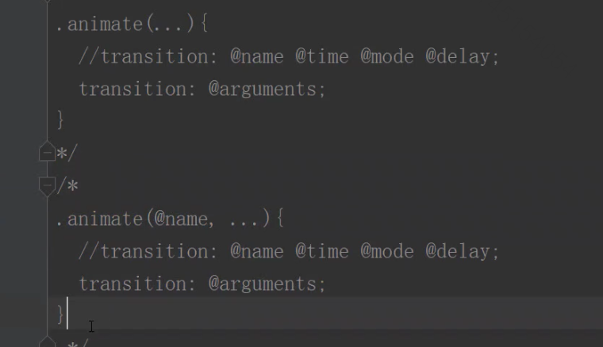

# CSS

---

## 1. 文本属性

### 1.1 缩进

```css
text-index: 2em
```

## 2. 选择器

### 2.1 后代选择器

格式是 选择器1 选择器2

可以是任何选择器 

#### 2.1.1 例子

格式： 标签1 标签2

```html
<!DOCTYPE html>
<html lang="en">
<head>
    <meta charset="UTF-8">
    <title>Title</title>
    <style>
        div p {
            color: red;
        }
    </style>
</head>
<body>
<p>段落</p>
<div>
  <!--只有这些P会亮 -->
    <p>段落1</p>
    <p>段落2</p>
    <p>段落3</p>
    <p>段落4</p>
</div>
</body>
</html>
```

#### 2.1.1 注意点

孙子也算 只要符合就可以 比如格式是

div -> p -> span 通过选择器 div span 一样可以查找到

```html
<!DOCTYPE html>
<html lang="en">
<head>
    <meta charset="UTF-8">
    <title>Title</title>
    <style>
        div span {
            color: red;
        }
    </style>
</head>
<body>
<p>段落</p>
<div>
    <p>段落1</p>
    <p>段落2</p>
    <p>段落3</p>
  <!-- 只有span会red-->
    <p>段落4 <span>span</span></p>
</div>
</body>
</html>
```

### 2.2 子元素选择器

**直接**子元素 和后代不同 不包含孙子。

选择器1 > 选择器2   **不可以用空格必须直接用>相连**

```html
<!DOCTYPE html>
<html lang="en">
<head>
    <meta charset="UTF-8">
    <title>Title</title>
    <style>
        div > p{
            color: red;
        }
    </style>
</head>
<body>
<p>兄弟</p>
<div>
    <p>儿子</p>
    <ul>
        <li><p>孙子</p></li>
    </ul>
</div>
<p>兄弟</p>
</body>
</html>

```

### 2.3 交集选择器

选择器1选择器2

直接相连没有任何符号包括空格

```html
<style>
        p.p1{
            color: red;
        }
</style>

		<p>1</p>
    <p>2</p>
    <p>3</p>
    <p class="p1">4</p>
    <p class="p1">5</p>
```

### 2.4 并集选择器

选择器1,选择器2

```html
<style>
    p,.p1{
        color: red;
    }
</style>
  <p>1</p>
    <p>2</p>
    <p>3</p>
    <span class="p1">4</span>
    <span class="p1">5</span>
```

### 2.5 兄弟选择器

#### 2.5.1 相邻兄弟选择器 

只有相邻的第一个兄弟会被选中，**并且向下兄弟向上无效**

选择器1+选择器2

```html
<style>
        h1+p{
            color: red;
        }
 </style>
<h1>标题</h1>
<!-- 只有第一行会变化-->
<p>内容</p>
<p>内容</p>
<p>内容</p>
<h1>标题</h1>
<!-- 只有第一行会变化-->
<p>内容</p>
<p>内容</p>
<p>内容</p>
```

#### 2.5.2 通用兄弟选择器

只要前面出现了就可以不需要相邻，但是必须是兄弟

选择器1~选择器2

```html
<style>
    h1~p{
        color: red;
    }
</style>
<h1>标题</h1>
<!-- 不影响-->
<a href="">asdasd</a>
<p>内容</p>
<p>内容</p>
<p>内容</p>
<h1>标题</h1>
<p>内容</p>
<p>内容</p>
<p>内容</p>
```

### 2.6 序选择器

CSS3 新增选择器

很多，具体用的时候查文档

#### 2.6.1 同级别的第几个

针对每一个级别里面都选中某一个

标签:逻辑

**逻辑有很多种 距离first-child 这里两个级别的第一个p都会被选中**

```html
<style>
    p:first-child{
        color: red;
    }
</style>
<p>段落1</p>
<p>段落1</p>
<div>
    <p>段落2</p>
    <p>段落2</p>
</div>
```

#### 2.6.2 同级别并且同类型 

类似只是改成

first-of-type

### 2.7 属性选择器

选择具有**某种属性**的标签

选择器[属性]  or 选择器[属性=value] 

```html
		<style>
        p[class]{
            color: red;
        }
    </style>

<p>1</p>
<p class="aa">2</p>
<p class="bb">3</p>
<p>4</p>
```

#### 2.7.1 常用场景

imput标签 一般input的type会不同 可以通过这种方法快速选中需要的

#### 2.7.2 模糊查询

有类似以什么开头什么结尾包含什么的 用的时候查文档

举一个例子

```html
img[alt^=aaa]{
    color: red;
}


```

### 2.8 伪元素选择器

在一个元素的**内容**前或者后添加内容

```html
div::before{
    content: "添加的内容";
    display: block;
    background-color: red;
}
<div>
    内容
</div>
```

## 3. 继承性

只有color/font-/text-/line开头的才可以继承

## 4.行内块级元素

* 不独占一行
* 可以设置宽度和高度

## 5. background

**background-attachment** 默认图片随着滚动，可以设置为 scroll 或者 fixed

连写：

**background: 背景颜色 背景图片 平铺方式 关联方式 定位方式。**

## 6. 盒子模型

#### 6.1 内容的宽度和高度

**weight** 和 **height** 设置的高度。

#### 6.2 元素的宽度和高度

整个边框内（除了外边距）

#### 6.3 元素的空间宽度和高度

整合盒子模型的大小 内外边距都包括

#### 6.4 注意点

* 增加padding属性元素的宽高也会增加

**box-sizing： boarder-box;** 可以保证添加了padding或者border后仍然不改变元素宽高

#### 6.5 居中问题

**盒子**嵌套在盒子中 那么可以使用 margin：0 auto； 让盒子**自己 ** **来水平居中**

text-align: center; 可以用来设置**盒子里面的**文字和img的居中

## 7. 浮动流

**float** 可以设置该元素和父元素（左或者右）对齐，只能设置**水平排版** 并且**没有居中**。 

* 浮动流不可以使用 margin:0 auto;

* 浮动流不区分行内块级元素的，都可以水平排版

* 浮动流中无论什么元素都可以设置宽高 类似**inline-block**

* **设置了浮动流那么这个元素会脱离标准流**

* 相同方向的浮动 先浮动前面后浮动靠着在后面

* **浮动流的排版和他在标准流中的位置来确定的**  就是在开始浮动的那一瞬间他在标准流的哪一行他就在哪一行

* ```html
  <!DOCTYPE html>
  <html lang="en">
  <head>
      <meta charset="UTF-8">
      <title>Title</title>
      <style>
          .box1{
              width: 100px;
              height: 100px;
              background-color: red;
              float: left;
          }
  
          .box2{
              width: 200px;
              height: 200px;
              background-color: blue;
              float: left;
          }
          .box3{
              width: 150px;
              height: 150px;
              background-color: pink;
          }
          .box4{
              width: 150px;
              height: 150px;
              background-color: black;
          }
      </style>
  </head>
  <body>
  <div class="box1"></div>
  <div class="box3"></div>
  <div class="box4"></div>
  <div class="box2"></div>
  </body>
  </html>
  ```

  

上图中 1 和 4 浮动 ：

* 1开始浮动的时候是在第一行，4开始浮动的时候是在第3行（因为1脱标 其他都上去了）

#### 7.1 贴靠现象

如果某个浮动的标签不够他浮动的位置，那么就开始从**上一个贴靠元素**向前寻找足够贴靠的元素贴靠一直到找到**父元素**

#### 7.2 字围效果

浮动的图片不会遮挡住不浮动的文字。自动效果。

#### 7.3 高度问题

浮动流的元素是无法撑起父元素高度的，标准流可以撑起。

#### 7.4 清除浮动

场景和方法1

如果一个盒子内部的元素全部都是浮动的，那么可以给这个盒子设置一个高度，否则在所有的内容浮动了后盒子会没有高度，那么会被下一个盒子在标准流中占据，从而出现很诡异的现象。（不推荐，能不写高度就不写）

方法2

**clear：both；** 后面的盒子添加这个属性，让这个盒子不去寻找上一个的浮动元素，这样不会写在同一行。

方法3 

外墙法，在两个盒子中间添加一个额外的块级元素 添加上 **clear：both；** 外墙法可以让第二个盒子使用margin-top，第一个盒子不可以使用 margin-bottom

内墙法，在第一个盒子中末尾添加一个块级元素 设置同上。

**注意点**：内墙法可以撑起第一个盒子的告诉


方法4 通过伪元素来添加一个墙。

```css
div::after{
  content: '';
  height: 0;
  display: block;
  visibility: hidden;
  cleaer: both;
}
```


#### 7.5 margin-top 失效

如果子元素是想和父元素拉开margin的距离。父元素没有边框 那么子元素会让父元素一起拉下来 ，解决办法就是给父元素加边框。（实际开发不适用）

实际开发使用： 给外面的容器添加一个 **overflow：hidden;**

## 8 定位流

### 8.1 相对定位

相对于标准流的位置进行上下左右的偏倚

**相对定位不会脱离标准流**

```css
.box2{
    background-color: pink;
    height: 100px;
    width: 100px;
    position: relative;
    top: 30px;
}
```

**注意点**：

* **同一个方向上只能使用一个**，不能左右一起使用 上下一起使用
* 因为不脱离标准流，所以**会区分元素类型**（行内、块级）
* 给相对定位的元素添加 margin等可能会影响标准流的位置。

### 8.2 绝对定位


#### 8.2.1 注意点

* 脱离标准流
* **不区分元素类型**
* 如果以Body为参考点那么如果有滚动条会出现无法针对整个网页的定位 只会以当前视口定位。
* 绝对定位忽略padding

#### 8.2.2 定位参考点

1. 默认都是body为参考点。无论是否有祖先元素
2. **如果一个 绝对定位的元素有祖先啊，并且祖先也是定为流（除了静态定位），那么这个这个绝对定位的元素会以祖先为参考,并且优先以最近的祖先为基准。**

#### 8.2.3 子绝父相

前提只是：

* 浮动流某一角度也是标准流，因为在浮动了后 他的位置就固定了。
* 一个元素可以既是浮动流也是定为流

这样的话 当浮动了后一个元素就固定了，那么再把它设置为相对定位，那么他是不会有变化的，但是子元素就可以通过设置绝对定位来在父元素的范围内进行移动了

### 8.3 固定定位

* 不区分行内块级
* 脱离标准流
* 固定定位和视口相关 不会随着滚动

### 8.4 覆盖关系

* 默认定位流会盖住标准流
* 默认后面的定位流会盖住前面的定位流
* 从父现象，两个子元素的父元素谁的index值越大谁在前面

**z-index: 1**； 用来控制覆盖，所有的流默认都是0，越高越在上面

## 9. a标签伪类选择器

* link
* visited
* active
* hover

a 标签4中状态时候的，使用和一般CSS一样

```css
a:avtice{
  color: red;
}
```

### 9.1 注意点

* 可以单独出现也可以同时出现
* 如果一起出现有严格的顺序 必须按照上面的顺序。


## 10  过渡模块

**transition-property**: 属性； 告诉系统哪个模块需要执行过渡效果

**transition-duration**: 时间; 告诉系统执行多长，

**两者必须都有才生效**, 同时也要有对应的动画

```html
<!DOCTYPE html>
<html lang="en">
<head>
    <meta charset="UTF-8">
    <title>Title</title>
    <style>
        div{
            width: 100px;
            height: 100px;
            background-color: red;
            transition-property: width;
            transition-duration: 4s;
        }
        div:hover{
            width: 300px;
        }
    </style>
</head>
<body>
<div></div>
</body>
</html>
```

注意点：

* 多属性写在一行 否则后面的覆盖前面的。

## 11. 2D转化模块

**transform:方法（参数）；** 

**scale**(水平，垂直); 进行水平垂直的缩放，参数填写比例

**rotate**(度数) 旋转 默认都是Z轴旋转 也可以改成 rotateY 或者 rotateX需要添加 **perspective** 这个属性相当于是让你离这个div的距离有多近，越近自然旋转效果越明显 **推荐添加到父元素上**

**transform-origin: 0px 0px;**  上面的旋转默认是以中心，这个可以设置中心，两个参数数水平和垂直的像素 相对于这个容器。

## 12 flex布局

**两个重要概念**

1. 开启了flex布局的叫做flex container
2. 里面的**直接子元素** 叫做flex-item

### 12.1 使用

开启布局：添加 display：选项;

flex ： 块级元素

Inline-flex 行内元素

### 12.2 两个轴

* main axis. flex item 默认是沿着主轴排列

* cross axis . 

### 12.3 相关属性

#### 12.3.1 用在container上

flex-flow 省略写法 direction 和 wrap

flex-direction 修改主轴方向

**flex-wrap** 默认所有元素都会在同一行显示 默认会撑开container 可以通过设置修改

* nowarp 不换行
* wrap 换行

**justify-content** 决定了 item在**主轴**上的排布 方式

**align-items** 决定item 在**交叉**轴上的对齐方式 

* normal 如果item没有设置容器高度则拉伸成container的长度

**align-content** **多行**交叉轴上的排布形式 类似 **justify-content** 

#### 12.3.2 用在flex items上

flex

flex-grow 决定如何扩展 只有在 main axis上还有距离的时候才可以使用

flex-basis 设置主轴的大小 其实没啥用

flex-shrink

**order** 排序 可以设置一个值 越小会排前面

align-self 单独决定对齐方式 用来覆盖container的

## 13 column属性

用于排版文字布局

```html
<!DOCTYPE html>
<html lang="en">
<head>
    <meta charset="UTF-8">
    <title>Title</title>
    <style>
        .column{
            column-count: 2;
            column-gap: 20%;
        }
    </style>
</head>
<body>
<div class="column">
    jhkajhdsljk fklajsdf kljaskjdhf kaljshdlkfjha ksldjkfha lkjsdfl adfal sdlfhl asd lfaljsd fkj
    jhkajhdsljk fklajsdf kljaskjdhf kaljshdlkfjha ksldjkfha lkjsdfl adfal sdlfhl asd lfaljsd fkj
    jhkajhdsljk fklajsdf kljaskjdhf kaljshdlkfjha ksldjkfha lkjsdfl adfal sdlfhl asd lfaljsd fkj
    jhkajhdsljk fklajsdf kljaskjdhf kaljshdlkfjha ksldjkfha lkjsdfl adfal sdlfhl asd lfaljsd fkj
    jhkajhdsljk fklajsdf kljaskjdhf kaljshdlkfjha ksldjkfha lkjsdfl adfal sdlfhl asd lfaljsd fkj
</div>
</body>
</html>
```

## 项目实际问题

## 1 背景图片自适应大小

```css
background-size:100% 100%;
background-size: cover;
```

## 2 垂直居中问题

使用flex布局

```css
.box{
  height:300;
  display: flex;
  align-items: center; // cross 轴居中
  justify-content:center; // 主轴居中
}
```


# LESS

---

## 1. 使用

* 引入less.js

* 创建文件直接创建.less 文件

* 引入到HTML中需要表明是less文件

  ```html
      <link rel="stylesheet/less" href="css/index.less">
  ```

### 1.1 注意点

* 一定要先引入**自己写**的less文件 再引入less.js。
* 默认**需要服务器环境**才可以打开，比如webstore默认就是，如果直接点开index.html是无效的

## 2. 注释

单行注释编译后会消失

## 3. 变量

@ 来书写语法

```less
@w: 200px;
@h: 200px;

.box1{
  width: @w;
  height: @h;
  background-color: blue;
}

.box2{
  width: @w;
  height: @h;
  background-color: red;
}
```

### 3.1 作用域

1. 和其他语言一样 **有块级作用域**，同时也有CSS的特性 **层叠性 优先更近的**
2. **有延迟性 放在后面也可以**。

### 3.2 变量插值

如果属性也想要用变量，那么就需要用变量插值 语法如下

```less
@size: 200px;
@w: width;

.box{
  //中括号
  @{w}:@size;
  height: 200px;
  background-color: red;
}
```

## 4. 运算

支持简单的加减乘除

语法

```less
margin-left: (-200px * 0.5);
```

## 5. 混合

就是相当于把一个CSS块当做一个变量来使用

```less
// center作为一个类
.center{
  position: absolute;
  left: 50%;
  top: 50%;
  transform: translate(-50%, -50%);
}
// box也作为一个类
.box{
  width: 200px;
  height: 200px;
}

.box2{
  width: 100px;
  height: 100px;
  // 这里使用
  .center;
  background-color: blue;
}

.box1{
  //这里使用
  .box;
  .center;
  background: red;
}
```

### 5.1 混合类可以添加()也可以不添加

编译后略有区别

### 5.2 可以带参数

```less
.whc(@w,@h,@c){
  width: @w;
  height: @h;
  background-color: @c;
}

.box3{
  .whc(400px,500px,pink);
}
```

### 5.2 可以带默认值和选择性赋值

需要设置默认值，并且制定赋值

```less
.wch(@w: 200px,@h: 200px,@c: blue){
  width: @w;
  height: @h;
  background-color: @c;
}

.box{
  //这里指定
  .wch(@c: red)
}
```

### 5.3 也可以用 ...代表可变参数

例子略，一般用于多个参数的 比如 transition



搭配使用表示**至少**需要前面的参数，后面的可变

### 5.4 混合模式

类似java的方法，有不同参数的方法

```less
.triangle(down,@w,@color){
  width: 0;
  height: 0;
  border-width: @w;
  border-style: solid solid solid solid;
  border-color: @color transparent transparent transparent;
}

// 可以通过在前面添加一个字符串做匹配
.triangle(up,@w,@color){
  width: 0;
  height: 0;
  border-width: @w;
  border-style: solid solid solid solid;
  border-color: transparent transparent @color transparent;
}

// 调用的时候用字符串前缀来表明是调用了哪个
.box{
  .triangle(up,50px,green);
}
```

#### 5.4.1 通用匹配

有些重复代码可以放出来用通用来执行，会在所有的匹配之前执行

```less
// @_ 来表示通用匹配
.triangle(@_,@w,@color){
  width: 0;
  height: 0;
  border-style: solid solid solid solid;
}


.triangle(down,@w,@color){
  border-width: @w;
  border-color: @color transparent transparent transparent;
}

.triangle(up,@w,@color){
  border-width: @w;
  border-color: transparent transparent @color transparent;
}

.box{
  .triangle(up,50px,green);
}
```

## 6. 导入文件

```less
@import "匹配模式";

.box{
  .triangle(up,50px,black);
}
```

## 7. 内置函数

http://lesscss.org/#functions

## 8. 层级关系

默认写在大括号里面的全部都是**后代选择器**

所以有的时候可以+上其他的在前面 &的作用就是告诉编译器不要用后台拼接，而是直接拼接

相当于 a :hover 和a:hover 的区别 有空格

## 9. 继承

基本一样 没啥区别语法如下

```less
.center{
  position: absolute;
  left: 50%;
  top: 50%;
  transform: translate(-50%, -50%);
}


.father:extend(.center){
  width: 200px;
  height: 200px;
  background-color: red;
  .son:extend(.center){
    width: 100px;
    height: 100px;
    background-color: blue;
  }
}
```

## 10. 逻辑判断

1. 使用when 大部分常规判断都可以
2. 判断相等使用= 而不是 == or ===


### 10.1 普通Boolean

```less
.size(@w,@h) when (@w = 50px){
  width: @w;
  height: @h;
}

.box{
  .size(50px,50px);
  background-color: red;
}
```

### 10.2 或于运算

, 分割 于就是 and

```less
.size(@w,@h) when (@w = 50px),(@h = 50px){
  width: @w;
  height: @h;
}

.box{
  .size(510px,50px);
  background-color: red;
}
```

### 10.3 用内置函数判断

比如 isNumber 这一类的

# SASS

----

