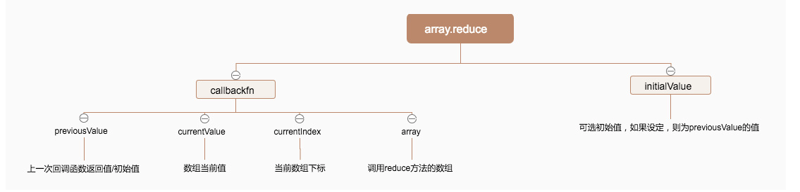

# ES6

## 1. 变化

### 1.1 变量

* let 不能重复声明，可以修改
* const 不能重复声明，不可以修改
* var 可以重复声明 可以修改 没有块级作用域
* **let是块级作用域**

### 1.2 函数

#### 1.2.1 箭头函数

* 如果只有参数 小括号可以省略

  ```javascript
  let show = a =>{
    return a * 2;
  }
  ```

* 如果只有一行return 大括号也可以省略

  ```javascript
  let show = a => a * 2; // 这里是也只有一个参数 否则小括号不可以省略
  ```


#### 1.2.2 参数省略

* args**必须是最后一个参数**，args是一个**数组**，所有的剩余数据存放在这个数组里面
* 变量名随便

```javascript
function show (a,b, ...args){
  aleart(args);
}
```

#### 1.2.3 参数扩展

* 相当于是直接把数组展开了放在引用的地方

```javascript
let arr1 = [1,2,3];
let arr2 = [4,5,6];

let arr= [...arr1, ...arr2];
```

#### 1.2.4 默认参数

```javascript
function show(a, b = 5,c = 12){
  console.log(a,b,c);
}
```

#### 1.2.5 解构赋值

* 左右两边必须一样
* 右边必须是具体值且合法
* 赋值和解构必须在一行

```javascript
let [a,b,c] = [1,2,3];
// json
let {a, b, c} = {a : 12 , c : 5, d: 6}
```


### 1.3 数组

#### 1.3.1 map

多个返回多个

相当于是


```javascript
let arr = [12, 4, 5];
let result = arr.map(function(item){
  return item * 2;
})
```

#### 1.3.2 reduce

多个返回一个



左边的四个参数按顺序可以在回调函数里面直接获得

#### 1.3.2.1 例子

累计计算一个数组的和

```js
arr.reduce((preValue, item) => {
    return preValue + item.count * item.price
}
// 这里每次计算完prevalue获得上一次计算的结果 然后再加上这次的。
```


#### 1.3.3 filter

过滤数组 需要给过滤函数

例子：

```javascript
let result = arr.filter(item => {
  if(item > 60) return true;
  else return false;
})
```

```javascript
let arr =[
	{title: '男士衬衫', price : 75},
  {title: '女士衬衫', price : 7232325},
  {title: '男士包包', price : 75},
  {title: '女士包包', price : 75454},
]

let result = arr.filter(json => json.price >= 10000);
```

#### 1.3.4 foreach forof forin

* foreach 和 for of都是拿到值 或者（key在map中） for in 是拿到index

### 1.4 字符串

#### 1.4.1 startsWith & endsWith

返回boolean 用于判断是否是以什么开头或者结尾的。

* 判断邮箱结尾
* 判断文件类型

#### 1.4.2 字符串模板

* 可以换行
* 可以放变量 ${变量}

### 1.5 面向对象

#### 1.5.1 基础案例 创建 + 继承

```html
<!DOCTYPE html>
<html lang="en">
<head>
    <meta charset="UTF-8">
    <title>Title</title>
</head>
<body>
<script>
    class User{
        constructor(name, pass) {
            this.name = name;
            this.pass = pass;
        }

        showName(){
            alert(this.name);
        }

        showPass(){
            alert(this.pass);
        }
    }
	// 继承
    class VipUser extends User{
        constructor(name, pass, level) {
            super(name, pass);
            this.level = level;
        }

        showLevel(){
            alert(this.level);
        }
    }

    let vipUser = new VipUser('bohan',"sds",23);
    vipUser.showLevel();
    vipUser.showName();
    vipUser.showPass();
</script>

</body>
</html>

```

### 1.6 json

json的类型 （字符串形态的时候）

*  只能用双引号

* 所有的名字都必须用引号包起来

  ```javascript
  
  ```

  

#### 1.6.1 常用方法

##### 1.6.1.1 stringify & parse

```html
<!DOCTYPE html>
<html lang="en">
<head>
    <meta charset="UTF-8">
    <title>Title</title>
</head>
<body>
<script>
    let json = {a: 12, b:23};
    //注意命名规范
    let str = '{"a":12, "b":"abc"}';
    alert(JSON.stringify(json));
    console.log(JSON.parse(str));
</script>

</body>
</html>

```

#### 1.6.2 json 的简写

* ES6中名字和值一样可以只写一个
* 方法 可以function和‘：’一起删掉

### 1.7 Promise

遇到层级的异步请求，比如先去请求所有电源，然后拿到分类，然后拿到每个电影的详细。这里可以用then来进行下一次的异步请求。**用同步的方法来书写异步的请求**。

#### 1.7.1 简单案例

* 异步代码需要写在里面
* 异步的执行了两个Promise 然后 如果都成功。。。如果都失败。。。。
* 传入resolve的参数，就是then里面拿到的参数，实际就是异步操作后 通过resolve来把结果传到下一个链式调用里
* reject就是失败的时候，会通过reject传入catch里面（例子中没有写）。另一种方法直接在then中写入两个函数 第二个就用来代替catch

```html
<!DOCTYPE html>
<html lang="en">
<head>
    <meta charset="UTF-8">
    <title>Title</title>
    <script src="lib/jquery.min.js" charset="utf-8"></script>
    <script>
        let p1 = new Promise(function (resolve, reject) {
            $.ajax({
                url: 'data/arr.txt',
                dataType: 'json',
                success(arr) {
                    resolve(arr);
                },
                error(err) {
                    reject(err);
                }
            })
        });

        let p2 = new Promise(function (resolve, reject) {
            $.ajax({
                url: 'data/json.txt',
                dataType: 'json',
                success(arr) {
                    resolve(arr);
                },
                error(err) {
                    reject(err);
                }
            })
        });


        Promise.all([
            p1,p2
        ]).then(function (arr) {
          //这里的arr是返回的结果的总和 可以用解构赋值来完成
            let [res1, res2] = arr;
            alert("all success");
            console.log(res1, res2);
        },function () {
            alert("at least one failed")
        })
    </script>
</head>
<body>

</body>
</html>

```

#### 1.7.2 jquery的合作

**高版本**的jquery的返回值就是promise对象。

#### 1.7.3 实际写法

```javascript
Promise.all([$.ajax(), $.ajax()]).then(results=>{
  //成功
},err=>{
  // 错误
})
```

#### 1.7.4 其他用法

race 替换 all 哪个成功就先优先用哪个。

### 1.8 generator

普通函数：不能停

generator函数：中间可以停

相当于打一个断点 用 **yield**来断点

```html
<!DOCTYPE html>
<html lang="en">
<head>
    <meta charset="UTF-8">
    <title>Title</title>
</head>
<body>
<script>
  // 需要 + *
    function *show() {
        alert('a');
        yield;
        alert('b');
    }
    let show1 = show();
  // 一次next就可以前进一次
    show1.next();
    show1.next();
</script>
</body>
</html>

```

#### 1.8.1 yield传参

* 第一个next里面无法传参

  ```html
  <!DOCTYPE html>
  <html lang="en">
  <head>
      <meta charset="UTF-8">
      <title>Title</title>
  </head>
  <body>
  <script>
      function *show() {
  
          alert('a');
          let a = yield;
          alert('b');
          alert(a);// 结果是34
      }
      let show1 = show();
      show1.next(123);// 第一个next不能给里面传参
      show1.next(34);
      
  </script>
  </body>
  </html>
  
  ```

  

* 可以有返回值

  ```javascript
     function *show() {
  
          alert('a');
          yield 12;
          alert('b');
          return 23;
      }
      let show1 = show();
      let next = show1.next(123);// 第一个next不能给里面传参
      console.log(next);
      let next1 = show1.next(34);
      console.log(next1);
  ```

  


### 1.9  模块化

导入的时候添加 type=“module”

导出 

* 使用expoart 导出的是对象， 也可以直接导出一个变量。

导入

*  使用 import 导入的是对象里面属性（属性也可以是对象）

#### 1.9.1 export default

可以让引用者自己命名 **默认的只可以有一个**。

#### 1.9.2 统一全部导入

所有的导入封装成一个对象

```js
import * as aaa from './aaa.js'

console.log(aaa.flag);
```

#### 1.9.3 注意点

* 如果导入一个文件夹 则默认导入这个文件夹里面的index.js