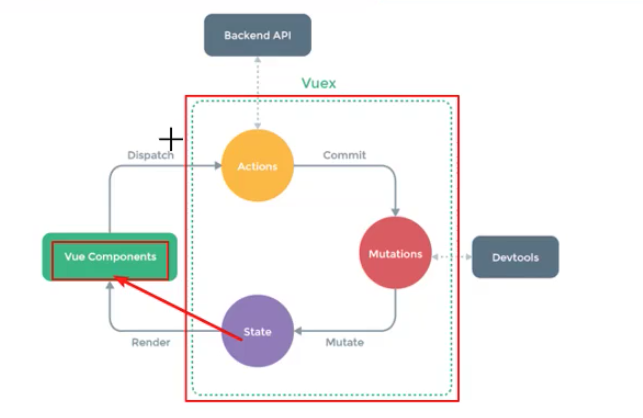
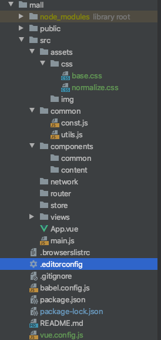

# Vue

## 1. 开发环境

### 1.1 cdn

```html
<script src="https://cdn.bootcss.com/vue/2.6.11/vue.common.dev.js"></script>
```

## 2. 简单案例

```html
<!DOCTYPE html>
<html lang="en">
<head>
    <meta charset="UTF-8">
    <title>Title</title>
</head>
<body>

<!-- view层 -->
<div id="app">
    {{message}}
</div>


<!-- 导入Vue.js -->
<script src="https://cdn.bootcss.com/vue/2.5.21/vue.js"></script>
<script>
    let vm = new Vue({
        el:"#app",
        data:{
            message:"hello,vue!"
        }
    })
</script>
</body>
</html>
```

### 2.1 动态生成 

加了一层 MVVM 有一层中间层用来双向连接所以可以实现动态的改变。

虚拟Dom, dom放在内存里 随时更新 速度很快

## 3. 语法

### 3.1 指令

v-开头的一般都是指令

#### 3.1.1 v-bind

相当于用一个变量绑定了这个属性，可以直接用：来省略代表

```html
<div id="app">
    {{message}}
    <span v-bind:title="message">
        悬停
    </span>
</div>
```

例子：

```html
<!DOCTYPE html>
<html lang="en">
<head>
    <meta charset="UTF-8">
    <title>Title</title>
    <script src="../js/vue.js"></script>
</head>
<style>
    .active{
        color: red;
    }
</style>
<body>
<div id="app">
    <h2 :class="{active: isActive, line: true}">{{message}}</h2>
    <button v-on:click="btnClick">click</button>
</div>
<script>
    let app = new Vue({
        el:'#app',
        data: {
            message:"hello, vue",
            isActive: false
        },
        methods: {
            btnClick: function () {
                this.isActive = !this.isActive;
            }
        }
    });
</script>
</body>
</html>

```

```html
<!DOCTYPE html>
<html lang="en">
<head>
    <meta charset="UTF-8">
    <title>Title</title>
    <script src="../js/vue.js"></script>
</head>
<style>
    .active{
        color: red;
    }
</style>
<body>
<div id="app">
    <h2 :style="{fontSize: fontSize + 'px'}">{{message}}</h2>
    <h2 :style="getStyles()">{{message}}</h2>
</div>
<script>
    let app = new Vue({
        el:'#app',
        data: {
            message:"hello, vue",
            fontSize: 100
        },
        methods: {
            getStyles : function () {
                return {fontSize: this.fontSize + 'px'};
            }
        }
    });
</script>
</body>
</html>

```


#### 3.1.2 v-if else

```html
<div id="app">
    <h1 v-if="ok">yes</h1>
    <h1 v-else>no</h1>
</div>
```

v-else-if 类似

#### 3.1.3 v-for

* 如果遍历的是对象 那么如果获取一个参数 就是值 如果两个前面是值后面是key 如果三个 则是第三个为index

  ```html
  v-for="value in info"
  v-for="(value, key) in info"
  v-for="(value, key, index) in info"
  ```

* v-for 最好加一个key（官方建议）

  原因是如果有key的时候会增加修改虚拟DOM的效率

```html
<!DOCTYPE html>
<html lang="en" xmlns:v-bind="http://www.w3.org/1999/xhtml">
<head>
    <meta charset="UTF-8">
    <title>Title</title>
</head>
<body>

  
  <!-- 
      <div id="app">
          <li v-for="(item,index) in items">
              {{item.message}}
          </li>
      </div>
  -->

<div id="app">
    <li v-for="item in items">
        {{item.message}}
    </li>
</div>

<!-- 导入Vue.js -->
<script src="https://cdn.bootcss.com/vue/2.5.21/vue.js"></script>
<script>
    let vm = new Vue({
        el:"#app",
        data:{
            items:[
                {message:"11111"},
                {message:"222222"},
                {message:'lalalla'},
            ]
        }
    })
</script>
</body>
</html>
```

##### 3.1.3.1 数组那些是响应式的

并不是所有的数组方法都是响应式的

* push
* pop
* shift 删除第一个
* unshift 数组最前面添加元素
* splice

##### 3.1.3.2 案例

一个list,鼠标点击哪个，哪个变红。

```html
<!DOCTYPE html>
<html lang="en">
<head>
    <meta charset="UTF-8">
    <title>Title</title>
    <script src="../js/vue.js"></script>
</head>
<style>
    .active{
        color: red;
    }
</style>
<body>

<div id="app">
<ul>
    <li v-for="(item,index) in movies" :class="{active: currentIndex === index}"
    @click="liClick(index)"
    >{{item}}</li>
</ul>
</div>
<script>
    let app = new Vue({
        el:'#app',
        data: {
            movies:[
                'aaa','bbb','ccc','dddd'
            ],
            currentIndex: 0
        },
        methods:{
            liClick(index){
                this.currentIndex = index;
            }
        }
    });
</script>
</body>
</html>

```


#### 3.1.4 v-on (methods绑定)

```html
<!DOCTYPE html>
<html lang="en" xmlns:v-bind="http://www.w3.org/1999/xhtml" xmlns:v-on="http://www.w3.org/1999/xhtml">
<head>
    <meta charset="UTF-8">
    <title>Title</title>
</head>
<body>


<div id="app">
    <button v-on:click="sayHi">click</button>
</div>

<!-- 导入Vue.js -->
<script src="https://cdn.bootcss.com/vue/2.5.21/vue.js"></script>
<script>
    let vm = new Vue({
        el: "#app",
        data: {
            message:"lalalal"
        },
        methods: {//必须定义在vue的methods对象中
            sayHi: function (event) {
                alert(this.message);
            }
        }
    }s
</script>
</body>
</html>
```

#### 3.1.5 v-model 双向绑定

* 双向的同时变化，html<---->script
* 原来是js改变界面改变，现在界面改变js也会改变
* checkbox和数组可以直接绑定，选中一个就添加一个进去。

```html
<!DOCTYPE html>
<html lang="en" xmlns:v-bind="http://www.w3.org/1999/xhtml" xmlns:v-on="http://www.w3.org/1999/xhtml">
<head>
    <meta charset="UTF-8">
    <title>Title</title>
</head>
<body>

<!-- 双向的同时变化 -->
<div id="app">
    <input type="text" v-model="message">{{message}}
</div>

<!-- 导入Vue.js -->
<script src="https://cdn.bootcss.com/vue/2.5.21/vue.js"></script>
<script>
    let vm = new Vue({
        el: "#app",
        data: {
            message:"lalalal"
        }
    })
</script>
</body>
</html>
```

##### 3.1.5.1 原理

实际上是一个结合

* 用v-bind 来绑定js到界面
* 用v-on：input 来绑定界面到js


##### 3.1.5.2 修饰符

* lazy input失去焦点的时候再进行赋值 避免浪费

  ```html
  v-model.lazy:xxx
  ```

* number  用来作为类型转换 默认input传输的都是字符串 这个可以固定为数字

  ```html
  v-mdel.number:xxx
  ```

* trim 去除空格 使用同上。

* .nativc 组件本身是无法监听事件的，但是加上这个后就可以监听组件


#### 3.1.5 v-show

和 if 很类似 

* 相同点：都是控制tag是否消失
* 不同点：
  * show 是改变行内的样式 display 是否为 none/show （使用频繁）
  * if 是直接整个tag删掉/添加（只用一次切换）
  * 本质是一个还放在dom中只是改变样式 另一个是直接从dom中移除

用来绑定事件 简写@

### 3.2 vue参数

#### 3.2.1 el

* String HTMLElement

可以字符串，也可以自己选择

```javascript
document.querySelector()
```

#### 3.2.1 data:

* Object | Function

#### 3.2.2 method


### 3.3 插值语法

*  v-once  只渲染一次 不会随着值改变而改变

* v-html 可以解析标签

* v-text 和mustcache一样

* v-pre 不启用mustcache

* v-cloak 解决闪烁问题

  ```html
  <style>
      [v-cloak] {
        display: none;
      }
    </style>
  </head>
  <body>
  
  <div id="app">
    <h2 v-cloak>{{message}}</h2>
  </div>
  
  <script src="../js/vue.js"></script>
  <script>
    setTimeout(() => {
  	  const app = new Vue({
  		  el: '#app',
  		  data: {
  			  message: 'Hello World'
  		  }
  	  })
    }, 2000)
  </script>
  ```

  

## 4. Vue 组件

* 类似其他的框架的组件
* **v-bind作为中间商将两个JS文件(数据 + 模板)结合**
* v-bind后面的变量作为传递方法

```html
<!DOCTYPE html>
<html lang="en" xmlns:v-bind="http://www.w3.org/1999/xhtml" xmlns:v-on="http://www.w3.org/1999/xhtml">
<head>
    <meta charset="UTF-8">
    <title>Title</title>
</head>
<body>


<div id="app">
    <bohan v-for="item in items" v-bind:bianliang="item"></bohan>
</div>

<!-- 导入Vue.js -->
<script src="https://cdn.bootcss.com/vue/2.5.21/vue.js"></script>
<script>
    Vue.component("bohan",{
      //所需的参数 类似函数的传参
       props:['bianliang'],
      // 具体样子 类似JXP
       template:'<li>{{item}}</li>'
    });
    let vm = new Vue({
        el: "#app",
        data: {
            items:['111','222','333']
        }
    })
</script>
</body>
</html>
```

### 4.1 步骤

* 创建template Vue.extend() （现在很少还用extend 一般都直接卸载component里面）
* 注册 Vue.componet()
* 使用

### 4.2 注意点

* component是全局组件 所有的Vue对象都可以使用，在Vue实例里面注册的则是局部的 添加 component属性

### 4.3 例子

```html
<!DOCTYPE html>
<html lang="en">
<head>
    <meta charset="UTF-8">
    <title>Title</title>
    <script src="../js/vue.js"></script>
</head>
<body>
<div id="app">
    <h2>{{message}}</h2>
    <my_title></my_title>
    <my_title></my_title>
    <my_title></my_title>
</div>

<script>
    const cpn = Vue.extend({
        template: `
        <div>
            <h2>我是标题</h2>
            <p>内容啦啦啦啦啦啦</p>
        </div>
        `
    });

    let vue = new Vue({
        el: '#app',
        data: {
            message: "hello Vue"
        },
        components: {
            my_title : cpn
        }
    });
</script>
</body>
</html>
```

### 4.4 父子组件

在某个组件中注册另一个组件，这个组件也是局部的，这样父组件里面可以使用子组件。

其实Vue也可以当做一个根组件

```html
<!DOCTYPE html>
<html lang="en">
<head>
    <meta charset="UTF-8">
    <title>Title</title>
    <script src="../js/vue.js"></script>
</head>
<body>
<div id="app">
    <h2>{{message}}</h2>
    <my_title></my_title>
    <my_title></my_title>
    <my_title></my_title>
</div>

<script>
    const cpn1 = Vue.extend({
        template: `
        <div>
            <h2>我是标题1</h2>
            <p>内容啦啦啦啦啦啦</p>
        </div>
        `
    });
    const cpn2 = Vue.extend({
        template: `
        <div>
            <h2>我是标题2</h2>
            <p>内容啦啦啦啦啦啦</p>
            <cpn1></cpn1>
            <cpn1></cpn1>
            <cpn1></cpn1>
        </div>
        `,
        //在组件2中注册组件1 这样在组件1的模板里面同样可以引用组件1
        components: {
            cpn1 : cpn1
        }
    });

    let vue = new Vue({
        el: '#app',
        data: {
            message: "hello Vue"
        },
        components: {
            my_title : cpn2
        }
    });
</script>
</body>
</html>
```

### 4.5 模板的分离写法

* 第一种略

* 第二中可以用template tag直接在body 里的 script 里面写

  ```html
  <!DOCTYPE html>
  <html lang="en">
  <head>
      <meta charset="UTF-8">
      <title>Title</title>
      <script src="../js/vue.js"></script>
  </head>
  <body>
  <div id="app">
      <h2>{{message}}</h2>
      <my-title></my-title>
  </div>
  
  <template id="myTemplate">
      <div>
          <h1>标题</h1>
          <p>context</p>
      </div>
  </template>
  <script>
  
      Vue.component("my-title", {
          template: '#myTemplate'
      })
  
      let vue = new Vue({
          el: '#app',
          data: {
              message: "hello Vue"
          },
      });
  </script>
  </body>
  </html>
  ```

### 4.6 组件通信

就是传值

* 组件不能访问Vue的实例的变量，本质是因为vue的实例其实是根组件，属于底层想访问上层的数据
* 每个组件有自己的data ，是一个方法而不是一个对象，因为如果是对象则所有创建的这个组件都是用的同一个数据对象，那么一改则都改，用方法则是相当于新建了自己的对象拥有自己的作用域。

```html
<!DOCTYPE html>
<html lang="en">
<head>
    <meta charset="UTF-8">
    <title>Title</title>
    <script src="../js/vue.js"></script>
</head>
<body>
<div id="app">
    <cpn></cpn>
</div>
<template id="myCpn">
    <div>
        <h2>当前计数:{{counter}}</h2>
        <button @click="increment">+</button>
        <button @click="decrement">-</button>
    </div>
</template>
<script>
    Vue.component('cpn',{
        template: '#myCpn',
        // 用函数返回对象
        data(){
            return{
                counter: 0
            }
        },
        methods: {
            increment(){
                this.counter ++;
            },
            decrement(){
                this.counter --;
            }
        }
    });

    let app = new Vue({
        el: '#app',
        data:{
            message: "hello Vue"
        }
    });
</script>
</body>
</html>

```

#### 4.6.1 父子之间通信

##### 4.6.1.1 第一种方法 用数组

* 父到子 props **变量用字符串来表示**

  ```html
  <!DOCTYPE html>
  <html lang="en">
  <head>
      <meta charset="UTF-8">
      <title>Title</title>
      <script src="../js/vue.js"></script>
  </head>
  <body>
  <div id="app">
      <!-- 这里通过v-bind来绑定父子-->
      <cpn :cmovies="movies" :cmessage="message"></cpn>
  </div>
  
  <template id="myCpn">
      <div>
          <ul>
              <li v-for="item in cmovies">{{item}}</li>
          </ul>
          <hr>
          <p>{{cmessage}}</p>
      </div>
  </template>
  <script>
      const cpn = {
          template: '#myCpn',
          // 创建子类需要的变量 字符串就是变量
          props: ['cmovies','cmessage']
      }
  
      let app = new Vue({
          el: '#app',
          data:{
              message: "hello Vue",
              movies: [
                  'aaa','vvv','cccc'
              ]
          },
          components: {
              cpn
          }
      });
  </script>
  </body>
  </html>
  ```

  

* 子到父 event (这里在HTML里面的时候不需要写带参数)

  补充：如果想监听原生的时间 比如 click load等需要添加.native
  
  ```vue
  <item @click.native="methods"></item>
  ```
  
  
  
  ```html
  <!DOCTYPE html>
  <html lang="en">
  <head>
      <meta charset="UTF-8">
      <title>Title</title>
      <script src="../js/vue.js"></script>
  </head>
  <body>
  <div id="app">
      <!-- 这里通过v-bind来绑定父子-->
      <!-- 这里来监听自定义事件 -->
      <cpn :cmovies="movies" :cmessage="message" @item-click="childClick"></cpn>
  </div>
  
  <template id="myCpn">
      <div>
          <ul>
              <li v-for="item in cmovies" @click="itemClick(item)">{{item}}</li>
          </ul>
          <hr>
          <p>{{cmessage}}</p>
      </div>
  </template>
  <script>
      const cpn = {
          template: '#myCpn',
          // 创建子类需要的变量 字符串就是变量
          // props: ['cmovies','cmessage']
          props: {
              cmovies: {
                  type: Array,
                  // 需要注意 这里和data一样必须要用函数返回
                  default(){
                      return ['default elements'];
                  }
              },
              cmessage: {
                  type: String,
                  default: 'default message'
              }
          },
          methods: {
              // 创建事件触发调用的方法（自定义事件）
              itemClick(item){
                  // 通过emit来通知父组件事件触发了
                  this.$emit('item-click',item);
              }
          }
      }
  
      let app = new Vue({
          el: '#app',
          data:{
              message: "hello Vue",
              movies: [
                  'aaa','vvv','cccc'
              ]
          },
          components: {
              cpn
          },
          methods: {
              childClick(item){
                  console.log(item);
              }
          }
      });
  </script>
  </body>
  </html>
  
  ```

##### 4.6.1.2 第二种 用object

可以限制参数类型和设置默认值,是否必须

```html
<!DOCTYPE html>
<html lang="en">
<head>
    <meta charset="UTF-8">
    <title>Title</title>
    <script src="../js/vue.js"></script>
</head>
<body>
<div id="app">
    <!-- 这里通过v-bind来绑定父子-->
    <cpn :cmovies="movies" :cmessage="message"></cpn>
</div>

<template id="myCpn">
    <div>
        <ul>
            <li v-for="item in cmovies">{{item}}</li>
        </ul>
        <hr>
        <p>{{cmessage}}</p>
    </div>
</template>
<script>
    const cpn = {
        template: '#myCpn',
        // 创建子类需要的变量 字符串就是变量
        // props: ['cmovies','cmessage']
        props: {
            cmovies: {
                type: Array,
                // 需要注意 这里和data一样必须要用函数返回
                default(){
                    return ['default elements'];
                }
            },
            cmessage: {
                type: String,
                default: 'default message'
            }

        }
    }

    let app = new Vue({
        el: '#app',
        data:{
            message: "hello Vue",
            movies: [
                'aaa','vvv','cccc'
            ]
        },
        components: {
            cpn
        }
    });
</script>
</body>
</html>

```

##### 4.6.1.3 注意

如果是驼峰的变量，那么在HTML 标签里面用v-bind绑定的话 需要用 - 来分割并且都用小写。

#### 4.6.2 父子访问

直接拿到对象，从而可以操作更多 比如获得方法。

##### 4.6.2.1 父到子

* $children用的少

  ```html
  <!DOCTYPE html>
  <html lang="en">
  <head>
      <meta charset="UTF-8">
      <title>Title</title>
      <script src="../js/vue.js"></script>
  </head>
  <body>
  <div id="app">
      <cpn></cpn>
      <button @click="btnClick">button</button>
  </div>
  <template id="cpn">
      <div>子组件</div>
  </template>
  <script>
      let app = new Vue({
          el: '#app',
          data:{
              message: "hello Vue"
          },
          components: {
              cpn:{
                  template: '#cpn',
                  methods: {
                      showMessage(){
                          console.log("message from child");
                      }
                  }
              }
          },
          methods: {
              btnClick(){
                  // 通过$children 来获取所有的children
                  this.$children[0].showMessage();
              }
          }
      });
  </script>
  </body>
  </html>
  ```

* $refs获取

  1. 在子组件添加ref
  2. 通过refs获取

  ```html
  <!DOCTYPE html>
  <html lang="en">
  <head>
      <meta charset="UTF-8">
      <title>Title</title>
      <script src="../js/vue.js"></script>
  </head>
  <body>
  <div id="app">
      <cpn></cpn>
      <cpn ref="aaa"></cpn>
      <cpn></cpn>
      <button @click="btnClick">button</button>
  </div>
  <template id="cpn">
      <div>子组件</div>
  </template>
  <script>
      let app = new Vue({
          el: '#app',
          data:{
              message: "hello Vue"
          },
          components: {
              cpn:{
                  template: '#cpn',
                  methods: {
                      showMessage(){
                          console.log("message from child");
                      }
                  }
              }
          },
          methods: {
              btnClick(){
                  // 通过$children 来获取所有的children
                  // this.$children[0].showMessage();
  
                  //通过$refs 是一个对象 默认是空的
                  this.$refs.aaa.showMessage();
              }
          }
      });
  </script>
  </body>
  </html>
  
  ```


##### 4.6.2.2 子到父

类似，用$parent 获取,**用的很少**

$root 类似 获取最高层root的对象 是一个Vue实例

```html
<!DOCTYPE html>
<html lang="en">
<head>
    <meta charset="UTF-8">
    <title>Title</title>
    <script src="../js/vue.js"></script>
</head>
<body>
<div id="app">
    <cpn></cpn>
    <cpn ref="aaa"></cpn>
    <cpn></cpn>

</div>
<template id="cpn">
    <div>
        <div>子组件</div>
        <button @click="btnClick">button</button>
    </div>
</template>
<script>
    let app = new Vue({
        el: '#app',
        data:{
            message: "hello Vue"
        },
        components: {
            cpn:{
                template: '#cpn',
                methods: {
                    btnClick(){
                        this.$parent.showMessage();
                    }
                }
            }
        },
        methods: {
            showMessage(){
                console.log("message from root");
            }
        }
    });
</script>
</body>
</html>

```

#### 4.6.3 补充：非父子之间通信

这里使用bus做介绍，相当于一个公共频道 谁都可以发送事件 任何人也可以监听某个时间

1. 创建bus 脚手架内可以直接安装

   ```bash
   npm install vue-bus --save
   ```

2. 导入并且使用

   ```js
   import bus from 'vue-bus'
   Vue.use(bus);
   ```

3. 发送事件和监听事件

   ```js
   this.$bus.$emit('eventName',params);
   this.$bus.$on('eventName',() => {
     //回调函数
   })
   ```

   

## 5. 网络通信

### 5.1 安装

```bash
npm install axios --save
```

#### 5.1.1 设置默认路径

```js
axios.defaults.baseUrl = 'xxxxxx';
axios.defaults.timeout = 5000;
```


### 5.1 Axios

* 这里使用了钩子函数 **mound()** 

用于浏览器和nodejs之间的异步操作，就是Ajax。

### 5.2 例子

* 使用json进行AJAX通信，例子直接调用后台json文件的数据并且绑定给data中的数据
* 因为el已经绑定了 所以可以直接调用

#### 5.2.1 json

```json
{
  "name": "bohan",
  "url": "https://www.wayne.edu",
  "page": 1,
  "inNonProfit": true,
  "address": {
    "street": "4747 Anthony Wayne Dr",
    "city": "Detroit",
    "country": "USA"
  },
  "links": [
    {
      "name": "bilibili",
      "url": "https://www.bilibili.com/video/BV18E411a7mC?p=9"
    },
    {
      "name": "狂神说Java",
      "url": "https://www.bilibili.com/video/BV18E411a7mC?p=9"
    },
    {
      "name": "lalala",
      "url": "https://www.bilibili.com/video/BV18E411a7mC?p=9"
    }
  ]
}

```

#### 5.2.2 HTML

```html
<!DOCTYPE html>
<html lang="en" xmlns:v-bind="http://www.w3.org/1999/xhtml" xmlns:v-on="http://www.w3.org/1999/xhtml"
      xmlns:v-bond="http://www.w3.org/1999/xhtml">
<head>
    <meta charset="UTF-8">
    <title>Title</title>
</head>
<!-- 解决闪烁问题 -->
<style>
    [v-clock]{
        display: none;
    }
</style>
<body>


<div id="app">
    <div>{{info.name}}</div>
    <a v-bind:href="info.url">click</a>
</div>

<!-- 导入Vue.js -->
<script src="https://cdn.bootcss.com/vue/2.5.21/vue.js"></script>
<script src="https://unpkg.com/axios/dist/axios.min.js"></script>
<script>
    let vm = new Vue({
        el: "#app",
        mounted(){//钩子函数 链式编程
            axios.get('../static/data.json').then(response=>(this.info=response.data));
        },
        data(){
            return{
                info:{
                    name:null,
                    url:null,
                    address:{
                        street:null,
                        city:null,
                        county:null
                    }
                }
            }
        },
    })
</script>
</body>
</html>

```

### 5.3 创建实例

* 有的时候公共的配置不止一套 比如访问地址，所以需要创建多个实例


```js
let instance = axios.create({
  // config
});
```

### 5.4 封装工具类

* 为什么？ 因为不封装则需要对所有的文件进行引用并且一旦需要更换框架那么需要对所有引用文件进行重新引用
* 封装后，只需要在封装文件里面更改，对项目只暴露一个API 具体实现无所谓。

这里两个版本 简单版本 和 promise版本（一共两个推荐第二个）

```js
import axios from 'axios'

// 进行封装
export function request(config) {

  let instance = axios.create({
    baseURL: 'http://123.207.32.32:8000',
    timeout: 5000
  });

  instance(config.baseConfig)
    .then(res => {
    config.success(res);
  }).catch(err => {
    config.failure(err);
  })

}


export function requestPromise(config) {
  // 相当于返回了一个Promise对象
  return new Promise((resolve, reject) => {
    let instance = axios.create({
      baseURL: 'http://123.207.32.32:8000',
      timeout: 5000
    });
  // 这里相当于传统过程中只有ajax情况下处理success，和reject 分别
  // 对应了向下传值和报错  
    instance(config)
      .then(res => {
        resolve(res);
      }).catch(err => {
        reject(err);
    })
  })
}

export function requestUlt(config) {
  // 相当于返回了一个Promise对象

    let instance = axios.create({
      baseURL: 'http://123.207.32.32:8000',
      timeout: 5000
    });
    // instance 本身就是promise对象。
    return instance(config)
}

```

这里给出promise版本的使用例子

```js
import {requestPromise} from "./network/request";

requestPromise({
  url: '/home/multidata'
}).then(res => {
  console.log(res);
}).catch(err => {
  console.log(err);
})
```

### 5.5 拦截器

* 可以编写全局的 也可以instance的
* 成功的一定要返回数据，也可以对数据进行处理 

```js
 instance.interceptors.request.use(res => {
      console.log(res);
      // 这里一定要返回数据
      return res;
    },err => {
      console.log(err);
    })
```


## 6. 生命周期


## 7. 计算属性

其实就是缓存，一个方法如果**返回值不会变**，那么可以把它**当做属性**做 运行的结果会被**保存**，而一旦函数的参数或者某些原因导致计算结果不一样那么**清理缓存重新计算**。

**提升效率！**

### 7.1 computed

使用这个来实现 并且调用的时候是call**函数名** 而不是 函数名+（）。

```javascript
computed:{//不能重名 否则默认调用methods中的内容
    currentTime2: function () {
        return Date.now();
    }
}
```

```html
<p>currentTime1:{{currentTime2}}}</p>
```

## 8. 插槽

### 8.1 作用

* 有的组件**部分需要动态**部分不需要所以需要用到插槽来处理。
* 增强组件的可扩展性，预留出来位置。

### 8.2  slot

Vue特有标签，相当于**预留**出来一个空间给其他的组件，只需要**绑定**即可其他没什么差别。

* 如果写的不止一个默认会全部一起替换slot,图中写法只会替换没有name的slot

简单案例：

```html
<!DOCTYPE html>
<html lang="en">
<head>
    <meta charset="UTF-8">
    <title>Title</title>
    <script src="../js/vue.js"></script>
</head>
<body>
<div id="app">
    <cpn></cpn>
    <cpn><i>lalalala</i></cpn>
    <cpn><p>kjhkjhkjh</p></cpn>
</div>
<template id="cpn">
    <div>
       <h2>标题</h2>
        <p>内容</p>
        <!-- 写在slot里的相当于是默认 传入则覆盖-->
        <slot><button>按钮</button></slot>
    </div>
</template>
<script>
    let app = new Vue({
        el: '#app',
        data:{
            message: "hello Vue"
        },
        components: {
            cpn:{
                template: '#cpn',
            }
        }
    });
</script>
</body>
</html>
```

#### 8.2.1 绑定

通过**name**属性来**绑定**，name里面的值应该也是一个**组件的名字**。

```html
<!DOCTYPE html>
<html lang="en">
<head>
    <meta charset="UTF-8">
    <title>Title</title>
    <script src="../js/vue.js"></script>
</head>
<body>
<div id="app">
  <!-- 指定替换的slot的名字-->
    <cpn><span slot="center">123123123</span></cpn>
    <cpn><i slot="left">lalalala</i></cpn>
    <cpn><b slot="right">kjhkjhkjh</b></cpn>
</div>
<template id="cpn">
    <div>
       <slot name="left"><span>左边</span></slot>
       <slot name="center"><span>中间</span></slot>
       <slot name="right"><span>右边</span></slot>
    </div>
</template>
<script>
    let app = new Vue({
        el: '#app',
        data:{
            message: "hello Vue"
        },
        components: {
            cpn:{
                template: '#cpn',
            }
        }
    });
</script>
</body>
</html>

```

### 8.3 例子

```vue
<!DOCTYPE html>
<html lang="en" xmlns:v-bind="http://www.w3.org/1999/xhtml" xmlns:v-on="http://www.w3.org/1999/xhtml"
      xmlns:v-bond="http://www.w3.org/1999/xhtml">
<head>
    <meta charset="UTF-8">
    <title>Title</title>
</head>
<!-- 解决闪烁问题 -->
<style>
    [v-clock] {
        display: none;
    }
</style>
<body>


<div id="app">
<todo>
  <!-- 绑定后再html里面就可以直接使用 并且需要标记这个是一个slot 并且绑定一个componet 同时传值 -->
    <todo-title slot="todo-title" :title="title"></todo-title>
    <todo-items slot="todo-items" v-for="item in todoItems" :item="item"></todo-items>
</todo>
</div>

<!-- 导入Vue.js -->
<script src="https://cdn.bootcss.com/vue/2.5.21/vue.js"></script>
<script src="https://unpkg.com/axios/dist/axios.min.js"></script>
<script>
    //这里一定要注意先注册然后再写vm
    Vue.component("todo",{
        template:'<div><slot name="todo-title"></slot><ul><slot name="todo-items"></slot></ul></div>'
    });
    Vue.component("todo-title",{
        props:['title'],
        template: '<li>{{title}}</li>'
    });
    Vue.component("todo-items",{
        props:['item'],
        template: '<li>{{item}}</li>'
    });
    let vm = new Vue({
        el: "#app",
        data: {
            todoItems:["1111","2222","3333"],
            title:"bohan"
        }
    });

</script>
</body>
</html>
```

效果：


#### 8.3.1 操作顺序

* 创建两个子componet

  ```Vue
  Vue.component("todo-title",{
      props:['title'],
      template: '<li>{{title}}</li>'
  });
  Vue.component("todo-items",{
      props:['item'],
      template: '<li>{{item}}</li>'
  });
  ```

* 创建主componet。嵌套的两个子componet**用slot代替**，并且通过**name**来绑定子componet

  ```Vue
  Vue.component("todo",{
      template:'<div><slot name="todo-title"></slot><ul><slot name="todo-items"></slot></ul></div>'
  });
  ```

* 创建 vue对象 **一定要之后创建否则会报错**

* 在html中调用，并且传参给子componet

  ```html
  <todo>
      <todo-title slot="todo-title" :title="title"></todo-title>
      <todo-items slot="todo-items" v-for="item in todoItems" :item="item"></todo-items>
  </todo>
  ```


### 8.4 作用域插槽

子类保留数据，但是父类想修改tag

```html
<!DOCTYPE html>
<html lang="en">
<head>
    <meta charset="UTF-8">
    <title>Title</title>
    <script src="../js/vue.js"></script>
</head>
<body>
<div id="app">
    <cpn></cpn>
    <cpn>
        <template slot-scope="slot">
            <span>{{slot.data.join('-')}}</span>
        </template>
    </cpn>
</div>
<template id="cpn">
    <div>
        <slot :data="pLanguages">
            <ul>
                <li v-for="item in pLanguages">{{item}}</li>
            </ul>
        </slot>
    </div>
</template>
<script>
    let app = new Vue({
        el: '#app',
        data:{
            message: "hello Vue"
        },
        components: {
            cpn:{
                template: '#cpn',
                data(){
                    return{
                        pLanguages: ['javascript','python','java','C++']
                    }
                }
            }
        }
    });
</script>
</body>
</html>
```

## 9. 自定义事件（在组件也有例子）

### 9.1 作用

因为每个componet 和 vue对象都是同级的 互相之间无法修改数据或者调用方法。所需需要中间层（HTML）来进行协助操作。

**核心：把方法从一个Vue中传递给componet**

### 9.2 例子

要通过**点击事件**来修改**vue对象里面的数据**

* vue对象创建可以操作自己数据的方法

  ```js
  let vm = new Vue({
      el: "#app",
      data: {
          todoItems:["1111","2222","3333"],
          title:"bohan"
      },
      methods:{
          removeItem: function (index) {
              this.todoItems.splice(index,1);
          }
      }
  });
  ```

* 中间层（HTML）创建自定义事件（方法）

  ```html
  <todo-items slot="todo-items" v-for="(item,index) in todoItems"
              :item="item" v-on:remove="removeItem(index)"></todo-items>
  ```

  * 添加index这个参数 因为 li是遍历的 所以这个参数可以拿到并且传递给下一层

* componet 通过 $emit 来接受方法并且绑定给自己的button

  ```js
  Vue.component("todo-items",{
          props:['item'],
          template: '<li>{{item}} <button v-on:click="remove">delete</button> </li>',
          methods:{
              remove:function (index) {
                  //第一个参数是 自定义方法（事件）的名字，后面是参数。
                  this.$emit('remove', index);
              }
          }
      });
  ```


## 10. 脚手架 vue-cli

### 10.1 安装启动

* 确保安装npm  

  ```shell
  npm -v
  ```

* 确保安装node.js

  ```shell
  node -v
  ```

* 安装vue-cli

  ```shell
  npm install vue-cli -g
  npm install @vue/cli -g # 脚手架3的版本
  ```

* 初始化

  ```shell
  vue init webpack my-vue-study # version 2
  vue create my-vue-study # version3
  ```
  
* 安装依赖（和maven类似）

  ```shell
  npm install 
  ```

* 启动

  ```shell
  npm run dev
  ```

### 10.2 遇到的问题

#### 10.1.1 `gyp` failed with exit code: 1

```shell
gyp: No Xcode or CLT version detected!
gyp ERR! configure error
gyp ERR! stack Error: \`gyp\` failed with exit code: 1
gyp ERR! stack     at ChildProcess.onCpExit (/usr/local/lib/node_modules/npm/node_modules/node-gyp/lib/configure.js:351:16)
gyp ERR! stack     at ChildProcess.emit (events.js:321:20)
gyp ERR! stack     at Process.ChildProcess.\_handle.onexit (internal/child_process.js:275:12)
gyp ERR! System Darwin 19.3.0
gyp ERR! command "/usr/local/Cellar/node/13.8.0/bin/node" "/usr/local/lib/node_modules/npm/node_modules/node-gyp/bin/node-gyp.js" "rebuild"
gyp ERR! cwd /usr/local/lib/node_modules/gulp/node_modules/fsevents
gyp ERR! node -v v13.8.0
gyp ERR! node-gyp -v v5.0.7
gyp ERR! not ok
```

**No Xcode or CLT version detected!**

Mac的系统环境问题 https://mycyberuniverse.com/how-fix-node-gyp-rebuild-fail-no-xcode-clt.html **完美解决**

#### 10.1.2  stack Error: EACCES: permission denied

```shell
gyp ERR! configure error 
gyp ERR! stack Error: EACCES: permission denied, mkdir '/usr/local/lib/node_modules/webpack/node_modules/fsevents/.node-gyp'
gyp ERR! System Darwin 18.2.0
gyp ERR! command "/usr/local/bin/node" "/usr/local/lib/node_modules/npm/node_modules/node-gyp/bin/node-gyp.js" "configure" "--fallback-to-build" "--module=/usr/local/lib/node_modules/webpack/node_modules/fsevents/lib/binding/Release/node-v64-darwin-x64/fse.node" "--module_name=fse" "--module_path=/usr/local/lib/node_modules/webpack/node_modules/fsevents/lib/binding/Release/node-v64-darwin-x64" "--napi_version=3" "--node_abi_napi=napi"
gyp ERR! cwd /usr/local/lib/node_modules/webpack/node_modules/fsevents
gyp ERR! node -v v10.14.1
gyp ERR! node-gyp -v v3.8.0
gyp ERR! not ok

```

完美解决 一个一个试。

```shell
sudo npm install webpack -g
sudo npm install webpack -g --unsafe-perm=true --allow-root
sudo npm install webpack -g --unsafe-perm=true
```


## 11. webpack

导包软件，浏览器支持ES5。Vue用的ES6 需要打包成ES5。

### 常用插件

1. #### banner插件

   ```js
   const webpack = require('webpack')
   
   plugins: [
       new webpack.BannerPlugin('所有权:Bohan')
   ]
   ```

2. ### HtmlWebPackPlugin

   自动生成index.html  3.2.0版本！！！！

   ```bash
   npm install html-webpack-plugin --save-dev
   ```

   配置

   ```js
     plugins: [
           new webpack.BannerPlugin('所有权:Bohan'),
           new HtmlWebpackPlugin({
                   template: 'index.html'
               }
           )
       ]
   ```

3. js压缩

   ```bash
   npm install uglifyjs-webpack-plugin@1.1.1 --save-dev
   ```

4. 热部署

   ```bash
    npm install webpack-dev-server@2.9.3 --save-dev
   ```

   

### 11.1 安装

```shell
npm install webpack -g
npm install webpack-cli -g
webpack -v
```

### 11.2  webpack 配置vue

安装vue

```bash
npm install vue --save # 因为vue是一直要用 所以不+ dev
```

安装loader 版本13.0.0 

```bash
npm install vue-loader vue-template-compiler --save-dev
```

创建vue 组件

```vue
<template>
    <div>
        <h2 class="title">{{name}}</h2>
        <Cpn/>
    </div>
</template>

<script>
    import Cpn from "./Cpn.vue";

    export default {
        name: "App",
        data() {
            return{
                name: '我是app组件'
            }
        },
        components: {
            Cpn
        }
    }
</script>

<style scoped>
.title{
    color: blue;
}
</style>
```

在index.js中引入

```js
import App from './vue/App.vue';


new Vue({
    el: '#app',
    template: '<App/>',
    components:{
        App,
    }
})
```


## 12. 模块开发

### 12.1 开发的问题

* 变量冲突
* js引用顺序


## 13. SPA (vue-router)

单页面复应用 **整个网页只有一个html页面**

### 13.1 前端路由

映射关系是一个url 对应一个 组件

### 13.2 vue-router

安装

```bash
npm install vue-router --save
```

1. 创建路由对象和映射配置 router/index.js

   ```js
   import VueRouter from 'vue-router'
   import Vue from 'vue'
   import Home from "../components/Home";
   import about from "../components/about";
   // 必须通过vue.use 安装插件
   
   Vue.use(VueRouter);
   
   const routes = [
       {
           path: '/home',
           component: Home
       },
       {
           path: '/about',
           component: about
       }
   ]
   
   let router = new VueRouter({
       routes
   });
   
   export default router;
   ```

2. 挂载

   在main.js中放到Vue的主文件里面

   ```js
   new Vue({
     render: h => h(App),
     router
   }).$mount('#app') // version 3 cl
   ```

   使用

   ```vue
   <template>
     <div id="app">
       <router-link to="/home">首页</router-link>
       <router-link to="/about">关于</router-link>
       <router-view></router-view>
   <!--    <router-view></router-view>-->
     </div>
   </template>
   
   <script>
   
   export default {
     name: 'App',
     components: {
   
     }
   }
   </script>
   
   <style>
   #app {
     font-family: Avenir, Helvetica, Arial, sans-serif;
     -webkit-font-smoothing: antialiased;
     -moz-osx-font-smoothing: grayscale;
     text-align: center;
     color: #2c3e50;
     margin-top: 60px;
   }
   </style>
   ```

#### 13.2.1 默认路径

```js
{
    path: '/',
    redirect: '/home'
},
```


#### 13.2.2 router-link 属性扩充

* tag
* replace
* Active-class

#### 13.2.4 $router

相当于调用vue的rooter进行路由设置

```vue
<template>
  <div id="app">
<!--    <router-link to="/home">首页</router-link>-->
<!--    <router-link to="/about">关于</router-link>-->
    <button @click="test">test</button>
    <button @click="test1">test1</button>
    <router-view></router-view>
<!--    <router-view></router-view>-->
  </div>
</template>

<script>

export default {
  name: 'App',
  components: {

  },
  methods: {
    test(){
      this.$router.push('/about');
    },
    test1(){
      this.$router.push('/home');
    }
  }
}
</script>

<style>
#app {
  font-family: Avenir, Helvetica, Arial, sans-serif;
  -webkit-font-smoothing: antialiased;
  -moz-osx-font-smoothing: grayscale;
  text-align: center;
  color: #2c3e50;
  margin-top: 60px;
}
</style>
```

#### 13.2.5 $route

用来获取传来的参数，场景比如 进入用户界面获取userId

1. User.vue

   ```vue
   <template>
       <div>
           <h2>用户界面</h2>
           <p>用户内容</p>
           <h2>{{userId}}</h2>
       </div>
   </template>
   
   <script>
       export default {
           name: "User",
           computed: {
               userId(){
                 // this 是谁被路由就是谁
                   return this.$route.params.userId
               }
           }
       }
   </script>
   
   <style scoped>
   
   </style>
   ```

2. 配置路由

   ```js
   {
     // ：表示后面跟着的东西是动态的被视为userid
       path: '/user/:userId',
       component: User
   }
   ```

3. app.vue

   ```vue
   <template>
       <div id="app">
           <router-link :to="'/user/' + userId">用户</router-link>
           <router-view></router-view>
       </div>
   </template>
   
   <script>
   
       export default {
           name: 'App',
           data(){
               return {
                   userId: 'Bohan'
               }
           }
       }
   </script>
   
   <style>
       #app {
           font-family: Avenir, Helvetica, Arial, sans-serif;
           -webkit-font-smoothing: antialiased;
           -moz-osx-font-smoothing: grayscale;
           text-align: center;
           color: #2c3e50;
           margin-top: 60px;
       }
   </style>
   ```


#### 13.2.6 懒加载

打包成一个js文件太大，需要先进行分割 然后用的时候再加载。否则用户体验不好。

```js
// import Home from "../components/Home";
// import about from "../components/about";
// import User from "../components/User";
// 必须通过vue.use 安装插件

// 懒加载写法
const Home = () => import('../components/Home');
const about = () => import('../components/about');
const User = () => import('../components/User');
```

改写后 一个懒加载就对于一个js文件

#### 13.2.7 嵌套路由

思路其实差不多 

1. 在父路由里面使用children 属性

   ```js
   {
       path: '/home',
       component: Home,
       children: [
           {
               //子组件不写 /
               path: 'news',
               component: HomeNews
           },
           {
               path: 'messages',
               component: HomeMessage
           }
       ]
   },
   ```

2. 在父路由对于的组件里面 这里是Home，来添加router-link

   ```vue
   <template>
       <div>
           <h2>我是首页</h2>
           <p>我是首页内容</p>
           <router-link to="/home/news">新闻</router-link>
           <router-link to="/home/messages">消息</router-link>
           <router-view></router-view>
       </div>
   </template>
   
   <script>
       export default {
           name: "Home"
       }
   </script>
   
   <style scoped>
   
   </style>
   ```

   路径需要写全称

#### 13.2.8 传参

##### 13.2.8.1 parms

通过路由的路径写法来获取参数 在上面的route处已经做过例子

##### 13.2.8.2 query

1. 父组件中写法

   ```vue
   <router-link :to="{path: '/profile',
   query: {name: 'why', age: 18,height: 1.77}}">用户(query)
   </router-link>
   ```

2. 路由组件取值

   ```vue
   <template>
       <div>
           <h2>{{$route.query.name}}</h2>
           <h2>{{$route.query.age}}</h2>
           <h2>{{$route.query.height}}</h2>
       </div>
   </template>
   ```

   

### 13.3 导航守卫

本质是一些钩子函数 在生命周期之间使用的。

#### 13.3.1 全局守卫

当跳转的时候需要修改**公共**一些DOM元素的时候 可以使用

**在 index.js 中 设置router 的 beforeeach属性**

override

```js
router.beforeEach((to, from,next) =>{
    // 跳转
    next();
    document.title = to.matched[0].meta.title;
} )
```

#### 13.3.2 独享守卫


### 13.4 keep-alive

让用户浏览的页面进行缓存，再次访问的时候会是最后访问时候的样子。 

```vue
  <keep-alive>
            <router-view></router-view>
  </keep-alive>
<!-- 当这样包裹了后，组件的钩子函数（activated 和 deactivated）才会生效
```

#### 13.4.1 exclude & include

```vue
  <keep-alive include="Profile">
            <router-view></router-view>
  </keep-alive>
```

有些希望就正常销毁不保存，里面填写组件名（也就是页面）


## 14. Vuex

遇到需要共享的变量，如果通过层级来传递太麻烦，所以相当于设置了一个公共区域来管理 就是Vuex。并且它是响应式的（state）。

比如登录状态。

用户地址。

收藏。

### 14.1 安装

```bash
npm install vuex --save
```

然后使用

```js
import Vue from 'vue';
import Vuex from 'vuex';

// 1. 安装
Vue.use(Vuex);
// 2. 创建对象
let store = new Vuex.Store({

});

// 3. 导出
export default store

```

添加到Vue的原型中

```js
import Vue from 'vue'
import App from './App'
import router from './router'
import store from "./store";

Vue.config.productionTip = false

// 4. 添加给所有的Vue实例
Vue.prototype.$store = store
/* eslint-disable no-new */
new Vue({
  el: '#app',
  router,
  render: h => h(App)
})

```

### 14.2 属性

下面的例子只是简单是用 并没有符合规范 



简单的例子（没写）是只进行了 Vue组件 和state之间的交互 其实当Vue组件想访问state的时候应该绕一圈过来。

#### 14.2.3 mutation

就是方法，改变state的唯一方法就是通过mutation, 这里不要做异步操作，否则tools无法监听

补充：一般完成的内容单一 不包含逻辑判断

#### 14.2.2 devtools

浏览器插件,用来记录每次修改是有哪个页面发起的。 

#### 14.2.3 action 

负责异步操作，和后台进行交互的时候。如果没有异步操作可以直接通过mudation跳过action。

补充：也可以做一些逻辑操作

通过（action 外面） dispatch调用，通过commit提交（action里面）

#### 14.2.4 getters

相当于是computed，进行一些数据处理后的属性，也可以直接返回一个函数。

使用例子

```js
import Vue from 'vue';
import Vuex from 'vuex';

// 1. 安装
Vue.use(Vuex);
// 2. 创建对象
let store = new Vuex.Store({
  state: {
    counter: 0,
    students: [
      {id: 1,age: 12},
      {id: 2,age: 232},
      {id: 3,age: 132},
      {id: 4,age: 52},
      {id: 5,age: 16},
    ]
  },
  mutations: {
    increment(state){
      state.counter ++;
    },
    decrement(state){
      state.counter --;
    }
  },
  actions: {

  },
  getters: {
    // 直接返回简单计算的值
    powerCounter(state){
      return state.counter * state.counter;
    },
    // 两个参数，都是默认获得
    greaterAgesCount(state, getters){
      return getters.studentAgeGreater18(18).length;
    },
    // 可以返回一个函数，这样在组件里可以直接传参数
    studentAgeGreater18(state){
      return age => {
        return state.students.filter(s => s.age > age);
      }
    }
  }
});

// 3. 导出
export default store

```

```vue
<template>
  <div>
    <h2>{{this.$store.state.counter}}</h2>
    <h2>{{this.$store.getters.powerCounter}}</h2>
    <!-- 组件传参-->
    <h2>{{this.$store.getters.studentAgeGreater18(18)}}</h2>
    <h2>{{this.$store.getters.greaterAgesCount}}</h2>
  </div>

</template>

<script>
    export default {
        name: "HelloVuex"
    }
</script>

<style scoped>

</style>

```

### 14.3 传参

直接添加即可

```js
      changeCount(count){
        // 使用 mutation
        this.$store.commit('changeCount', count)
        // 使用actioin
        this.$store.dispatch('changeCount', count)
      }
```

### 14.4 map

这里做getter的例子 其实其他的比如 mutation action都有

* getter --- computed
* action -- methods

用于将vuex中的getters的方法直接转换为组件里面的计算属性

1. 导入

   ```js
   import {mapGetters} from 'vuex'// 记住是从vuex导入
   ```

2. 两种使用方法

   * 两者名字一样

     ```js
     computed: {
       ...mapGetters([
         'cartLength'
       ])
     }
     ```

   * 名字不一样

     ```js
     computed: {
       ...mapGetters({
         'ComputedName': 'GetterName'
       })
     }
     ```

## 15. 全局组件（toast）

有的组件可能全局都需要 相当于可以默认添加在所有的页面里面（比如toast弹窗）

### 15.1 用法

1. 在toast文件夹下创建index.js（这样做是因为导入文件夹的时候会默认导入index）

   ```js
   import Toast from "./Toast";
   
   const obj = {}
   
   // 在使用Vue.use的时候会默认执行install函数。
   obj.install = function (Vue) {
   
     // 相当于手动创建一个组件模板 Toast是一个 .vue文件
     const toastConstructor = Vue.extend(Toast);
     // 创建实例
     const toast = new toastConstructor();
   
     // 这里是为了开启挂载? 具体不知
     toast.$mount(document.createElement('div'));
     // 挂载到所有的 Vue组件的body的最后一个元素上
     document.body.appendChild(toast.$el);
   	
     // 并且在原型中添加
     Vue.prototype.$toast = toast;
   }
   export default obj
   ```

2. 在main.js 中调用

   ```vue
   Vue.use(toast);
   ```

   

# 开发遇到的问题

## 1.Cannot find element: #app

解决：需要把引入的js文件放到body里面，页面没有加载完成就进行渲染，导致找不到#app。

## 2. Runtime-only

在config中添加：

```js
resolve: {
    alias: {
        'vue$': 'vue/dist/vue.esm.js'
    }
}
```

## 3. Module not found: Error: Can't resolve 'vue/App.vue' 

路径问题，一定要他妈的大写+全称

```js
import App from './vue/App.vue'; //./不能省略
```

## 4. create中不能获取元素，此时还没有加载

## 5 插件或者代码功能无效

* 有些插件只能作用于手机端，所以必须模拟手滑动  滚轮无效

## 6 keepalive失效

插件冲突问题 可以使用保存功能 两个钩子函数 **activated** **deactivated**

```js
activated() {
  console.log('activated and Y:', this.saveY);
  this.$refs.scroll.scrollTo(0, this.saveY);
},
deactivated() {
  console.log('deactivated and y:' , this.saveY);
  this.saveY = this.$refs.scroll.scroll.y;
},
```


## 7  ERROR  TypeError: Cannot read property 'request' of undefined

URL没有写完

# 项目实战

## 1. 基本环境搭建

使用脚手架3

```bash
vue create mall
```


### 1.1 创建项目目录




### 1.2 添加两个CSS 文件 

base（copy from original project） + normalize（github）

### 1.3 添加vue.config 配置别名

```js
module.exports = {
    configureWebpack: {
        resolve: {
            // 已经默认配置了@ 是项目路径
            alias: {
                'assets': '@/assets',
                'common': '@/common',
                'components': '@/components',
                'network': '@/network',
                'views': '@/views'
            }
        }
    }
}
```

### 1.4 添加.editorconfig

项目规则（copy from version2）

```config
root = true

[*]
charset = utf-8
indent_style = space
indent_size = 2
end_of_line = lf
insert_final_newline = true
trim_trailing_whitespace = true
```

## 2. 配置路由

1. 创建组件
2. 在路由配置文件（router > index.js）
   * 懒加载组件到router中
   * 配置组件URL映射关系
   * （可选）配置mode为history
3. 在显示区域添加 router-view tag
4. 挂载router到main.js的vue中

## 3. Better-Scroll 

处理滑动的插件 使用例子网上找  **父组件一定要有高度!**

快速创建多行

```js
ul>li{列表$}*100
```

### 3.1 导包

这里是使用了从mall项目里面直接生成转义后的js文件 也就是 dist里面的js 官网的不起作用但是文档是对的。

### 3.2 功能

#### 3.2.1 监听滚动

```js
  let scroll = new BScroll('.wrapper',{
    //默认是0 不监控，2 是监控手动 惯性不监控 3是都监控
        probeType: 2,
    });
    scroll.on('scroll', pos => {
      //这里写逻辑 pos是坐标
    });
```

#### 3.2.2 上啦加载更多

```js
   scroll.on('pullingUp', () => {
        // do something
        console.log('上啦加载更多');
        // call finish in order to do next
        scroll.finishPullUp();
    })

//         pullUpLoad: true, 添加这个属性
```

## 4. FastClick

处理移动端点击延迟

1. ```bash
   npm install fastclick --save
   ```

2. 

## 附录

### 1. 如何动态生成类

（选中则添加某些特效）

```vue
<div v-for="(item, index) in titles" class="tab-control-item"
         :class="{active: index === currentIndex}">
```

需要在属性里面添加 currentindex这个属性

* V-show 可以用来处理一些简单需要是否显示的功能.

### 2. “ ” 和 {{}}

如果使用了: (v-on) 则里面全部都是直接字符串代替了变量名 不需要添加{{}} 如果直接引用则需要使用大括号

### 3. ref属性

绑定给子组件中 那么可以获取组件对象

绑定给普通的元素中，可以获得这个元素,所以在scroll中使用这个来选中。

### 4. 设置吸顶

offsetTop 属性获取这个组件到顶部的距离 再用scroll获取当前滚动并且做判断更改 吸顶组件的样式

### 5. 获取组件里面的元素

1. 拿到组件
2. 通过$el来获得


### 6. 判断Object是否为空

* 有些地方空则不显示

```js
Oject.keys(obj).length === 0
```


### 7.  后端传入数据选择性展示

有的数据是空的 但是组件是通用的 有的时候需要进行判断某个组件的某个部分是否显示

比如有的时候有图片有的时候没有 ---使用 **commuted**

```js
computed: {
  showImage(){
    return data.image || data.img
  }
}
```

```vue

```


### 8. 驼峰和-分割

一般来说 属性驼峰，传入值（子组件里面所需的）的时候用-分割

说白了就是 HTML里面是不区分大小写的，所以在HTML里面给子组件传值（通过：）需要加杠

### 9 $nextTick()

当一次DOM数据更新完成加载后会立刻调用这个函数传入的回调函数。

可以用来操作渲染结束后来进行计算的事（因为图片加载比较慢容易出现计算错误）但是不包括图片！！！！


### 10 购物车添加

这里使用的策略是 购物车全局的list通过vuex来管理，同时添加的时候相当于是一个事件触发，如果想进行更多操作 可以通过调用dispatch返回的promise对象通过点.then来进行下一步操作。

结构如下：

1. vuex 通过 state 来保存数据

2. 当用户添加购物车 事件调用通过vuex中的action来进行操作

   ```js
   this.$store.dispatch('addCart', product).then(res => {
             console.log(res);
    });
   ```

3. 因为actions 中一般是用作异步操作请求和逻辑操作，所以可以直接在action中创建对应的Promise对象，从而让 step2中可以通过dispatch获得一个promise对象这样就可以通过在action中设置的resolve来传递所需要的数据。

   ```js
   addCart(context, payload) {
     return new Promise((resolve,reject) => {
       let oldProduct = context.state.cartList.find(item => item.iid === payload.iid);
       if(oldProduct){
         context.commit('addCount',oldProduct);
         resolve('商品数量+1');
       }else{
         payload.count  = 1;
         context.commit('addToCar', payload);
         resolve('商品添加到购物车');
       }
     })
   }
   ```

