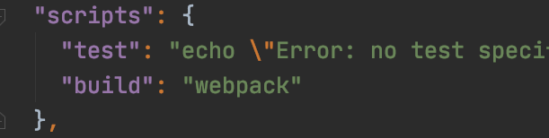
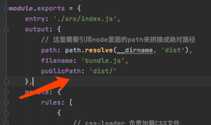

# Webpack

## 1. 简介

模块化打包工具。

## 2.  简单使用

* 将所有的js代码全部引入到一个index.js中

* 进入项目文件

  ```bash
  webpack ./src/index.hs ./dist/bundle.js
  ```

* 然后会自动把index打包到bundle

* 导入bundle即可。


### 3. 通过node来管理webpack

#### 3.1 流程

1. 在根目录下输入，生成package.json 文件

```bash
npm init
```

2. 创建webpack.config.js 配置文件

   ```js
   const path = require('path')
   
   module.exports = {
       entry: './src/index.js',
       output: {
           // 这里需要引用node里面的path来拼接成绝对路径
           path: path.resolve(__dirname,'dist'),
           filename: 'bundle.js'
       }
   }
   
   ```

   注意点：需要绝对路径作为输出，所以需要引用node里面的path来写

3. 直接使用 ，来打包

   ```bash
   webpack
   ```


## 3. 本地和全局

在命令行中使用webpack默认都是全局的，如果想运行本地的（项目的）webpack需要在脚本里面配置，这样会优先查找本地的。

对应的项目最好使用对应的webpack否则可能报错。

### 3.1 相关命令

```bash
npm install webpack@3.6.0 --save-dev # 安装本地开发时的webpack
```

并且在package.json中配置




## 4. loader

不同的文件都需要不同的loader来进行打包和加载，**大多数查文档** 这里只做几个例子

### 4.1 CSS 打包

CSS 等其他类型的文件需要对应使用不同的加载器，官网查

* css-loader
* Style-loader

#### 4.1.1 步骤

安装这两个

```bash
npm install --save-dev style-loader
npm install --save-dev css-loader
```


然后在webpack.config.js中添加 module

```js
const path = require('path')

module.exports = {
    entry: './src/index.js',
    output: {
        // 这里需要引用node里面的path来拼接成绝对路径
        path: path.resolve(__dirname, 'dist'),
        filename: 'bundle.js'
    },
    module: {
        rules: [
            {
                // css-loader 负责加载CSS文件
                // style-loader 负责渲染到DOM中
                // 多个loader加载的时候 从右向左加载
                test: /\.css$/i,
                use: ['style-loader', 'css-loader'],
            },
        ],
    },
}
```


### 4.2  加载图片

#### 4.2.1 操作

```bash
npm install -save-dev url-loader
```


rules配置

```js
{
                test: /\.(png|jpg|gif)$/i,
                use: [
                    {
                        loader: 'url-loader',
                        options: {
                            limit: 8192,
                        },
                    },
                ],
            },
```

如果大于 limit 则需要再使用 file-loader

```bash
npm install --save-dev file-loader
```

小于 limit 大小则会被默认变成base64字符

#### 4.2.2 配置输出地址

需要再config中配置输出路径 否则发布后无法找到文件。




#### 4.3 ES6-ES5

#### 4.3.1 环境

```bash
npm install --save-dev babel-loader@7 babel-core babel-preset-es2015
```

```javascript
{
      test: /\.m?js$/,
      exclude: /(node_modules|bower_components)/,
      use: {
        loader: 'babel-loader',
        options: {
          presets: ['es2015']
        }
      }
    }
```

# 遇到的坑

## 1. 安装了 loader但是仍然无法解析

路径必须这么写

```js
require('./css/aaa.css')
```

前面的./不能省略


## 2. 使用less版本问题

当前一套可以使用的版本

```js
 "devDependencies": {
    "css-loader": "^3.5.3",
    "less": "^3.9.0",
    "less-loader": "^4.1.0",
    "style-loader": "^1.2.1",
    "webpack": "^3.6.0"
  }
```

