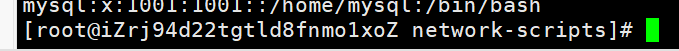

# Linux 下的目录

---


/bin:

/boot:

/dev:

**/ect:**用来存放所有的系统管理的配置文件和子目录

**/home:**用户的主目录

/lib: 不要动

/lost+found:

/media:

/mnt

**/opt:** 给主机额外安装软件所摆放的目录. 比如说oracle数据库 。 默认是空

/proc:

**/root:**系统管理员

/sbin:

/srv:

/sys:

**/tmp:**用完就丢的文件可以存放在这里 临时目录。

**/usr:**重要的目录！ 很多用户的应用程序和文件都放在这个目录下面 类似windows的program files

/usr/bin:

/usr/sbin:

/usr/src:

/var:

/run:

# 常用命令

---

## ls

-a 所有参数

-l 详细参数  **这两可以组合**

-ll 查看文件的属性

## dir

dir -p test1/test2 递归创建目录

rmdir 删除目录 

​	rmdir -p test1/test2 删除非空的dir则必须使用递归删除

## cp

cp 拷贝文件 拷贝目录

## rm

-f 忽略不存在的文件 强制删除

-r 递归删除目录

-i 互动 删除询问是否删除

## mv

-f 强制

-u 只替换已经更新过的文件

## chgrp 

修改组名 一般不建议使用

## chmod 

**修改文件9个属性 十分重要** chmod 权限 文件

可以用字符或者数字

r:4 w:2 x:1

例子：

​	可读可写不可执行 rw-  或者 6（4+2+0）

​	可读可写可执行  rwx 或者 7

​	chmod 777 www 自己+组+其他用户 都是可读可写可执行

​	chmod 700 www 自己 可读可写可执行 其他组+用户没有任何权限

## ifconfig 

查看网络

---

file查询

## cat tac

正序 倒叙 查看文件

## nl 

打开文件同时显示行号 **常用！**

eg： nl file1

## more

文件分页 可以通过空格下一页 q 退出

## head

head显示前几行 

例子：

head -n 20 file1

## tail 

用法同上 倒着读取

## /字符串 ？字符串

查询自己想查找的字符串

/向上查询 ？向下查询 n向下下一个 N向上上一个

# 基础知识

---


## 通过ls -ll 查询出的结果

**d 是表示目录 - 表示是文件 l表示是链接文档**（快捷方式）

 b为装置文件里面的可供存储的接口设备 c装置文件的端口设备


一共十个字符 

## 硬连接和软连接 -了解

硬连接就是多了一个指针指向源文件 如果删除 别的连接还可以使用

软连接就是一个快捷方式 如果源文件被删除 所有的软连接都无法使用

## vim

### 三个模式

命令模式 输入模式 底线命令模式

刚刚进入 是命令模式

i 切换到输入模式

x 删除当前光标所在的字符

: 切换到底线命令模式

​	q 退出

​	w 保存

​	set nu 设置行号


# Linux账号学习

---

## useradd -选项 用户名

-m ：自动创建 

-G: 给用户分配组

## userdel 删除用户

-r ：将他的目录一块删除

## usermod 修改


## 切换用户

$ 表示普通用户 #表示是超级用户



## 主机名

hostname 查询

hostname  newname 修改主机名字

# 用户组学习

## 创建一个用户组 groupadd 名字

创建完用户组可以得到一个组的id

groupdel 和 groupmod 类似

# 磁盘管理

## du 查看磁盘使用情况

 	-h 以MB GB来显示

dl


# 进程管理

PID 进程号

## ps -xx 

查看当前西东中正在实行的各种进程的情况

​	-a 所有的

​	-u 以用户的信息显示进程

​	-x 显示参数

```bash
ps -aux|
ps -aux|grep mysql
# 叫做管道符 前面的结果用作输入
# grep 过滤器
```

​	-ef 父进程

```bash
ps -ef|grep mysql #查看父进程
```

​	-kill -9 结束进程id

```bash
kill -9 PID
```


# 环境安装

---

一般来说是三种 rpm 解压缩 yum（docker）在线安装

## JDK 


## 重启防火墙

```bash
# 开启端口
firewall -cmd --zone=public --add-port=9000/tcp --permanent
# 重启
systemctl restart firewalld.service
```


# 自己补充

```bash
curl url # 直接显示某个url下的页面
systemctl 服务 # 开启一个进程 eg systemctl docker
```

# 背景资料（补）

---


