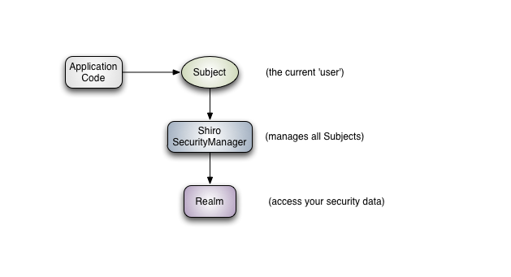

## 1. 导包

```xml
        <dependency>
            <groupId>org.apache.shiro</groupId>
            <artifactId>shiro-spring</artifactId>
            <version>1.5.0</version>
        </dependency>
```

## 2. 核心三大对象




### 2.1 subject 用户

当前用户，通过如下获得

```java
Subject subject = SecurityUtils.getSubject();
User curUser = (User) subject.getPrincipal();
```

### 2.2 SecurityManager 管理所有用户

管理所有用户

### 2.3 Realm 连接数据  需要自定义

* 单独创建
* 在这里连接数据库根据情况处理认证和权限处理

## 3. 案例

### 3.1 所需简介

* shiro
* springboot
* mock数据（没有使用数据库）
* Thymeleaf

### 3.2 导包

```xml
<dependencies>
        <!-- 常用包 -->
        <dependency>
            <groupId>org.springframework.boot</groupId>
            <artifactId>spring-boot-starter-web</artifactId>
        </dependency>
        <dependency>
            <groupId>org.springframework.boot</groupId>
            <artifactId>spring-boot-devtools</artifactId>
            <scope>runtime</scope>
            <optional>true</optional>
        </dependency>
        <dependency>
            <groupId>org.projectlombok</groupId>
            <artifactId>lombok</artifactId>
            <optional>true</optional>
        </dependency>
        <dependency>
            <groupId>org.springframework.boot</groupId>
            <artifactId>spring-boot-starter-test</artifactId>
            <scope>test</scope>
            <exclusions>
                <exclusion>
                    <groupId>org.junit.vintage</groupId>
                    <artifactId>junit-vintage-engine</artifactId>
                </exclusion>
            </exclusions>
        </dependency>

        <!-- https://mvnrepository.com/artifact/org.apache.shiro/shiro-core -->
        <!-- shiro -->
        <dependency>
            <groupId>org.apache.shiro</groupId>
            <artifactId>shiro-core</artifactId>
            <version>1.4.0</version>
        </dependency>

        <dependency>
            <groupId>org.apache.shiro</groupId>
            <artifactId>shiro-spring</artifactId>
            <version>1.5.0</version>
        </dependency>
  
        <!-- thymeleaf -->
        <dependency>
            <groupId>org.thymeleaf</groupId>
            <artifactId>thymeleaf-spring5</artifactId>
        </dependency>
        <dependency>
            <groupId>org.thymeleaf.extras</groupId>
            <artifactId>thymeleaf-extras-java8time</artifactId>
        </dependency>

        <!-- shiro-thymeleaf -->
        <dependency>
            <groupId>com.github.theborakompanioni</groupId>
            <artifactId>thymeleaf-extras-shiro</artifactId>
            <version>2.0.0</version>
        </dependency>

    </dependencies>
```

### 3.3 UserRealm (Realm)

* 这里做一些根据**数据库**处理的逻辑操作
* **认证和授权**
  * doGetAuthorizationInfo
  * doGetAuthenticationInfo

#### 3.3.1 代码

```java
package com.bohan.config;

import com.bohan.pojo.User;
import org.apache.shiro.SecurityUtils;
import org.apache.shiro.authc.*;
import org.apache.shiro.authz.AuthorizationInfo;
import org.apache.shiro.authz.SimpleAuthorizationInfo;
import org.apache.shiro.realm.AuthorizingRealm;
import org.apache.shiro.subject.PrincipalCollection;
import org.apache.shiro.subject.Subject;
import java.util.HashSet;

public class UserRealm extends AuthorizingRealm {


    //授权
    @Override
    protected AuthorizationInfo doGetAuthorizationInfo(PrincipalCollection principalCollection) {

        System.out.println("执行了 => 授权 doGetAuthorizationInfo");
        SimpleAuthorizationInfo info = new SimpleAuthorizationInfo();

//        info.addStringPermission("user:add");
        // 拿到当前对象
        Subject subject = SecurityUtils.getSubject();
        User curUser = (User) subject.getPrincipal();

        info.setStringPermissions(curUser.getParms());
        return info;
    }

    //认证
    @Override
    protected AuthenticationInfo doGetAuthenticationInfo(AuthenticationToken authenticationToken) throws AuthenticationException {

        System.out.println("执行了 => 认证 doGetAuthenticationInfo");
        String username = "bohan";

        UsernamePasswordToken token = (UsernamePasswordToken) authenticationToken;
        //伪造数据假设这里通过信息查到了数据库里的user
        User user = new User();
        user.setUsername("bohan");
        user.setPassword("111");
        HashSet<String> parms = new HashSet<>();
        parms.add("user:add");
        parms.add("user:delete");
        parms.add("user:update");
        user.setParms(parms);

        if(!token.getUsername().equals(username)){
            return null; //return null 会自动抛出异常
        }
        //这里第一个参数传入当前的用户 这样在授权阶段可以通过拿到当前用户来获得这个用户的内容
        return new SimpleAuthenticationInfo(user,user.getPassword(),"");
    }
}

```

### 3.4 ShiroConfig

#### 3.4.1 代码

```java
package com.bohan.config;


import at.pollux.thymeleaf.shiro.dialect.ShiroDialect;
import org.apache.shiro.spring.web.ShiroFilterFactoryBean;
import org.apache.shiro.web.mgt.DefaultWebSecurityManager;
import org.springframework.beans.factory.annotation.Qualifier;
import org.springframework.context.annotation.Bean;
import org.springframework.context.annotation.Configuration;

import java.util.HashMap;

@Configuration
public class ShiroConfig {

    //ShiroFilterFactoryBean
    @Bean
    public ShiroFilterFactoryBean getShiroFilterFactoryBean(@Qualifier("manager") DefaultWebSecurityManager defaultWebSecurityManager){
        ShiroFilterFactoryBean factoryBean = new ShiroFilterFactoryBean();
        //设置安全管理器
        factoryBean.setSecurityManager(defaultWebSecurityManager);
        /**
         * anon:无需认证
         * authc: 必须认证
         * user: 必须拥有记住我
         * perms: 必须有某个资源的quanxian
         * role: 必须有角色
         */

        HashMap<String, String> filter = new HashMap<>();

        filter.put("/user/*", "authc");


        filter.put("/user/add", "perms[user:add]");
        filter.put("/user/delete", "perms[user:delete]");
        filter.put("/user/test", "perms[user:test]");
        filter.put("/user/update", "perms[user:update]");

        factoryBean.setLoginUrl("/toLogin");
        factoryBean.setUnauthorizedUrl("/unAuth");

        factoryBean.setFilterChainDefinitionMap(filter);
        return factoryBean;
    }
    //DefaultWebSecurityManager
    @Bean(name = "manager")
    public DefaultWebSecurityManager getDefaultWebSecurityManager(@Qualifier("userRealm") UserRealm userRealm){
        DefaultWebSecurityManager securityManager = new DefaultWebSecurityManager();
        securityManager.setRealm(userRealm);
        return securityManager;
    }


    //Realm 需要自定义

    @Bean
    public UserRealm userRealm(){
        return new UserRealm();
    }
		//开启 thymeleaf 和 shiro 的兼容
    @Bean
    public ShiroDialect getShiroDialect(){
        return new ShiroDialect();
    }
}

```

#### 3.4.2 三大类从上到下依次依赖

* ShiroFilterFactoryBean
* DefaultWebSecurityMannager
* Realm

### 3.5 前端

没什么重点，只放代码

#### 3.5.1 index.html

```html
<!DOCTYPE html>
<html lang="en" xmlns:th="http://www.thymeleaf.org"
      xmlns:shiro="http://www.thymeleaf.org/thymeleaf-extras-shiro">
<head>
    <meta charset="UTF-8">
    <title>Title</title>
</head>
<body>
<h1 th:text="${msg}"></h1>
<h1 th:text="${session.loginUser}"></h1>

<div th:if="${session.loginUser==null}">
    <a th:href="@{/toLogin}">login</a>
</div>

<div shiro:hasPermission="user:add">
    <a th:href="@{/user/add}">add</a>
</div>

<div shiro:hasPermission="user:update">
    <a th:href="@{/user/update}">update</a>
</div>

<div shiro:hasPermission="user:delete">
    <a th:href="@{/user/delete}">delete</a>
</div>

</body>
</html>
```

#### 3.5.2 namespace

```html
xmlns:shiro="http://www.thymeleaf.org/thymeleaf-extras-shiro"
```

## A. 参考文档

* https://blog.csdn.net/jokemqc/article/details/79159228

