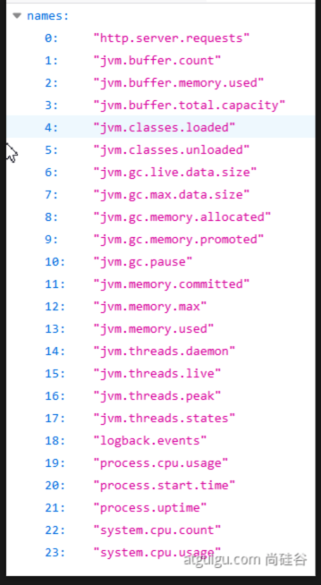

# SpringBoot

---


## 1. 原理

文档网址：https://docs.spring.io/spring-boot/docs/current/reference/htmlsingle

### 1.1 spring-boot-dependencies

核心依赖都在父工程中 所以不需要版本号以及一些依赖

### 1.2 启动器

**各种启动器实现了各个技术栈的配置**

#### 1.2.1 默认自带启动器实现了自动装配

```xml
<dependency>
    <groupId>org.springframework.boot</groupId>
    <artifactId>spring-boot-starter</artifactId>
</dependency>
```

官网的解释

### 1.3 主程序

```java
@SpringBootApplication
public class SpringbootApplication {

    public static void main(String[] args) {
        SpringApplication.run(SpringbootApplication.class, args);
    }

}
```


### 1.4 自动装载

装载了什么？

* 

## 2. properties & yaml

### 2.1 给bean赋值

```java
@ConfigurationProperties(prefix = "person")
public class Person {
    private String name;
    private int age;
}
```

```properties
person.name=bohan
person.age=23
```


### 2.2 yaml (主要)

都相同只是需要再yaml格式

### 2.3 自定义

自定义文件

```properties
# 这里没有前缀的说法了
name = bohan
age = 2333
```

```java
@PropertySource(value = "classpath:custom.properties")
    public class Person {
    @Value("${name}")
    private String name;
    @Value("${age}")
    private int age;
}
```

## 3. Thymeleaf

模板引擎：像JSP这样的东西需要模板引擎来渲染内容。

没有整理 因为属于前后端不分离项目做的 还在model and view

### 3.1 导包

```xml
<dependency>
			<groupId>org.thymeleaf</groupId>
			<artifactId>thymeleaf-spring5</artifactId>
		</dependency>
		<dependency>
			<groupId>org.thymeleaf.extras</groupId>
			<artifactId>thymeleaf-extras-java8time</artifactId>
</dependency>
```

### 3.2 访问

默认在templates里面匹配return的字符串的html

### 3.3 文档地址 & 头文件

```html
xmlns:th="http://www.thymeleaf.org"
```

https://www.thymeleaf.org/doc/tutorials/3.0/usingthymeleaf.html#a-multi-language-welcome

### 3.4 语法

#### 3.4.1 th:

替换几乎所有的html元素 动态赋值

例子：

```html
<h1 th:text="${msg}"></h1>
```

## 4. Junit

测试单元，springboot自动集成，2.X以后的版本都是**Junit5**

* 2.4 以后移除了对Vintage的依赖，更为方便了

### 4.1 简介

* 使用@Test
* 可以使用Autowired，具有自动装配功能

### 4.2 注解

* **displayname**: 给单元测试命名，写在class或者测试方法上
* **BeforeEach**/**AfterEach**：每个单元测试前后执行
* **BeforeAll**/**AfterAll**：所有单元测试前后执行
* **Disabled**：禁止某一个测试单元
* **TimeOut**:  设置超时时间
* **@Tag :**表示单元测试类别，类似于JUnit4中的@Categories
* **@ExtendWith :**为测试类或测试方法提供扩展类引用

### 4.3 断言

和JDK的断言基本一个意思，进行了封装

| 方法            | 说明                                 |
| --------------- | ------------------------------------ |
| assertEquals    | 判断两个对象或两个原始类型是否相等   |
| assertNotEquals | 判断两个对象或两个原始类型是否不相等 |
| assertSame      | 判断两个对象引用是否指向同一个对象   |
| assertNotSame   | 判断两个对象引用是否指向不同的对象   |
| assertTrue      | 判断给定的布尔值是否为 true          |
| assertFalse     | 判断给定的布尔值是否为 false         |
| assertNull      | 判断给定的对象引用是否为 null        |
| assertNotNull   | 判断给定的对象引用是否不为 null      |


#### 4.3.1 组合断言

可以让多个断言一起判断，并且都通过才可以。

```java
@Test
@DisplayName("assert all")
public void all() {
 assertAll("Math",
    () -> assertEquals(2, 1 + 1),
    () -> assertTrue(1 > 0)
 );
}
```

#### 4.3.2 异常断言

假设某一个运行必然会抛异常，如果没有抛异常那么则不能通过。

```java
@Test
@DisplayName("异常测试")
public void exceptionTest() {
    ArithmeticException exception = Assertions.assertThrows(
           //扔出断言异常
            ArithmeticException.class, () -> System.out.println(1 % 0));

}
```

#### 4.3.3 超时断言

```java
@Test
@DisplayName("超时测试")
public void timeoutTest() {
    //如果测试方法时间超过1s将会异常
    Assertions.assertTimeout(Duration.ofMillis(1000), () -> Thread.sleep(500));
}
```

#### 4.3.4 快速失败

直接让其无法通过。

```java
@Test
@DisplayName("fail")
public void shouldFail() {
 fail("This should fail");
}
```

### 4.4 前置条件

和断言不同，不会终止，**如果没通过会被添加到报告里面然后继续运行。**

* 报告中显示为跳过

```java
@DisplayName("前置条件")
public class AssumptionsTest {
 private final String environment = "DEV";
 
 @Test
 @DisplayName("simple")
 public void simpleAssume() {
    assumeTrue(Objects.equals(this.environment, "DEV"));
    assumeFalse(() -> Objects.equals(this.environment, "PROD"));
 }
 
 @Test
 @DisplayName("assume then do")
 public void assumeThenDo() {
    assumingThat(
       Objects.equals(this.environment, "DEV"),
       () -> System.out.println("In DEV")
    );
 }
}
```

### 4.5 嵌套测试

外层可以影响内层，内层无法影响外层

```java
@DisplayName("A stack")
class TestingAStackDemo {

    Stack<Object> stack;

    @Test
    @DisplayName("is instantiated with new Stack()")
    void isInstantiatedWithNew() {
        new Stack<>();
    }

    @Nested
    @DisplayName("when new")
    class WhenNew {

        @BeforeEach
        void createNewStack() {
            stack = new Stack<>();
        }

        @Test
        @DisplayName("is empty")
        void isEmpty() {
            assertTrue(stack.isEmpty());
        }

        @Test
        @DisplayName("throws EmptyStackException when popped")
        void throwsExceptionWhenPopped() {
            assertThrows(EmptyStackException.class, stack::pop);
        }

        @Test
        @DisplayName("throws EmptyStackException when peeked")
        void throwsExceptionWhenPeeked() {
            assertThrows(EmptyStackException.class, stack::peek);
        }

        @Nested
        @DisplayName("after pushing an element")
        class AfterPushing {

            String anElement = "an element";

            @BeforeEach
            void pushAnElement() {
                stack.push(anElement);
            }

            @Test
            @DisplayName("it is no longer empty")
            void isNotEmpty() {
                assertFalse(stack.isEmpty());
            }

            @Test
            @DisplayName("returns the element when popped and is empty")
            void returnElementWhenPopped() {
                assertEquals(anElement, stack.pop());
                assertTrue(stack.isEmpty());
            }

            @Test
            @DisplayName("returns the element when peeked but remains not empty")
            void returnElementWhenPeeked() {
                assertEquals(anElement, stack.peek());
                assertFalse(stack.isEmpty());
            }
        }
    }
}
```

### 4.6 参数化测试

使用不同的参数测试同一个单元

* **@ParameterizedTest** 来指定

```java
@ParameterizedTest
@ValueSource(strings = {"one", "two", "three"})
@DisplayName("参数化测试1")
public void parameterizedTest1(String string) {
    System.out.println(string);
    Assertions.assertTrue(StringUtils.isNotBlank(string));
}


@ParameterizedTest
@MethodSource("method")    //指定方法名
@DisplayName("方法来源参数")
public void testWithExplicitLocalMethodSource(String name) {
    System.out.println(name);
    Assertions.assertNotNull(name);
}

static Stream<String> method() {
    return Stream.of("apple", "banana");
}
```

## 5. Actuator

用于各种指标监控

### 5.1 使用

#### 5.1.1 导包

```xml
        <dependency>
            <groupId>org.springframework.boot</groupId>
            <artifactId>spring-boot-starter-actuator</artifactId>
        </dependency>
```

#### 5.1.2 配置

```yaml
management:
  endpoints:
    enabled-by-default: true #暴露所有端点信息
    web:
      exposure:
        include: '*'  #以web方式暴露
```

访问：

http://localhost:8080/actuator/beans

http://localhost:8080/actuator/configprops

http://localhost:8080/actuator/metrics

http://localhost:8080/actuator/metrics/jvm.gc.pause

[http://localhost:8080/actuator/](http://localhost:8080/actuator/metrics)endpointName/detailPath

### 5.2 常用Endpoint


| ID                 | 描述                                                         |
| ------------------ | ------------------------------------------------------------ |
| `auditevents`      | 暴露当前应用程序的审核事件信息。需要一个`AuditEventRepository组件`。 |
| `beans`            | 显示应用程序中所有Spring Bean的完整列表。                    |
| `caches`           | 暴露可用的缓存。                                             |
| `conditions`       | 显示自动配置的所有条件信息，包括匹配或不匹配的原因。         |
| `configprops`      | 显示所有`@ConfigurationProperties`。                         |
| `env`              | 暴露Spring的属性`ConfigurableEnvironment`                    |
| `flyway`           | 显示已应用的所有Flyway数据库迁移。 需要一个或多个`Flyway`组件。 |
| `health`           | 显示应用程序运行状况信息。                                   |
| `httptrace`        | 显示HTTP跟踪信息（默认情况下，最近100个HTTP请求-响应）。需要一个`HttpTraceRepository`组件。 |
| `info`             | 显示应用程序信息。                                           |
| `integrationgraph` | 显示Spring `integrationgraph` 。需要依赖`spring-integration-core`。 |
| `loggers`          | 显示和修改应用程序中日志的配置。                             |
| `liquibase`        | 显示已应用的所有Liquibase数据库迁移。需要一个或多个`Liquibase`组件。 |
| `metrics`          | 显示当前应用程序的“指标”信息。                               |
| `mappings`         | 显示所有`@RequestMapping`路径列表。                          |
| `scheduledtasks`   | 显示应用程序中的计划任务。                                   |
| `sessions`         | 允许从Spring Session支持的会话存储中检索和删除用户会话。需要使用Spring Session的基于Servlet的Web应用程序。 |
| `shutdown`         | 使应用程序正常关闭。默认禁用。                               |
| `startup`          | 显示由`ApplicationStartup`收集的启动步骤数据。需要使用`SpringApplication`进行配置`BufferingApplicationStartup`。 |
| `threaddump`       | 执行线程转储。                                               |

### 5.3 Health Endpoint

可以设置一系列的监控，**并且所有监控的指标都健康才是健康的**。

### 5.4 Metrics Endpoint

提供层级详细的指标信息



### 5.5 定制 Health Endpoint

实现接口 **AbstractHealthIndicator**，重写真实的检测逻辑，并且给status设置值

```java
@Component
public class MyComHealthIndicator extends AbstractHealthIndicator {

    /**
     * 真实的检查方法
     * @param builder
     * @throws Exception
     */
    @Override
    protected void doHealthCheck(Health.Builder builder) throws Exception {
        //mongodb。  获取连接进行测试
        Map<String,Object> map = new HashMap<>();
        // 检查完成
        if(1 == 2){
//            builder.up(); //健康
            builder.status(Status.UP);
            map.put("count",1);
            map.put("ms",100);
        }else {
//            builder.down();
            builder.status(Status.OUT_OF_SERVICE);
            map.put("err","连接超时");
            map.put("ms",3000);
        }


        builder.withDetail("code",100)
                .withDetails(map);

    }
}
```

### 5.6 定制Info

两种方法 ,http://localhost:8080/actuator/info 会输出以上方式返回的所有info信息

1. 配置文件

   ```yaml
   info:
     appName: boot-admin
     version: 2.0.1
     mavenProjectName: @project.artifactId@  #使用@@可以获取maven的pom文件值
     mavenProjectVersion: @project.version@
   ```

   

2. 配置类

   ```java
   import java.util.Collections;
   
   import org.springframework.boot.actuate.info.Info;
   import org.springframework.boot.actuate.info.InfoContributor;
   import org.springframework.stereotype.Component;
   
   @Component
   public class ExampleInfoContributor implements InfoContributor {
   
       @Override
       public void contribute(Info.Builder builder) {
           builder.withDetail("example",
                   Collections.singletonMap("key", "value"));
       }
   
   }
   ```

### 5.7  定制Endpoint

```java
@Component
@Endpoint(id = "container")
public class DockerEndpoint {


    @ReadOperation
    public Map getDockerInfo(){
        return Collections.singletonMap("info","docker started...");
    }

    @WriteOperation
    private void restartDocker(){
        System.out.println("docker restarted....");
    }

}
```

## 6. Profile 功能

适配多环境的配置文件

* 默认配置环境的也会生效，如果有重复的 指定的会覆盖默认的

默认配置环境中执行当前什么环境，那么就回去找对应的环境配置文件

```yaml
spring:
	profiles:
		active: test
```

### 6.1 激活方式

可以通过配置文件，也可以通过命令行，命令行优先！

```bash
java -jar xxx.jar --spring.profiles.active=prod  --person.name=haha
```

### 6.2 条件装配

使用@Profile来指定某个类或者class在什么环境下才会装配

```java
@Configuration(proxyBeanMethods = false)
@Profile("production")
public class ProductionConfiguration {

    // ...

}
```

### 6.3 profile分组

可以同时加载多个配置文件

```properties
spring.profiles.group.production[0]=proddb
spring.profiles.group.production[1]=prodmq
# 使用：--spring.profiles.active=production  激活
```


