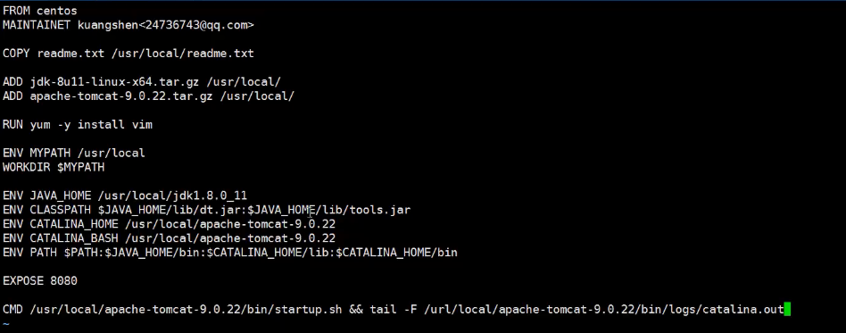
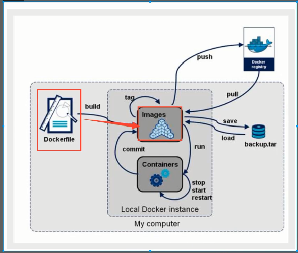

# docker

---

docker官网地址  https://www.docker.com/

docker启动命令,docker重启命令,docker关闭命令

启动    systemctl start docker

**守护进程重启**  sudo systemctl daemon-reload

**重启docker服务**  systemctl restart  docker

**重启docker服务** sudo service docker restart

关闭docker service docker stop

关闭docker systemctl stop docker


## 1. 组成

### 1.1 镜像（image）

模板 可以通过模板来创建容器服务

### 1.2容器（container）

有基本命令

可以理解成linux系统

### 1.3 仓库

存放镜像的地方

docker hub

国内有很多 比如 阿里云

## 2 . 命令

```bash
docker --help
docker info
docker version
```

### 2.1  镜像命令

```bash
docker images
docker images -a # 所有
docker images -q # id
docker images -aq
```

### 2.2  搜索命令

```bash
docker search 名字
```

### 2.3 下载

```bash
docker pull 名字[版本]
```

### 2.4  删除 

```bash
docker rmi
docker rmi -f 容器id
docker rmi -f 容器id 容器id #删除多个
docker rmi -f $(docker images -aq) #删除所有
```

### 2.5 容器命令

```bash
docker run [option] name
--name #起名字
-d #后台
-it # 使用交互方式运行 exit 退出 容器不停止 ctrl + p + q
-p # 指定容器的端口
docker ps [-a] # 当前运行/全部运行的
-n=? # 最近创建的
-q #只显示编号
--rm 用完就删 39b9444e4eb2 

#eg
[root@iZrj94d22tgtld8fnmo1xoZ ~]# docker run -d --name nginx02 -p 3344:80 nginx 
docker run -it --rm tomcat:9.0

#--------------------------------------------------------------#
docker rm 容器id # 删除

docker start 容器id
docker stop 容器id
docker kill 容器id
docker restart 容器id

docker logs

docker inspect 容器id # 查看一些复杂信息
docker exec -it 容器id 容器命令行地址 # 进入一个容器 开启一个新的终端 常用！
docker attch #这个是当前运行的终端

docker cp 容器id：容器内路径 主机路径 # 容器内往主机考

```

### 2.6 commit 镜像

```bash
docker commit # 提交容器成为一个新的版本

docker commit -m "discrption" -a"author" 容器id 镜像名字 [tag]
```

## 3. 容器数据卷

如果数据在容器中，那么容器删除则数据丢失。 所以需要数据持久化！

说白了就是把目录挂在到linux上作为共享


### 3.1 使用数据卷

方式1 

```bash
-v 
# eg
docker run -it -v /home/ceshi:/home centos /bin/bash
```

匿名挂载

```bash
docker run -d -p --name nginx01 -v /etc/nginx nginx # 匿名挂载

docker volume ls
```

具名挂载  -v 名字:地址 **一般用这种**

```bash
[root@iZrj94d22tgtld8fnmo1xoZ home]# docker run -d -P --name nginx03 -v juming-nginx:/etc/nginx nginx
e353039fbcd14c0c121929e466c728edf3bdc467bdae904e5ba317ce9c7db92a
[root@iZrj94d22tgtld8fnmo1xoZ home]# docker volume ls
DRIVER              VOLUME NAME
local               98a55540a7a6f57a540d9afa3dba9fdad0ca052ef55b729d1305726f02ddd266
local               juming-nginx
[root@iZrj94d22tgtld8fnmo1xoZ home]# 

```

不指定挂载地址 默认挂载地址

```bash
/var/lib/docker/volumes/juming-nginx/_data
```

小结

```bash
-v 容器内路径 # 匿名挂载
-v 卷名:容器内路径 # 具名挂载
-v /宿主机路径:容器内路径 # 指定路径挂载
```

拓展

```bash
docker run -d - P --name nginx02 -v juming-nginx:/etc/nginx:ro nginx
docker run -d - P --name nginx02 -v juming-nginx:/etc/nginx:rw nginx

ro readonly
rw readwrite
```

### 3.2 容器数据卷

可以用来同步数据 类似继承关系

--volumes-from  

```bash
docker run -it --name docker02 --volumes-from docker01 centos
# 启动一个centos 基于 docker01 所挂载的目录
```

挂载在里面的数据会一直保存 即使容器被删除。直到没有任何容易使用这个数据，除非是挂载到了本地 也就是docker外面

## 4. Dockerfile

用于创建镜像 分层 一层一个命令 

```bash
FROM # 基础镜像 一切重这里开始构建
MAINTAINER # 谁写的 name+email
RUN #镜像构建的时候需要运行的命令
ADD # 步骤 添加一些本地的东西 比如tomcat
WORKDIR # 镜像的工作目录
VOLUME #挂载的目录
EXPOSE #暴露端口
CMD #指定的容器启动的时候需要的命令 
ENTRYPOINT # 只有容器启动的时候需要运行的命令，可以追加
ONBUILD # 当构建一个被继承的 dockerfile 会运行这个
COPY # 类似ADD ，拷贝文件到镜像中的指定位置一些文件
ENV # 设置环境变量
```

```bash
docker build -f docerfile名字 # 通过dockerfile创建镜像
```


 例子

## 5 . 小结




```yml
version: '3.1'
services:
  nginx:
    restart:always
    image:daocloud.io/library/nginx:latest
    container_name:nginx
    posts:
      - 80:80
```


```bash
docker-compose down
docker-compose build
```


## 6. 微服务补充

自动启动

```bash
sudo docker update redis --restart=always # 这里是让redis自动启动
```

## 

## 7. dockerFile 补充

类似脚本文件, 镜像构建文件

### 7.1 语法

1. 所有的保留字指令必须大写，并且跟参数

### 7.2 保留字

* FROM: 基础镜像
* MAINTAINER:  维护者名字和邮箱
* RUN：容器创建的时候执行的命令
* EXPOSE：对外暴露出的端口
* WORKDIR: 创建容器后，中断的默认地点
* ENV: k-v 环境变量
* ADD/COPY：拷贝HOST目录下的文件到镜像内部
* VOLUME：容器数据卷
* CMD: 启动容器的时候需要运行的命令，只有最后一个生效
* ENTRYPOINT: 同上，但是不会覆盖，会添加。
* ONBUILD：构建继承的Dockerfile的时候运行的命令（继承为 FROM 被调用）

### 7.3 案例

#### 7.3.1 自定义centOS

很多精简版的centOS镜像啥都没有，这里自动安装一下 VIM 和 ipconfig

```dockerfile
FROM centos
MAINTAINER bohan<bohan.neal@gmail.com>

ENV MYPATH /user/local
WORKDIR $MYPATH

RUN yum -y install vim
RUN yum -y install net-tools

EXPOSE 80

CMD echo $MYPATH
CMD echo "success ----------OK"
CMD /bin/bash
```


