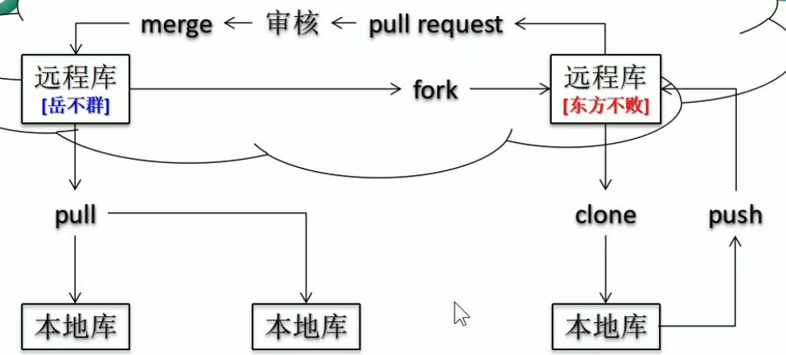
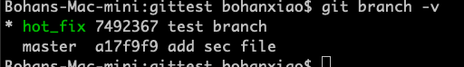

# 1. 原理

---

### 1.1 config

相关配置 git/etc/config

```bash
git config -l
git config --system --list # 系统配置的
git config user.name "bohan"
git config user.email "gk6511@wayne.edu"
git config --global user.name "bohan" # 全局设置
```

### 2. 原理


## 1.1 多小组合作案例



* Fork出的库相当于一份一样的克隆并且分配给的团队会有全部的权限
* 合并的时候需要申请

## 1.2 Soft mix hard

* Soft: 移动的时候只移动了本地库 -- **自己看到的代码没有变**，**push的时候会提交soft reset的地方**， **缓存区不清除**，commit的时候，add 的file也不会被清除
* Mix:  移动的时候移动了本地库 -- 同上，**但是缓存区会被清除**
* Hard：**三个都变**

## 1.3 分支合并

分支自行修改 进行commit，查看分支的时候如果领先版本则会有 * 提示



* 谁需要其他人的更新，谁发起merge，**一般是master**
* 如果有冲突，自己手动添加，并且add回去commit 则解决冲突。

## 1.4 远程库配置

这里以github为例

```bash
git remote -v # 查看所有设置的远程地址
git remote add origin <Http地址> # 设置远程仓库地址
git push origin <branch> # 用来推送
```

#### 1.4.1 拉取

**pull = fetch + merge**

* fetch：读操作，把某个分支的数据下载下来，但是本地数据还不会被合并
* merge：和本地的数据进行合并

所以整体的Pull 是先下载下后合并

# 2. 快速查阅

---

```bash
git clone # 不仅会复制代码，也会初始化库， 加入团队后才有push权限
git fork # 把自己的库克隆一份出来交给另一个团队，这个团队相当于拥有了这个新的库
git log # 查看所有版本信息
git log --pretty=oneline # 简洁显示
git log -oneline # 更简洁
git reflog # 查看移动次数到某一个版本
git reset --hard <版本号> # 移动到某个版本
git diff <文件名> # 查看某个文件在当前commit后的修改
git diff <某个历史版本> <文件名> # 和某个文件进行对比
git diff # 比较所有
git branch -v # 查看所有分支
git branch <分支名字> # 创建其他分支
git checkout <分支名字> # 切换分支
```

