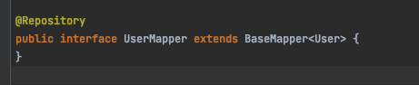
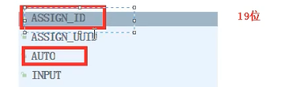

# 1. 配置

maven依赖

```xml
  <!--mybatis-plus-->
        <dependency>
            <groupId>com.baomidou</groupId>
            <artifactId>mybatis-plus-boot-starter</artifactId>
            <version>3.3.1</version>
        </dependency>
```

日志

```yaml
#mybatis日志
mybatis-plus.configuration.log-impl=org.apache.ibatis.logging.stdout.StdOutImpl
```

## 1.1 使用方法

和之前mybatis基本一样的配置 只是在接口配置的时候继承basemapper接口



# 2. 功能

## 2.1 主键策略



默认为第一种

```java
@TableId(type = IdType.ASSIGN_ID)
//添加在主键属性上来配置
```


### 2.1.1  雪花算法

用于自动生成主键

## 2.2 自动填充

基于某一个操作自动添加一个操作，比如添加更新时间和创建时间。

### 2.2.1  流程

1. 标注需要自动填充或者更改的属性

   

2. 创建一个类实现MetaObjectHandler接口

   ```java
   @Configuration
   public class MyMetaObjectHandler implements MetaObjectHandler {
   
   
       @Override
       public void insertFill(MetaObject metaObject) {
         // 指定需要操作哪个属性，需要更改或者添加成为什么值
           this.setFieldValByName("createTime", new Date(), metaObject);
       }
   
       @Override
       public void updateFill(MetaObject metaObject) {
           this.setFieldValByName("updateTime", new Date(), metaObject);
       }
   }
   
   ```

   

## 2.3 乐观锁

手动添加一个version属性，并且使用注解标注


这里也同时添加了一个自动填充，让version的初始值为1，具体步骤如2.2

在配置一个乐观锁的拦截器组件 -- 固定写法

```java
@Configuration
@MapperScan("com.atguigu.demomp.mapper")
public class MpConfig {

    @Bean
    public OptimisticLockerInterceptor optimisticLockerInterceptor(){
        return new OptimisticLockerInterceptor();
    }

}
```

## 2.4 分页查询

添加配置类

```java
 	@Bean
    public PaginationInterceptor paginationInterceptor(){
        return new PaginationInterceptor();
    }
```

直接使用

```java
 @Test
    public void pagination(){
        Page<User> userPage = new Page<>(1, 5);
        Page<User> page = userMapper.selectPage(userPage, null);
        System.out.println(page.getRecords());
      // 有许多配置信息都可以通过page来调用
    }
```

## 2.5 wrapper

## 2.6 Service base类使用

对于简单的增删盖茶 MP还提供了service的封装

1. Mapper 层  这里仍然是继承base + xml（用于扩展新查询）

   ```java
   @Mapper
   public interface HospitalSetMapper extends BaseMapper<HospitalSet> {
   }
   
   ```

   ```xml
   <?xml version="1.0" encoding="UTF-8" ?>
   <!DOCTYPE mapper PUBLIC "-//mybatis.org//DTD Mapper 3.0//EN"
           "http://mybatis.org/dtd/mybatis-3-mapper.dtd">
   <mapper namespace="com.atguigu.yygh.hosp.mapper.HospitalSetMapper">
   
   </mapper>
   
   ```

2. Service  接口集成IService（获得增删改查等基本method）

   ```java
   public interface HospitalSetService extends IService<HospitalSet> {
   }
   ```

   ```java
   @Service
   public class HospitalSetServiceImpl extends ServiceImpl<HospitalSetMapper, HospitalSet> implements HospitalSetService {
   
   }// ServiceIMPL来获得IService接口的实现类，泛型传入mapper用于查询
   ```

   

## 2.7 添加标准不存在的属性

使用注解

```java
@TableField(exist = false)
```


