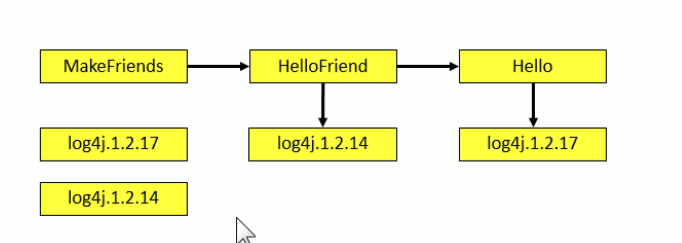
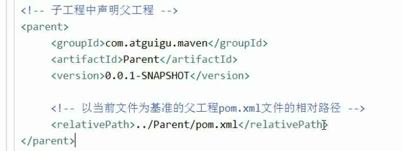
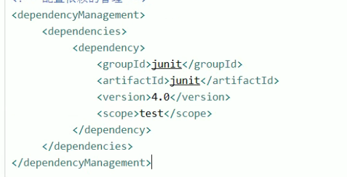

# Maven

---

## 1. 生命周期

### 1.1 各个scope的范围

* **compile**：对主程序和测试都有效 参与打包，参与部署
* **test**：对主程序无效，对测试程序有效，**不参与打包，不参与部署**
* **provided**：**只在开发阶段（主程序和开发）有效**（有些在部署后可以被部署容器来提供，所以不需要再打包）

### 1.2 构建过程的环节

* 顺序不可以打乱
* 无论从选择执行哪里 都会**执行这一步之前所有的阶段**

## 2. 依赖

* 传递性 -- **compile 可以传递， provided & test是不会传递**

* 排除 -- 当遇到了**导入某个依赖但是不想使用这个依赖的依赖**，可以使用exclude将其排除，比如不想使用tomcat作为springmvc的容器

  ```xml
  <exclusions>
  	<exclusion></exclusion>
  </exclusions>
  ```

### 2.1 依赖的原则

就近选择，**优先选择自己或者直接父级**，**如果同级则按着声明顺序**



**这里会调用1.2.14**

### 2.2 管理版本号

使用 properties管理

```xml
<properties></properties>
```


## 3. 继承

通过父工程进行管理 

* package方式一定要是POM，子工程中声明父工程



* 依赖管理 ，这样子类就不需要再指定版本




## 4. 聚合

一键安装所有的模块工程

先在父工程中配置

```xml
    <modules>
        <module>common</module>
<!--        <module>common_util</module>-->
<!--        <module>common_util</module>-->
        <module>model</module>
        <module>service</module>
        <module>service_client</module>
        <module>server_gateway</module>
    </modules>
```

# Jenkins

---

