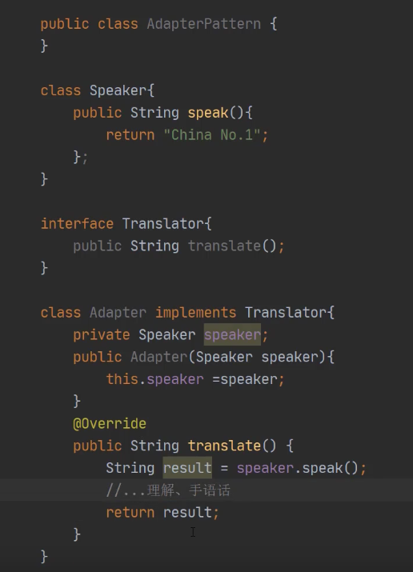

# 找工作内容复制

---

```tex
Hi

 
学长您好，十分感谢您在OneCareer社区分享的职位信息，希望您能帮忙内推一下g的岗位。群里的消息里没有提到需要第三人称推荐语，下面也附上in case 您需要。
```

```tex
Hi

 
十分感谢您在一亩三分地社区分享的职位信息，希望您能帮reference Software Engineer 的岗位。群里的消息里没有提到需要第三人称推荐语，下面也附上in case 您需要。
```


---

```tex
Inquire about possible of reference at  【OneCareer推荐】
```


---

```tex
Bohan has two years industry experiences in Java-web development including front-end and back-end development by using Spring framework and Vue.js In addition, he also has 1 year AWS development experience , and he passed AWS associate developer certification. Furthermore , He has the Oracle Certified Professional , Java SE 8 Programmer certification which makes him has solid Java programming skills .
```


# 面试通用

---

## 1. 开场感谢

```tex
I've been looking forward to speaking with you
Thank you so much for taking the time to meet with me today.
Thank you again for connecting with me today.
```

## 2. 自我介绍

```tex
I am Bohan! I got my master degree in Computer Science in Wayne State Univeristy on Dec 2020. And I have about two years of experience as a junior Java SDE in web-based development position. I am familar with JavaEE framworks like Springboot and related 技术栈 such as MVC/Mybatis/SQL/NoSQL.And I aslo experecened with AWS and 微服务development（By using SpirngCloud). I am currently working for Wayne State University Big data lab as a full-stack software developer. My responsibility here is developing applications and providing architecture solutions.

before my current position, I was a Full-stack software engineer in Zoom Ride, I had been part of  mutiple projects, for example the main website of the campany and their coming service elite tour which is a online ride booking system based on mic-service by using springboot and AWS componets.  In addition, I aslo did the code optimization for existing projects.

I am sure that I am a self-starter and quick learner, 我愿意牺牲自己的空闲时间来为团队做事。


```

# 工作经历

---

## 1. Big Data Lab

### 1.1 简历

#### 1.1.1 项目cloud架构修改

```tex
区块链 exchange project -- MySQL as data base --- DynamoDB
											 -- add AWS Redis as a cahe teir 
											 -- loging System AWS CloudWatch
```

#### 1.1.2 项目效率

**项目：DataView**

* IO 效率 -- NIO
* 数据流效率 -- stream + lambda
* 未处理exception -- log system

```tex


S: It was my first assignment  in BigData lab, at that time I was waiting for my OPT to be aprroved, So I was working as a volunteer. We have a task-schedule project by using Java, it's very similar to Hadoop which is the most popular big data framework.

T: I was been asked to improve the performance of some existing task
A: after I read the source code, I found that the IO part consumes too much performance. And the provious developer was using very basic for loop to deal with the data-flow. So the first thing that I did is to using NIO which is the new features in JDK7 to deal with the IO part. And use stream feature and Lambda function to deal with the data flow. 

In addition, Durting the testing stage, I aslo found some exceptiones was not been catched which will cause the application crashed when the input format is not correct. and the testing mode of this project  is using muti-thread 来模拟真实环境. which means it is really hard to debug when the expection is not clear for example just a NullPointer. What I did is to add a log system to make sure the developer knows the what the problem is.

R： Finally, we use one million records  as the testing sample, the excuation time was halfed.
```

#### 1.1.3 重构前端

项目：DataView

```tex
We have a task-schedule project, which is design and excute the big data workflow in a smart way. And it still provide a interface for users who is not very farmiliar with command line. The previous version was using jsp which is relatively old tech, it is mix the front-end code and the back-end code together. My work was to decouple the front-end and the back-end, So that the project could be developed separately.

I selected Vue.js as the front-end framework which is similar to React.js. And change the back-end API to RESTful API, and use Axios which is a ajax framework to call the APIs with JSON data format.
```

#### 1.1.4  目前在做的项目

* 区块链项目 -- 开发组长 vue.js + springboot + AWS DynamoDB + AWS CloudWatch
* Hospital registration system -- Springboot + SpringCloud + MongoDB + Redis 
  * 我的工作：大多数registration平台 module，service module，后台管理module,  gateway module，common module

###  1.2 遇到的problem 

```tex
1. 理解之前的task-schedule 项目 -- 没有注释 并且在测试环境下是本机运行的，有些时候报错很困难排查。
   一开始打算用全局处理，但是发现不用springboot很难实现
   想完善log系统，但是被拒绝
   解决：简单的log系统，写入文件。并且对一些没有处理的异常进行catch
2. 安全部分的Shiro部分很难设计，
	 1. 一开始打算对其进行加密然后使用shiro来进行验证 -> 发现不好携带加密信息
   2. 打算使用Token，但是发现Shiro针对Token进行验证需要很多配置类，并且不好处理 
   3. 大量的阅读documents
3. cross account problem AWS
   1. 只添加resource-policy 来允许某个IP访问，但是后来发现一旦IP变化（比如换EC2）会很麻烦
   2. 通过查资料得到标准的几种处理cross acount的方法
```

## 2. Zoom Ride

### 2.1 简历

#### 2.1.1 使用J2EE

```tex
I have been part of many projects, for example the Elite tour service which is a online ride booking system by using springboot and springcloud, It is a mirc-service project. My responsibility is providing architecture solutions based on the business module. And be part of the back-end development team. My developing work is the product module, gateway module and 后台管理module。

Springboot + SpringMVC + MyBatis + springCloud + Redis + AWS RDS + AWS Cognito + AWS lambda + AWS CloudWatch.
```


#### 2.1.1 提升效率

```tex
使用Lambda fuction + stream 提升数据量较大的APIs
```

#### 2.1.1 API 安全

```tex
Employee management system
```

###  2.2 遇到的problem 

```java
	 1. 项目转移到on-pramis to cloud --> 并没有什么经验，CTO忙于和mobile APP team合作，并且他们在印度，所以经常不在
   2. 小组讨论，和CTO沟通后决定先进行正常的微服务开发 然后慢慢转型，因为项目一开始也并不需要太多
   3. 下班后自学，并且开始一些比较简单的比如 Cloudwatch logs 和 一些Corn job 
```

## 3. Webmaster

### 3.1 简历

增强效率，封装了方法 响应式library（导入了不同的）--- 重构了所有新的，把相对来说旧一些的网站修改会BootStrap3 version

# AWS 

---

## 1. 经历

### 1.1 使用经历

```tex
Elete Tour Service 
		ElasticBeanStack 
		AWS RDS(MySQL engine)
		AWS ElasticCache(Redis cluster)
		AWS CloudWatch for loging system, and did some anylsic work for with lambda
		AWS SQS to decouple the ordring module
		
Zoom Ride Website
		S3 bucket as a static website
		AWS GateWay + Lambda to deal with sample logic 

exchange
		DynamoDB, Lambda, CloudWatch
		
		
```


```tex
1. 测试环境和部署环境都是使用 Blue/green 策略 --> 没必要因为测试环境不需要 all-at-once
2. SOS live streaming system, 视频上传等等 --> 可以把这部分解耦出来使用Worker environment来配置cron job 来处理
3. User的私有仓库是调用lambda function来查询数据库的，其实可以直接用Cognito identity pools with Policy 变量即可。
```

### 1.2 小优化经历

#### 1.2.1 SQS -- 改用long polling

```tex
I have been part of the  SOS live-Stream project, and one of our back-end developer discovered that the order module was always getting empty Response from AWS SQS, So after I check the product module I found that it's better to use Long polling instend of short polling. It reduced the cost from AWS a lot and aslo improved the proformance.
```

#### 1.2.2 安全

* 改变AWS managed policy to customer managed policy
* Lambda 的数据库连接参数应该使用SSM + 环境变量

#### 1.2.3 EBS测试环境也使用Green/Blue 策略

* 费钱，所以改用all at once

### 1.3 大优化经历

**AWS**

* 从ElasticBeanstack（mobile app） -- 

  * 之前：使用AWS RDS cluster 添加cache tier（AWS Redis cluster 用于储存session并且缓存数据），

  * 之前：直接处理数据： 添加message Queue来处理订单消息. 可以单独解耦订单系统，并且配置性能更好的ASG来在高峰时期增加处理能力

  * 之前：直接上传视频：使用lambda + message Queue来异步处理

  * 添加dead letter queue  用于处理fail操作

    

```tex
When I was in zoom ride, i was aslo been assigned to the desgin group for the next version of our mobile app. At that time the most of the features were integrated together with classical three teir depolyment on AWS which is using ASG + LB + RDS + S3.After I talked the previous designer, I recommaned them to do
```

* 网站使用Nginx部署在EC2上，但是只有少部分的后台代码（上传文件和发送消息，订阅等等）
  * 改用S3 bucket
  * 改用lambda function来处理上传文件和订阅。


# BQ

---

## Career/Work History

### 1. most important accomplishments

###  Tell me about a time when you had to go above and beyond your regular job responsibilities in order to get a job done. 

Leading the team complete the Transformation from on-promise architecture to cloud-based architecture

S - 队伍里都没有经验，CTO忙于和其他队伍

T - 项目基于微服务，并且希望可以尽可能的使用cloud-based 组件

A - 

* 说明队伍情况 说服CTO第一阶段先做on-promise的基础架构（进行部分的尝试）。

* 并且通过after work来提升自己AWS能力
* ask mobile app team 安全问题

R - 队伍已经完全具备了转移componet的能力

```tex
when I just joined the web-team in zoom ride, our mission is to create a upcoming service, and we will use springboot and springcloud. And the CTO need us to use  AWS componets,as many as . Although most of team member have experience with springboot, but few of us have experence with AWS. 
```


### 2. Tell me about a difficult obstacle you have had to overcome.

* ### Tell me about a complicated problem you have had to deal with. 

**When I was in zoom ride**, One day my team leader  told me there is something wrong with some of our S3 buckets, The size of the bucket increased very very fast. He has no clue about it, It comfused my too, since this bucket was working fine in the past  few monthes, And I sped a lot of time on our code, but I didn't find any problems or bugs. And then I thought it may be have duplicicate uploading. So I checked objects in the bucket, then I found that there were a lot of unknowed log files had been added to the bucked. So I believe the problem is because our team misconfigred our bucket as their log bucket.Since we were sharing the same AWS account with other team.So  I convinced my CTO to create separate account for different teams.And until I left, something like this were never happed again.


### 3.  disagreed with a supervisor.

* **accept your ideas**
* **Tell me about a time where you didn't see eye to eye with someone at work.** **意见不合**

S - 设计项目架构和技术选型

T - 数据库的技术选型 -- 导师觉得使用MySQL，我觉得使用DynamoDB

A - 我给他做了一个小的演讲 列举了DynamoDB的优势。比如说我们可以很方便的来通过Stream和Lambda做数据分析

R - 他同意我可以尝试使用DynamoDB。


### 4. who was difficult to get along with

S - 团队中有一个人十分有能力但是不愿意交流

T - 我们需要他的建议

A - 和他做朋友

R - 他开始参与到设计和指导。

### 5. under pressure

去年暑假三份工作 


### 5. disappointments

One of the co-workers left, alex. He is a exper of AWS, he is really nice guys, Everytime. He is in other team, 总是耐心的回答我的问题，he left in sep pass the AWS Certified Developer

## 5. difficult decision

读博 - 退出


## 6. conflicting priorities. 

S - 正在进行一个微服务项目的开发

T - The deadline was advanced about a week，并且有一些前端的设计部分需要改进

A - 我们重新计算了整个项目的优先级，觉得只有coupon module是可以removed。

R - 我们最后赶上了

## 失误+如何解决

S - 开发一个SOS system lives treaming 遗产项目，他们使用了一个第三方提供的服务，我的任务是创建一个监控系统一旦有这样的,前端代码已经写好了。我来负责写后端。

A - 

## 其他

**How would you foster a diverse and inclusive environment?**

* learing by yourself
* 鼓励沟通

**Tell me about a time where you had to be innovative.**

* leader忙  -- shift schedule

```tex
When I was in Zoom Ride my previous campany. We started a new project that was using many technoloy that our team not so familiar. Our team leader is a expert of those tech, and he was very confident to support us to finish the project. But after 2 weeks since the project start, He was very busy with the mobile app team.....
After a few days, We found that everyone in the team was behind schedule. So during the next sprint review. Everyone inclouding the team leader thought that we need to hire someone have strong experience with those tech. But problem is to hire somene still need time, and money, It can't solve the problem fast. So What I sugguest that We shift our working hours, we start from afternoon everyday.


```

**Why do you want to do software development?**

简单回答当然是我喜欢code，但是我也可以分享一下我的经历

我是ME - 想和朋友一起上课接触到了C语言 - 然后转到EE去学嵌入式 - 后来转到CS -- 

**What Are Your Hobbies and Interests?**

* **church activities**
* **Playing games with my friends**
* **Travel with my family**

**How do you deal with stress?**

Pressure is very important to me. It helps me growth my abilities

举例：去年暑假三份工作

**Tell me about a time where you had to offer someone feedback.**

 When I was working as a webmaster, we have a designer Jeida, she stated to be late very frequently. 

* 向她解释我为什么有些担心
* 在她确定知道了后我询问他是不是有什么事儿 -- 她说他最近学校的一个proejct做的不好
* 我和manger说了 -- 改变了他的schedule

**How do you learn? Reading and research approach vs Hands-On approach.**

* Video tutorial + Hands-on proejct + books

* 先看视频教程 -- 因为相比书来说 视频教程会帮你总结重要的部分，并且学习起来更有意思
* 寻找可以使用这些技术的项目 -- 这就是为什么我有很多志愿者经历
* 通过书籍来补充一些重要的知识点 -- 通过测试来检测这些。

**"A poor craftsman blames his tools." How do you think this statement relates to software development?**


# SDE

### 处理application down

1. report to 领导
2. 确认问题
   1. 查看logs
   2. 查看用户反馈
   3. 从团队人员中收集信息
3. list 可能的原因并且进行测试直到通过
4. 把新版本提交给测试团队
5. 测试没问题后发布并且更新documents

# Java

---

## 1. HashTable / HashMap

### 不同：

* HashTable is thread safe, hashMap is not thread safe, Methoed is Synchronize(性能上Map更高)
* HashMap 允许有一个**Null key**，HashTable is not allowed

## 2. Polymorphism

* many forms
* it occurs when there are many classes related to each other by inheritance.

## 3. stack Heap

* stack 只被一个线程调用，其他线程无法访问，Heap shared by all the thread of the application
* stack is FIFO, and the memory will be free after the thread end. Heap memory will lives from the start to the ned of the application
* stack memory is only for local variables, but heap will be used whenever a object is created

## 4. Package

* a collection of many related class or interface that are boundled together
* avoiding name clashes
* provide access control 

## 5. OOP

Rather logic and methods, the OOP program are organized around objects. In other words, for OOPs , We are focuing more on object insted of logic.

### 4 important concepts for oop

###  Inheritance 

* 允许一个class获取另一个class的properties
* Inheritance will take the advantage from reusability and reduces code length

###  Encapsulation

* It is a mechanism that allow the programer to wrap up the **data** and **code** together in a single unit.

### Abstraction

* It is methodology of hiding the implimentation details from the users, and only providing the functionality to the users.

### Polymorphism

* It menas "many form",it allows  variables functions or object to take multiple forms.

Polymorphism allows the object to decide which form of the implimentation the method will use at compile-time (overloading) as well as run-time (overriding).

### Polymorphism 和 inhritance的区别

* 介绍
* Inhritance used in class-level, Polumorphism basically applied to methods.

## 6. JVM

**JVM JRE JDK区别**

### How many types of memory areas are allocated by JVM?

* Method Area: Stores pre-class structures,such as runtime constant pool, feild, method data
* Heap: running time area, it is used for allocating object
* Stack: Stack stores frames, It holds variables and partial results. 每条线程都有自己的 private stack，不可以被其他线程访问, method结束的时候销毁
* Program Counter register：
* Native Method Stack： it contains native method


# SQL

---

## 1. SQL Constraints

两种，column type & table type

* NOT NULL - column 
* Unique - column unique
* Primary key - uniquely identifies
* Foreign key - 
* Check
* Default

# 设计模式

---

## 1. 装饰器模式（Decorator）

给**已有产品添加新的功能**，保持原来的功能（实现类组合进来），同时添加新的功能。IO流中大量使用


## 2. 适配器（adaptor）

中间做一个桥梁也是把需要适配的class**组合**在一起，提供一个转换机制并且返回所需要的信息。

和装饰器的区别：目的不是为了扩展功能，而是为了进行转换



## 观察者模式Observer 发布者订阅者模式

## 外观模式Facade 

由于隐藏系统的复杂性。有些类似工厂模式。

## 状态模式 state

允许方法根据不同的状态来实现不同的功能，加强版if else

## 策略模式 Policy

和状态模式十分相似，但是policy一般来说不会改变是一种选中了就不改变的，但是状态模式可以在处理的过程中自己进行修改，相当于是一个当前状态。策略模式典型使用创建线程池的时候可以使用rejectedPolicy。

## 代理类 Proxy

代理类和被代理类一起实现需要被代理的业务的接口，其实主要是**控制对某个代理人的访问**

## 责任链模式 Chain of Responsibility

相当于创建一个链表，如果这个问题可以处理那么直接返回，如果不能处理就移动链表到下一个责任人

优势是不需要知道谁处理了结果。问题是如果太长了会造成性能问题

## 模板方法 template

公用的部分写在抽象父类并且直接实现，不同的部分由子类去实现。

## 享元模式（Flyweight）

池技术，避免公用的资源重复创建来浪费资源

## 命令模式（再看！）

## 建造者模式 Builder

可以分步骤来构造对象而不是一口气创建完成


## 原型模式 prototype

有些对象的内部十分复杂或者不可见，如果想完成手动一个完全一样的复制会十分麻烦。

## 备忘录模式 Memento

想要对某个对象的某一节点进行备份，并且可以随时返回。

## 迭代器模式 Iterator(再看)

## 组合模式 

# SpringBoot

---

***\*实例化、属性注入、初始化、使用、销毁\****

Life sycle is manged by spring container

-- contianer start

-- container will create the instance of bean dependcey on the

-- then dependencies are injected.

-- been will be destroyed when the container is closed

# CICD

---


# Agile & Scrum

---

## 1.  How long is a sprint?

* 由工作量决定
* 一般来说是一个月，但是也有特殊 距离 website

## 2. What is the purpose of a retrospective?

* 来回顾，并且从上一个sprint中学习
* 举例：有一个项目中，微服务项目，大家只关注了自己的module，其他部分并不是很了解，在做RPC的时候经常出错。后来决定大家需要对其他人的API也有一定的了解。

## 3. What is the most important function of a Scrum master?

* 沟通
* 举例：SOS System, 后端团队在印度，有一次遇到一个Bug，后端修改了数据格式但是没有通知我，他很快创建了meeting，然后我们处理了Bug

## 4. Tell me about a time you encountered an impediment during a project

* 配置文件 
* 测试环境没问题 生产环境就有问题， 起初我们以为是AWS的问题。查看了很多log没有问题。

## 5. What is the function of stand-ups（daily meeting）?

* explains their progress

## 6. What is the most important thing for a product owner to do

* track the team’s progress.

## 7. What is a user story?